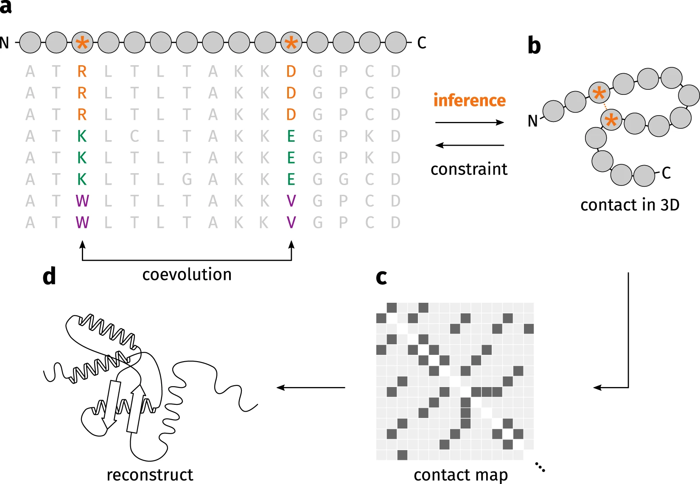

# 🔬 Contact‑Map Prediction Tools for Protein‑Protein Interactions

[](https://awesome.re)
[](https://www.gnu.org/licenses/gpl-3.0)
[](http://makeapullrequest.com) 





> The figure above was adapted from paper [StructureDistiller: Structural relevance scoring identifies the most informative entries of a contact map](https://www.nature.com/articles/s41598-019-55047-4)


A curated collection of computational tools for `intermolecular interaction prediction`. For any input number of polypeptide chains(≥2), each method outputs a `two-dimensional inter-chain residue-residue interaction matrix` encoding pairwise contact probabilities or predicted inter-residue distances. Methods are organized by their capability to generate full residue-pair interaction/contact maps, rather than by domain labels (e.g., PPI prediction vs. structure prediction, DL vs docking/physics).

> **⚠️ Admission criteria:** A tool must produce `a complete 2D matrix across all residue pairs`, with values corresponding to contact probabilities or predicted inter-residue distances. Tools that output only per-residue binding-site scalar scores — without explicit residue-pair coupling information — are excluded from the main track and may only be presented as low-resolution baselines.

## Menu

- [Models & Tools](#models--tools)
  - [A. Structure-based](#a-structure-based)
    - [Single structure prediction](#single-structure-prediction)
    - [Conformational ensemble generation](#2--idr-ensemble-generation)
  - [B. Sequence-based](#b-sequence-based-contact-map-prediction)
  - [C. IDR-specific](#c-idr--fuzzy-binding-specific)
- [Datasets](#datasets)
- [Bench](#bench)
- [Entry template](#entry-template)
- [Contributing](#contributing)

---

> ⚠️ `It should be noted that there exist some essential differences between the structure prediction task and the contact‑map prediction task, which need to be discussed here.`
>
> although we all know MDS(multi-dimensional scaling) can convert a distance matrix to a 3D structure, the reverse is not true. A 3D structure can be converted to a distance matrix, but it is not guaranteed that the distance matrix can be converted back to the original 3D structure. This is because the distance matrix may not contain enough information to uniquely determine the 3D structure, especially if there are multiple conformations or if the structure is flexible. Therefore, while contact-map prediction can provide valuable information about protein-protein interactions, it may not always be sufficient for accurate structure prediction.
>
> 🌟 `But in this repository, we will try to discuss what within contact-map is more fundamental and important than structure prediction.` 

---

## Models & Tools

> All tools are grouped by whether they can output a complete residue-pair interaction matrix (an L1×L2 map of contact probabilities / distances):
> - **A · Structure-based** — predicts a structure / conformational ensemble (via deep-learning prediction, docking, or MD simulation), then extracts the map.
> - **B · Sequence-based** — sequence (+ optional MSA / embeddings) → L1×L2 contact map directly; no 3D structure needed.
> - **C · IDR-specific** — methods designed for IDRs / fuzzy complexes that don't output a full structure/ensemble-based map (e.g. binding-site baselines).

### A. Structure-based 

#### Single structure prediction

> Extraction: distance threshold (Cα/Cβ) → 0/1 contact map, or pLDDT-weighted / sharpened distogram probability (low-temperature — may need re-calibration).

<details>
<summary>AlphaFold2</summary>

- **Paper:** [Highly accurate protein structure prediction with AlphaFold](https://www.nature.com/articles/s41586-021-03819-2) (Nature, 2021) 
- **Code:** https://github.com/google-deepmind/alphafold
- **Docs:** [Read more →](docs/AlphaFold2/) *to be written*
- **Approach:** DL
</details>

--- 

<details>
<summary>AlphaFold3</summary>

- **Paper:** [Accurate structure prediction of biomolecular interactions with AlphaFold 3](https://www.nature.com/articles/s41586-024-07487-w)(Nature, 2024)
- **Docs:** [Read more →](docs/AlphaFold3/) *to be written*
- **Code:** https://github.com/google-deepmind/alphafold3
- **Web server:** https://alphafoldserver.com/
- **Approach:** DL
</details>

--- 

<details>
<summary>AlphaFold-Multimer</summary>

- **Paper:** [Protein complex prediction with AlphaFold-Multimer](https://www.biorxiv.org/content/10.1101/2021.10.04.463034v2) (bioRxiv, 2022) 
- **Docs:** [Read more →](docs/AlphaFold-Multimer/) *to be written*
- **Code:** https://github.com/jcheongs/alphafold-multimer
- **Approach:** DL
</details> 

--- 

<details>
<summary>ColabFold</summary>

- **Paper:** 
  - [ColabFold: making protein folding accessible to all](https://www.nature.com/articles/s41592-022-01488-1) (Nature Methods, 2022)
  - [Easy and accurate protein structure prediction using ColabFold](https://www.nature.com/articles/s41596-024-01060-5) (Nature Protocols, 2024)
- **Docs:** [Read more →](docs/ColabFold/) *to be written*
- **Code:** https://github.com/sokrypton/colabfold
- **Approach:** DL
</details>

--- 

<details>
<summary>ESMFold</summary>

- **Paper:** [Evolutionary-scale prediction of atomic-level protein structure with a language model](https://www.science.org/doi/10.1126/science.ade2574) (Science, 2023)
- **Docs:** [Read more →](docs/esmfold/) *to be written*
- **Code:** https://github.com/facebookresearch/esm | https://github.com/facebookresearch/esm#esmfold
- **Approach:** DL
</details>

--- 

<details>
<summary>ESMFold2</summary>

- **Paper:** [Language Modeling Materializes a World Model of Protein Biology](https://www.biorxiv.org/content/10.64898/2026.06.03.729735v1) (bioRxiv, 2026)
- **Docs:** [Read more →](docs/ESMFold2/) *to be written*
- **Code:** https://github.com/Biohub/esm#esmfold2 | https://huggingface.co/biohub/ESMFold2
- **Approach:** DL
</details>

--- 

<details>
<summary>RoseTTAFold</summary>

- **Paper:** [Accurate prediction of protein structures and interactions using a three-track neural network](https://www.science.org/doi/10.1126/science.abj8754) (Science, 2021)
- **Docs:** [Read more →](docs/RoseTTAFold/) *to be written*
- **Code:** https://github.com/RosettaCommons/RoseTTAFold
- **Web server:** https://robetta.bakerlab.org/
- **Approach:** DL
</details>

--- 

<details>
<summary>RoseTTAFold2</summary>

- **Paper:** [Efficient and accurate prediction of protein structure using RoseTTAFold2](https://www.biorxiv.org/content/10.1101/2023.05.24.542179v1) (bioRxiv, 2023)
- **Docs:** [Read more →](docs/RoseTTAFold2/) *to be written*
- **Code:** https://github.com/uw-ipd/RoseTTAFold2
- **Approach:** DL
</details>

---

<details>
<summary>RoseTTAFold2NA</summary>

- **Paper:** [Accurate prediction of protein–nucleic acid complexes using RoseTTAFoldNA](https://www.nature.com/articles/s41592-023-02086-5) (Nature Methods, 2023)
- **Docs:** [Read more →](docs/RoseTTAFold2NA/) *to be written*
- **Code:** https://github.com/uw-ipd/RoseTTAFold2NA
- **Approach:** DL
</details>

---

<details>
<summary>RoseTTAFold3</summary>

- **Paper:** [Accelerating Biomolecular Modeling with AtomWorks and RF3](https://www.biorxiv.org/content/10.1101/2025.08.14.670328v2) (bioRxiv, 2025)
- **Docs:** [Read more →](docs/RoseTTAFold3/) *to be written*
- **Code:** https://github.com/RosettaCommons/foundry/tree/production/models/rf3
- **Approach:** DL
</details>

---

<details>
<summary>OpenFold</summary>

- **Paper:** [OpenFold: retraining AlphaFold2 yields new insights into its learning mechanisms and capacity for generalization](https://www.nature.com/articles/s41592-024-02272-z) (Nature Methods, 2024)
- **Docs:** [Read more →](docs/OpenFold/) *to be written*
- **Code:** https://github.com/aqlaboratory/openfold
- **Approach:** DL
</details>


---

<details>
<summary>Uni-Fold</summary>

- **Paper:** [Uni-Fold: An Open-Source Platform for Developing Protein Folding Models beyond AlphaFold](https://www.biorxiv.org/content/10.1101/2022.08.04.502811v3) (bioRxiv, 2022)
- **Docs:** [Read more →](docs/Uni-Fold/) *to be written*
- **Code:** https://github.com/dptech-corp/Uni-Fold
- **Approach:** DL
</details>

--- 

<details>
<summary>OmegaFold</summary>

- **Paper:** [High-resolution de novo structure prediction from primary sequence](https://www.biorxiv.org/content/10.1101/2022.07.21.500999v1) (bioRxiv, 2022)
- **Docs:** [Read more →](docs/OmegaFold/) *to be written*
- **Code:** https://github.com/HeliXonProtein/OmegaFold
- **Approach:** DL
</details>

---

<details>
<summary>EquiFold</summary>

- **Paper:** [EquiFold: Protein Structure Prediction with a Novel Coarse-Grained Structure Representation](https://www.biorxiv.org/content/10.1101/2022.10.07.511322v2) (bioRxiv, 2023)
- **Docs:** [Read more →](docs/EquiFold/) *to be written*
- **Code:** https://github.com/Genentech/equifold
- **Approach:** DL
</details>

---

<details>
<summary>RoseTTAFold All-Atom</summary>

- **Paper:** [EquiFold: Protein Structure Prediction with a Novel Coarse-Grained Structure Representation](https://www.biorxiv.org/content/10.1101/2022.10.07.511322v2) (bioRxiv, 2023)
- **Docs:** [Read more →](docs/RoseTTAFold-All-Atom/) *to be written*
- **Code:** https://github.com/baker-laboratory/RoseTTAFold-All-Atom
- **Approach:** DL
</details>

--- 

<details>
<summary>Boltz family</summary>

- **Paper:** 
  - Boltz-1: [Boltz-1 Democratizing Biomolecular Interaction Modeling](https://www.biorxiv.org/content/10.1101/2024.11.19.624167v4) (bioRxiv, 2025)
  - Boltz-2: [Boltz-2: Towards Accurate and Efficient Binding Affinity Prediction](https://www.biorxiv.org/content/10.1101/2025.06.14.659707v1) (bioRxiv, 2025)
- **Docs:** [Read more →](docs/Boltz/) *to be written*
- **Code:** https://github.com/jwohlwend/boltz 
- **Approach:** DL
</details>

--- 

<details>
<summary>Chai-1</summary>

- **Paper:** [Chai-1: Decoding the molecular interactions of life](https://www.biorxiv.org/content/10.1101/2024.10.10.615955v2) (bioRxiv, 2024)
- **Docs:** [Read more →](docs/Chai-1/) *to be written*
- **Code:** https://github.com/chaidiscovery/chai-lab 
- **Web server:** https://lab.chaidiscovery.com/dashboard
- **Approach:** DL
</details>

--- 

<details>
<summary>Chai-2</summary>

- **Paper:** [Zero-shot antibody design in a 24-well plate](https://www.biorxiv.org/content/10.1101/2025.07.05.663018v1) (bioRxiv, 2025)
- **Docs:** [Read more →](docs/Chai-2/) *to be written*
- **Code:** N/A
- **Approach:** DL
</details>

--- 

<details>
<summary>HelixFold</summary>

- **Paper:** [HelixFold: An Efficient Implementation of AlphaFold2 using PaddlePaddle](https://arxiv.org/abs/2207.05477) (arxiv, 2022)
- **Docs:** [Read more →](docs/HelixFold-Family/) *to be written*
- **Code:** https://github.com/PaddlePaddle/PaddleHelix/tree/dev/apps/protein_folding/helixfold
- **Web server:** https://paddlehelix.baidu.com/
- **Approach:** DL
</details>

--- 

<details>
<summary>HelixFold-Single</summary>

- **Paper:** [HelixFold-Single: MSA-free Protein Structure Prediction by Using Protein Language Model as an Alternative](https://arxiv.org/abs/2207.13921) (arxiv, 2023)
- **Docs:** [Read more →](docs/HelixFold-Family/) *to be written*
- **Code:** https://github.com/PaddlePaddle/PaddleHelix/tree/dev/apps/protein_folding/helixfold-single
- **Web server:** https://paddlehelix.baidu.com/
- **Approach:** DL
</details>

--- 

<details>
<summary>HelixFold-Multimer</summary>

- **Paper:** [HelixFold-Multimer: Elevating Protein Complex Structure Prediction to New Heights](https://arxiv.org/abs/2404.10260) (arxiv, 2024)
- **Docs:** [Read more →](docs/HelixFold-Family/) *to be written*
- **Code:** N/A
- **Approach:** DL
</details>

--- 

<details>
<summary>HelixFold3</summary>

- **Paper:** [Technical Report of HelixFold3 for Biomolecular Structure Prediction](https://arxiv.org/abs/2408.16975) (arxiv, 2024)
- **Docs:** [Read more →](docs/HelixFold-Family/) *to be written*
- **Code:** https://github.com/PaddlePaddle/PaddleHelix/tree/dev/apps/protein_folding/helixfold3
- **Web server:** https://paddlehelix.baidu.com/
- **Approach:** DL
</details>

--- 

<details>
<summary>Protenix-Mini</summary>

- **Paper:** [Protenix-Mini: Efficient Structure Predictor via Compact Architecture, Few-Step Diffusion and Switchable pLM](https://arxiv.org/abs/2507.11839) (arxiv, 2025)
- **Docs:** [Read more →](docs/Protenix-Family/) *to be written*
- **Code:** https://github.com/bytedance/Protenix
- **Approach:** DL
</details>

--- 

<details>
<summary>Protenix</summary>

- **Paper:** [Protenix - Advancing Structure Prediction Through a Comprehensive AlphaFold3 Reproduction](https://www.biorxiv.org/content/10.1101/2025.01.08.631967v1) (bioRxiv, 2025)
- **Docs:** [Read more →](docs/Protenix-Family/) *to be written*
- **Code:** https://github.com/bytedance/Protenix
- **Approach:** DL
</details>

--- 

<details>
<summary>Protenix-v1</summary>

- **Paper:** [Protenix-v1: Toward High-Accuracy Open-Source Biomolecular Structure Prediction](https://www.biorxiv.org/content/10.64898/2026.02.05.703733v1) (bioRxiv, 2026)
- **Docs:** [Read more →](docs/Protenix-Family/) *to be written*
- **Code:** https://github.com/bytedance/Protenix
- **Approach:** DL
</details>

--- 

<details>
<summary>Protenix-v2</summary>

- **Paper:** [Protenix-v2: Broadening the Reach of Structure Prediction and Biomolecular Design](https://www.biorxiv.org/content/10.64898/2026.04.10.717613v1) (bioRxiv, 2026)
- **Docs:** [Read more →](docs/Protenix-Family/) *to be written*
- **Code:** https://github.com/bytedance/Protenix
- **Approach:** DL
</details>

--- 

<!-- More single_structure placeholders can be added here -->
<!-- PLACEHOLDER: <another single-structure predictor> -->


#### Conformational ensemble generation

> Extraction: ensemble contact frequency — how often residue pair (i, j) falls within the threshold across the ensemble.
>
> Primarily designed for IDR tasks. 

--- 

<details>
<summary>AlphaFlow/ESMFlow</summary>

> ⚠️ AlphaFlow and ESMFlow are related but distinct models that share the same repository (bjing2016/alphaflow). AlphaFlow fine-tunes AlphaFold, while ESMFlow fine-tunes ESMFold, both using a flow-matching training objective. So we group them together here as a single family.

- **Paper:** [AlphaFold Meets Flow Matching for Generating Protein Ensembles](https://arxiv.org/abs/2402.04845) (arxiv, 2024)
- **Docs:** [Read more →](docs/AlphaFlow/) *to be written*
- **Code:** https://github.com/bjing2016/alphaflow
- **Approach:** DL
</details>

--- 

<details>
<summary>BioEmu</summary>

- **Paper:** [Scalable emulation of protein equilibrium ensembles with generative deep learning](https://www.science.org/doi/10.1126/science.adv9817) (Science, 2025)
- **Docs:** [Read more →](docs/BioEmu/) *to be written*
- **Code:** https://github.com/microsoft/bioemu
- **Approach:** DL
</details>

--- 

<details>
<summary>Phanto-IDP</summary>

- **Paper:** [Phanto-IDP: compact model for precise intrinsically disordered protein backbone generation and enhanced sampling](https://academic.oup.com/bib/article/25/1/bbad429/7453435) (Briefings in Bioinformatics, 2024)
- **Docs:** [Read more →](docs/Phanto-IDP/) *to be written*
- **Code:** https://github.com/Junjie-Zhu/Phanto-IDP
- **Approach:** DL
- **For IDR**
</details>


---

<details>
<summary>IDPFold</summary>

- **Paper:** [Accurate Generation of Conformational Ensembles for Intrinsically Disordered Proteins with IDPFold](https://advanced.onlinelibrary.wiley.com/doi/10.1002/advs.202511636) (Advanced Science, 2025)
- **Docs:** [Read more →](docs/IDPFold/) *to be written*
- **Code:** https://github.com/Junjie-Zhu/IDPFold
- **Approach:** DL
- **For IDR**
</details>


---


<details>
<summary>IDPFold2</summary>

- **Paper:** [Extending Conformational Ensemble Prediction to Multidomain Proteins and Protein Complex](https://www.biorxiv.org/content/10.64898/2026.01.14.699584v1) (bioRxiv, 2026)
- **Docs:** [Read more →](docs/IDPFold2/) *to be written*
- **Code:** https://github.com/Junjie-Zhu/IDPFold2
- **Approach:** DL
- **For IDR**
</details>


---

<details>
<summary>STARLING</summary>

- **Paper:** [Accurate predictions of disordered protein ensembles with STARLING](https://www.nature.com/articles/s41586-026-10141-2) (Nature, 2026)
- **Docs:** [Read more →](docs/STARLING/) *to be written*
- **Code:** https://github.com/idptools/starling | https://idptools-starling.readthedocs.io/en/latest/ | https://github.com/holehouse-lab/supportingdata/tree/master/2026/starling_2026 | https://github.com/idptools/idpcolab/blob/main/STARLING/STARLING_demo.ipynb
- **Approach:** DL
- **For IDR**
</details>


---


<details>
<summary>IDP-LZerD</summary>

- **Paper:** [Modeling disordered protein interactions from biophysical principles](https://journals.plos.org/ploscompbiol/article?id=10.1371/journal.pcbi.1005485) (PLOS Computational Biology, 2017)
- **Docs:** [Read more →](docs/IDP-LZerD/) *to be written*
- **Code:** https://github.com/kiharalab/idp_lzerd
- **Approach:** docking + MD
- **For IDR**
</details>

---


<details>
<summary>IDPForge</summary>

- **Paper:** [IDPForge: Deep Learning of Proteins with Global and Local Regions of Disorder](https://www.biorxiv.org/content/10.64898/2026.03.25.714313v2) (bioRxiv, 2026)
- **Docs:** [Read more →](docs/IDPForge/) *to be written*
- **Code:** https://github.com/THGLab/IDPForge
- **Approach:** DL
- **For IDR**
</details>

---

<details>
<summary>AlphaFlex (AFX-IDPForge)</summary>

> ⚠️ IDPForge is the core generative diffusion model that samples individual disordered region (IDR) conformers . AlphaFlex is an extension pipeline in the AlphaFlex/ subdirectory that orchestrates IDPForge at scale to build full-length, multi-domain protein ensembles.
>
> IDPForge and AlphaFlex are combined because they share the same repository.

- **Paper:** [AlphaFlex: Ensembles of the human proteome representing disordered regions](https://www.biorxiv.org/content/10.1101/2025.11.24.690279v2) (bioRxiv, 2026)
- **Docs:** [Read more →](docs/AlphaFlex/) *to be written*
- **Code:** https://github.com/THGLab/IDPForge/tree/main/AlphaFlex
- **Data:** https://zenodo.org/records/17684898 
- **Approach:** DL
- **For IDR** 
</details>

--- 

<details>
<summary>IdpSAM</summary>

- **Paper:** [Transferable deep generative modeling of intrinsically disordered protein conformations](https://journals.plos.org/ploscompbiol/article?id=10.1371/journal.pcbi.1012144) (PLOS Computational Biology, 2024)
- **Docs:** [Read more →](docs/IdpSAM/) *to be written*
- **Code:** https://github.com/giacomo-janson/idpsam
- **Approach:** DL
- **For IDR**
</details>

---


<!-- More idr ensemble placeholders can be added here -->
<!-- PLACEHOLDER: diffusion-based IDR conformation generator -->
<!-- PLACEHOLDER: enhanced-sampling MD post-processing ensemble tool -->

---


### B. Sequence-based contact-map like prediction

> ⚠️ Models trained on structure data but requiring only sequence at inference still belong here. Per-residue binding-site scores (no pair coupling) are excluded from the main track.


<details>
<summary>FINCHES</summary>

- **Paper:** [Sequence-based prediction of intermolecular interactions driven by disordered regions](https://www.science.org/doi/10.1126/science.adq8381) (Science, 2025)
- **Docs:** [Read more →](docs/FINCHES/) *to be written*
- **Code:** https://github.com/idptools/finches | https://github.com/idptools/finches-colab
- **Web server:** https://www.finches-online.com/
- **For IDR**
</details>


--- 

<details>
<summary>Disobind</summary>

- **Paper:** [Disobind: A sequence-based, partner-dependent contact map and interface residue predictor for intrinsically disordered regions](https://www.cell.com/cell-systems/abstract/S2405-4712(25)00319-9) (Cell Systems, 2026)
- **Docs:** [Read more →](docs/Disobind/) *to be written*
- **Code:** https://github.com/isblab/disobind
- **For IDR**
</details>


--- 


#### DeepInteract

<details>
<summary>Sequence-based · contact predictor</summary>

- **Paper:** [Geometric Transformers for Protein Interface Contact Prediction](https://arxiv.org/pdf/2110.02423.pdf) (ICLR, 2022)
- **Docs:** [Read more →](docs/deepinteract/)
- **Input:** two-chain sequence / structure features
- **Output:** L1×L2 inter-chain contact-probability matrix
- **Code:** https://github.com/BioinfoMachineLearning/DeepInteract
</details>

#### GLINTER

<details>
<summary>Sequence-based · contact predictor</summary>

- **Paper:** [Deep graph learning of inter-protein contacts](https://academic.oup.com/bioinformatics/article/38/1/280/6438575) (Bioinformatics, 2021)
- **Docs:** [Read more →](docs/glinter/) *to be written*
- **Input:** two-chain sequence features
- **Output:** L1×L2 inter-chain contact-probability matrix
- **Code:** https://github.com/zw2x/glinter
</details>

#### ComplexContact

<details>
<summary>Sequence-based · contact predictor</summary>

- **Paper:** [ComplexContact: a web server for inter-protein contact prediction using deep learning](https://academic.oup.com/nar/article/46/W1/W432/4999176) (Nucleic Acids Research, 2018)
- **Docs:** [Read more →](docs/complexcontact/) *to be written*
- **Input:** two-chain sequences + MSA
- **Output:** L1×L2 inter-chain contact-probability matrix
- **Code:** N/A
- **Web server:** https://complexcontact.cs.ucd.ie/
</details>

#### <!-- PLACEHOLDER --> DRN-1D2D_Inter

<details>
<summary>Sequence-based · contact predictor</summary>

- **Paper:** [TBD]
- **Docs:** [Read more →](docs/drn-1d2d-inter/) *to be written*
- **Input:** [TBD]
- **Output:** [TBD]
- **Code:** N/A
</details>

<!-- More sequence-based placeholders can be added here -->
<!-- PLACEHOLDER: multi-chain trRosetta variant -->
<!-- PLACEHOLDER: ESM-2 / pLM fine-tuned contact-map variant (preprint) -->

---

### C. IDR / fuzzy-binding-specific

> ⚠️ Binding-site predictors (`fIDPnn / flDPnn`, MoRF) output one scalar per residue — usable only as an outer-product baseline, not the main track.

#### IDP-LZerD

<details>
<summary>IDR-specific · ensemble</summary>

- **Paper:** [TBD]
- **Docs:** [Read more →](docs/idp-lzerd/) *to be written*
- **Input:** [TBD]
- **Output:** low-resolution template + FFT docking → structural ensemble → contact-probability matrix (ensemble contact frequency)
- **Code:** https://github.com/aanastasiou/IDP-LZerD
</details>

#### <!-- PLACEHOLDER --> AlphaFold-IDR (dropout / random-seed multi-conformation)

<details>
<summary>IDR-specific · ensemble</summary>

- **Paper:** [TBD]
- **Docs:** [Read more →](docs/alphafold-idr/) *to be written*
- **Input:** [TBD]
- **Output:** multiple conformations → integrated contact-probability map
- **Code:** N/A
</details>

#### <!-- PLACEHOLDER --> fIDPnn / flDPnn (MoRF binding-site baseline)

<details>
<summary>IDR-specific · binding-site baseline</summary>

- **Paper:** [TBD]
- **Docs:** [Read more →](docs/fidpnn/) *to be written*
- **Input:** [TBD]
- **Output:** per-residue site probability → outer-product minimal L1×L2 baseline (full-connectivity assumption)
- **Code:** N/A
</details>

<!-- More IDR-specific placeholders can be added here -->
<!-- PLACEHOLDER: coarse-grained docking + short MD optimization framework contact scores -->
<!-- PLACEHOLDER: other sequence models designed for fuzzy / flexible binding -->

---

## Datasets

*To be filled* — Tier 1 (induced-folding complexes, PDB-derived labels) and Tier 2 (fuzzy/dynamic complexes, ensemble-constraint labels from NMR PRE / XL-MS / smFRET).

---

<details>
<summary>Protein Ensemble Database, PED</summary>

- Description: The Protein Ensemble Database (PED) is an open access database for the deposition of structural ensembles, including intrinsically disordered proteins (IDPs). Manually curated data of structural ensembles measured with nuclear magnetic resonance spectroscopy, small-angle X-ray scattering, fluorescence resonance energy transfer are annotated in PED. The deposition of structural coordinates can be used for the evaluation of the ensembles, thus supporting the evolution of new modeling methods leading to much improved skills of connecting the characteristic "lack of structure" of IDPs with function. Each entry in PED corresponds to the primary experimental data and to the structural ensembles associated with these data.
- Url: https://proteinensemble.org/
- API: https://proteinensemble.org/api

</details>

---

## Bench

<details>
<summary>FoldBench</summary>

- Description: FoldBench is a low-homology benchmark spanning proteins, nucleic acids, ligands, and six major interaction types, enabling assessments that were previously infeasible with task-specific datasets. (Benchmarking all-atom biomolecular structure prediction with FoldBench)
- Paper: [Benchmarking all-atom biomolecular structure prediction with FoldBench](https://www.nature.com/articles/s41467-025-67127-3) (Nature Communications, 2025)
- Code: https://github.com/BEAM-Labs/FoldBench

</details>

## Entry template

> ⚠️ Note that deepwiki must use `https://github.com/zxmfke/deepwiki-md-chrome-extension`, and if there are any code/graph missing pages, please use the plugin to redownload the missing pages only again, and manually check it

Each tool uses a collapsible `<details>` block with consistent fields. The `<summary>` is a minimal **type tag** (the tool name lives in the `####` heading, so it is not repeated):

```markdown
#### <Tool name>

<details>
<summary><Type tag> · <subtype></summary>

- **Paper:** [Title](link) (Journal, year) | [preprint](link)
- **Docs:** [Read more →](docs/<tool>/) — abstract/method + deepwiki/zread annotations
- **Code:** official implementation repo (N/A if none)
- **Web server:** link (only when it exists)
- **Approach:** DL / docking / MD (here DL = deep learning, docking = molecular docking, MD = molecular dynamics simulation)
- **For IDR:** optional, only if the method is designed for intrinsically disordered proteins (IDPs)
</details>
```

Fields are flat — no nested `Access:` group. The entry keeps only the official access routes (Code + Web server). **Reimplementations, extra resources and other secondary links live in `docs/<tool>/README.md`** (a `Reimplementations / Resources` section), so the list stays uniform even when a tool has many third-party implementations.

Type tags used in this repo:
- `Structure-based · single-structure`
- `Structure-based · ensemble`
- `Sequence-based · contact predictor`
- `IDR-specific · ensemble`
- `IDR-specific · binding-site baseline`

## Contributing

- Keep README entries lean: flat **Paper, Code, Web server, Docs, Input, Output** fields (no nested `Access:` group).
- Per-tool detailed content (abstract, method, deepwiki/zread annotations) lives in `docs/<tool>/`; README links via `Docs:`.
- **Reimplementations and extra resources go in `docs/<tool>/README.md`, not in the README entry** — the entry lists only the official Code + Web server.
- For unpublished tools, add a Note (⚠️ not peer-reviewed; experimental) and cite a verifiable source (preprint / leaderboard).
- Provide at least one working Code or Web server link.
- When unsure about category placement, follow the three-category split in the design doc (`README_cn.md`).

## TODO / placeholders

Each category contains `<!-- PLACEHOLDER -->`-marked tool placeholders, used to flag "known but not yet filled" entries and "empty niches to be added".

- [ ] Add TIMELINE graph for each category so we can see the trend
- [ ] Update the wiki in docs/, and manually refresh it in sync with the original repository commit date
- [ ] extract the model architecture for those tools tagged `Approach: DL`, e.g., attention, GNN, flow-matching 
- [ ] extract DATASET part in these models README

## Reference

- https://github.com/AspirinCode/awesome-BioMolGenFold#folding-tool-collection
- 