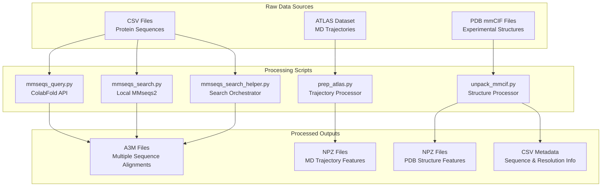
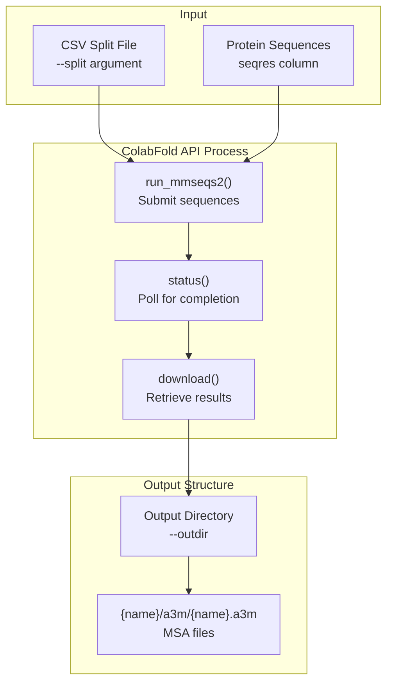
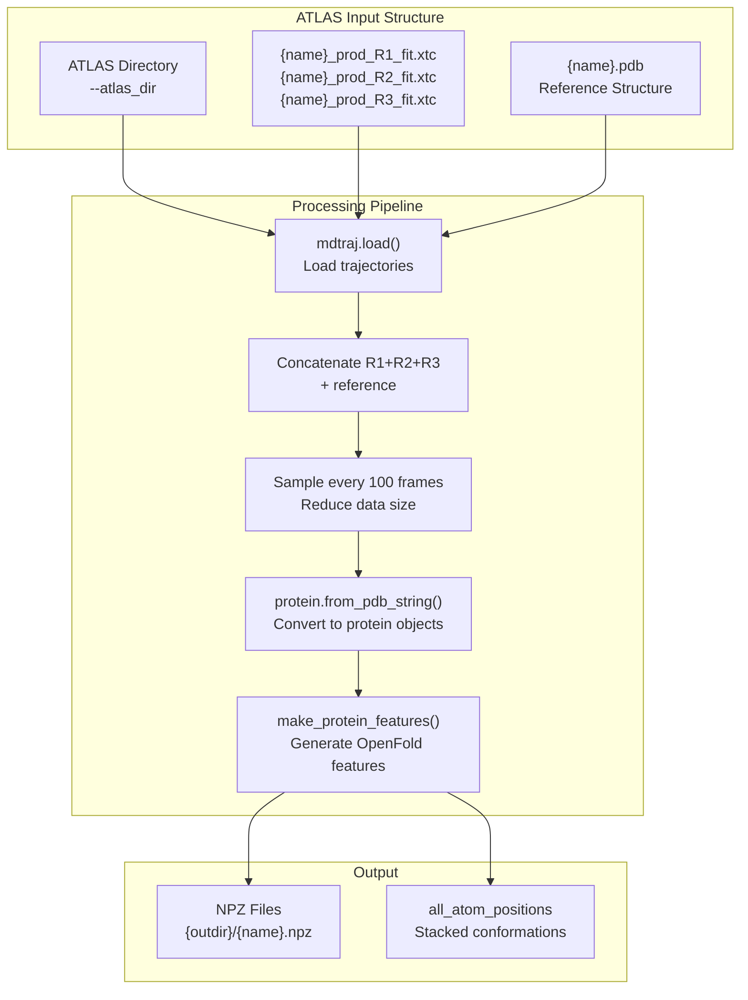
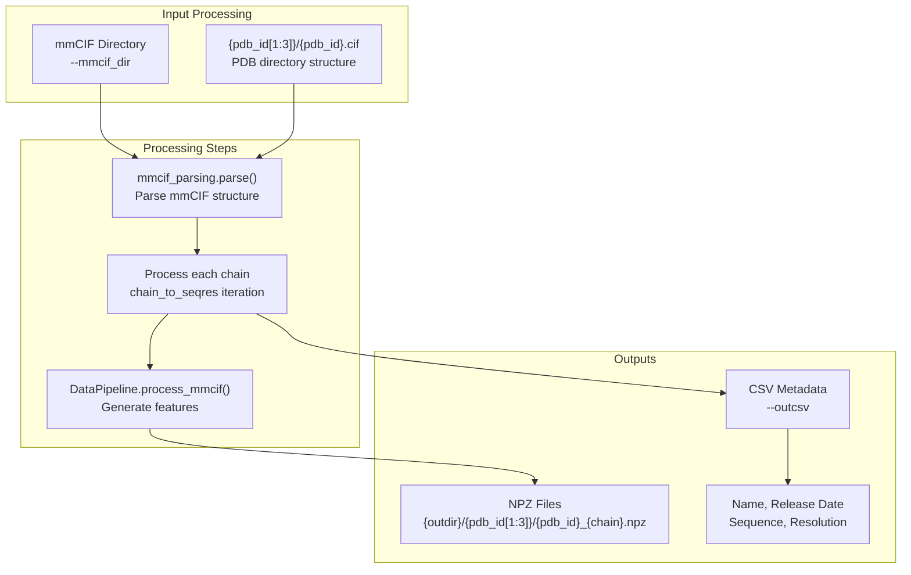

# Data Processing

> **Relevant source files**
> * [scripts/mmseqs_query.py](https://github.com/bjing2016/alphaflow/blob/02dc0376/scripts/mmseqs_query.py)
> * [scripts/mmseqs_search.py](https://github.com/bjing2016/alphaflow/blob/02dc0376/scripts/mmseqs_search.py)
> * [scripts/mmseqs_search_helper.py](https://github.com/bjing2016/alphaflow/blob/02dc0376/scripts/mmseqs_search_helper.py)
> * [scripts/prep_atlas.py](https://github.com/bjing2016/alphaflow/blob/02dc0376/scripts/prep_atlas.py)
> * [scripts/unpack_mmcif.py](https://github.com/bjing2016/alphaflow/blob/02dc0376/scripts/unpack_mmcif.py)

This document covers the data processing utilities and scripts used to prepare various types of protein data for training and inference in the AlphaFlow system. Data processing involves transforming raw protein data sources into standardized formats required by the model training and prediction pipelines.

The data processing system handles three primary data types: Multiple Sequence Alignments (MSAs) for evolutionary information, molecular dynamics trajectories from the ATLAS dataset, and experimental protein structures from the Protein Data Bank. For information about how this processed data is consumed during training, see [Training System](/bjing2016/alphaflow/4-training-system). For details on how processed data is loaded by dataset classes, see [Dataset Classes](/bjing2016/alphaflow/5.2-dataset-classes).

## Data Processing Pipeline Overview

The AlphaFlow data processing system transforms raw protein data into standardized NPZ and A3M formats through several specialized scripts:



Sources: [scripts/mmseqs_query.py L1-L295](https://github.com/bjing2016/alphaflow/blob/02dc0376/scripts/mmseqs_query.py#L1-L295)

 [scripts/mmseqs_search.py L1-L634](https://github.com/bjing2016/alphaflow/blob/02dc0376/scripts/mmseqs_search.py#L1-L634)

 [scripts/mmseqs_search_helper.py L1-L30](https://github.com/bjing2016/alphaflow/blob/02dc0376/scripts/mmseqs_search_helper.py#L1-L30)

 [scripts/prep_atlas.py L1-L61](https://github.com/bjing2016/alphaflow/blob/02dc0376/scripts/prep_atlas.py#L1-L61)

 [scripts/unpack_mmcif.py L1-L73](https://github.com/bjing2016/alphaflow/blob/02dc0376/scripts/unpack_mmcif.py#L1-L73)

## MSA Generation

Multiple Sequence Alignments provide evolutionary context essential for protein structure prediction. The system offers both API-based and local approaches for MSA generation using MMseqs2.

### ColabFold API Approach

The `mmseqs_query.py` script generates MSAs using the ColabFold web API:



Key parameters and functionality:

* **Input**: CSV file with `name` and `seqres` columns
* **API Configuration**: Uses `host_url="https://api.colabfold.com"` with automatic retry logic
* **Output Format**: Creates directory structure `{outdir}/{name}/a3m/{name}.a3m`
* **Processing**: Handles deduplication of sequences and manages API rate limiting

Sources: [scripts/mmseqs_query.py L21-L283](https://github.com/bjing2016/alphaflow/blob/02dc0376/scripts/mmseqs_query.py#L21-L283)

 [scripts/mmseqs_query.py L287-L294](https://github.com/bjing2016/alphaflow/blob/02dc0376/scripts/mmseqs_query.py#L287-L294)

### Local MMseqs2 Search

For high-throughput processing or offline usage, `mmseqs_search.py` provides local MMseqs2 execution:

| Feature | Function | Description |
| --- | --- | --- |
| Monomer Search | `mmseqs_search_monomer()` | Single protein sequence alignment |
| Paired Search | `mmseqs_search_pair()` | Complex/paired protein alignment |
| Database Support | Multiple DBs | UniRef30, environmental, template databases |
| Output Control | Filter parameters | Quality filtering and sequence limits |

The local search requires pre-installed MMseqs2 databases and supports more granular control over search parameters like sensitivity (`-s`), e-value thresholds, and database selection.

Sources: [scripts/mmseqs_search.py L25-L446](https://github.com/bjing2016/alphaflow/blob/02dc0376/scripts/mmseqs_search.py#L25-L446)

 [scripts/mmseqs_search.py L148-L327](https://github.com/bjing2016/alphaflow/blob/02dc0376/scripts/mmseqs_search.py#L148-L327)

### Search Helper Utility

The `mmseqs_search_helper.py` script orchestrates local searches with simplified input handling:

```python
# Creates temporary FASTA from CSVwith open('/tmp/tmp.fasta', 'w') as f:    for _, row in df.iterrows():        f.write(f'>{row["name"]}\n{row.seqres}\n') # Executes local searchcmd = f'python -m scripts.mmseqs_search /tmp/tmp.fasta {args.db_dir} {args.outdir}'
```

This helper automatically organizes output files into the expected directory structure for downstream processing.

Sources: [scripts/mmseqs_search_helper.py L11-L30](https://github.com/bjing2016/alphaflow/blob/02dc0376/scripts/mmseqs_search_helper.py#L11-L30)

## MD Trajectory Processing

The `prep_atlas.py` script processes molecular dynamics trajectories from the ATLAS dataset into training-ready NPZ format:



The processing workflow includes:

* **Trajectory Loading**: Combines three production runs (R1, R2, R3) with reference structure
* **Subsampling**: Processes every 100th frame to manage memory and storage requirements
* **Feature Generation**: Uses OpenFold's `make_protein_features()` to create standardized feature tensors
* **Output Format**: Saves as NPZ with stacked `all_atom_positions` arrays representing conformational ensemble

Sources: [scripts/prep_atlas.py L38-L60](https://github.com/bjing2016/alphaflow/blob/02dc0376/scripts/prep_atlas.py#L38-L60)

 [scripts/prep_atlas.py L39-L57](https://github.com/bjing2016/alphaflow/blob/02dc0376/scripts/prep_atlas.py#L39-L57)

## mmCIF Structure Processing

The `unpack_mmcif.py` script converts PDB mmCIF files into processed NPZ format suitable for training:



Key processing features:

* **Chain Separation**: Each protein chain becomes a separate entry with naming format `{pdb_id}_{chain}`
* **Metadata Extraction**: Captures release date, sequence, and resolution information
* **Directory Organization**: Maintains PDB's two-character subdirectory structure for efficient file access
* **Parallel Processing**: Supports multiprocessing via `--num_workers` parameter

The `DataPipeline` class transforms mmCIF structures into OpenFold-compatible feature dictionaries containing atomic coordinates, amino acid sequences, and structural metadata.

Sources: [scripts/unpack_mmcif.py L17-L70](https://github.com/bjing2016/alphaflow/blob/02dc0376/scripts/unpack_mmcif.py#L17-L70)

 [scripts/unpack_mmcif.py L38-L70](https://github.com/bjing2016/alphaflow/blob/02dc0376/scripts/unpack_mmcif.py#L38-L70)

## File Format Specifications

The data processing pipeline produces standardized file formats:

| Format | Extension | Content | Usage |
| --- | --- | --- | --- |
| A3M | `.a3m` | Multiple sequence alignments | MSA input for AlphaFold models |
| NPZ | `.npz` | Protein feature arrays | Training data for both model types |
| CSV | `.csv` | Metadata tables | Split definitions and protein information |

### NPZ Feature Arrays

Both trajectory and structure processing generate NPZ files containing standardized OpenFold features:

* `all_atom_positions`: Atomic coordinates (optionally stacked for trajectories)
* `aatype`: Amino acid type encoding
* `atom_mask`: Valid atom indicators
* `residue_mask`: Valid residue indicators
* Additional structural and sequence features as defined by OpenFold's data pipeline

These NPZ files serve as input to the dataset classes documented in [Dataset Classes](/bjing2016/alphaflow/5.2-dataset-classes) and are consumed during model training as described in [Training System](/bjing2016/alphaflow/4-training-system).

Sources: [scripts/prep_atlas.py L50-L57](https://github.com/bjing2016/alphaflow/blob/02dc0376/scripts/prep_atlas.py#L50-L57)

 [scripts/unpack_mmcif.py L63-L67](https://github.com/bjing2016/alphaflow/blob/02dc0376/scripts/unpack_mmcif.py#L63-L67)