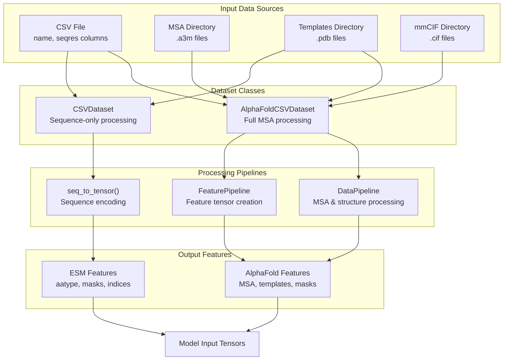
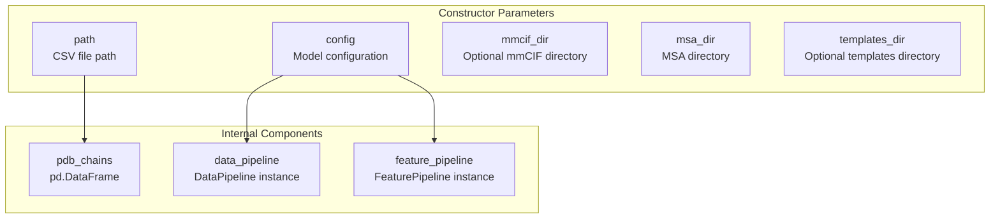
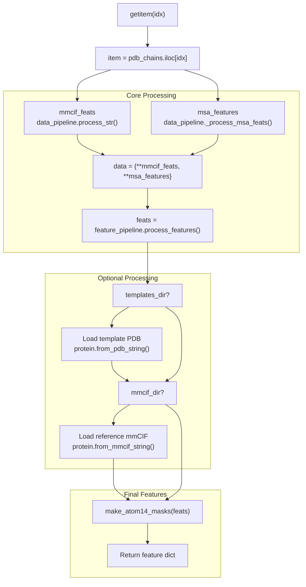
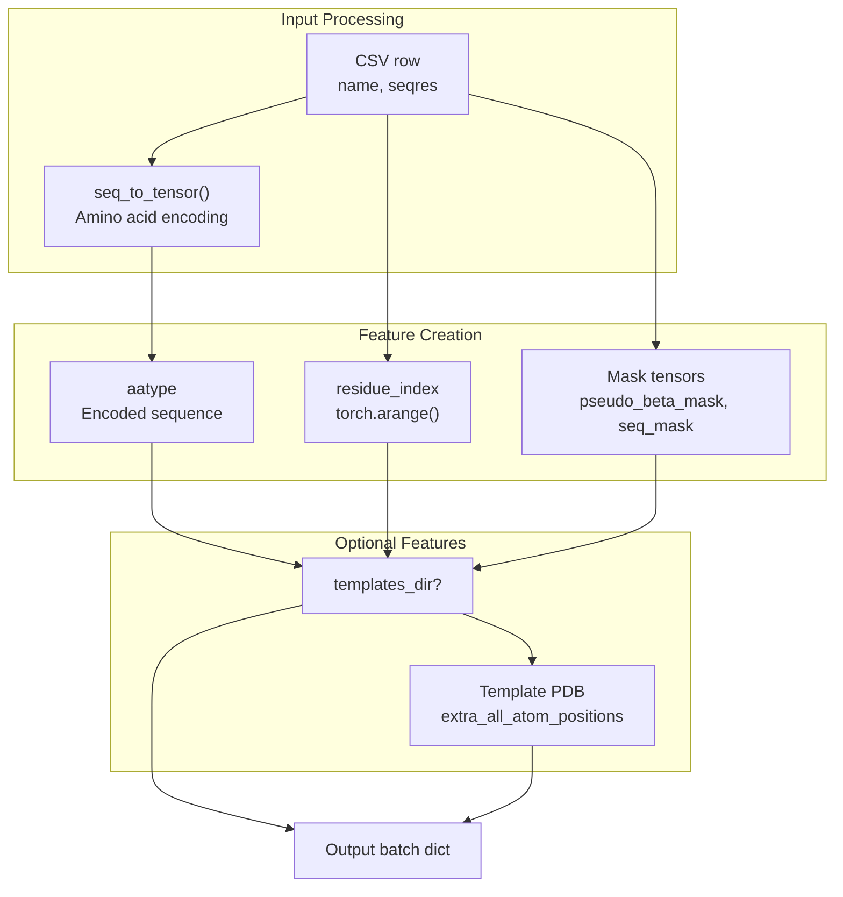
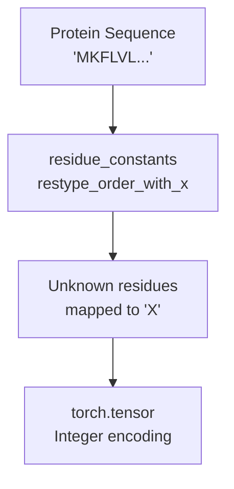

# Dataset Classes

> **Relevant source files**
> * [alphaflow/data/inference.py](https://github.com/bjing2016/alphaflow/blob/02dc0376/alphaflow/data/inference.py)

This page documents the dataset classes used for loading and processing protein data during inference in the AlphaFlow system. These classes handle the conversion of raw protein sequence data, Multiple Sequence Alignments (MSAs), and optional template structures into the tensor format required by AlphaFlow and ESMFlow models.

For information about training data preparation and processing, see [Training Data Preparation](/bjing2016/alphaflow/4.2-training-data-preparation). For details about the underlying data processing pipelines used by these classes, see [Data Processing](/bjing2016/alphaflow/6-data-processing).

## Overview

The AlphaFlow system provides two main dataset classes for inference:

* `AlphaFoldCSVDataset` - Full-featured dataset class for AlphaFold-style models requiring MSA data
* `CSVDataset` - Simplified dataset class for ESMFold-style models that work with sequence-only input

Both classes read protein information from CSV files and can optionally incorporate template structures to guide prediction.

## Dataset Class Architecture



Sources: [alphaflow/data/inference.py L1-L91](https://github.com/bjing2016/alphaflow/blob/02dc0376/alphaflow/data/inference.py#L1-L91)

## AlphaFoldCSVDataset

The `AlphaFoldCSVDataset` class provides comprehensive data processing for AlphaFold-style models that require MSA information and optional template guidance.

### Initialization and Configuration



The dataset expects a CSV file with columns:

* `name` - Protein identifier (used as index)
* `seqres` - Protein sequence
* Optional `msa_id` - MSA identifier if different from name

Sources: [alphaflow/data/inference.py L17-L25](https://github.com/bjing2016/alphaflow/blob/02dc0376/alphaflow/data/inference.py#L17-L25)

### Data Processing Pipeline

The `__getitem__` method implements a multi-stage processing pipeline:

| Stage | Processing | Components Used |
| --- | --- | --- |
| 1. Basic Features | Extract sequence features | `data_pipeline.process_str()` |
| 2. MSA Processing | Load and process MSA data | `data_pipeline._process_msa_feats()` |
| 3. Feature Pipeline | Convert to model tensors | `feature_pipeline.process_features()` |
| 4. Template Loading | Optional template structures | `protein.from_pdb_string()` |
| 5. Reference Loading | Optional reference structures | `protein.from_mmcif_string()` |



Sources: [alphaflow/data/inference.py L30-L60](https://github.com/bjing2016/alphaflow/blob/02dc0376/alphaflow/data/inference.py#L30-L60)

### Output Features

The `AlphaFoldCSVDataset` returns a comprehensive feature dictionary containing:

* **Sequence Features**: `aatype`, `residue_index`, `seq_mask`
* **MSA Features**: Multiple sequence alignment tensors
* **Structure Features**: `pseudo_beta_mask`, atom masks
* **Optional Template Features**: `extra_all_atom_positions`
* **Metadata**: `name`, `seqres`
* **Optional Reference**: `ref_prot` for evaluation

## CSVDataset

The `CSVDataset` class provides simplified data processing for ESMFold-style models that work with sequence-only input.

### Simplified Processing



The `CSVDataset` creates a minimal feature set:

```
batch = {    'name': row.name,    'seqres': row.seqres,    'aatype': seq_to_tensor(row.seqres),    'residue_index': torch.arange(len(row.seqres)),    'pseudo_beta_mask': torch.ones(len(row.seqres)),    'seq_mask': torch.ones(len(row.seqres))}
```

Sources: [alphaflow/data/inference.py L62-L90](https://github.com/bjing2016/alphaflow/blob/02dc0376/alphaflow/data/inference.py#L62-L90)

## Sequence Encoding Utility

Both dataset classes utilize the `seq_to_tensor()` function for converting amino acid sequences to numerical tensors:



The function maps each amino acid to its corresponding integer index, with unknown residues mapped to the 'X' token.

Sources: [alphaflow/data/inference.py L10-L15](https://github.com/bjing2016/alphaflow/blob/02dc0376/alphaflow/data/inference.py#L10-L15)

## Usage Patterns

### Model Type Selection

| Model Type | Dataset Class | Required Data | Optional Data |
| --- | --- | --- | --- |
| AlphaFlow | `AlphaFoldCSVDataset` | CSV + MSA directory | Templates, mmCIF |
| ESMFlow | `CSVDataset` | CSV only | Templates |

### Template Integration

Both dataset classes support optional template structures:

* Templates are loaded from PDB files in the specified directory
* Template coordinates are added as `extra_all_atom_positions`
* Templates guide the model's structure prediction process

### Error Handling

The datasets implement fallback mechanisms:

* MSA ID defaults to protein name if `msa_id` column is missing
* Unknown amino acids are mapped to 'X' token
* Template loading failures are handled gracefully

Sources: [alphaflow/data/inference.py L42-L43](https://github.com/bjing2016/alphaflow/blob/02dc0376/alphaflow/data/inference.py#L42-L43)

 [alphaflow/data/inference.py L83-L88](https://github.com/bjing2016/alphaflow/blob/02dc0376/alphaflow/data/inference.py#L83-L88)