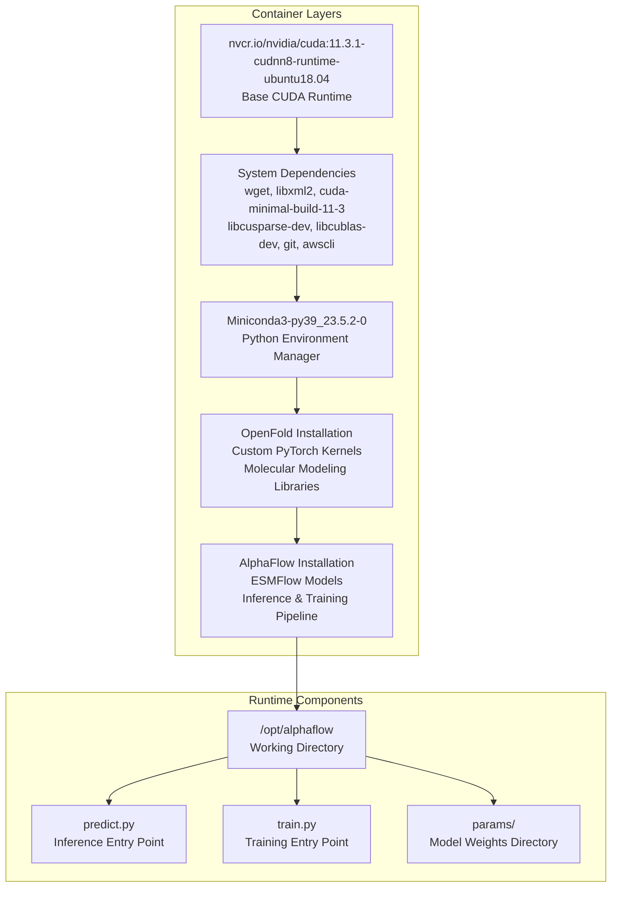
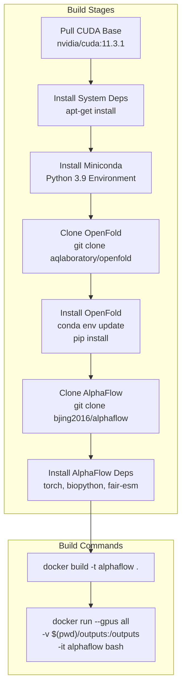
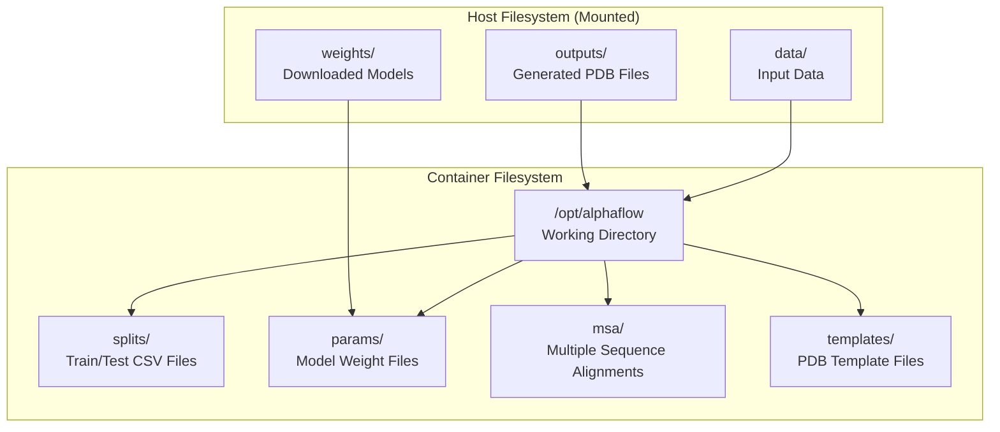

# Docker Deployment

> **Relevant source files**
> * [Dockerfile](https://github.com/bjing2016/alphaflow/blob/02dc0376/Dockerfile)

This document covers containerized deployment of the AlphaFlow system using Docker. It explains how to build and run the provided Docker container for protein structure prediction in isolated, reproducible environments with GPU acceleration support.

For installation without Docker, see [Installation and Setup](/bjing2016/alphaflow/2.1-installation-and-setup). For general inference usage, see [Inference Pipeline](/bjing2016/alphaflow/3.1-inference-pipeline).

## Overview

The AlphaFlow Docker deployment provides a complete, self-contained environment that includes all system dependencies, CUDA libraries, and the AlphaFlow codebase. The container is built on top of the OpenFold container to leverage its complex dependency management and custom PyTorch kernels.

### Container Architecture

The Docker container follows a layered architecture that builds upon established protein folding infrastructure:



Sources: [Dockerfile L22-L87](https://github.com/bjing2016/alphaflow/blob/02dc0376/Dockerfile#L22-L87)

### Key Container Features

| Feature | Description | Size Impact |
| --- | --- | --- |
| Base Image | NVIDIA CUDA 11.3.1 with cuDNN 8 | ~4GB |
| OpenFold Dependencies | Custom PyTorch kernels, molecular libraries | ~12GB |
| AlphaFlow Code | Complete inference and training pipeline | ~500MB |
| Optional Weights | Pre-downloaded model parameters | ~5GB |
| **Total Size** | **Without weights: ~20GB, With weights: ~25GB** |  |

Sources: [Dockerfile L8-L11](https://github.com/bjing2016/alphaflow/blob/02dc0376/Dockerfile#L8-L11)

## Building the Container

### Prerequisites

Before building the container, ensure you have:

* Docker installed with GPU support
* NVIDIA Container Toolkit for GPU access
* At least 30GB of available disk space
* Stable internet connection for downloading dependencies

### Build Process

The container build process follows these stages:



Sources: [Dockerfile L22-L78](https://github.com/bjing2016/alphaflow/blob/02dc0376/Dockerfile#L22-L78)

To build the container:

```
docker build -t alphaflow .
```

The build process installs dependencies in this order:

1. System packages via `apt-get` [Dockerfile L28-L40](https://github.com/bjing2016/alphaflow/blob/02dc0376/Dockerfile#L28-L40)
2. Miniconda Python environment [Dockerfile L42-L47](https://github.com/bjing2016/alphaflow/blob/02dc0376/Dockerfile#L42-L47)
3. OpenFold with custom kernels [Dockerfile L49-L66](https://github.com/bjing2016/alphaflow/blob/02dc0376/Dockerfile#L49-L66)
4. AlphaFlow Python dependencies [Dockerfile L73-L76](https://github.com/bjing2016/alphaflow/blob/02dc0376/Dockerfile#L73-L76)

## Running the Container

### Basic Container Execution

To run the container with GPU access and volume mounting:

```
docker run --gpus all -v "$(pwd)/outputs:/outputs" -it "$(docker image ls -q | head -n1)" bash
```

This command:

* `--gpus all`: Enables GPU access for CUDA acceleration
* `-v "$(pwd)/outputs:/outputs"`: Mounts local `outputs` directory
* `-it`: Provides interactive terminal access
* Uses the most recently built image

Sources: [Dockerfile L14](https://github.com/bjing2016/alphaflow/blob/02dc0376/Dockerfile#L14-L14)

### Example Inference Command

Once inside the container, run inference using:

```
python predict.py --mode esmfold --input_csv splits/atlas_test.csv --pdb 6o2v_A --weights params/esmflow_md_base_202402.pt --samples 5 --outpdb /outputs
```

This example command demonstrates:

* `--mode esmfold`: Uses ESMFlow model for sequence-only prediction
* `--input_csv splits/atlas_test.csv`: Input protein sequences
* `--pdb 6o2v_A`: Specific protein target
* `--weights params/esmflow_md_base_202402.pt`: Model checkpoint
* `--samples 5`: Generate 5 ensemble structures
* `--outpdb /outputs`: Output to mounted volume

Sources: [Dockerfile L20](https://github.com/bjing2016/alphaflow/blob/02dc0376/Dockerfile#L20-L20)

## Volume Mounting and Data Management

### Directory Structure

The container expects data to be organized in specific directories:



Sources: [Dockerfile L78](https://github.com/bjing2016/alphaflow/blob/02dc0376/Dockerfile#L78-L78)

### Common Volume Mounts

| Mount Purpose | Host Path | Container Path | Description |
| --- | --- | --- | --- |
| Output Files | `./outputs` | `/outputs` | Generated PDB structures |
| Input Data | `./data` | `/data` | CSV files, sequences |
| Model Weights | `./weights` | `/opt/alphaflow/params` | Pre-trained models |
| MSA Files | `./msa` | `/opt/alphaflow/msa` | Sequence alignments |
| Templates | `./templates` | `/opt/alphaflow/templates` | Reference structures |

## Configuration Options

### GPU Requirements

The container requires NVIDIA GPU support with:

* CUDA 11.3 compatibility
* At least 8GB GPU memory for inference
* 16GB+ GPU memory recommended for training

To verify GPU access within the container:

```javascript
nvidia-smipython -c "import torch; print(torch.cuda.is_available())"
```

### Optional Weight Pre-caching

The Dockerfile includes commented code to pre-download model weights during build:

```markdown
# Optionally, download weights as part of the image# RUN mkdir params && \#     aws s3 cp s3://alphaflow/params/esmflow_md_base_202402.pt params/esmflow_pdb_md_202402.pt && \#     mkdir -p /root/.cache/torch/hub/checkpoints && \#     wget -q -O /root/.cache/torch/hub/checkpoints/esm2_t36_3B_UR50D.pt https://dl.fbaipublicfiles.com/fair-esm/models/esm2_t36_3B_UR50D.pt
```

Uncomment these lines to cache weights in the image, increasing build time but eliminating download time during inference.

Sources: [Dockerfile L80-L86](https://github.com/bjing2016/alphaflow/blob/02dc0376/Dockerfile#L80-L86)

## Troubleshooting

### Common Issues

| Issue | Solution |
| --- | --- |
| GPU not accessible | Install nvidia-container-toolkit |
| Out of memory | Reduce `--samples` or use smaller models |
| Permission errors | Ensure proper volume mount permissions |
| Missing weights | Download weights or use pre-cached image |

### NVIDIA Container Toolkit Installation

If GPU access fails, install the NVIDIA Container Toolkit:

```php
# Ubuntu/Debiandistribution=$(. /etc/os-release;echo $ID$VERSION_ID)curl -s -L https://nvidia.github.io/nvidia-docker/gpgkey | sudo apt-key add -curl -s -L https://nvidia.github.io/nvidia-docker/$distribution/nvidia-docker.list | sudo tee /etc/apt/sources.list.d/nvidia-docker.listsudo apt-get update && sudo apt-get install -y nvidia-container-toolkitsudo systemctl restart docker
```

Sources: [Dockerfile L16-L17](https://github.com/bjing2016/alphaflow/blob/02dc0376/Dockerfile#L16-L17)