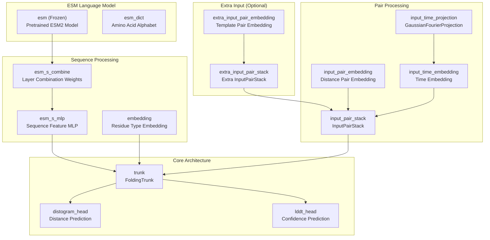
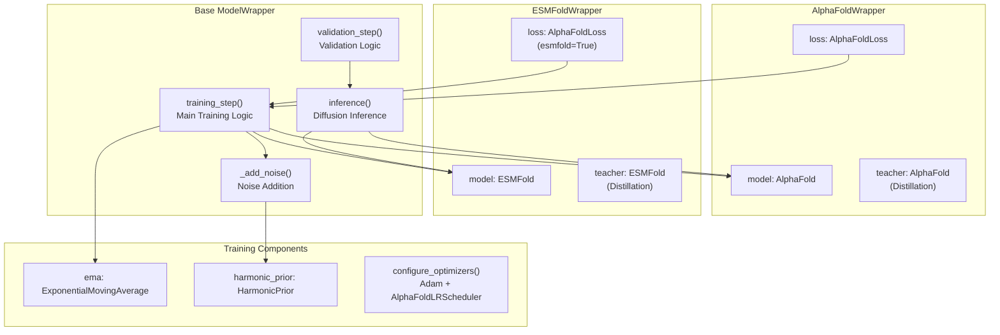
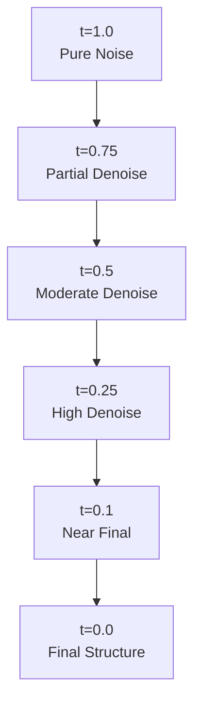
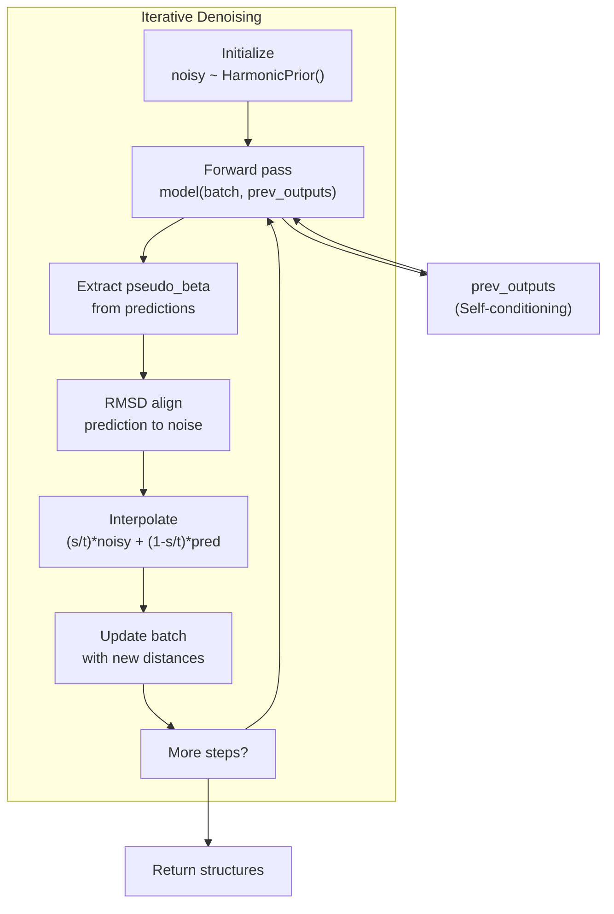

# ESMFold and ModelWrapper

> **Relevant source files**
> * [alphaflow/model/esmfold.py](https://github.com/bjing2016/alphaflow/blob/02dc0376/alphaflow/model/esmfold.py)
> * [alphaflow/model/wrapper.py](https://github.com/bjing2016/alphaflow/blob/02dc0376/alphaflow/model/wrapper.py)

This document covers the ESMFold model implementation and the ModelWrapper training framework that provides the core training and inference capabilities for both ESMFold and AlphaFold models in the AlphaFlow system.

For information about the AlphaFold model architecture, see [AlphaFold Architecture](#5.3). For details about dataset classes used with these models, see [Dataset Classes](/bjing2016/alphaflow/5.2-dataset-classes).

## ESMFold Architecture

The `ESMFold` class extends Meta's ESMFold with diffusion capabilities for ensemble generation. It combines the ESM protein language model with a folding trunk and specialized input processing for handling noisy distance inputs during diffusion training.

### Core Components

The ESMFold architecture consists of several key components:



Sources: [alphaflow/model/esmfold.py L49-L124](https://github.com/bjing2016/alphaflow/blob/02dc0376/alphaflow/model/esmfold.py#L49-L124)

### Key Methods

| Method | Purpose | Key Features |
| --- | --- | --- |
| `__init__` | Initialize model components | Sets up ESM model, embeddings, trunk, and heads |
| `forward` | Main forward pass | Handles noisy inputs, time conditioning, optional extra inputs |
| `infer` | Sequence-to-structure inference | Batch processing, multimer support, residue indexing |
| `_compute_language_model_representations` | Extract ESM features | BOS/EOS token handling, attention extraction |
| `_get_input_pair_embeddings` | Process distance inputs | Distance binning, pair embedding, stack processing |

Sources: [alphaflow/model/esmfold.py L125-L437](https://github.com/bjing2016/alphaflow/blob/02dc0376/alphaflow/model/esmfold.py#L125-L437)

## ModelWrapper Training Framework

The `ModelWrapper` class provides a PyTorch Lightning-based training framework that supports diffusion training, distillation, and exponential moving averages. It serves as the base class for both `ESMFoldWrapper` and `AlphaFoldWrapper`.

### Training Architecture



Sources: [alphaflow/model/wrapper.py L51-L515](https://github.com/bjing2016/alphaflow/blob/02dc0376/alphaflow/model/wrapper.py#L51-L515)

### Training Process Flow

The training process implements diffusion-based ensemble generation with optional self-conditioning and distillation:

```mermaid
flowchart TD

DIST_START["disillation_training_step()"]
TEACHER_FORWARD["Teacher forward pass<br>(multiple steps)"]
STUDENT_FORWARD["Student forward pass<br>(single step)"]
DIST_LOSS["Distillation loss"]
START["training_step()"]
NOISE_CHECK["noise_prob > random?"]
ADD_NOISE_STEP["_add_noise()<br>Add diffusion noise"]
SELF_COND_CHECK["self_cond_prob > random?"]
SELF_COND_FORWARD["Forward pass<br>(no_grad)"]
MAIN_FORWARD["Forward pass<br>(with prev_outputs)"]
LOSS_CALC["Loss calculation"]
METRICS["Validation metrics"]

subgraph subGraph1 ["Distillation Training"]
    DIST_START
    TEACHER_FORWARD
    STUDENT_FORWARD
    DIST_LOSS
    DIST_START --> TEACHER_FORWARD
    TEACHER_FORWARD --> STUDENT_FORWARD
    STUDENT_FORWARD --> DIST_LOSS
end

subgraph subGraph0 ["Standard Training"]
    START
    NOISE_CHECK
    ADD_NOISE_STEP
    SELF_COND_CHECK
    SELF_COND_FORWARD
    MAIN_FORWARD
    LOSS_CALC
    METRICS
    START --> NOISE_CHECK
    NOISE_CHECK --> ADD_NOISE_STEP
    NOISE_CHECK --> SELF_COND_CHECK
    ADD_NOISE_STEP --> SELF_COND_CHECK
    SELF_COND_CHECK --> SELF_COND_FORWARD
    SELF_COND_CHECK --> MAIN_FORWARD
    SELF_COND_FORWARD --> MAIN_FORWARD
    MAIN_FORWARD --> LOSS_CALC
    LOSS_CALC --> METRICS
end
```



Sources: [alphaflow/model/wrapper.py L52-L175](https://github.com/bjing2016/alphaflow/blob/02dc0376/alphaflow/model/wrapper.py#L52-L175)

## Diffusion Noise Addition

The `_add_noise` method implements the core diffusion process by interpolating between ground truth and random structures:

### Noise Addition Process

| Component | Purpose | Implementation |
| --- | --- | --- |
| `HarmonicPrior` | Generate random structures | Samples from harmonic distribution |
| `rmsdalign` | Align structures | RMSD-based structural alignment |
| Time sampling | Control noise level | `t ~ Uniform(0,1)` |
| Interpolation | Mix clean/noisy | `(1-t) * clean + t * noisy` |

The process creates noisy pseudo-beta distances for training:

```python
# Simplified noise addition logic from _add_noise()noisy = harmonic_prior.sample()noisy = rmsdalign(ground_truth, noisy)t = random_uniform()noisy_beta = (1 - t) * ground_truth + t * noisy
```

Sources: [alphaflow/model/wrapper.py L52-L71](https://github.com/bjing2016/alphaflow/blob/02dc0376/alphaflow/model/wrapper.py#L52-L71)

## Inference Pipeline

The `inference` method implements iterative denoising for structure generation:

### Diffusion Schedule



### Self-Conditioning Flow



Sources: [alphaflow/model/wrapper.py L350-L392](https://github.com/bjing2016/alphaflow/blob/02dc0376/alphaflow/model/wrapper.py#L350-L392)

## Key Configuration Parameters

### ESMFold Configuration

| Parameter | Purpose | Location |
| --- | --- | --- |
| `esm_type` | ESM model variant | [alphaflow/model/esmfold.py L57](https://github.com/bjing2016/alphaflow/blob/02dc0376/alphaflow/model/esmfold.py#L57-L57) |
| `trunk` | Folding trunk config | [alphaflow/model/esmfold.py L112](https://github.com/bjing2016/alphaflow/blob/02dc0376/alphaflow/model/esmfold.py#L112-L112) |
| `input_pair_embedder` | Distance embedding config | [alphaflow/model/esmfold.py L77-L92](https://github.com/bjing2016/alphaflow/blob/02dc0376/alphaflow/model/esmfold.py#L77-L92) |
| `use_esm_attn_map` | Use ESM attention | [alphaflow/model/esmfold.py L153](https://github.com/bjing2016/alphaflow/blob/02dc0376/alphaflow/model/esmfold.py#L153-L153) |

### Training Configuration

| Parameter | Purpose | Default/Usage |
| --- | --- | --- |
| `noise_prob` | Probability of adding noise | Training control |
| `self_cond_prob` | Self-conditioning probability | Training enhancement |
| `extra_input_prob` | Template input probability | Template training |
| `distillation` | Enable distillation training | Knowledge transfer |
| `no_ema` | Disable exponential moving average | Weight averaging |

Sources: [alphaflow/model/wrapper.py L126-L175](https://github.com/bjing2016/alphaflow/blob/02dc0376/alphaflow/model/wrapper.py#L126-L175)

## Validation and Metrics

The validation process generates ensemble predictions and computes structural metrics:

### Validation Metrics

| Metric Type | Metrics | Purpose |
| --- | --- | --- |
| Reference Comparison | RMSD, GDT-TS, GDT-HA, LDDT | Compare to ground truth |
| Self Comparison | Self-RMSD, Self-LDDT | Measure ensemble diversity |
| Single Structure | First prediction metrics | Assess initial quality |

The validation generates multiple samples per input and computes both reference and self-consistency metrics to evaluate both accuracy and ensemble quality.

Sources: [alphaflow/model/wrapper.py L177-L229](https://github.com/bjing2016/alphaflow/blob/02dc0376/alphaflow/model/wrapper.py#L177-L229)

 [alphaflow/model/wrapper.py L394-L446](https://github.com/bjing2016/alphaflow/blob/02dc0376/alphaflow/model/wrapper.py#L394-L446)