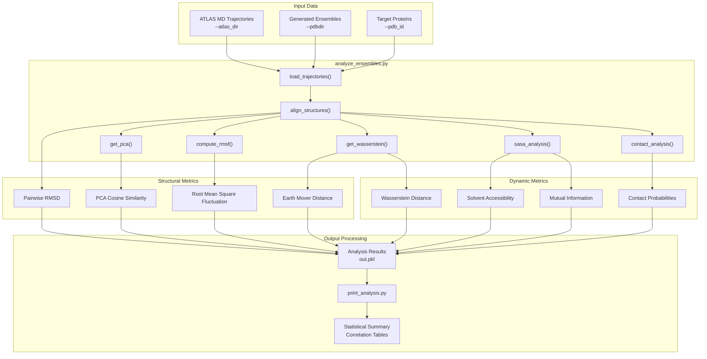
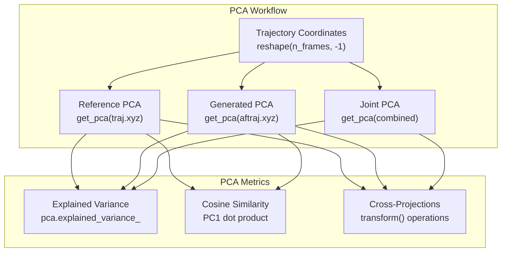
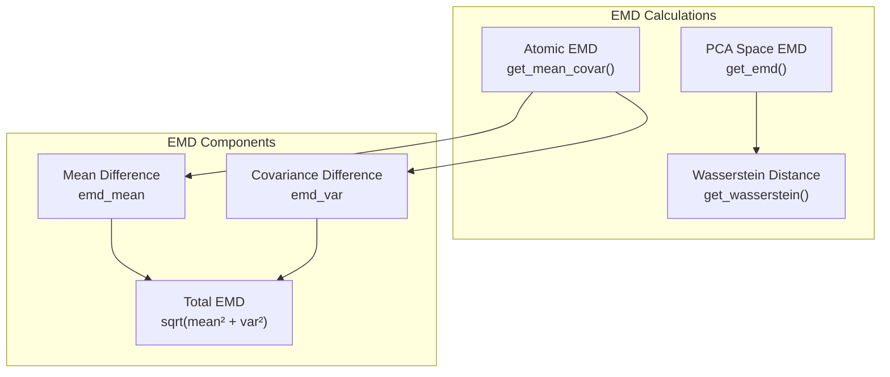
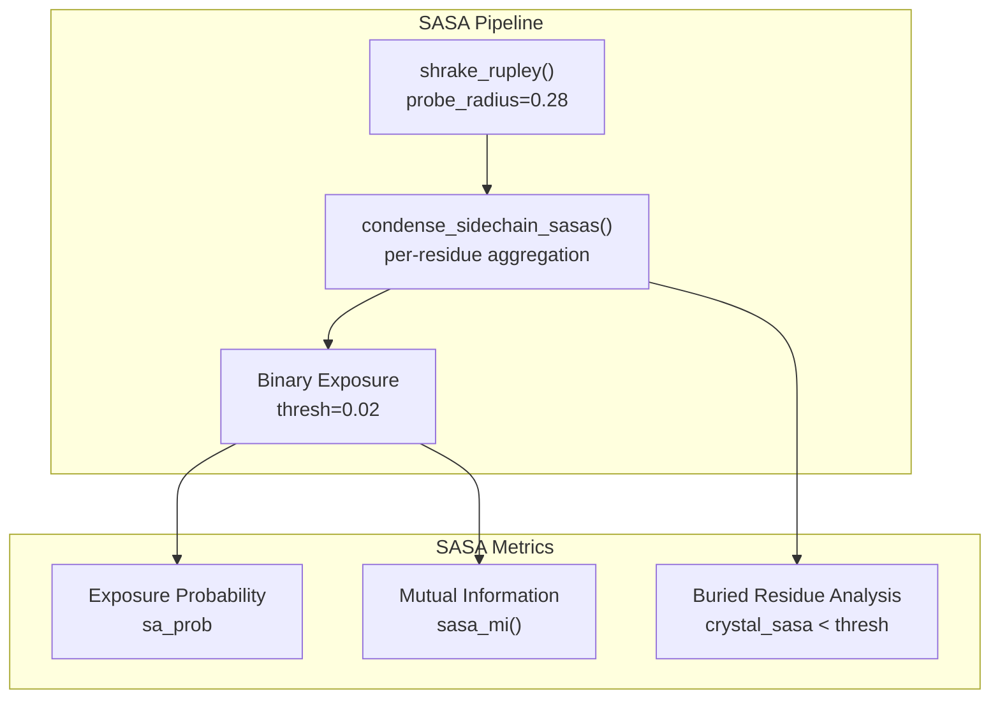

# Ensemble Analysis

> **Relevant source files**
> * [scripts/analyze_ensembles.py](https://github.com/bjing2016/alphaflow/blob/02dc0376/scripts/analyze_ensembles.py)
> * [scripts/print_analysis.py](https://github.com/bjing2016/alphaflow/blob/02dc0376/scripts/print_analysis.py)

This page documents the ensemble analysis system used to evaluate and compare protein conformational ensembles generated by AlphaFlow and ESMFlow models against reference molecular dynamics (MD) trajectories from the ATLAS dataset. The analysis pipeline computes structural, dynamic, and contact-based metrics to quantify how well generated ensembles capture the conformational dynamics observed in experimental MD simulations.

For information about generating ensembles, see [Inference System](/bjing2016/alphaflow/3-inference-system). For performance comparisons between different model variants, see [Performance Evaluation](/bjing2016/alphaflow/7.2-performance-evaluation).

## Analysis Pipeline Overview

The ensemble analysis system consists of two main components: `analyze_ensembles.py` for computing detailed structural metrics, and `print_analysis.py` for generating comparative statistical reports.



Sources: [scripts/analyze_ensembles.py L1-L286](https://github.com/bjing2016/alphaflow/blob/02dc0376/scripts/analyze_ensembles.py#L1-L286)

 [scripts/print_analysis.py L1-L111](https://github.com/bjing2016/alphaflow/blob/02dc0376/scripts/print_analysis.py#L1-L111)

## Core Analysis Functions

### Structural Alignment and Preprocessing

The analysis begins by loading reference MD trajectories and generated ensembles, then performing structural alignment to enable meaningful comparisons.

| Function | Purpose | Key Operations |
| --- | --- | --- |
| `align_tops()` | Align topology structures | Matches atoms between reference and generated structures |
| `main()` trajectory loading | Load MD and AF trajectories | Removes hydrogens, applies structural filters |
| Superposition | Structural alignment | Aligns all frames to crystal structure reference |

The preprocessing pipeline supports several structural filtering options:

* `--bb_only`: Analyze backbone atoms only (CA, C, N, O, OXT)
* `--ca_only`: Analyze C-alpha atoms only
* Default: All heavy atoms after hydrogen removal

Sources: [scripts/analyze_ensembles.py L89-L162](https://github.com/bjing2016/alphaflow/blob/02dc0376/scripts/analyze_ensembles.py#L89-L162)

### Principal Component Analysis

PCA analysis quantifies the dominant modes of motion in both reference and generated ensembles.



The `get_pca()` function [scripts/analyze_ensembles.py L19-L23](https://github.com/bjing2016/alphaflow/blob/02dc0376/scripts/analyze_ensembles.py#L19-L23)

 computes principal components and transforms coordinates into PC space. The `cosine_sim` metric [scripts/analyze_ensembles.py L228](https://github.com/bjing2016/alphaflow/blob/02dc0376/scripts/analyze_ensembles.py#L228-L228)

 measures alignment between the first principal components of reference and generated ensembles.

Sources: [scripts/analyze_ensembles.py L166-L184](https://github.com/bjing2016/alphaflow/blob/02dc0376/scripts/analyze_ensembles.py#L166-L184)

## Key Structural Metrics

### Root Mean Square Fluctuation (RMSF)

RMSF quantifies per-residue flexibility by measuring positional variance around the mean structure:

* `ref_rmsf`: Reference MD trajectory fluctuations [scripts/analyze_ensembles.py L186](https://github.com/bjing2016/alphaflow/blob/02dc0376/scripts/analyze_ensembles.py#L186-L186)
* `af_rmsf`: Generated ensemble fluctuations [scripts/analyze_ensembles.py L185](https://github.com/bjing2016/alphaflow/blob/02dc0376/scripts/analyze_ensembles.py#L185-L185)

The correlation between reference and generated RMSF profiles indicates how well the model captures residue-specific flexibility patterns.

### Pairwise RMSD Analysis

Multiple pairwise RMSD metrics assess ensemble diversity:

| Metric | Calculation | Purpose |
| --- | --- | --- |
| `ref_mean_pairwise_rmsd` | MD trajectory self-similarity | Reference ensemble diversity |
| `af_mean_pairwise_rmsd` | Generated ensemble self-similarity | Generated ensemble diversity |
| `ref_rms_pairwise_rmsd` | RMS of pairwise distances | Higher-order diversity measure |

The `get_rmsds()` function [scripts/analyze_ensembles.py L25-L32](https://github.com/bjing2016/alphaflow/blob/02dc0376/scripts/analyze_ensembles.py#L25-L32)

 computes normalized RMSD values between trajectory frames.

Sources: [scripts/analyze_ensembles.py L219-L226](https://github.com/bjing2016/alphaflow/blob/02dc0376/scripts/analyze_ensembles.py#L219-L226)

### Earth Mover's Distance (EMD)

EMD quantifies the minimum cost to transform one ensemble distribution into another using the Wasserstein distance:



The EMD decomposition separates translational differences (`emd_mean`) from conformational variability differences (`emd_var`).

Sources: [scripts/analyze_ensembles.py L188-L196](https://github.com/bjing2016/alphaflow/blob/02dc0376/scripts/analyze_ensembles.py#L188-L196)

 [scripts/analyze_ensembles.py L231-L267](https://github.com/bjing2016/alphaflow/blob/02dc0376/scripts/analyze_ensembles.py#L231-L267)

## Dynamic and Contact Analysis

### Contact Probability Analysis

Contact analysis identifies residue pairs that form transient or persistent interactions:

| Contact Type | Definition | Threshold |
| --- | --- | --- |
| Crystal contacts | Present in crystal structure | < 0.8 nm |
| Weak contacts | Crystal contacts with low MD probability | Crystal + prob < 0.9 |
| Transient contacts | Non-crystal contacts with significant MD probability | Non-crystal + prob > 0.1 |

The Intersection over Union (IoU) metric quantifies agreement between reference and generated contact patterns.

Sources: [scripts/analyze_ensembles.py L212-L218](https://github.com/bjing2016/alphaflow/blob/02dc0376/scripts/analyze_ensembles.py#L212-L218)

 [scripts/print_analysis.py L43-L56](https://github.com/bjing2016/alphaflow/blob/02dc0376/scripts/print_analysis.py#L43-L56)

### Solvent Accessible Surface Area (SASA)

SASA analysis examines sidechain exposure dynamics:



The `sasa_mi()` function [scripts/analyze_ensembles.py L54-L67](https://github.com/bjing2016/alphaflow/blob/02dc0376/scripts/analyze_ensembles.py#L54-L67)

 computes mutual information between residue exposure states, capturing correlated dynamics.

Sources: [scripts/analyze_ensembles.py L198-L211](https://github.com/bjing2016/alphaflow/blob/02dc0376/scripts/analyze_ensembles.py#L198-L211)

## Statistical Analysis and Reporting

### Correlation Analysis

The `print_analysis.py` script computes multiple correlation coefficients for each metric:

```python
def correlations(a, b, prefix=''):    return {        prefix + 'pearson': scipy.stats.pearsonr(a, b)[0],        prefix + 'spearman': scipy.stats.spearmanr(a, b)[0],         prefix + 'kendall': scipy.stats.kendalltau(a, b)[0],    }
```

Sources: [scripts/print_analysis.py L8-L13](https://github.com/bjing2016/alphaflow/blob/02dc0376/scripts/print_analysis.py#L8-L13)

### Summary Report Generation

The `analyze_data()` function [scripts/print_analysis.py L16-L72](https://github.com/bjing2016/alphaflow/blob/02dc0376/scripts/print_analysis.py#L16-L72)

 processes analysis results and generates comprehensive performance tables including:

* RMSD correlation metrics
* RMSF correlation analysis
* EMD-based distance measures
* Contact analysis IoU scores
* SASA exposure correlations

### Performance Table Output

The final output provides model comparison across key metrics:

| Metric Category | Key Measurements |
| --- | --- |
| Structural | Pairwise RMSD correlation, RMSF correlation |
| Dynamic | RMWD (Root Mean Wasserstein Distance) |
| Geometric | PC similarity percentage, Joint PCA W2 |
| Contacts | Weak/transient contact IoU |
| Exposure | Exposed residue correlation, MI matrix correlation |

Sources: [scripts/print_analysis.py L83-L111](https://github.com/bjing2016/alphaflow/blob/02dc0376/scripts/print_analysis.py#L83-L111)

## Usage Examples

### Basic Analysis Command

```
python scripts/analyze_ensembles.py \    --atlas_dir /path/to/atlas/trajectories \    --pdbdir /path/to/generated/ensembles \    --num_workers 8
```

### Analyzing Specific Targets

```python
python scripts/analyze_ensembles.py \    --atlas_dir /data/atlas \    --pdbdir /results/alphflow_md \    --pdb_id 1abc 2def 3ghi \    --ca_only
```

### Generating Comparative Reports

```
python scripts/print_analysis.py \    /results/model1/out.pkl \    /results/model2/out.pkl \    /results/model3/out.pkl
```

Sources: [scripts/analyze_ensembles.py L1-L10](https://github.com/bjing2016/alphaflow/blob/02dc0376/scripts/analyze_ensembles.py#L1-L10)

 [scripts/print_analysis.py L6](https://github.com/bjing2016/alphaflow/blob/02dc0376/scripts/print_analysis.py#L6-L6)