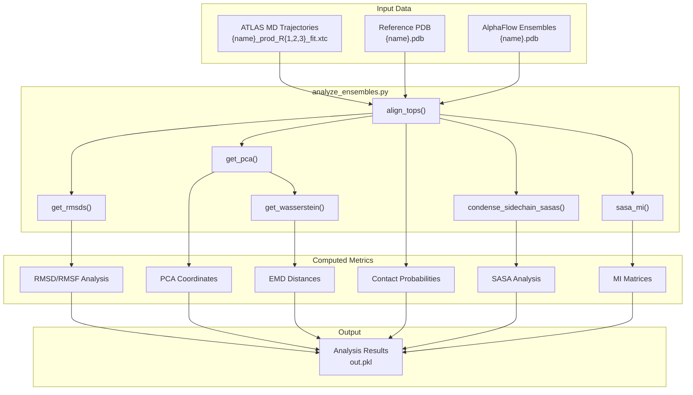
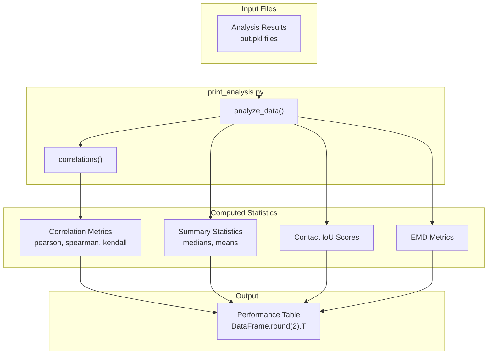

# Evaluation and Analysis

> **Relevant source files**
> * [assets/12l_md_templates.md](https://github.com/bjing2016/alphaflow/blob/02dc0376/assets/12l_md_templates.md?plain=1)
> * [assets/6uof_A_animation.gif](https://github.com/bjing2016/alphaflow/blob/02dc0376/assets/6uof_A_animation.gif)
> * [scripts/analyze_ensembles.py](https://github.com/bjing2016/alphaflow/blob/02dc0376/scripts/analyze_ensembles.py)
> * [scripts/print_analysis.py](https://github.com/bjing2016/alphaflow/blob/02dc0376/scripts/print_analysis.py)

This section covers the tools and frameworks for evaluating and analyzing generated protein ensembles from AlphaFlow and ESMFlow models. The evaluation system compares model-generated conformational ensembles against reference molecular dynamics (MD) trajectories using structural and dynamic metrics. For information about model training and inference, see [Training System](/bjing2016/alphaflow/4-training-system) and [Inference System](/bjing2016/alphaflow/3-inference-system).

The evaluation framework consists of two main components: ensemble analysis tools that compute detailed structural metrics, and performance evaluation utilities that generate comparative reports across different model variants.

## Ensemble Analysis

The core ensemble analysis is performed by `analyze_ensembles.py`, which compares AlphaFlow-generated protein ensembles against reference MD trajectories from the ATLAS dataset. This script computes comprehensive structural and dynamic metrics to assess how well the generated ensembles reproduce experimentally observed conformational behavior.



### Key Analysis Functions

The analysis pipeline implements several core functions for structural comparison:

**Trajectory Alignment and Processing**

* `align_tops()` [scripts/analyze_ensembles.py L89-L97](https://github.com/bjing2016/alphaflow/blob/02dc0376/scripts/analyze_ensembles.py#L89-L97)  aligns topology objects between reference and predicted structures
* Hydrogen removal and atom masking for consistent comparisons
* Superposition using MDTraj for structural alignment

**Principal Component Analysis**

* `get_pca()` [scripts/analyze_ensembles.py L19-L23](https://github.com/bjing2016/alphaflow/blob/02dc0376/scripts/analyze_ensembles.py#L19-L23)  performs PCA on flattened coordinate arrays
* Computes explained variance and principal component projections
* Enables comparison of conformational spaces between MD and AlphaFlow ensembles

**Distance Metrics**

* `get_rmsds()` [scripts/analyze_ensembles.py L25-L32](https://github.com/bjing2016/alphaflow/blob/02dc0376/scripts/analyze_ensembles.py#L25-L32)  computes pairwise RMSD matrices
* `get_wasserstein()` [scripts/analyze_ensembles.py L83-L87](https://github.com/bjing2016/alphaflow/blob/02dc0376/scripts/analyze_ensembles.py#L83-L87)  calculates Earth Mover's Distance using optimal transport
* Earth Mover's Distance (EMD) analysis in PCA space [scripts/analyze_ensembles.py L231-L261](https://github.com/bjing2016/alphaflow/blob/02dc0376/scripts/analyze_ensembles.py#L231-L261)

**Contact and Surface Analysis**

* Contact probability matrices from distance thresholding (0.8 nm cutoff)
* `condense_sidechain_sasas()` [scripts/analyze_ensembles.py L34-L52](https://github.com/bjing2016/alphaflow/blob/02dc0376/scripts/analyze_ensembles.py#L34-L52)  aggregates SASA by residue
* `sasa_mi()` [scripts/analyze_ensembles.py L54-L67](https://github.com/bjing2016/alphaflow/blob/02dc0376/scripts/analyze_ensembles.py#L54-L67)  computes mutual information matrices for surface exposure

### Analysis Workflow

The main analysis workflow in `main()` [scripts/analyze_ensembles.py L99-L267](https://github.com/bjing2016/alphaflow/blob/02dc0376/scripts/analyze_ensembles.py#L99-L267)

 follows these steps:

1. **Data Loading**: Loads reference MD trajectories and AlphaFlow ensembles
2. **Preprocessing**: Removes hydrogens, aligns topologies, performs superposition
3. **Structural Analysis**: Computes RMSD, RMSF, and PCA coordinates
4. **Dynamic Analysis**: Calculates EMD distances and contact probabilities
5. **Surface Analysis**: Performs SASA calculations and mutual information analysis
6. **Output Generation**: Saves comprehensive results to pickle format

### Command Line Usage

```
python scripts/analyze_ensembles.py \    --atlas_dir /path/to/atlas/trajectories \    --pdbdir /path/to/alphaflow/ensembles \    --pdb_id 6uof_A 7k00_A \    --num_workers 4
```

**Sources**: [scripts/analyze_ensembles.py L1-L286](https://github.com/bjing2016/alphaflow/blob/02dc0376/scripts/analyze_ensembles.py#L1-L286)

 [assets/6uof_A_animation.gif L1-L9](https://github.com/bjing2016/alphaflow/blob/02dc0376/assets/6uof_A_animation.gif#L1-L9)

## Performance Evaluation

The `print_analysis.py` script processes ensemble analysis results to generate comparative performance tables across different AlphaFlow model variants. This tool computes correlation statistics and summary metrics for systematic model evaluation.



### Statistical Analysis Functions

**Correlation Analysis**

* `correlations()` [scripts/print_analysis.py L8-L13](https://github.com/bjing2016/alphaflow/blob/02dc0376/scripts/print_analysis.py#L8-L13)  computes Pearson, Spearman, and Kendall correlations
* Applied to RMSF comparisons and mutual information matrices

**Data Processing**

* `analyze_data()` [scripts/print_analysis.py L16-L72](https://github.com/bjing2016/alphaflow/blob/02dc0376/scripts/print_analysis.py#L16-L72)  processes raw analysis results
* Computes IoU (Intersection over Union) scores for contact and surface exposure predictions
* Handles missing data and edge cases with proper fallbacks

### Performance Metrics

The evaluation framework computes several key performance indicators:

| Metric Category | Specific Metrics | Purpose |
| --- | --- | --- |
| **Structural Similarity** | Pairwise RMSD, RMSF correlations | Assess conformational accuracy |
| **Dynamic Properties** | EMD distances, PCA variance | Evaluate ensemble diversity |
| **Contact Prediction** | Weak/transient contact IoU | Measure interaction accuracy |
| **Surface Properties** | SASA IoU, MI matrix correlations | Assess surface exposure patterns |
| **Computational Cost** | Runtime measurements | Performance benchmarking |

### Model Comparison Results

The evaluation system has been used to compare different AlphaFlow variants, with results documented in [assets/12l_md_templates.md L1-L17](https://github.com/bjing2016/alphaflow/blob/02dc0376/assets/12l_md_templates.md?plain=1#L1-L17)

 Key findings include:

* **48-layer vs 12-layer models**: 12-layer models achieve 2.5x speedup with modest accuracy trade-offs
* **Distilled models**: Show improved runtime (38s → 1.56s) with reasonable performance retention
* **EMD analysis**: Provides sensitive metrics for conformational ensemble quality

**Usage Example**:

```
python scripts/print_analysis.py \    /path/to/results1/out.pkl \    /path/to/results2/out.pkl \    /path/to/results3/out.pkl
```

**Sources**: [scripts/print_analysis.py L1-L111](https://github.com/bjing2016/alphaflow/blob/02dc0376/scripts/print_analysis.py#L1-L111)

 [assets/12l_md_templates.md L1-L17](https://github.com/bjing2016/alphaflow/blob/02dc0376/assets/12l_md_templates.md?plain=1#L1-L17)