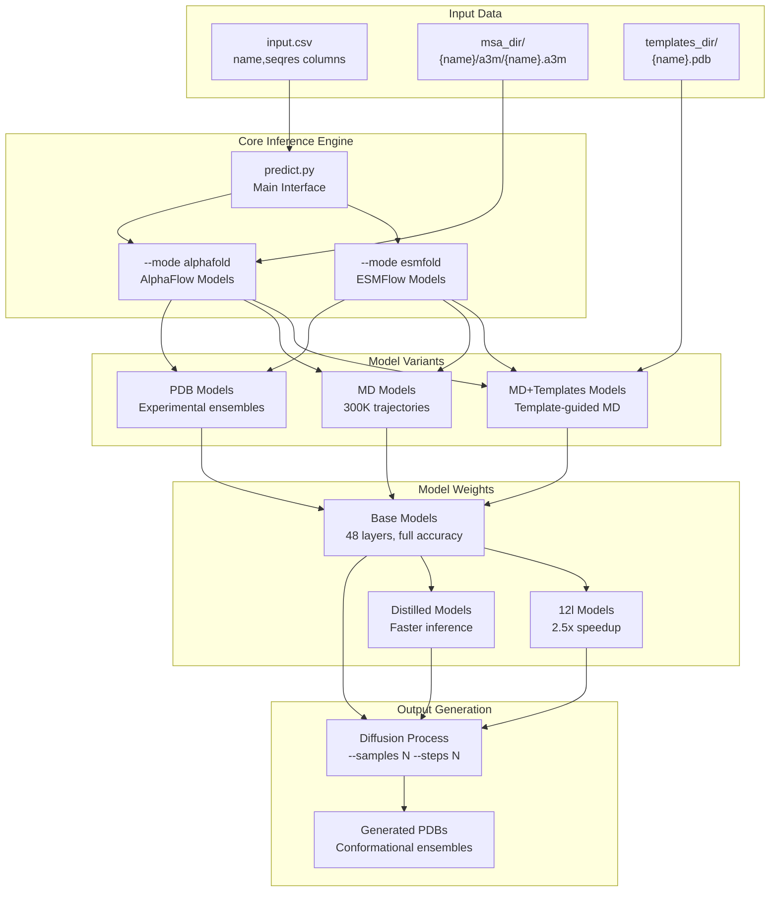
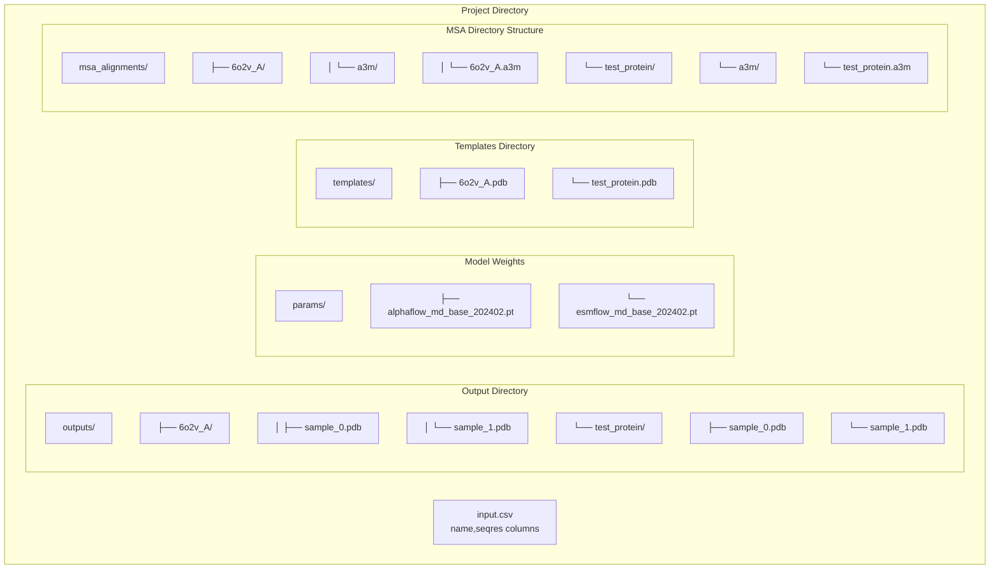

# Getting Started

> **Relevant source files**
> * [Dockerfile](https://github.com/bjing2016/alphaflow/blob/02dc0376/Dockerfile)
> * [README.md](https://github.com/bjing2016/alphaflow/blob/02dc0376/README.md?plain=1)

This guide provides step-by-step instructions for setting up AlphaFlow and running your first protein ensemble predictions. It covers installation, model selection, and basic inference workflows to get you productive quickly.

For detailed information about the underlying model architectures and training methodologies, see [Model Architecture](/bjing2016/alphaflow/5-model-architecture). For comprehensive inference configuration options, see [Inference System](/bjing2016/alphaflow/3-inference-system). For training your own models from scratch, see [Training System](/bjing2016/alphaflow/4-training-system).

## System Overview

AlphaFlow provides two main model families for generating protein conformational ensembles: **AlphaFlow** (based on AlphaFold) and **ESMFlow** (based on ESMFold). Each family offers three specialized variants trained on different data sources to model distinct types of conformational diversity.

### Model Architecture and Workflow



Sources: [README.md L86-L113](https://github.com/bjing2016/alphaflow/blob/02dc0376/README.md?plain=1#L86-L113)

 [predict.py](https://github.com/bjing2016/alphaflow/blob/02dc0376/predict.py)

### Model Selection Guide

| Use Case | Recommended Model | Key Features |
| --- | --- | --- |
| Crystal structure variants | AlphaFlow-PDB | Models experimental conditions |
| Physiological dynamics | AlphaFlow-MD | 300K MD trajectories |
| Template-guided modeling | AlphaFlow-MD+Templates | Uses reference structures |
| Sequence-only prediction | ESMFlow variants | No MSA required |
| Fast inference | 12l or distilled models | 2.5x faster execution |

Sources: [README.md L49-L59](https://github.com/bjing2016/alphaflow/blob/02dc0376/README.md?plain=1#L49-L59)

## Installation and Environment Setup

### Standard Installation

Create a Python 3.9 environment and install the required dependencies:

```sql
conda create -n alphaflow python=3.9conda activate alphaflow # Core dependenciespip install numpy==1.21.2 pandas==1.5.3pip install torch==1.12.1+cu113 -f https://download.pytorch.org/whl/torch_stable.htmlpip install biopython==1.79 dm-tree==0.1.6 modelcif==0.7 ml-collections==0.1.0 scipy==1.7.1 absl-py einopspip install pytorch_lightning==2.0.4 fair-esm mdtraj==1.9.9 wandb # OpenFold installation (requires CUDA 11)pip install 'openfold @ git+https://github.com/aqlaboratory/openfold.git@103d037'
```

### CUDA 11 Installation (if system has wrong CUDA version)

```markdown
conda install nvidia/label/cuda-11.8.0::cudaconda install nvidia/label/cuda-11.8.0::cuda-cudart-devconda install nvidia/label/cuda-11.8.0::libcusparse-devconda install nvidia/label/cuda-11.8.0::libcusolver-devconda install nvidia/label/cuda-11.8.0::libcublas-devln -s $CONDA_PREFIX/lib/libcudart_static.a $CONDA_PREFIX/lib/libcudart.a # Install OpenFold with CUDA environmentCUDA_HOME=$CONDA_PREFIX pip install 'openfold @ git+https://github.com/aqlaboratory/openfold.git@103d037'
```

### Docker Deployment

For containerized deployment, use the provided Dockerfile which builds on the OpenFold container:

```markdown
# Build the containerdocker build -t alphaflow . # Run with GPU support and mounted output directorydocker run --gpus all -v "$(pwd)/outputs:/outputs" -it alphaflow bash # Test command inside containerpython predict.py --mode esmfold --input_csv splits/atlas_test.csv --pdb 6o2v_A \    --weights params/esmflow_md_base_202402.pt --samples 5 --outpdb /outputs
```

Sources: [README.md L26-L47](https://github.com/bjing2016/alphaflow/blob/02dc0376/README.md?plain=1#L26-L47)

 [Dockerfile L1-L87](https://github.com/bjing2016/alphaflow/blob/02dc0376/Dockerfile#L1-L87)

## Model Weights and Download

### Weight Download Commands

Download model weights from Google Cloud Storage. Choose weights based on your use case:

```sql
# Create weights directorymkdir -p params # Example: AlphaFlow-MD base modelwget -O params/alphaflow_md_base_202402.pt \    https://storage.googleapis.com/alphaflow/params/alphaflow_md_base_202402.pt # Example: Fast inference model (12l)wget -O params/alphaflow_12l_md_templates_base_202406.pt \    https://storage.googleapis.com/alphaflow/params/alphaflow_12l_md_templates_base_202406.pt # Example: ESMFlow for sequence-only predictionwget -O params/esmflow_md_base_202402.pt \    https://storage.googleapis.com/alphaflow/params/esmflow_md_base_202402.pt
```

### Available Model Weights

```mermaid
flowchart TD

BASE_TIER["Base: Full accuracy<br>48 layers"]
DIST_TIER["Distilled: Faster<br>Some accuracy loss"]
L12_TIER["12l: 2.5x speedup<br>Small accuracy loss"]
AF_PDB_BASE["alphaflow_pdb_base_202402.pt"]
AF_PDB_DIST["alphaflow_pdb_distilled_202402.pt"]
AF_MD_BASE["alphaflow_md_base_202402.pt"]
AF_MD_DIST["alphaflow_md_distilled_202402.pt"]
AF_MDT_BASE["alphaflow_md_templates_base_202402.pt"]
AF_MDT_DIST["alphaflow_md_templates_distilled_202402.pt"]
AF_MDT_12L_BASE["alphaflow_12l_md_templates_base_202406.pt"]
AF_MDT_12L_DIST["alphaflow_12l_md_templates_distilled_202406.pt"]
ESM_PDB_BASE["esmflow_pdb_base_202402.pt"]
ESM_PDB_DIST["esmflow_pdb_distilled_202402.pt"]
ESM_MD_BASE["esmflow_md_base_202402.pt"]
ESM_MD_DIST["esmflow_md_distilled_202402.pt"]
ESM_MDT_BASE["esmflow_md_templates_base_202402.pt"]
ESM_MDT_DIST["esmflow_md_templates_distilled_202402.pt"]
PDB_TYPE["PDB: Experimental<br>ensembles"]
MD_TYPE["MD: 300K trajectory<br>ensembles"]
MDT_TYPE["MD+Templates:<br>Template-guided"]

PDB_TYPE --> AF_PDB_BASE
PDB_TYPE --> AF_PDB_DIST
PDB_TYPE --> ESM_PDB_BASE
PDB_TYPE --> ESM_PDB_DIST
MD_TYPE --> AF_MD_BASE
MD_TYPE --> AF_MD_DIST
MD_TYPE --> ESM_MD_BASE
MD_TYPE --> ESM_MD_DIST
MDT_TYPE --> AF_MDT_BASE
MDT_TYPE --> AF_MDT_DIST
MDT_TYPE --> AF_MDT_12L_BASE
MDT_TYPE --> AF_MDT_12L_DIST
MDT_TYPE --> ESM_MDT_BASE
MDT_TYPE --> ESM_MDT_DIST

subgraph subGraph2 ["Model Types"]
    PDB_TYPE
    MD_TYPE
    MDT_TYPE
end

subgraph subGraph1 ["ESMFlow Models"]
    ESM_PDB_BASE
    ESM_PDB_DIST
    ESM_MD_BASE
    ESM_MD_DIST
    ESM_MDT_BASE
    ESM_MDT_DIST
end

subgraph subGraph0 ["AlphaFlow Models"]
    AF_PDB_BASE
    AF_PDB_DIST
    AF_MD_BASE
    AF_MD_DIST
    AF_MDT_BASE
    AF_MDT_DIST
    AF_MDT_12L_BASE
    AF_MDT_12L_DIST
end

subgraph subGraph3 ["Performance Tiers"]
    BASE_TIER
    DIST_TIER
    L12_TIER
end
```



Sources: [README.md L61-L83](https://github.com/bjing2016/alphaflow/blob/02dc0376/README.md?plain=1#L61-L83)

## Quick Start Example

### Input Data Preparation

Create the required input files for a basic prediction:

1. **Input CSV**: Create a file with protein sequences

```
name,seqres6o2v_A,MKTVRQERLKSIVRILERSKEPVSGAQLAEELSVSRQVIVQDIYLRSLGYNIVATPRGYVLAGGtest_protein,MKLLILTCLVAVALARPKHPIKHQGLPQEVLNENLLRFFVAPFPEVFGKEKVNELSKDIGSESTEDQAMEDIKQMEAESISSSQLQQGQTVTQIPGDILLTIRQGSTQGTTQGRAVFDLMPQMSATDDFQPQAQ
```

1. **MSA Directory** (for AlphaFlow models): Generate MSAs using ColabFold API

```
python -m scripts.mmseqs_query --split input.csv --outdir msa_alignments
```

1. **Templates Directory** (for MD+Templates models): Place reference PDB files

```markdown
mkdir templates# Place template PDB files: templates/6o2v_A.pdb, templates/test_protein.pdb
```

### Basic Inference Commands

#### ESMFlow (Sequence-only, fastest setup)

```
python predict.py \    --mode esmfold \    --input_csv input.csv \    --weights params/esmflow_md_base_202402.pt \    --samples 10 \    --outpdb outputs/
```

#### AlphaFlow (requires MSAs)

```
python predict.py \    --mode alphafold \    --input_csv input.csv \    --msa_dir msa_alignments \    --weights params/alphaflow_md_base_202402.pt \    --samples 10 \    --outpdb outputs/
```

#### AlphaFlow with Templates (most accurate for known structures)

```
python predict.py \    --mode alphafold \    --input_csv input.csv \    --msa_dir msa_alignments \    --templates_dir templates \    --weights params/alphaflow_md_templates_base_202402.pt \    --samples 10 \    --outpdb outputs/
```

### Command Options for Different Model Types

| Model Type | Required Arguments | Optional Performance Args |
| --- | --- | --- |
| PDB models | `--self_cond --resample` | `--tmax 0.2 --steps 2` |
| Distilled models | `--noisy_first --no_diffusion` |  |
| Fast inference | `--tmax 0.2 --steps 2` | `--samples 5` |
| Single protein | `--pdb 6o2v_A` |  |

Sources: [README.md L86-L113](https://github.com/bjing2016/alphaflow/blob/02dc0376/README.md?plain=1#L86-L113)

## File Structure and Organization

### Input Data Organization



### Test Data and Examples

The repository includes test data for validation:

| File | Purpose | Description |
| --- | --- | --- |
| `splits/atlas_test.csv` | Test dataset | ATLAS trajectory validation set |
| `splits/cameo2022.csv` | Validation set | CAMEO 2022 validation targets |
| `splits/atlas_train.csv` | Training data | ATLAS training split |

### Core Execution Scripts

| Script | Purpose | Key Parameters |
| --- | --- | --- |
| `predict.py` | Main inference | `--mode`, `--weights`, `--samples` |
| `train.py` | Model training | `--lr`, `--noise_prob`, `--train_data_dir` |
| `scripts/mmseqs_query.py` | MSA generation | `--split`, `--outdir` |
| `scripts/analyze_ensembles.py` | Evaluation | `--atlas_dir`, `--pdb_dir` |

Sources: [README.md L88-L95](https://github.com/bjing2016/alphaflow/blob/02dc0376/README.md?plain=1#L88-L95)

 [splits/](https://github.com/bjing2016/alphaflow/blob/02dc0376/splits/)

## Next Steps

After completing this quick start guide:

1. **For detailed inference configuration**: See [Inference System](/bjing2016/alphaflow/3-inference-system) for comprehensive parameter tuning and advanced diffusion settings
2. **For model training**: See [Training System](/bjing2016/alphaflow/4-training-system) to train custom models on your own datasets
3. **For evaluation and analysis**: See [Evaluation and Analysis](/bjing2016/alphaflow/7-evaluation-and-analysis) to assess ensemble quality and structural metrics
4. **For deployment scenarios**: See [Configuration and Deployment](/bjing2016/alphaflow/8-configuration-and-deployment) for production deployment strategies

The generated PDB ensembles can be analyzed using standard structural biology tools or the provided analysis scripts in `scripts/analyze_ensembles.py`.

Sources: [README.md L1-L214](https://github.com/bjing2016/alphaflow/blob/02dc0376/README.md?plain=1#L1-L214)