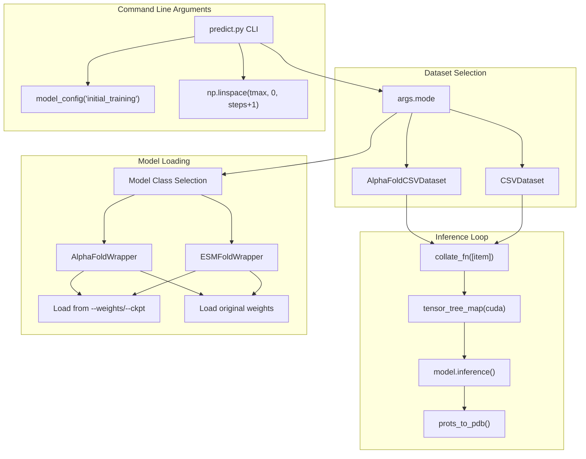
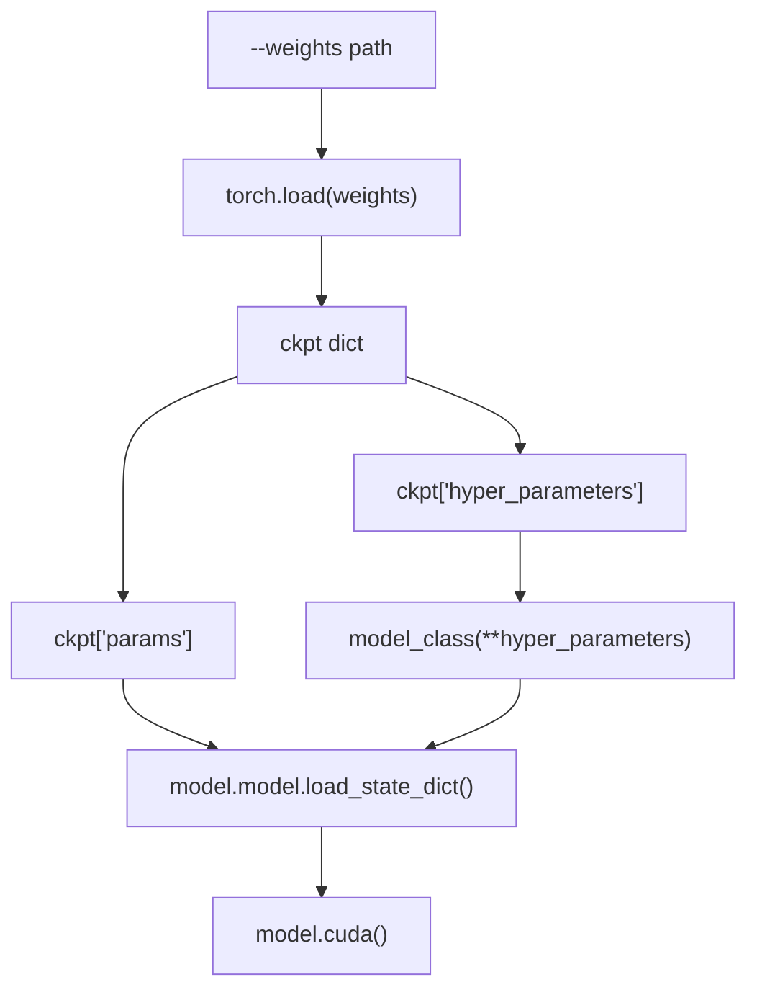
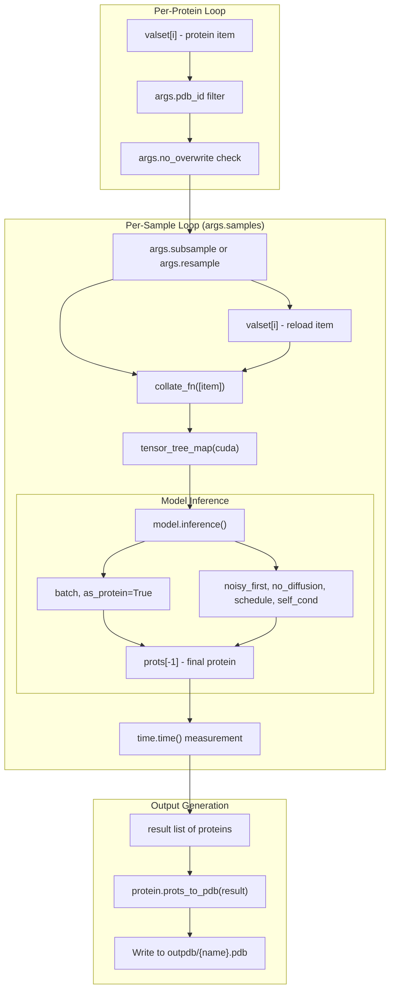
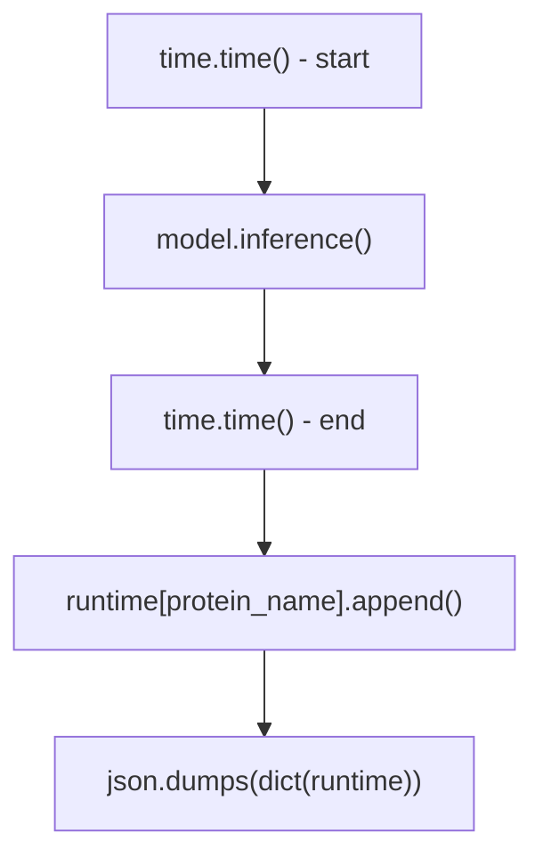

# Inference Pipeline

> **Relevant source files**
> * [predict.py](https://github.com/bjing2016/alphaflow/blob/02dc0376/predict.py)

This document covers the core inference pipeline implemented in `predict.py`, which serves as the primary entry point for generating protein conformational ensembles using trained AlphaFlow and ESMFlow models. The pipeline handles model loading, data preparation, diffusion sampling, and output generation.

For information about preparing input data (CSV files, MSAs, templates), see [Input Data Preparation](/bjing2016/alphaflow/3.2-input-data-preparation). For details about the underlying model architectures, see [Model Architecture](/bjing2016/alphaflow/5-model-architecture).

## Command-Line Interface

The inference pipeline accepts numerous command-line arguments that control model selection, sampling parameters, and output configuration:

| Parameter | Type | Default | Description |
| --- | --- | --- | --- |
| `--input_csv` | str | `splits/transporters_only.csv` | CSV file containing protein sequences |
| `--mode` | choice | `alphafold` | Model type: `alphafold` or `esmfold` |
| `--samples` | int | `10` | Number of ensemble samples to generate |
| `--steps` | int | `10` | Number of diffusion denoising steps |
| `--tmax` | float | `1.0` | Maximum noise level for diffusion |
| `--msa_dir` | str | `./alignment_dir` | Directory containing MSA files |
| `--templates_dir` | str | `None` | Directory containing template structures |
| `--weights` | str | `None` | Path to trained model weights |
| `--outpdb` | str | `./outpdb/default` | Output directory for PDB files |

Additional sampling control parameters include `--no_diffusion`, `--self_cond`, and `--noisy_first` for specialized inference modes.

Sources: [predict.py L1-L22](https://github.com/bjing2016/alphaflow/blob/02dc0376/predict.py#L1-L22)

## Pipeline Architecture



Sources: [predict.py L42-L133](https://github.com/bjing2016/alphaflow/blob/02dc0376/predict.py#L42-L133)

## Model Initialization Process

The pipeline supports three model loading strategies based on command-line arguments:

### Custom Trained Weights

When `--weights` is specified, the system loads a PyTorch Lightning checkpoint:



### Original Pretrained Weights

When `--original_weights` is specified, the system loads base model weights:

* **ESMFold mode**: Loads `esmfold_3B_v1.pt` using `torch.load()` and `model_state` dictionary
* **AlphaFold mode**: Uses `import_jax_weights_()` with `params_model_1.npz` and `model_3` version

### PyTorch Lightning Checkpoint

Default loading uses `model_class.load_from_checkpoint()` with EMA weight loading via `model.load_ema_weights()`.

Sources: [predict.py L75-L99](https://github.com/bjing2016/alphaflow/blob/02dc0376/predict.py#L75-L99)

## Dataset Loading and Batch Preparation

The pipeline selects dataset classes based on the specified mode:

| Mode | Dataset Class | Requirements |
| --- | --- | --- |
| `alphafold` | `AlphaFoldCSVDataset` | MSA files, optional templates |
| `esmfold` | `CSVDataset` | Sequence-only input |

Both datasets are initialized with the same parameters from [predict.py L62-L70](https://github.com/bjing2016/alphaflow/blob/02dc0376/predict.py#L62-L70)

:

* `data_cfg`: Configuration object
* `args.input_csv`: Input CSV file path
* `msa_dir`: MSA directory path
* `templates_dir`: Templates directory path

The `collate_fn` function converts individual dataset items into batched tensors, followed by CUDA memory transfer using `tensor_tree_map`.

Sources: [predict.py L62-L117](https://github.com/bjing2016/alphaflow/blob/02dc0376/predict.py#L62-L117)

## Inference Execution Loop

The core inference loop processes each protein through multiple sampling iterations:



The `model.inference()` method accepts several key parameters:

* `batch`: Batched input tensors
* `as_protein=True`: Return protein objects instead of raw tensors
* `schedule`: Diffusion noise schedule array
* `noisy_first`: Start with noisy initial structure
* `no_diffusion`: Skip diffusion process entirely
* `self_cond`: Enable self-conditioning

Sources: [predict.py L106-L128](https://github.com/bjing2016/alphaflow/blob/02dc0376/predict.py#L106-L128)

## Diffusion Schedule Configuration

The diffusion schedule controls the denoising process across multiple steps:

```
schedule = np.linspace(args.tmax, 0, args.steps+1)if args.tmax != 1.0:    schedule = np.array([1.0] + list(schedule))
```

* Default: Linear schedule from `tmax=1.0` to `0.0` over `steps=10`
* When `tmax < 1.0`: Prepends `1.0` to enable partial denoising
* Schedule passed directly to `model.inference()` method

Sources: [predict.py L47-L49](https://github.com/bjing2016/alphaflow/blob/02dc0376/predict.py#L47-L49)

## MSA Subsampling Configuration

When `--subsample` is specified, the system reduces MSA depth for faster inference:

```
data_cfg.predict.max_msa_clusters = args.subsample // 2data_cfg.predict.max_extra_msa = args.subsample
```

This implements the subsampling strategy from [eLifeSciences 75751](https://elifesciences.org/articles/75751#s3) for computational efficiency.

Sources: [predict.py L55-L57](https://github.com/bjing2016/alphaflow/blob/02dc0376/predict.py#L55-L57)

## Runtime Performance Tracking

The pipeline optionally tracks inference runtime per protein when `--runtime_json` is specified:



Runtime measurements capture only the `model.inference()` call duration, excluding data loading and PDB conversion overhead.

Sources: [predict.py L118-L131](https://github.com/bjing2016/alphaflow/blob/02dc0376/predict.py#L118-L131)