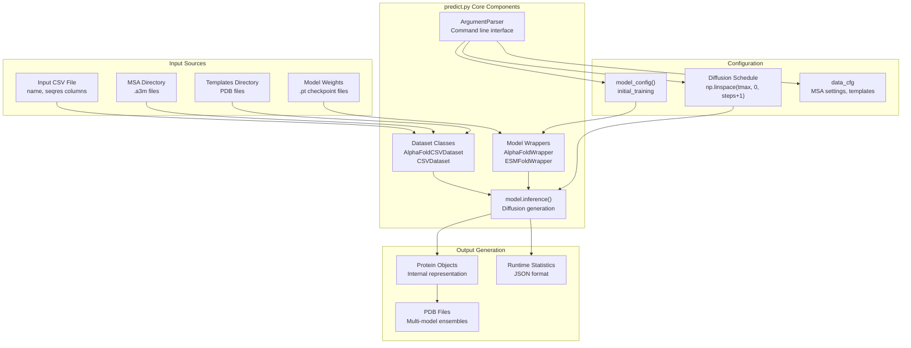
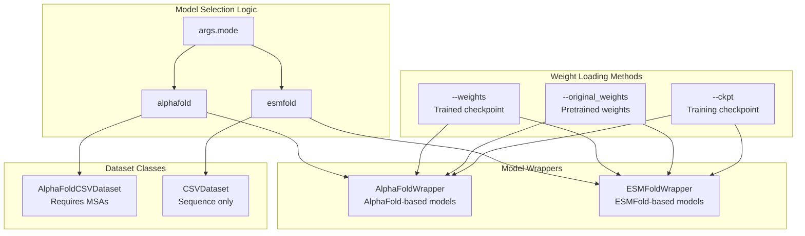

# Inference System

> **Relevant source files**
> * [README.md](https://github.com/bjing2016/alphaflow/blob/02dc0376/README.md?plain=1)
> * [predict.py](https://github.com/bjing2016/alphaflow/blob/02dc0376/predict.py)

This document covers the AlphaFlow inference system, which generates protein conformational ensembles using trained AlphaFlow and ESMFlow models. The inference system is primarily implemented through the `predict.py` script and supports various model variants, diffusion parameters, and output formats.

For information about training models, see [Training System](/bjing2016/alphaflow/4-training-system). For details on preparing training data and MSA generation, see [Input Data Preparation](/bjing2016/alphaflow/3.2-input-data-preparation).

## System Overview

The inference system generates protein structure ensembles through a flow matching diffusion process. It supports two main model architectures (AlphaFold-based and ESMFold-based) with multiple training variants, and provides extensive configuration options for controlling the generation process.



Sources: [predict.py L1-L134](https://github.com/bjing2016/alphaflow/blob/02dc0376/predict.py#L1-L134)

 [README.md L86-L113](https://github.com/bjing2016/alphaflow/blob/02dc0376/README.md?plain=1#L86-L113)

## Command Line Interface

The `predict.py` script provides the primary interface for running inference. It accepts numerous command line arguments to control model selection, input data sources, and generation parameters.

### Core Arguments

| Argument | Type | Default | Description |
| --- | --- | --- | --- |
| `--mode` | choice | `alphafold` | Model architecture: `alphafold` or `esmfold` |
| `--input_csv` | str | `splits/transporters_only.csv` | Input CSV with protein sequences |
| `--weights` | str | None | Path to trained model weights (.pt file) |
| `--samples` | int | 10 | Number of ensemble structures to generate |
| `--outpdb` | str | `./outpdb/default` | Output directory for PDB files |

### Diffusion Control Arguments

| Argument | Type | Default | Description |
| --- | --- | --- | --- |
| `--steps` | int | 10 | Number of diffusion steps |
| `--tmax` | float | 1.0 | Maximum diffusion time |
| `--no_diffusion` | flag | False | Skip diffusion process |
| `--noisy_first` | flag | False | Use noisy first frame (for distilled models) |
| `--self_cond` | flag | False | Enable self-conditioning |

### Data Source Arguments

| Argument | Type | Default | Description |
| --- | --- | --- | --- |
| `--msa_dir` | str | `./alignment_dir` | Directory containing MSA files |
| `--templates_dir` | str | None | Directory containing template PDB files |
| `--pdb_id` | list | [] | Specific protein IDs to process |
| `--subsample` | int | None | MSA subsampling size |

Sources: [predict.py L1-L22](https://github.com/bjing2016/alphaflow/blob/02dc0376/predict.py#L1-L22)

## Model Architecture Support

The inference system supports two distinct model architectures through wrapper classes, each with specific initialization and loading procedures.



Sources: [predict.py L62-L71](https://github.com/bjing2016/alphaflow/blob/02dc0376/predict.py#L62-L71)

 [predict.py L73-L99](https://github.com/bjing2016/alphaflow/blob/02dc0376/predict.py#L73-L99)

## Diffusion Process Configuration

The inference system implements a flow matching diffusion process with configurable scheduling and conditioning options.

### Schedule Generation

The diffusion schedule is generated using a linear interpolation between `tmax` and 0, with special handling for truncated inference:

```
schedule = np.linspace(args.tmax, 0, args.steps+1)if args.tmax != 1.0:    schedule = np.array([1.0] + list(schedule))
```

### Model Configuration

The system uses the `model_config('initial_training')` configuration with specific modifications for inference:

* `use_templates`: Set to False by default
* `max_recycling_iters`: Set to 0 for inference
* MSA subsampling: Controlled by `--subsample` argument

Sources: [predict.py L42-L58](https://github.com/bjing2016/alphaflow/blob/02dc0376/predict.py#L42-L58)

## Inference Loop Implementation

The core inference process iterates through proteins in the dataset, generating multiple samples for each protein through the diffusion process.

```mermaid
sequenceDiagram
  participant main()
  participant valset[i]
  participant collate_fn()
  participant model.inference()
  participant protein.prots_to_pdb()

  main()->>valset[i]: Get protein data
  valset[i]->>collate_fn(): Collate single item
  collate_fn()->>model.inference(): Send to GPU via tensor_tree_map
  loop [For each sample (args.samples)]
    model.inference()->>model.inference(): Apply diffusion process
    model.inference()->>main(): Return protein objects
  end
  main()->>protein.prots_to_pdb(): Convert to PDB format
  protein.prots_to_pdb()->>main(): Write ensemble PDB file
```

### Key Implementation Details

* **Resampling**: When `--resample` or `--subsample` flags are used, the dataset item is re-fetched for each sample to generate different MSA subsamples
* **GPU Transfer**: All batch data is moved to GPU using `tensor_tree_map(lambda x: x.cuda(), batch)`
* **Output Format**: Results are written as multi-model PDB files using `protein.prots_to_pdb(result)`
* **Runtime Tracking**: Optional runtime statistics are collected per protein

Sources: [predict.py L103-L131](https://github.com/bjing2016/alphaflow/blob/02dc0376/predict.py#L103-L131)

## Output Generation and File Management

The system generates PDB files containing multiple conformational states for each input protein, with optional runtime tracking and overwrite protection.

### File Naming Convention

* Output files follow the pattern: `{outpdb_dir}/{protein_name}.pdb`
* Each PDB file contains multiple MODEL records representing ensemble members

### Runtime Statistics

When `--runtime_json` is specified, the system tracks inference time per protein and saves the data in JSON format:

```json
{  "protein_name_1": [1.23, 1.45, 1.67],  "protein_name_2": [2.34, 2.56, 2.78]}
```

### Overwrite Protection

The `--no_overwrite` flag prevents regeneration of existing PDB files, allowing for partial rerun of large inference jobs.

Sources: [predict.py L109-L131](https://github.com/bjing2016/alphaflow/blob/02dc0376/predict.py#L109-L131)

 [predict.py L126-L131](https://github.com/bjing2016/alphaflow/blob/02dc0376/predict.py#L126-L131)