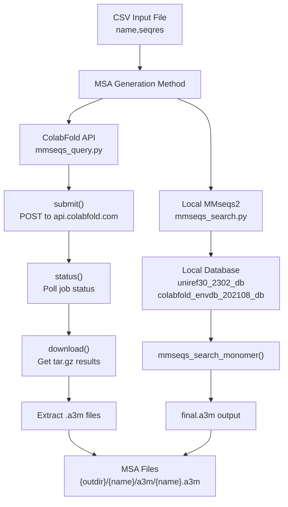
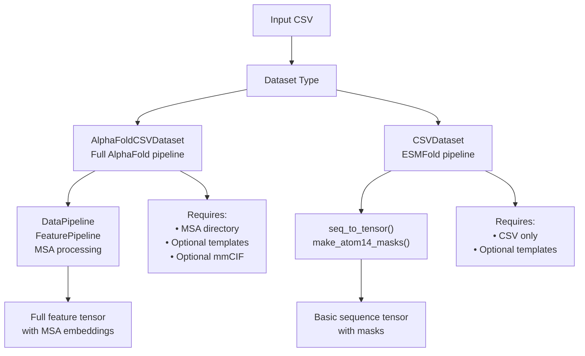
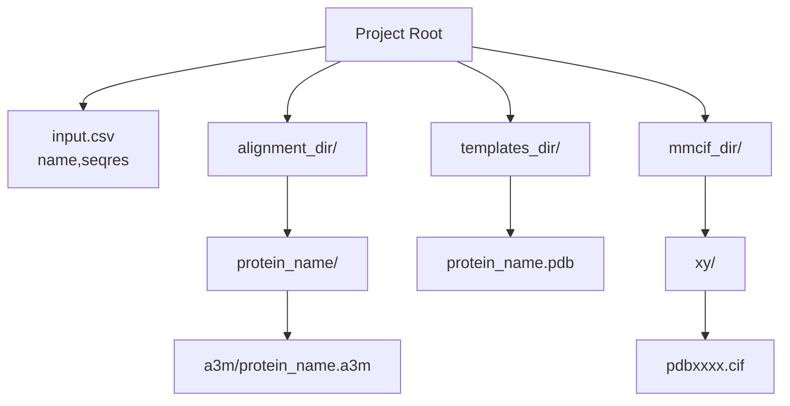

# Input Data Preparation

> **Relevant source files**
> * [alphaflow/data/inference.py](https://github.com/bjing2016/alphaflow/blob/02dc0376/alphaflow/data/inference.py)
> * [scripts/mmseqs_query.py](https://github.com/bjing2016/alphaflow/blob/02dc0376/scripts/mmseqs_query.py)
> * [scripts/mmseqs_search.py](https://github.com/bjing2016/alphaflow/blob/02dc0376/scripts/mmseqs_search.py)
> * [scripts/mmseqs_search_helper.py](https://github.com/bjing2016/alphaflow/blob/02dc0376/scripts/mmseqs_search_helper.py)

This document covers the preparation of input data required for running inference with AlphaFlow and ESMFlow models. This includes formatting protein sequences, generating Multiple Sequence Alignments (MSAs), preparing template structures, and understanding the dataset classes that load this data. For details on running the actual inference pipeline, see [Inference Pipeline](/bjing2016/alphaflow/3.1-inference-pipeline).

## Input Data Requirements

The AlphaFlow inference system requires different types of input data depending on the model variant being used:

| Model Type | CSV File | MSAs | Templates |
| --- | --- | --- | --- |
| ESMFlow variants | Required | Optional | Optional |
| AlphaFlow variants | Required | Required | Optional |

### CSV Input Format

All inference begins with a CSV file containing protein information. The CSV must have specific columns:

```
name,seqres,msa_id6uof_A,MKTVRQERLKSIVRILERSKEPVSGAQLAEELSVSRQVIVQDIAYLRSLGYNIVATPRGYVLAGG,6uof_A
```

**Required columns:**

* `name`: Unique identifier for the protein (used as index)
* `seqres`: Amino acid sequence in single-letter code

**Optional columns:**

* `msa_id`: Alternative identifier for MSA files (defaults to `name` if not provided)

*Sources: [alphaflow/data/inference.py L20](https://github.com/bjing2016/alphaflow/blob/02dc0376/alphaflow/data/inference.py#L20-L20)

 [alphaflow/data/inference.py L42-L43](https://github.com/bjing2016/alphaflow/blob/02dc0376/alphaflow/data/inference.py#L42-L43)*

## MSA Generation Workflow

Multiple Sequence Alignments are required for AlphaFlow models and optional for ESMFlow models. The system provides two methods for MSA generation:

### MSA Generation Methods



*Sources: [scripts/mmseqs_query.py L21-L282](https://github.com/bjing2016/alphaflow/blob/02dc0376/scripts/mmseqs_query.py#L21-L282)

 [scripts/mmseqs_search.py L25-L146](https://github.com/bjing2016/alphaflow/blob/02dc0376/scripts/mmseqs_search.py#L25-L146)*

### ColabFold API Method

The `mmseqs_query.py` script uses the ColabFold web API for MSA generation:

```
python scripts/mmseqs_query.py --split input.csv --outdir ./alignment_dir
```

**Key functions:**

* `run_mmseqs2()`: Main API interface function
* `submit()`: Submits sequences to ColabFold API
* `status()`: Polls job completion status
* `download()`: Downloads results as tar.gz

The script handles rate limiting, retries, and extracts results to the expected directory structure.

*Sources: [scripts/mmseqs_query.py L21-L60](https://github.com/bjing2016/alphaflow/blob/02dc0376/scripts/mmseqs_query.py#L21-L60)

 [scripts/mmseqs_query.py L284-L294](https://github.com/bjing2016/alphaflow/blob/02dc0376/scripts/mmseqs_query.py#L284-L294)*

### Local MMseqs2 Method

For offline or high-throughput usage, `mmseqs_search.py` runs MMseqs2 locally:

```
python scripts/mmseqs_search.py query.fasta /path/to/databases /path/to/output
```

**Required databases:**

* `uniref30_2302_db`: UniRef30 protein database
* `colabfold_envdb_202108_db`: Environmental sequences database

**Key functions:**

* `mmseqs_search_monomer()`: Performs local MSA search
* `run_mmseqs()`: Executes MMseqs2 commands

*Sources: [scripts/mmseqs_search.py L25-L146](https://github.com/bjing2016/alphaflow/blob/02dc0376/scripts/mmseqs_search.py#L25-L146)

 [scripts/mmseqs_search_helper.py L1-L30](https://github.com/bjing2016/alphaflow/blob/02dc0376/scripts/mmseqs_search_helper.py#L1-L30)*

## Template Structure Preparation

Template structures provide reference conformations that can guide the diffusion process. Templates are optional but can improve prediction quality for proteins with known homologs.

### Template Directory Structure

```
templates_dir/
├── 6uof_A.pdb
├── 1abc_B.pdb
└── ...
```

Template files must:

* Be in PDB format
* Have filenames matching the `name` column in the input CSV
* Contain the target protein structure or a close homolog

*Sources: [alphaflow/data/inference.py L35-L39](https://github.com/bjing2016/alphaflow/blob/02dc0376/alphaflow/data/inference.py#L35-L39)

 [alphaflow/data/inference.py L83-L88](https://github.com/bjing2016/alphaflow/blob/02dc0376/alphaflow/data/inference.py#L83-L88)*

## Dataset Classes

The system provides two main dataset classes for loading prepared input data:

### Dataset Class Hierarchy



*Sources: [alphaflow/data/inference.py L17-L91](https://github.com/bjing2016/alphaflow/blob/02dc0376/alphaflow/data/inference.py#L17-L91)*

### AlphaFoldCSVDataset

Used for AlphaFlow models that require full MSA processing:

```markdown
dataset = AlphaFoldCSVDataset(    config=config,    path="input.csv",    msa_dir="./alignment_dir",    templates_dir="./templates",    mmcif_dir="./mmcif_files"  # Optional for reference structures)
```

**Key processing steps:**

1. `process_str()`: Processes protein sequence
2. `_process_msa_feats()`: Loads and processes MSA files
3. `process_features()`: Creates feature tensors for model input

*Sources: [alphaflow/data/inference.py L17-L60](https://github.com/bjing2016/alphaflow/blob/02dc0376/alphaflow/data/inference.py#L17-L60)*

### CSVDataset

Used for ESMFlow models that work with sequence only:

```markdown
dataset = CSVDataset(    config=config,    path="input.csv",    templates_dir="./templates"  # Optional)
```

**Key processing steps:**

1. `seq_to_tensor()`: Converts amino acid sequence to tensor
2. `make_atom14_masks()`: Creates atom masks for structure prediction

*Sources: [alphaflow/data/inference.py L62-L91](https://github.com/bjing2016/alphaflow/blob/02dc0376/alphaflow/data/inference.py#L62-L91)

 [alphaflow/data/inference.py L10-L15](https://github.com/bjing2016/alphaflow/blob/02dc0376/alphaflow/data/inference.py#L10-L15)*

## File Organization Structure

The inference system expects a specific directory structure for optimal organization:

### Expected Directory Layout



### Directory Structure Mapping

| Directory | Purpose | Required For | File Pattern |
| --- | --- | --- | --- |
| `alignment_dir/` | MSA files | AlphaFlow models | `{name}/a3m/{msa_id}.a3m` |
| `templates_dir/` | Template PDBs | Optional enhancement | `{name}.pdb` |
| `mmcif_dir/` | Reference structures | Evaluation only | `{pdb_id[1:3]}/{pdb_id}.cif` |

**Path resolution logic:**

* MSA files: `f'{msa_dir}/{msa_id}'` where `msa_id` defaults to `name`
* Templates: `f'{templates_dir}/{name}.pdb'`
* mmCIF: `f'{mmcif_dir}/{pdb_id[1:3]}/{pdb_id}.cif'` (PDB-style hierarchy)

*Sources: [alphaflow/data/inference.py L44](https://github.com/bjing2016/alphaflow/blob/02dc0376/alphaflow/data/inference.py#L44-L44)

 [alphaflow/data/inference.py L36](https://github.com/bjing2016/alphaflow/blob/02dc0376/alphaflow/data/inference.py#L36-L36)

 [alphaflow/data/inference.py L56-L58](https://github.com/bjing2016/alphaflow/blob/02dc0376/alphaflow/data/inference.py#L56-L58)*