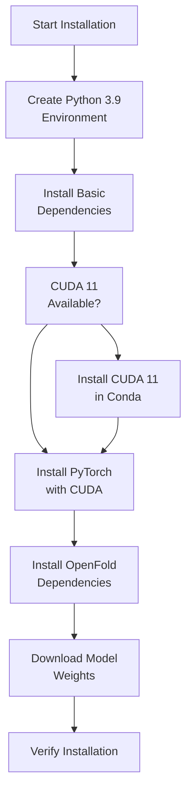
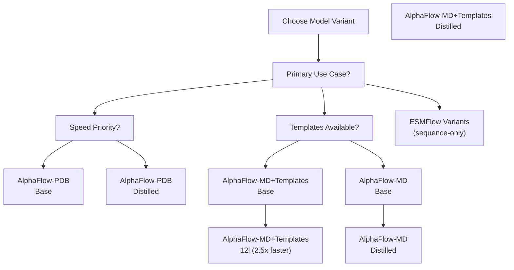
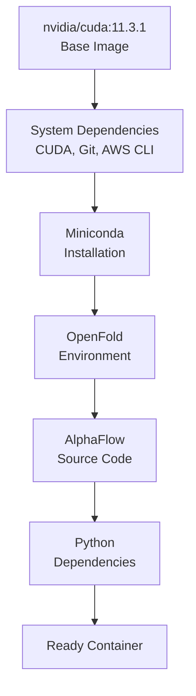
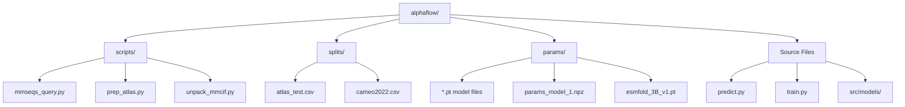

# Installation and Setup

> **Relevant source files**
> * [Dockerfile](https://github.com/bjing2016/alphaflow/blob/02dc0376/Dockerfile)
> * [README.md](https://github.com/bjing2016/alphaflow/blob/02dc0376/README.md?plain=1)

This document covers the complete installation and setup process for the AlphaFlow system, including environment preparation, dependency installation, model weights download, and Docker deployment options. For information about running your first prediction after installation, see [Quick Start Guide](/bjing2016/alphaflow/2.2-quick-start-guide).

## System Requirements

AlphaFlow requires a CUDA-compatible environment for GPU acceleration. The system has been tested with:

* Python 3.9
* CUDA 11.3+
* PyTorch 1.12.1+ with CUDA support
* Minimum 8GB GPU memory (recommended 24GB+ for larger proteins)

## Installation Flow



Sources: [README.md L26-L47](https://github.com/bjing2016/alphaflow/blob/02dc0376/README.md?plain=1#L26-L47)

 [Dockerfile L22-L87](https://github.com/bjing2016/alphaflow/blob/02dc0376/Dockerfile#L22-L87)

## Python Environment Setup

Create a Python 3.9 environment using conda:

```sql
conda create -n alphaflow python=3.9conda activate alphaflow
```

## Core Dependencies Installation

Install the required packages in the following order to avoid dependency conflicts:

### Basic Dependencies

```
pip install numpy==1.21.2 pandas==1.5.3
```

### PyTorch with CUDA Support

```
pip install torch==1.12.1+cu113 -f https://download.pytorch.org/whl/torch_stable.html
```

### Scientific Computing Dependencies

```
pip install biopython==1.79 dm-tree==0.1.6 modelcif==0.7 ml-collections==0.1.0 scipy==1.7.1 absl-py einops
```

### Machine Learning and Analysis Dependencies

```
pip install pytorch_lightning==2.0.4 fair-esm mdtraj==1.9.9 wandb
```

Sources: [README.md L28-L33](https://github.com/bjing2016/alphaflow/blob/02dc0376/README.md?plain=1#L28-L33)

## CUDA Configuration

If your system doesn't have CUDA 11, install it within the conda environment:

```
conda install nvidia/label/cuda-11.8.0::cudaconda install nvidia/label/cuda-11.8.0::cuda-cudart-devconda install nvidia/label/cuda-11.8.0::libcusparse-devconda install nvidia/label/cuda-11.8.0::libcusolver-devconda install nvidia/label/cuda-11.8.0::libcublas-devln -s $CONDA_PREFIX/lib/libcudart_static.a $CONDA_PREFIX/lib/libcudart.a
```

Sources: [README.md L36-L43](https://github.com/bjing2016/alphaflow/blob/02dc0376/README.md?plain=1#L36-L43)

## OpenFold Installation

OpenFold requires special handling due to custom CUDA kernels:

```
CUDA_HOME=$CONDA_PREFIX pip install 'openfold @ git+https://github.com/aqlaboratory/openfold.git@103d037'
```

If installation fails, ensure CUDA_HOME is properly set and all CUDA development libraries are installed.

Sources: [README.md L33-L47](https://github.com/bjing2016/alphaflow/blob/02dc0376/README.md?plain=1#L33-L47)

## Model Weights Download

AlphaFlow provides multiple pre-trained model variants. Choose the appropriate model for your use case:

### Model Variant Decision Tree



Sources: [README.md L49-L84](https://github.com/bjing2016/alphaflow/blob/02dc0376/README.md?plain=1#L49-L84)

### Download Model Weights

Create a weights directory and download the desired model:

```markdown
mkdir -p paramscd params # Example: Download AlphaFlow-MD+Templates base modelwget https://storage.googleapis.com/alphaflow/params/alphaflow_md_templates_base_202402.pt # Example: Download ESMFlow-MD base model  wget https://storage.googleapis.com/alphaflow/params/esmflow_md_base_202402.pt
```

### Pre-trained Base Model Weights

For training new models, download the original AlphaFold and ESMFold weights:

```markdown
# AlphaFold weightswget https://storage.googleapis.com/alphafold/alphafold_params_2022-12-06.tartar -xvf alphafold_params_2022-12-06.tar params_model_1.npz # ESMFold weightswget https://dl.fbaipublicfiles.com/fair-esm/models/esmfold_3B_v1.pt
```

Sources: [README.md L142-L147](https://github.com/bjing2016/alphaflow/blob/02dc0376/README.md?plain=1#L142-L147)

## Docker Installation (Alternative)

For containerized deployment, use the provided Dockerfile:

### Docker Environment Setup



Sources: [Dockerfile L22-L87](https://github.com/bjing2016/alphaflow/blob/02dc0376/Dockerfile#L22-L87)

### Build Docker Image

```
docker build -t alphaflow .
```

### Run Docker Container

```markdown
# With GPU support and mounted output directorydocker run --gpus all -v "$(pwd)/outputs:/outputs" -it alphaflow bash # Test command inside containerpython predict.py --mode esmfold --input_csv splits/atlas_test.csv --pdb 6o2v_A --weights params/esmflow_md_base_202402.pt --samples 5 --outpdb /outputs
```

Sources: [Dockerfile L14-L20](https://github.com/bjing2016/alphaflow/blob/02dc0376/Dockerfile#L14-L20)

## Directory Structure After Installation

After successful installation, your directory structure should look like:



Sources: [README.md L90-L91](https://github.com/bjing2016/alphaflow/blob/02dc0376/README.md?plain=1#L90-L91)

 [Dockerfile L69-L87](https://github.com/bjing2016/alphaflow/blob/02dc0376/Dockerfile#L69-L87)

## Installation Verification

Verify your installation by running a simple test:

```markdown
# Test ESMFlow (no MSA required)python predict.py --mode esmfold --input_csv splits/atlas_test.csv --pdb 6o2v_A --weights params/esmflow_md_base_202402.pt --samples 1 --outpdb test_output # Check if output PDB was generatedls test_output/
```

Common installation issues and solutions:

| Issue | Solution |
| --- | --- |
| CUDA version mismatch | Install CUDA 11 in conda environment |
| OpenFold compilation fails | Ensure CUDA_HOME is set correctly |
| Memory errors during installation | Use smaller batch sizes, ensure sufficient disk space |
| Model weights download fails | Check network connectivity, use alternative download methods |

Sources: [README.md L98-L112](https://github.com/bjing2016/alphaflow/blob/02dc0376/README.md?plain=1#L98-L112)

 [Dockerfile L20](https://github.com/bjing2016/alphaflow/blob/02dc0376/Dockerfile#L20-L20)

## Next Steps

After successful installation:

1. Prepare input data (CSV files, MSAs, templates) - see [Input Data Preparation](/bjing2016/alphaflow/3.2-input-data-preparation)
2. Run your first prediction - see [Quick Start Guide](/bjing2016/alphaflow/2.2-quick-start-guide)
3. For training new models - see [Training Pipeline](/bjing2016/alphaflow/4.1-training-pipeline)

Sources: [README.md L88-L95](https://github.com/bjing2016/alphaflow/blob/02dc0376/README.md?plain=1#L88-L95)