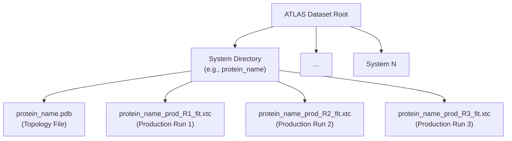
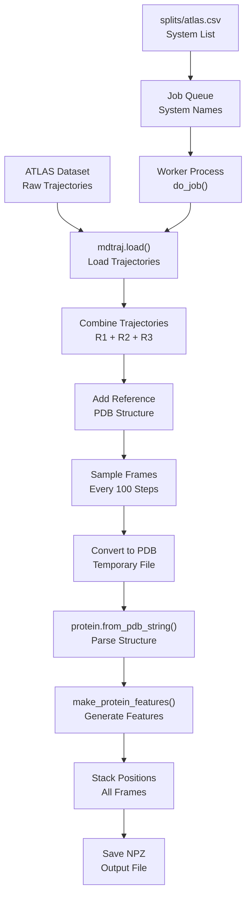
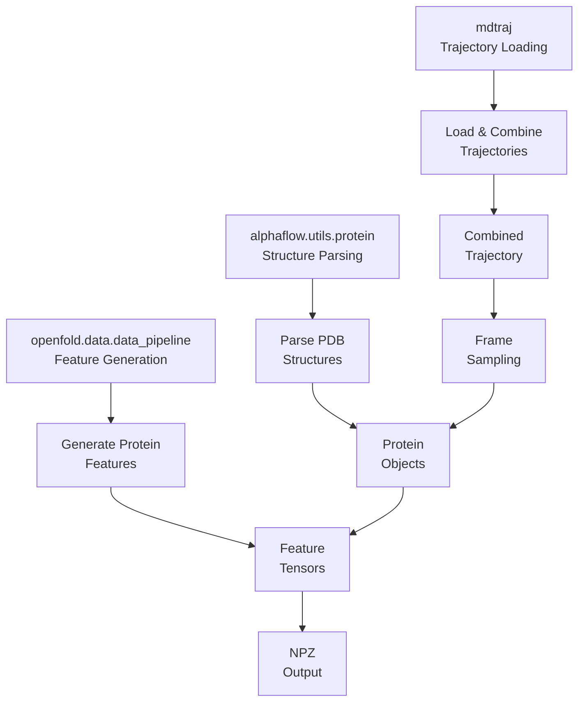
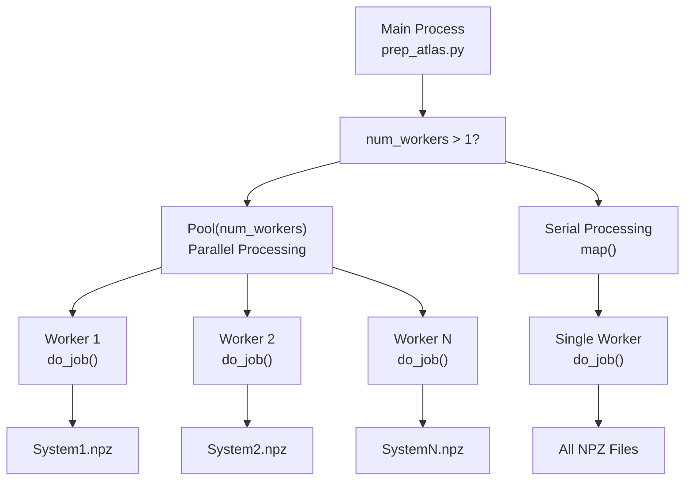

# MD Trajectory Processing

> **Relevant source files**
> * [scripts/prep_atlas.py](https://github.com/bjing2016/alphaflow/blob/02dc0376/scripts/prep_atlas.py)

This document covers the processing of molecular dynamics (MD) trajectories from the ATLAS dataset into training data format for AlphaFlow models. The primary focus is on converting trajectory files (.xtc) and topology files (.pdb) into NPZ format suitable for model training.

For information about training AlphaFlow models using this processed data, see [Training System](/bjing2016/alphaflow/4-training-system). For details about the overall data processing pipeline, see [Data Processing](/bjing2016/alphaflow/6-data-processing).

## Purpose and Scope

The MD trajectory processing system transforms molecular dynamics simulation data from the ATLAS dataset into a standardized format that can be used to train AlphaFlow models. This processing pipeline takes raw trajectory files containing time-series coordinates and converts them into protein feature tensors compatible with the AlphaFold architecture.

The main processing script `prep_atlas.py` handles the conversion of ATLAS trajectory data into NPZ files containing protein features that capture conformational diversity observed in MD simulations.

## ATLAS Dataset Structure

The ATLAS dataset contains molecular dynamics trajectories organized in a specific directory structure that the processing pipeline expects.

### Directory Organization

Sources: [scripts/prep_atlas.py L39-L42](https://github.com/bjing2016/alphaflow/blob/02dc0376/scripts/prep_atlas.py#L39-L42)

### File Types

| File Extension | Purpose | Description |
| --- | --- | --- |
| `.pdb` | Topology | Reference structure defining atom connectivity |
| `.xtc` | Trajectory | Compressed trajectory containing coordinate time series |
| `_prod_R1_fit.xtc` | Production Run 1 | First independent MD simulation |
| `_prod_R2_fit.xtc` | Production Run 2 | Second independent MD simulation |
| `_prod_R3_fit.xtc` | Production Run 3 | Third independent MD simulation |

## Processing Pipeline

The `prep_atlas.py` script implements the main processing pipeline that converts ATLAS trajectories into training-ready NPZ files.

### Command Line Interface

The script accepts several key parameters:

| Parameter | Type | Default | Description |
| --- | --- | --- | --- |
| `--split` | str | `splits/atlas.csv` | CSV file listing systems to process |
| `--atlas_dir` | str | Required | Root directory of ATLAS dataset |
| `--outdir` | str | `./data_atlas` | Output directory for NPZ files |
| `--num_workers` | int | 1 | Number of parallel processing workers |

Sources: [scripts/prep_atlas.py L3-L8](https://github.com/bjing2016/alphaflow/blob/02dc0376/scripts/prep_atlas.py#L3-L8)

### Processing Workflow

Sources: [scripts/prep_atlas.py L21-L60](https://github.com/bjing2016/alphaflow/blob/02dc0376/scripts/prep_atlas.py#L21-L60)

### Core Processing Function

The `do_job()` function handles processing for a single protein system:

1. **Load Trajectories**: Combines three production runs using `mdtraj.load()`
2. **Add Reference**: Prepends the reference PDB structure to the trajectory
3. **Sample Frames**: Processes every 100th frame to manage computational load
4. **Convert Format**: Temporarily saves frames as PDB for parsing
5. **Generate Features**: Uses OpenFold's `make_protein_features()` to create tensor representations
6. **Stack Coordinates**: Combines all frame coordinates into a single tensor
7. **Save Output**: Writes NPZ file with processed features

Sources: [scripts/prep_atlas.py L38-L59](https://github.com/bjing2016/alphaflow/blob/02dc0376/scripts/prep_atlas.py#L38-L59)

## Data Flow and Dependencies

The processing pipeline integrates several key libraries and components:

### Library Dependencies

Sources: [scripts/prep_atlas.py L10-L12](https://github.com/bjing2016/alphaflow/blob/02dc0376/scripts/prep_atlas.py#L10-L12)

### Parallel Processing Architecture

The system supports parallel processing using Python's multiprocessing module:

Sources: [scripts/prep_atlas.py L27-L36](https://github.com/bjing2016/alphaflow/blob/02dc0376/scripts/prep_atlas.py#L27-L36)

## Output Format

The processed trajectory data is saved as NPZ files containing protein features compatible with the AlphaFold training pipeline.

### NPZ File Structure

Each output NPZ file contains the following key components:

| Feature Key | Shape | Description |
| --- | --- | --- |
| `all_atom_positions` | `(n_frames, n_residues, 37, 3)` | Stacked coordinate tensors for all frames |
| Other protein features | Various | Additional features from `make_protein_features()` |

The `all_atom_positions` tensor is the primary output, containing coordinate information for all 37 atom types across all residues for every sampled trajectory frame.

Sources: [scripts/prep_atlas.py L55-L57](https://github.com/bjing2016/alphaflow/blob/02dc0376/scripts/prep_atlas.py#L55-L57)

### Processing Statistics

The script outputs shape information for debugging and verification:

* Prints tensor shapes for all generated features
* Confirms successful processing of trajectory frames
* Validates output file creation

This processed data serves as training input for AlphaFlow-MD and AlphaFlow-MD+Templates model variants, enabling them to learn conformational diversity patterns from molecular dynamics simulations.

Sources: [scripts/prep_atlas.py L56-L57](https://github.com/bjing2016/alphaflow/blob/02dc0376/scripts/prep_atlas.py#L56-L57)