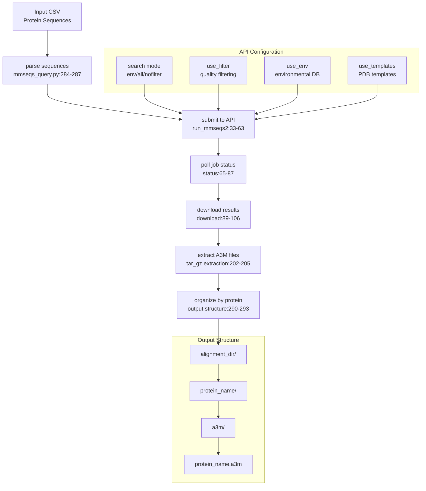
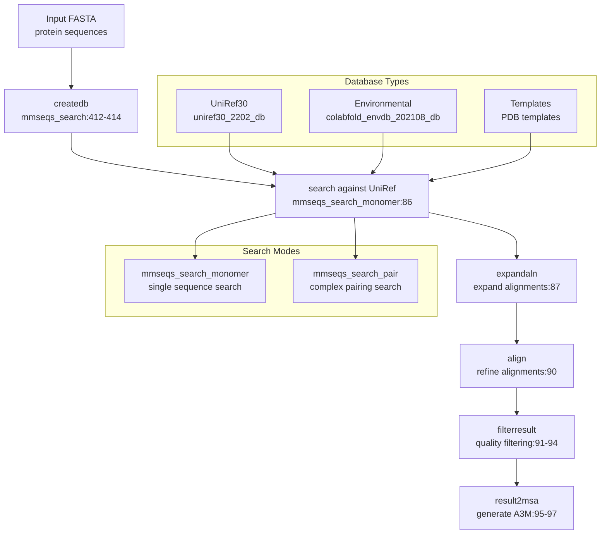
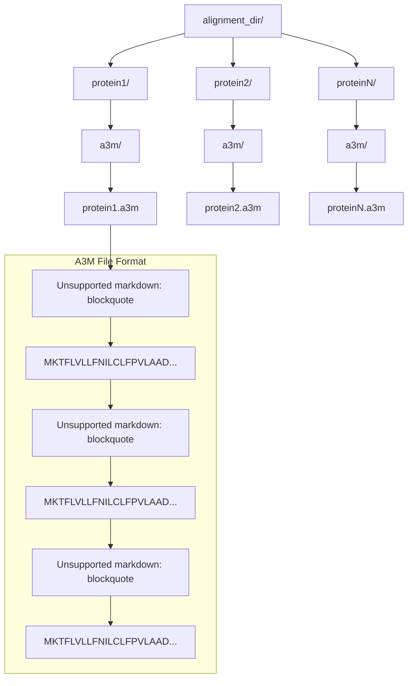
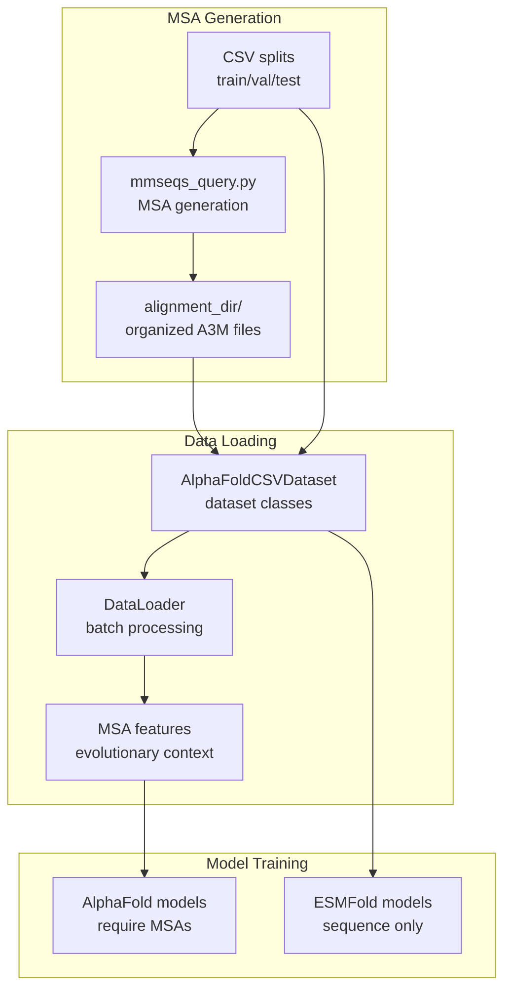
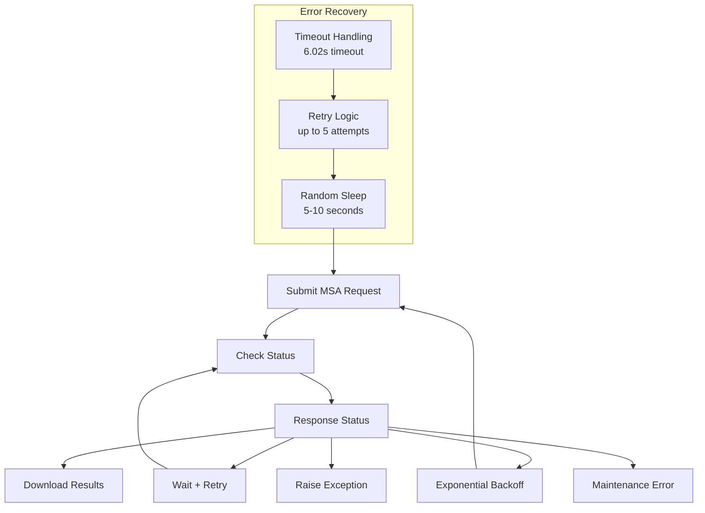

# MSA Generation

> **Relevant source files**
> * [scripts/mmseqs_query.py](https://github.com/bjing2016/alphaflow/blob/02dc0376/scripts/mmseqs_query.py)
> * [scripts/mmseqs_search.py](https://github.com/bjing2016/alphaflow/blob/02dc0376/scripts/mmseqs_search.py)
> * [scripts/mmseqs_search_helper.py](https://github.com/bjing2016/alphaflow/blob/02dc0376/scripts/mmseqs_search_helper.py)

This document covers the Multiple Sequence Alignment (MSA) generation system used to prepare evolutionary context data for protein structure prediction models. MSAs are required for AlphaFold-based models in the AlphaFlow system but are optional for ESMFold-based models.

For information about processing the generated MSAs during training and inference, see [Input Data Preparation](/bjing2016/alphaflow/3.2-input-data-preparation) and [Training Data Preparation](/bjing2016/alphaflow/4.2-training-data-preparation).

## Overview

The MSA generation system provides two primary methods for creating multiple sequence alignments:

1. **Remote API-based generation** using the ColabFold MMseqs2 API service
2. **Local database search** using locally installed MMseqs2 with downloaded sequence databases

Both methods produce A3M format alignment files organized in a standardized directory structure for consumption by the training and inference pipelines.

## MSA Generation Methods

### Remote API Method (ColabFold)

The primary MSA generation approach uses the ColabFold API service through the `run_mmseqs2` function. This method provides convenient access to large sequence databases without requiring local database storage.



**Sources:** [scripts/mmseqs_query.py L21-L282](https://github.com/bjing2016/alphaflow/blob/02dc0376/scripts/mmseqs_query.py#L21-L282)

 [scripts/mmseqs_query.py L284-L295](https://github.com/bjing2016/alphaflow/blob/02dc0376/scripts/mmseqs_query.py#L284-L295)

### Local Database Method

For environments requiring local control or when API access is limited, the system supports local MMseqs2 database searches through dedicated search functions.



**Sources:** [scripts/mmseqs_search.py L25-L146](https://github.com/bjing2016/alphaflow/blob/02dc0376/scripts/mmseqs_search.py#L25-L146)

 [scripts/mmseqs_search.py L148-L327](https://github.com/bjing2016/alphaflow/blob/02dc0376/scripts/mmseqs_search.py#L148-L327)

## File Organization and Data Flow

The MSA generation system follows a standardized directory structure that integrates with the broader AlphaFlow data processing pipeline.

### Input Data Format

MSA generation scripts expect protein sequence data in CSV format with specific column requirements:

| Column | Description | Required |
| --- | --- | --- |
| `name` | Protein identifier | Yes |
| `seqres` | Amino acid sequence | Yes |

### Output Directory Structure



**Sources:** [scripts/mmseqs_query.py L290-L293](https://github.com/bjing2016/alphaflow/blob/02dc0376/scripts/mmseqs_query.py#L290-L293)

 [scripts/mmseqs_search_helper.py L20-L30](https://github.com/bjing2016/alphaflow/blob/02dc0376/scripts/mmseqs_search_helper.py#L20-L30)

## Integration with Training Pipeline

The generated MSA files integrate with the AlphaFlow training and inference systems through dataset classes and data loaders.



**Sources:** [scripts/mmseqs_query.py L284-L295](https://github.com/bjing2016/alphaflow/blob/02dc0376/scripts/mmseqs_query.py#L284-L295)

 [scripts/mmseqs_search_helper.py L11-L30](https://github.com/bjing2016/alphaflow/blob/02dc0376/scripts/mmseqs_search_helper.py#L11-L30)

## Command-Line Usage

### Remote API Generation

The primary script for API-based MSA generation accepts the following parameters:

```
python scripts/mmseqs_query.py --split <csv_file> --outdir <output_directory>
```

**Key Parameters:**

* `--split`: Path to CSV file containing protein names and sequences
* `--outdir`: Output directory for organized MSA files (default: `./alignment_dir`)

### Local Database Generation

For local database searches, use the helper script that coordinates the search process:

```
python scripts/mmseqs_search_helper.py --split <csv_file> --db_dir <database_path> --outdir <output_directory>
```

**Key Parameters:**

* `--split`: Input CSV file with protein data
* `--db_dir`: Path to local MMseqs2 databases (default: `./dbbase`)
* `--outdir`: Output directory for MSA files (default: `./alignment_dir`)

**Sources:** [scripts/mmseqs_query.py L3-L7](https://github.com/bjing2016/alphaflow/blob/02dc0376/scripts/mmseqs_query.py#L3-L7)

 [scripts/mmseqs_search_helper.py L1-L6](https://github.com/bjing2016/alphaflow/blob/02dc0376/scripts/mmseqs_search_helper.py#L1-L6)

## Configuration Options

### Search Quality Control

The MSA generation system provides several quality control parameters:

| Parameter | Purpose | Default | Location |
| --- | --- | --- | --- |
| `use_filter` | Enable MSA quality filtering | `True` | `run_mmseqs2:116-119` |
| `use_env` | Include environmental databases | `True` | `run_mmseqs2:117-119` |
| `use_templates` | Include PDB template search | `False` | `run_mmseqs2:22` |
| `filter` | Apply sequence filtering | `True` | `mmseqs_search:50-55` |

### Database Selection

The local search method supports multiple database types configured through command-line arguments:

* **UniRef30**: Primary sequence database for homolog detection
* **Environmental**: Metagenomic sequences for increased coverage
* **Templates**: PDB structure templates for fold recognition

**Sources:** [scripts/mmseqs_query.py L21-L24](https://github.com/bjing2016/alphaflow/blob/02dc0376/scripts/mmseqs_query.py#L21-L24)

 [scripts/mmseqs_search.py L352-L361](https://github.com/bjing2016/alphaflow/blob/02dc0376/scripts/mmseqs_search.py#L352-L361)

## Error Handling and Retry Logic

The API-based MSA generation includes robust error handling for network issues and server limitations:



**Sources:** [scripts/mmseqs_query.py L39-L56](https://github.com/bjing2016/alphaflow/blob/02dc0376/scripts/mmseqs_query.py#L39-L56)

 [scripts/mmseqs_query.py L147-L190](https://github.com/bjing2016/alphaflow/blob/02dc0376/scripts/mmseqs_query.py#L147-L190)