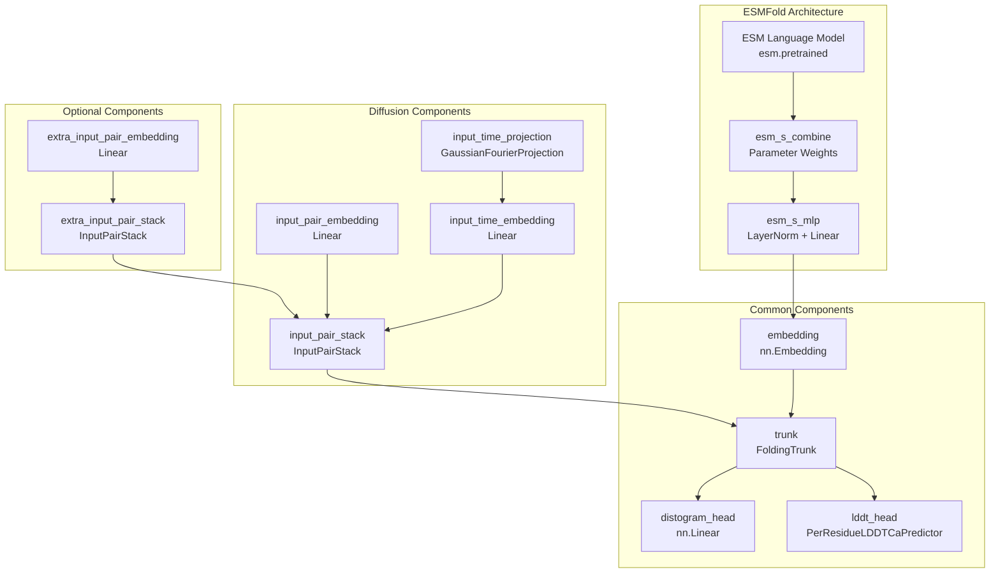
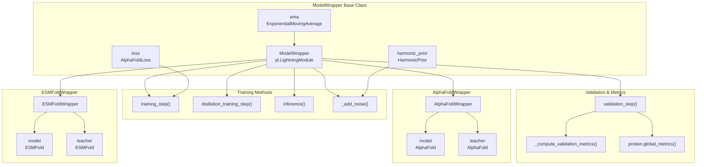
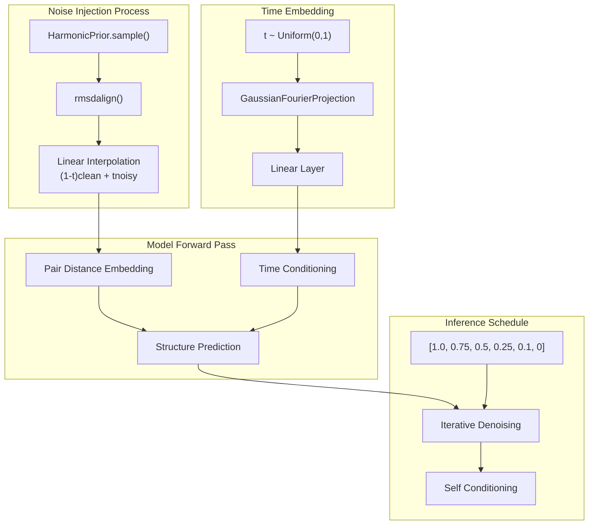
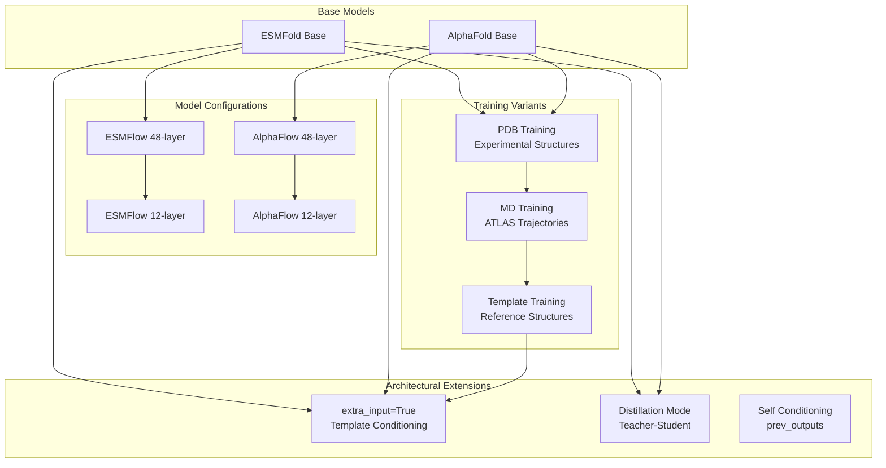

# Model Architecture

> **Relevant source files**
> * [alphaflow/model/esmfold.py](https://github.com/bjing2016/alphaflow/blob/02dc0376/alphaflow/model/esmfold.py)
> * [alphaflow/model/wrapper.py](https://github.com/bjing2016/alphaflow/blob/02dc0376/alphaflow/model/wrapper.py)

This document provides detailed technical specifications of the core model architectures and training frameworks in AlphaFlow. It covers the `ESMFold` and `AlphaFold` model implementations, the `ModelWrapper` training system, and the diffusion-based structure generation process.

For information about using these models for inference, see [Inference System](/bjing2016/alphaflow/3-inference-system). For training these models, see [Training System](/bjing2016/alphaflow/4-training-system).

## Core Model Components

The AlphaFlow system is built around two primary model architectures: `ESMFold` and `AlphaFold`, both modified to support diffusion-based ensemble generation. The models share a common diffusion framework but differ in their sequence processing approaches.

**ESMFold Model Architecture**

Sources: [alphaflow/model/esmfold.py L49-L437](https://github.com/bjing2016/alphaflow/blob/02dc0376/alphaflow/model/esmfold.py#L49-L437)

The `ESMFold` class integrates Meta's ESM language model with AlphaFold's structure prediction framework. Key architectural components include:

| Component | Class/Function | Purpose |
| --- | --- | --- |
| `esm` | `esm.pretrained` models | Pretrained language model backbone |
| `esm_s_combine` | `nn.Parameter` | Learnable layer combination weights |
| `esm_s_mlp` | `nn.Sequential` | Maps ESM features to structure space |
| `trunk` | `FoldingTrunk` | Core structure prediction module |
| `input_pair_embedding` | `Linear` | Embeds distance information |
| `input_time_projection` | `GaussianFourierProjection` | Time encoding for diffusion |

The model supports multiple ESM variants through the `esm_registry` [alphaflow/model/esmfold.py L34-L46](https://github.com/bjing2016/alphaflow/blob/02dc0376/alphaflow/model/esmfold.py#L34-L46)

 including models from 8M to 15B parameters.

## Training Framework Architecture

The training system is built around the `ModelWrapper` base class with specialized implementations for different model types.

**Training Framework Components**

Sources: [alphaflow/model/wrapper.py L51-L515](https://github.com/bjing2016/alphaflow/blob/02dc0376/alphaflow/model/wrapper.py#L51-L515)

The `ModelWrapper` class [alphaflow/model/wrapper.py L51](https://github.com/bjing2016/alphaflow/blob/02dc0376/alphaflow/model/wrapper.py#L51-L51)

 provides the core training infrastructure:

| Method | Purpose | Key Features |
| --- | --- | --- |
| `training_step()` | Standard training loop | Noise injection, self-conditioning, loss computation |
| `disillation_training_step()` | Teacher-student distillation | Multi-step teacher inference, student training |
| `inference()` | Diffusion-based sampling | Iterative denoising with configurable schedules |
| `_add_noise()` | Noise injection | RMSD alignment, harmonic prior sampling |

The system supports two specialized wrappers:

* `ESMFoldWrapper` [alphaflow/model/wrapper.py L466-L489](https://github.com/bjing2016/alphaflow/blob/02dc0376/alphaflow/model/wrapper.py#L466-L489)  for ESM-based models
* `AlphaFoldWrapper` [alphaflow/model/wrapper.py L491-L515](https://github.com/bjing2016/alphaflow/blob/02dc0376/alphaflow/model/wrapper.py#L491-L515)  for AlphaFold-based models

## Diffusion Process Architecture

The diffusion framework enables ensemble generation through iterative denoising of protein structures.

**Diffusion Implementation Details**

Sources: [alphaflow/model/esmfold.py L82-L92](https://github.com/bjing2016/alphaflow/blob/02dc0376/alphaflow/model/esmfold.py#L82-L92)

 [alphaflow/model/wrapper.py L52-L71](https://github.com/bjing2016/alphaflow/blob/02dc0376/alphaflow/model/wrapper.py#L52-L71)

The diffusion process operates on pseudo-beta carbon distances rather than raw coordinates:

1. **Noise Addition** [alphaflow/model/wrapper.py L52-L71](https://github.com/bjing2016/alphaflow/blob/02dc0376/alphaflow/model/wrapper.py#L52-L71) : * Sample from `HarmonicPrior` * RMSD align noisy structure to clean structure * Linear interpolation with time parameter `t`
2. **Time Conditioning** [alphaflow/model/esmfold.py L82-L89](https://github.com/bjing2016/alphaflow/blob/02dc0376/alphaflow/model/esmfold.py#L82-L89) : * `GaussianFourierProjection` encodes time `t` * Linear embedding to pair representation dimension * Added to pair embeddings before trunk processing
3. **Inference Schedule** [alphaflow/model/wrapper.py L369-L383](https://github.com/bjing2016/alphaflow/blob/02dc0376/alphaflow/model/wrapper.py#L369-L383) : * Default schedule: `[1.0, 0.75, 0.5, 0.25, 0.1, 0]` * Iterative denoising with optional self-conditioning * RMSD alignment between steps

## Model Variants and Extensions

The architecture supports several specialized variants through conditional inputs and training strategies.

**Extended Architecture Features**

Sources: [alphaflow/model/esmfold.py L94-L101](https://github.com/bjing2016/alphaflow/blob/02dc0376/alphaflow/model/esmfold.py#L94-L101)

 [alphaflow/model/wrapper.py L249-L264](https://github.com/bjing2016/alphaflow/blob/02dc0376/alphaflow/model/wrapper.py#L249-L264)

| Feature | Implementation | Purpose |
| --- | --- | --- |
| `extra_input` | Additional pair embeddings [alphaflow/model/esmfold.py L94-L101](https://github.com/bjing2016/alphaflow/blob/02dc0376/alphaflow/model/esmfold.py#L94-L101) | Template/reference structure conditioning |
| Distillation | Teacher-student training [alphaflow/model/wrapper.py L249-L264](https://github.com/bjing2016/alphaflow/blob/02dc0376/alphaflow/model/wrapper.py#L249-L264) | Model compression and knowledge transfer |
| Self-conditioning | Previous output recycling [alphaflow/model/esmfold.py L284-L297](https://github.com/bjing2016/alphaflow/blob/02dc0376/alphaflow/model/esmfold.py#L284-L297) | Improved structure refinement |
| Layer variants | 12-layer vs 48-layer models | Speed-accuracy tradeoffs |

The `extra_input` mode allows conditioning on reference structures through `extra_all_atom_positions` in the batch, enabling template-guided structure prediction.

Sources: [alphaflow/model/esmfold.py L1-L437](https://github.com/bjing2016/alphaflow/blob/02dc0376/alphaflow/model/esmfold.py#L1-L437)

 [alphaflow/model/wrapper.py L1-L515](https://github.com/bjing2016/alphaflow/blob/02dc0376/alphaflow/model/wrapper.py#L1-L515)