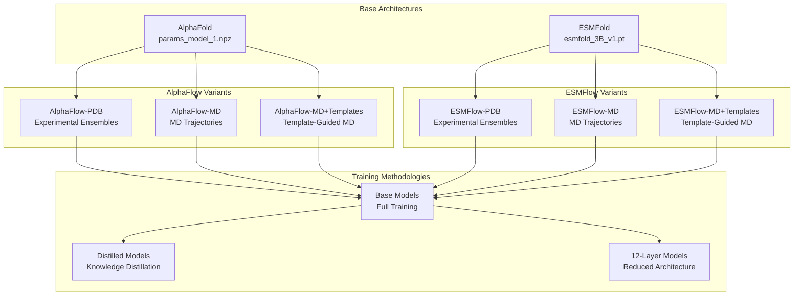
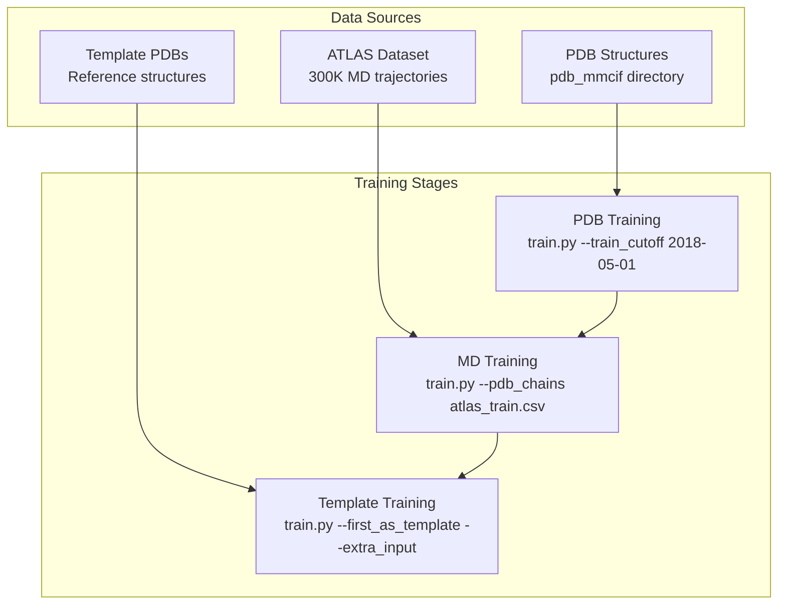

# Model Variants

> **Relevant source files**
> * [README.md](https://github.com/bjing2016/alphaflow/blob/02dc0376/README.md?plain=1)
> * [assets/12l_md_templates.md](https://github.com/bjing2016/alphaflow/blob/02dc0376/assets/12l_md_templates.md?plain=1)
> * [assets/6uof_A_animation.gif](https://github.com/bjing2016/alphaflow/blob/02dc0376/assets/6uof_A_animation.gif)

This document details the different model variants available in the AlphaFlow system, including AlphaFlow and ESMFlow models with their respective training methodologies and performance characteristics. For information about the overall system architecture and how these variants fit together, see [System Architecture](/bjing2016/alphaflow/1.2-system-architecture). For guidance on using these models for inference, see [Inference Pipeline](/bjing2016/alphaflow/3.1-inference-pipeline).

## Model Architecture Overview

The AlphaFlow system provides two main model families, each with multiple variants based on training data and methodology:

**Sources:** [README.md L51-L83](https://github.com/bjing2016/alphaflow/blob/02dc0376/README.md?plain=1#L51-L83)

## Training Data Variants

Each model variant is trained on different types of structural data to capture specific conformational behaviors:

| Variant | Training Data | Purpose | Input Requirements |
| --- | --- | --- | --- |
| **PDB Models** | Experimental structures from PDB | Model experimental ensembles from X-ray crystallography or cryo-EM under different conditions | MSA files (AlphaFlow) or sequence only (ESMFlow) |
| **MD Models** | All-atom, explicit solvent MD trajectories at 300K from ATLAS dataset | Model molecular dynamics ensembles at physiological temperature | MSA files (AlphaFlow) or sequence only (ESMFlow) |
| **MD+Templates Models** | MD trajectories + reference PDB structures as templates | Model MD ensembles guided by reference structure input | MSA files + template PDB structure |

The training progression follows a hierarchical approach where models are built upon previous checkpoints:

**Sources:** [README.md L53-L55](https://github.com/bjing2016/alphaflow/blob/02dc0376/README.md?plain=1#L53-L55)

 [README.md L149-L171](https://github.com/bjing2016/alphaflow/blob/02dc0376/README.md?plain=1#L149-L171)

## Training Methodologies

### Base Models

Base models undergo full training with complete diffusion processes and represent the highest accuracy variants:

* **Training Parameters:** `--lr 5e-4 --noise_prob 0.8 --accumulate_grad 8`
* **Validation:** Standard validation procedures with full ensemble generation
* **Performance:** Highest structural accuracy but slower inference times

### Distilled Models

Distilled models are trained using knowledge distillation from base models to achieve faster inference:

* **Training Command:** Append `--distillation` with `--ckpt [PATH]` of base model
* **Inference Modifications:** Require `--noisy_first --no_diffusion` flags
* **Performance Trade-off:** Significantly faster runtime with some accuracy loss
* **Training Adjustments:** Shorter `--train_epoch_len 16000`, no `--accumulate_grad`

### 12-Layer Models

Available only for AlphaFlow-MD+Templates, these models use reduced Evoformer layers for faster computation:

| Model Version | Layers | Runtime (s) | Pairwise RMSD | Global RMSF r |
| --- | --- | --- | --- | --- |
| 48l base | 48 | 38.0 | 2.18 | 0.91 |
| 48l distilled | 48 | 3.8 | 1.73 | 0.89 |
| 12l base | 12 | 15.2 | 1.94 | 0.78 |
| 12l distilled | 12 | 1.56 | 1.40 | 0.74 |

The 12-layer versions provide a 2.5x speedup with relatively small performance degradation.

**Sources:** [README.md L57-L59](https://github.com/bjing2016/alphaflow/blob/02dc0376/README.md?plain=1#L57-L59)

 [README.md L172-L173](https://github.com/bjing2016/alphaflow/blob/02dc0376/README.md?plain=1#L172-L173)

 [assets/12l_md_templates.md L1-L17](https://github.com/bjing2016/alphaflow/blob/02dc0376/assets/12l_md_templates.md?plain=1#L1-L17)

## Model Weight Distribution

All model weights are distributed via Google Cloud Storage with standardized naming conventions:

```mermaid
flowchart TD

AFP_B["alphaflow_pdb_base_202402.pt"]
AFP_D["alphaflow_pdb_distilled_202402.pt"]
AFM_B["alphaflow_md_base_202402.pt"]
AFM_D["alphaflow_md_distilled_202402.pt"]
AFMT_B["alphaflow_md_templates_base_202402.pt"]
AFMT_D["alphaflow_md_templates_distilled_202402.pt"]
AFMT_12B["alphaflow_12l_md_templates_base_202406.pt"]
AFMT_12D["alphaflow_12l_md_templates_distilled_202406.pt"]
EFP_B["esmflow_pdb_base_202402.pt"]
EFP_D["esmflow_pdb_distilled_202402.pt"]
EFM_B["esmflow_md_base_202402.pt"]
EFM_D["esmflow_md_distilled_202402.pt"]
EFMT_B["esmflow_md_templates_base_202402.pt"]
EFMT_D["esmflow_md_templates_distilled_202402.pt"]
GCS["storage.googleapis.com/alphaflow/params/"]

GCS --> AFP_B
GCS --> AFP_D
GCS --> AFM_B
GCS --> AFM_D
GCS --> AFMT_B
GCS --> AFMT_D
GCS --> AFMT_12B
GCS --> AFMT_12D
GCS --> EFP_B
GCS --> EFP_D
GCS --> EFM_B
GCS --> EFM_D
GCS --> EFMT_B
GCS --> EFMT_D

subgraph subGraph2 ["Storage Location"]
    GCS
end

subgraph subGraph1 ["ESMFlow Weights"]
    EFP_B
    EFP_D
    EFM_B
    EFM_D
    EFMT_B
    EFMT_D
end

subgraph subGraph0 ["AlphaFlow Weights"]
    AFP_B
    AFP_D
    AFM_B
    AFM_D
    AFMT_B
    AFMT_D
    AFMT_12B
    AFMT_12D
end
```

**Sources:** [README.md L61-L82](https://github.com/bjing2016/alphaflow/blob/02dc0376/README.md?plain=1#L61-L82)

## Model Selection Guide

### By Use Case

| Use Case | Recommended Model | Rationale |
| --- | --- | --- |
| Experimental ensemble prediction | AlphaFlow-PDB or ESMFlow-PDB | Trained on experimental structures |
| MD simulation prediction | AlphaFlow-MD or ESMFlow-MD | Trained on MD trajectories |
| Template-guided dynamics | AlphaFlow-MD+Templates | Uses reference structure input |
| High-speed inference | 12l distilled variants | 2.5x faster with minimal accuracy loss |
| Maximum accuracy | Base variants | Full training without distillation |

### By Performance Requirements

| Priority | Model Choice | Trade-offs |
| --- | --- | --- |
| Speed > Accuracy | Distilled models with `--noisy_first --no_diffusion` | Faster inference, reduced accuracy |
| Accuracy > Speed | Base models with full diffusion | Highest accuracy, slower inference |
| Balanced | 12l base models | Good accuracy with 2.5x speedup |

### By Input Data Availability

| Available Data | Compatible Models | Notes |
| --- | --- | --- |
| Sequence only | ESMFlow variants | No MSA required |
| Sequence + MSA | AlphaFlow variants | Better accuracy with evolutionary information |
| Sequence + MSA + Template | MD+Templates variants | Template-guided ensemble generation |

**Sources:** [README.md L102-L112](https://github.com/bjing2016/alphaflow/blob/02dc0376/README.md?plain=1#L102-L112)

 [README.md L9-L10](https://github.com/bjing2016/alphaflow/blob/02dc0376/README.md?plain=1#L9-L10)