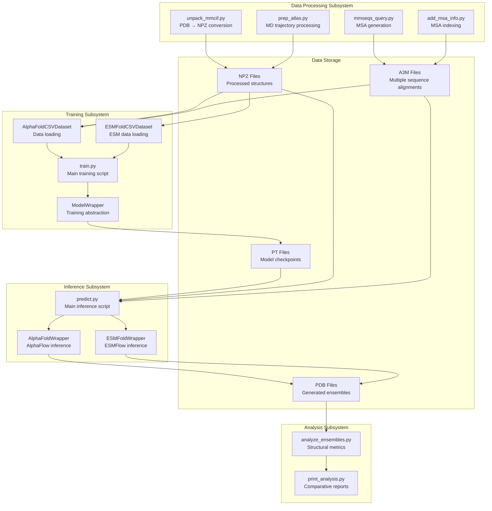
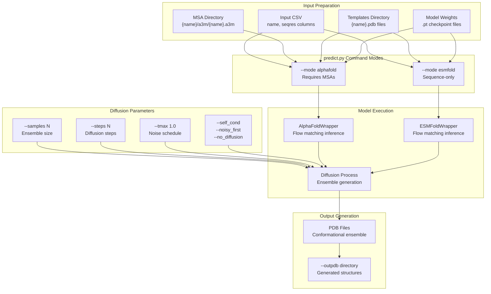
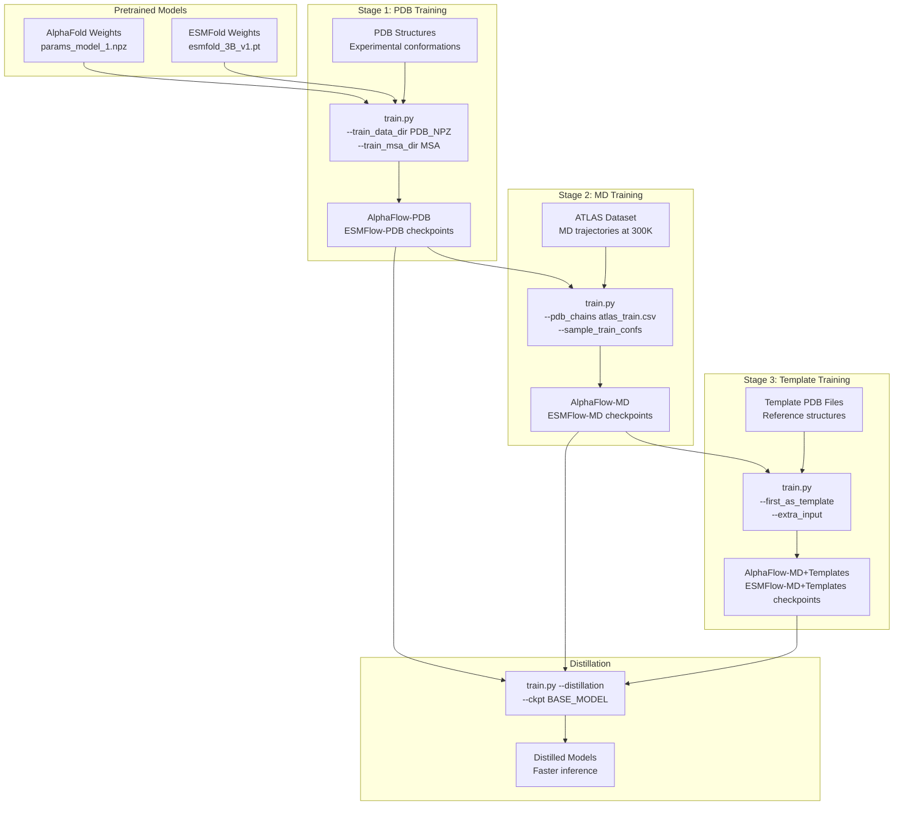

# Overview

> **Relevant source files**
> * [README.md](https://github.com/bjing2016/alphaflow/blob/02dc0376/README.md?plain=1)

This document provides an overview of the AlphaFlow system, a protein conformational ensemble generation framework built on modified versions of AlphaFold and ESMFold. AlphaFlow generates multiple plausible protein conformations rather than single static structures, enabling analysis of protein flexibility and dynamics.

For installation and setup instructions, see [Getting Started](/bjing2016/alphaflow/2-getting-started). For detailed usage of the inference system, see [Inference System](/bjing2016/alphaflow/3-inference-system). For model training procedures, see [Training System](/bjing2016/alphaflow/4-training-system).

## What is AlphaFlow

AlphaFlow is a generative modeling system that produces protein conformational ensembles by fine-tuning existing structure prediction models (AlphaFold and ESMFold) with flow matching objectives. The system addresses two key use cases:

* **Experimental ensembles**: Modeling conformational states as they would appear in experimental structures (PDB entries from X-ray crystallography or cryo-EM)
* **Molecular dynamics ensembles**: Modeling protein flexibility and dynamics at physiological temperatures (300K)

The system provides both **AlphaFlow** (based on AlphaFold) and **ESMFlow** (based on ESMFold) variants, with the key difference being that AlphaFlow requires multiple sequence alignments (MSAs) while ESMFlow operates on sequence alone.

Sources: [README.md L1-L7](https://github.com/bjing2016/alphaflow/blob/02dc0376/README.md?plain=1#L1-L7)

## Model Variants

AlphaFlow provides six primary model variants across two base architectures:

| Base Model | Variant | Training Data | Use Case |
| --- | --- | --- | --- |
| AlphaFlow | PDB | PDB structures | Experimental ensemble modeling |
| AlphaFlow | MD | ATLAS MD trajectories | Dynamics at 300K |
| AlphaFlow | MD+Templates | ATLAS + template PDBs | Template-guided dynamics |
| ESMFlow | PDB | PDB structures | Experimental ensemble modeling |
| ESMFlow | MD | ATLAS MD trajectories | Dynamics at 300K |
| ESMFlow | MD+Templates | ATLAS + template PDBs | Template-guided dynamics |

Each variant is available in multiple versions:

* **Base**: Full 48-layer models with highest accuracy
* **Distilled**: Faster inference with some accuracy trade-off
* **12l**: 12-layer versions (MD+Templates only) running 2.5x faster

Sources: [README.md L49-L83](https://github.com/bjing2016/alphaflow/blob/02dc0376/README.md?plain=1#L49-L83)

## System Architecture

The AlphaFlow system consists of four major subsystems that handle the complete pipeline from data preparation to ensemble analysis:

Sources: [README.md L86-L175](https://github.com/bjing2016/alphaflow/blob/02dc0376/README.md?plain=1#L86-L175)

 based on the overall system structure described in the README

## Core Inference Workflow

The primary user interface for AlphaFlow is the `predict.py` script, which orchestrates the ensemble generation process:

Sources: [README.md L86-L113](https://github.com/bjing2016/alphaflow/blob/02dc0376/README.md?plain=1#L86-L113)

## Training Pipeline Architecture

The training system supports multi-stage fine-tuning, starting from pretrained AlphaFold or ESMFold weights:

Sources: [README.md L140-L175](https://github.com/bjing2016/alphaflow/blob/02dc0376/README.md?plain=1#L140-L175)

## Key Data Formats

AlphaFlow processes and generates data in several standardized formats:

| Format | Usage | File Pattern | Description |
| --- | --- | --- | --- |
| NPZ | Training data | `{pdb_id}_{chain_id}.npz` | Preprocessed protein structures |
| A3M | MSA input | `{name}/a3m/{name}.a3m` | Multiple sequence alignments |
| CSV | Input/splits | `{split_name}.csv` | Protein lists with `name`, `seqres` columns |
| PDB | Output | `{name}_{sample_id}.pdb` | Generated conformational structures |
| PT | Checkpoints | `{model_name}.pt` | PyTorch model weights |

The system expects specific directory structures for different input types, particularly for MSA files which must follow the nested directory pattern shown above.

Sources: [README.md L88-L95](https://github.com/bjing2016/alphaflow/blob/02dc0376/README.md?plain=1#L88-L95)

## Performance Characteristics

AlphaFlow models offer different speed-accuracy trade-offs:

* **Base models**: Highest accuracy, slower inference (48 Evoformer layers)
* **Distilled models**: Faster inference with `--noisy_first --no_diffusion` flags
* **12l models**: 2.5x speed improvement over 48-layer versions (MD+Templates only)
* **ESMFlow vs AlphaFlow**: ESMFlow runs faster (no MSA requirement) but may have lower accuracy

Inference time scales with ensemble size (`--samples`), diffusion steps (`--steps`), and model complexity. The `--tmax` parameter allows truncation of the diffusion process for faster inference with reduced diversity.

Sources: [README.md L57-L59](https://github.com/bjing2016/alphaflow/blob/02dc0376/README.md?plain=1#L57-L59)

 [README.md L112-L113](https://github.com/bjing2016/alphaflow/blob/02dc0376/README.md?plain=1#L112-L113)