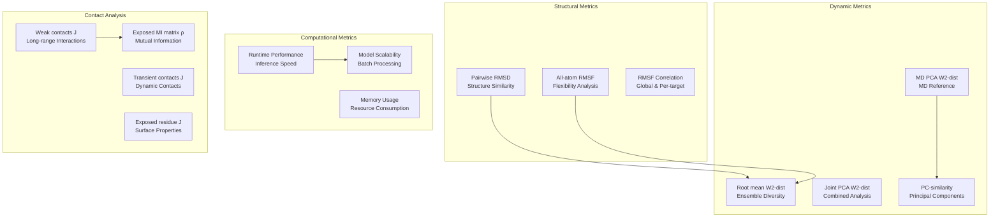
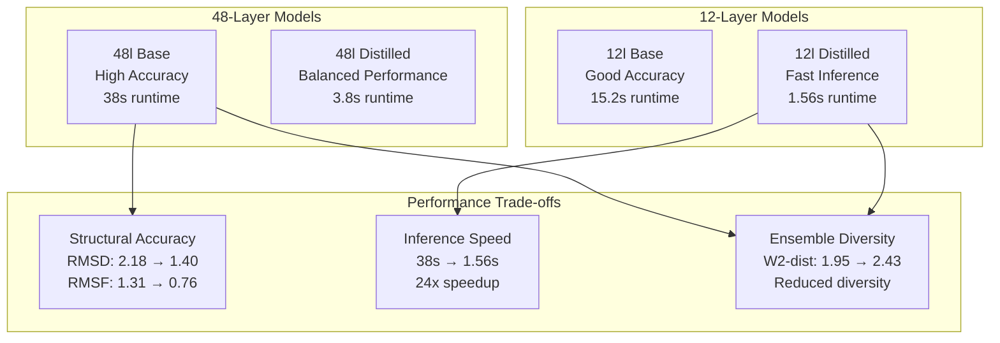
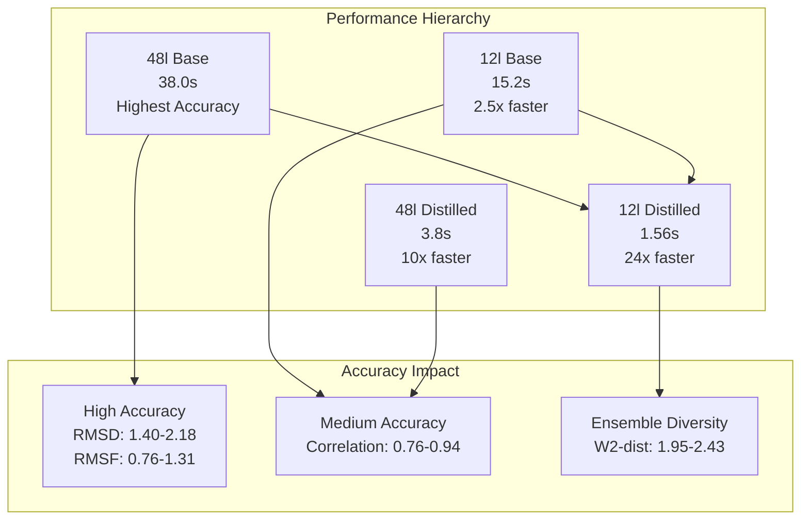
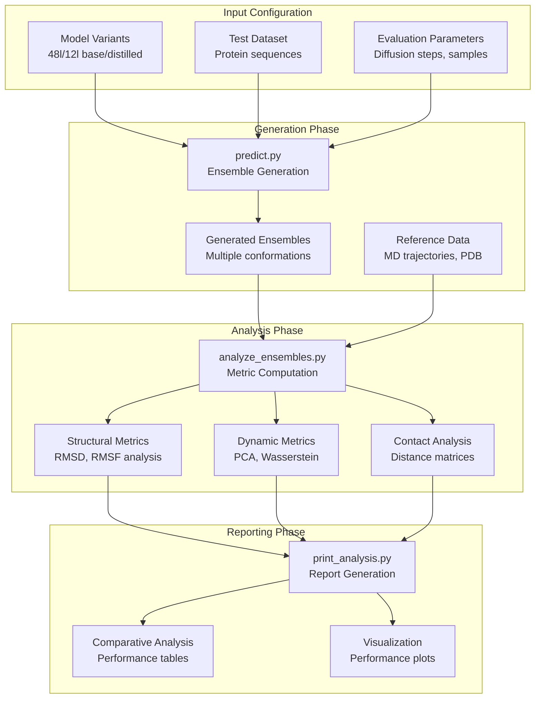

# Performance Evaluation

> **Relevant source files**
> * [assets/12l_md_templates.md](https://github.com/bjing2016/alphaflow/blob/02dc0376/assets/12l_md_templates.md?plain=1)
> * [assets/6uof_A_animation.gif](https://github.com/bjing2016/alphaflow/blob/02dc0376/assets/6uof_A_animation.gif)

This document covers the systematic evaluation and comparison of different AlphaFlow model variants, focusing on performance metrics, benchmarking methodologies, and comparative analysis across model architectures. For information about analyzing individual protein ensembles, see [Ensemble Analysis](/bjing2016/alphaflow/7.1-ensemble-analysis).

## Overview

Performance evaluation in the AlphaFlow system involves comparing model variants across multiple dimensions including structural accuracy, ensemble diversity, dynamic properties, and computational efficiency. The evaluation framework supports comparison between different layer counts (48-layer vs 12-layer), training approaches (base vs distilled), and model types (PDB vs MD vs MD+Templates).

## Performance Metrics Framework

The AlphaFlow evaluation system employs a comprehensive set of metrics to assess both structural and dynamic properties of generated ensembles:

### Performance Metrics Overview

Sources: [assets/12l_md_templates.md L1-L17](https://github.com/bjing2016/alphaflow/blob/02dc0376/assets/12l_md_templates.md?plain=1#L1-L17)

## Model Architecture Comparison

The performance evaluation framework supports systematic comparison between different model architectures, particularly focusing on the trade-offs between accuracy and computational efficiency.

### Architecture Performance Matrix

Sources: [assets/12l_md_templates.md L1-L17](https://github.com/bjing2016/alphaflow/blob/02dc0376/assets/12l_md_templates.md?plain=1#L1-L17)

## Benchmarking Results

The following table presents comprehensive benchmarking results comparing 48-layer and 12-layer AlphaFlow-MD+Templates models in both base and distilled configurations:

| Metric | 48l (base) | 48l (distilled) | 12l (base) | 12l (distilled) |
| --- | --- | --- | --- | --- |
| **Structural Accuracy** |  |  |  |  |
| Pairwise RMSD | 2.18 | 1.73 | 1.94 | 1.40 |
| Pairwise RMSD r | 0.94 | 0.92 | 0.81 | 0.76 |
| All-atom RMSF | 1.31 | 1.00 | 1.01 | 0.76 |
| Global RMSF r | 0.91 | 0.89 | 0.78 | 0.74 |
| Per-target RMSF r | 0.90 | 0.88 | 0.89 | 0.86 |
| **Dynamic Properties** |  |  |  |  |
| Root mean W₂-dist | 1.95 | 2.18 | 2.26 | 2.43 |
| MD PCA W₂-dist | 1.25 | 1.41 | 1.40 | 1.56 |
| Joint PCA W₂-dist | 1.58 | 1.68 | 1.78 | 1.90 |
| % PC-sim > 0.5 | 44% | 43% | 46% | 39% |
| **Contact Analysis** |  |  |  |  |
| Weak contacts J | 0.62 | 0.51 | 0.60 | 0.56 |
| Transient contacts J | 0.47 | 0.42 | 0.36 | 0.24 |
| Exposed residue J | 0.50 | 0.47 | 0.47 | 0.44 |
| Exposed MI matrix ρ | 0.25 | 0.18 | 0.21 | 0.13 |
| **Performance** |  |  |  |  |
| Runtime (s) | 38 | 3.8 | 15.2 | 1.56 |

Sources: [assets/12l_md_templates.md L2-L17](https://github.com/bjing2016/alphaflow/blob/02dc0376/assets/12l_md_templates.md?plain=1#L2-L17)

## Runtime Performance Analysis

The evaluation framework demonstrates significant performance improvements through model distillation and layer reduction:

### Runtime Scaling Analysis

Sources: [assets/12l_md_templates.md L17](https://github.com/bjing2016/alphaflow/blob/02dc0376/assets/12l_md_templates.md?plain=1#L17-L17)

## Evaluation Methodology

The performance evaluation process involves systematic comparison across multiple model configurations using standardized test sets and metrics:

### Evaluation Pipeline

The evaluation methodology incorporates both absolute performance metrics and relative comparisons against molecular dynamics reference data to assess the quality of generated conformational ensembles.

Sources: [assets/12l_md_templates.md L1-L17](https://github.com/bjing2016/alphaflow/blob/02dc0376/assets/12l_md_templates.md?plain=1#L1-L17)

## Performance Trade-off Analysis

The benchmarking results reveal clear trade-offs between computational efficiency and ensemble quality:

* **Accuracy vs Speed**: The 12-layer distilled model achieves 24x speedup (1.56s vs 38s) while maintaining reasonable structural accuracy
* **Ensemble Diversity**: Faster models show reduced ensemble diversity (higher Wasserstein distances) indicating less conformational sampling
* **Contact Prediction**: Transient contact prediction accuracy decreases significantly in distilled models (0.47 → 0.24 for 12-layer)
* **Correlation Preservation**: RMSF correlations remain relatively stable across model variants, suggesting preserved flexibility patterns

This analysis enables users to select appropriate model configurations based on their specific requirements for accuracy, speed, and ensemble diversity.

Sources: [assets/12l_md_templates.md L2-L17](https://github.com/bjing2016/alphaflow/blob/02dc0376/assets/12l_md_templates.md?plain=1#L2-L17)