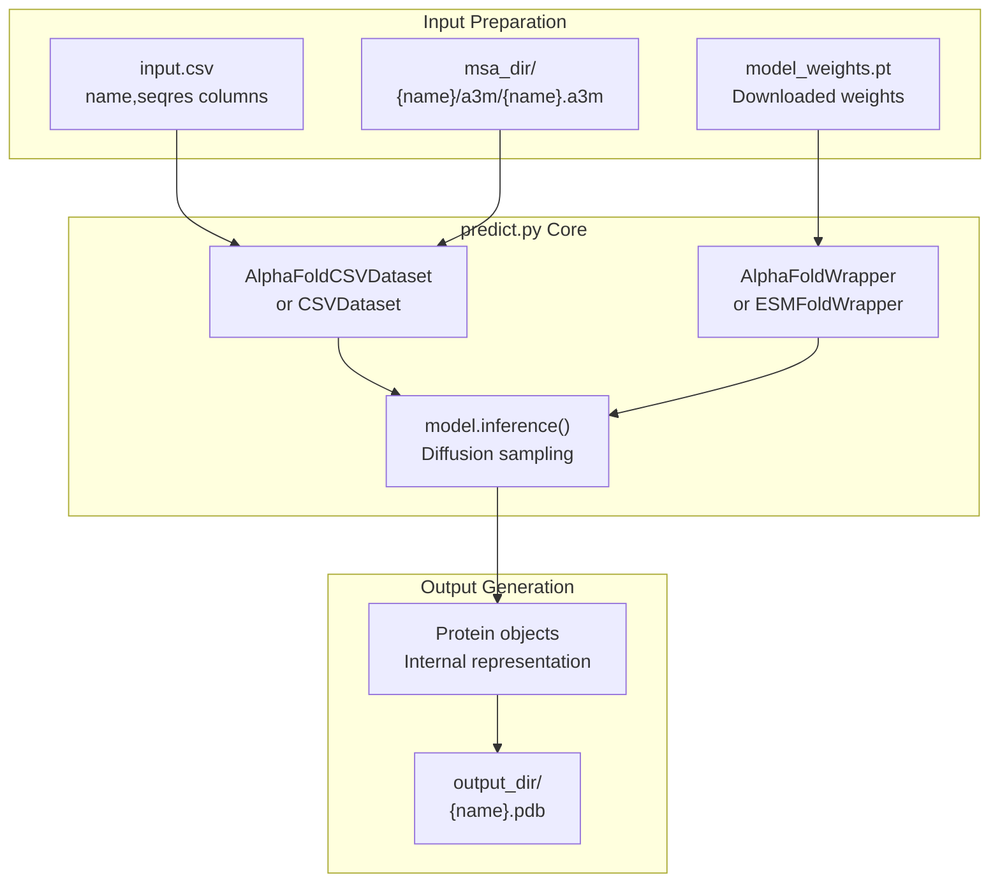
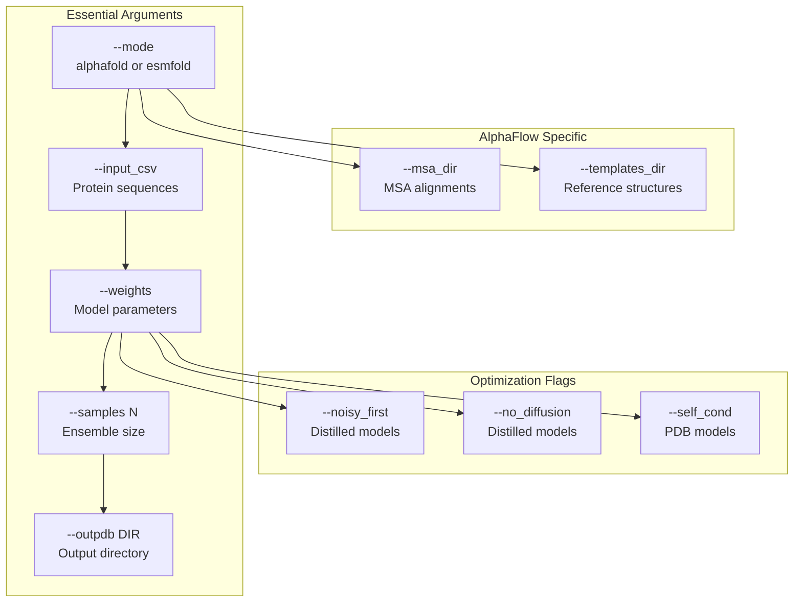

# Quick Start Guide

> **Relevant source files**
> * [README.md](https://github.com/bjing2016/alphaflow/blob/02dc0376/README.md?plain=1)
> * [predict.py](https://github.com/bjing2016/alphaflow/blob/02dc0376/predict.py)

This guide walks you through running your first protein structure ensemble prediction with AlphaFlow or ESMFlow. It covers the essential steps to generate conformational ensembles from a protein sequence, using minimal setup and default parameters.

For detailed installation instructions, see [Installation and Setup](/bjing2016/alphaflow/2.1-installation-and-setup). For comprehensive inference options and advanced usage, see [Inference Pipeline](/bjing2016/alphaflow/3.1-inference-pipeline). For training your own models, see [Training System](/bjing2016/alphaflow/4-training-system).

## Prerequisites

Before starting, ensure you have:

* Completed the installation process from [Installation and Setup](/bjing2016/alphaflow/2.1-installation-and-setup)
* Downloaded at least one model weights file (see model weights tables below)
* Basic familiarity with command-line operations

## Quick Start Workflow

The basic AlphaFlow prediction workflow involves three main components working together:



Sources: [predict.py L62-L70](https://github.com/bjing2016/alphaflow/blob/02dc0376/predict.py#L62-L70)

 [predict.py L73](https://github.com/bjing2016/alphaflow/blob/02dc0376/predict.py#L73-L73)

 [predict.py L119-L120](https://github.com/bjing2016/alphaflow/blob/02dc0376/predict.py#L119-L120)

 [predict.py L126-L127](https://github.com/bjing2016/alphaflow/blob/02dc0376/predict.py#L126-L127)

## Model Weights

Download one of the following model weights files to get started:

| Model Type | Use Case | Download Command |
| --- | --- | --- |
| AlphaFlow-MD (distilled) | Fast MD ensembles | `wget https://storage.googleapis.com/alphaflow/params/alphaflow_md_distilled_202402.pt` |
| ESMFlow-MD (distilled) | Fast MD ensembles, no MSA needed | `wget https://storage.googleapis.com/alphaflow/params/esmflow_md_distilled_202402.pt` |
| AlphaFlow-PDB (base) | Experimental ensembles | `wget https://storage.googleapis.com/alphaflow/params/alphaflow_pdb_base_202402.pt` |

The **distilled** models are recommended for quick start as they run significantly faster with minimal accuracy loss.

Sources: [README.md L57](https://github.com/bjing2016/alphaflow/blob/02dc0376/README.md?plain=1#L57-L57)

 [README.md L64-L71](https://github.com/bjing2016/alphaflow/blob/02dc0376/README.md?plain=1#L64-L71)

 [README.md L77-L82](https://github.com/bjing2016/alphaflow/blob/02dc0376/README.md?plain=1#L77-L82)

## Preparing Input Data

### Step 1: Create Input CSV

Create a CSV file with protein sequences you want to predict. The file must have `name` and `seqres` columns:

```
name,seqresexample_protein,MKLLILTCLVAVALARPKHPIKHQGLPQEVLNENLLRFFVAPFPEVFGKEKVNELtest_sequence,MKTVRQERLKSIVRILERSKEPVSGAQLAEELSVSRQVIVQDIAYLRSLGYNIVATPRGYVLAGG
```

Save this as `input.csv`. You can use the provided test data as reference: [splits/atlas_test.csv](https://github.com/bjing2016/alphaflow/blob/02dc0376/splits/atlas_test.csv)

Sources: [README.md L90](https://github.com/bjing2016/alphaflow/blob/02dc0376/README.md?plain=1#L90-L90)

 [predict.py L3](https://github.com/bjing2016/alphaflow/blob/02dc0376/predict.py#L3-L3)

### Step 2: MSA Generation (AlphaFlow only)

If using AlphaFlow models, generate Multiple Sequence Alignments (MSAs):

```markdown
# Quick MSA generation using ColabFold serverpython -m scripts.mmseqs_query --split input.csv --outdir ./msa_dir
```

This creates the required directory structure: `msa_dir/{name}/a3m/{name}.a3m`.

**Note**: ESMFlow models do not require MSAs and can skip this step.

Sources: [README.md L92](https://github.com/bjing2016/alphaflow/blob/02dc0376/README.md?plain=1#L92-L92)

 [predict.py L5](https://github.com/bjing2016/alphaflow/blob/02dc0376/predict.py#L5-L5)

## Running Your First Prediction

### ESMFlow (Simplest - No MSA Required)

```
python predict.py \    --mode esmfold \    --input_csv input.csv \    --weights esmflow_md_distilled_202402.pt \    --samples 5 \    --outpdb ./output \    --noisy_first --no_diffusion
```

### AlphaFlow (Requires MSA)

```
python predict.py \    --mode alphafold \    --input_csv input.csv \    --msa_dir ./msa_dir \    --weights alphaflow_md_distilled_202402.pt \    --samples 5 \    --outpdb ./output \    --noisy_first --no_diffusion
```

## Command Line Arguments Explained

The prediction process is controlled by several key parameters in [predict.py](https://github.com/bjing2016/alphaflow/blob/02dc0376/predict.py)

:



| Argument | Purpose | Required |
| --- | --- | --- |
| `--mode` | Choose between `alphafold` or `esmfold` | Yes |
| `--input_csv` | Path to input CSV with sequences | Yes |
| `--weights` | Path to downloaded model weights | Yes |
| `--samples` | Number of conformations to generate | Yes |
| `--outpdb` | Output directory for PDB files | Yes |
| `--msa_dir` | MSA directory (AlphaFlow only) | AlphaFlow |
| `--noisy_first --no_diffusion` | Required for distilled models | Distilled |

Sources: [predict.py L1-L22](https://github.com/bjing2016/alphaflow/blob/02dc0376/predict.py#L1-L22)

 [README.md L98-L112](https://github.com/bjing2016/alphaflow/blob/02dc0376/README.md?plain=1#L98-L112)

## Understanding Output

The prediction generates PDB files containing multiple conformations:

```markdown
output/
├── example_protein.pdb    # 5 conformations
└── test_sequence.pdb      # 5 conformations
```

Each PDB file contains the requested number of conformations as separate MODEL records. The output follows the standard PDB format and can be visualized with tools like PyMOL, ChimeraX, or VMD.

The [protein.prots_to_pdb()](https://github.com/bjing2016/alphaflow/blob/02dc0376/protein.prots_to_pdb())

 function in [predict.py L127](https://github.com/bjing2016/alphaflow/blob/02dc0376/predict.py#L127-L127)

 handles the conversion from internal protein representations to PDB format.

Sources: [predict.py L126-L127](https://github.com/bjing2016/alphaflow/blob/02dc0376/predict.py#L126-L127)

 [alphaflow/utils/protein.py](https://github.com/bjing2016/alphaflow/blob/02dc0376/alphaflow/utils/protein.py)

## Runtime Performance

Expected runtimes for different model configurations:

| Model | Layers | Runtime per Sample | Use Case |
| --- | --- | --- | --- |
| ESMFlow-MD (distilled) | 48 | ~2-5 seconds | Quick prototyping |
| AlphaFlow-MD (distilled) | 48 | ~5-10 seconds | Standard usage |
| AlphaFlow-MD+Templates (12l) | 12 | ~10-15 seconds | With templates |
| AlphaFlow-MD (base) | 48 | ~30-60 seconds | High accuracy |

The `--runtime_json` option can capture detailed timing information for performance analysis.

Sources: [README.md L9](https://github.com/bjing2016/alphaflow/blob/02dc0376/README.md?plain=1#L9-L9)

 [predict.py L20](https://github.com/bjing2016/alphaflow/blob/02dc0376/predict.py#L20-L20)

 [predict.py L118-L121](https://github.com/bjing2016/alphaflow/blob/02dc0376/predict.py#L118-L121)

## Next Steps

After successfully running your first prediction:

1. **Analyze Results**: Use the ensemble analysis tools described in [Ensemble Analysis](/bjing2016/alphaflow/7.1-ensemble-analysis)
2. **Advanced Options**: Explore additional inference parameters in [Inference Pipeline](/bjing2016/alphaflow/3.1-inference-pipeline)
3. **Template Usage**: Learn about using reference structures with MD+Templates models
4. **Custom Training**: Train models on your own data using [Training System](/bjing2016/alphaflow/4-training-system)

For troubleshooting common issues or optimizing performance, refer to the detailed documentation in subsequent sections.

Sources: [README.md L114-L121](https://github.com/bjing2016/alphaflow/blob/02dc0376/README.md?plain=1#L114-L121)