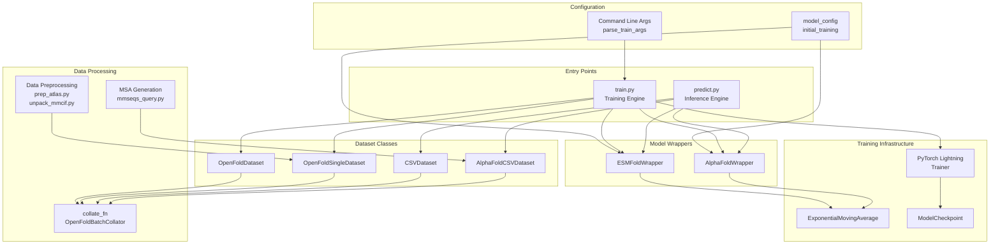
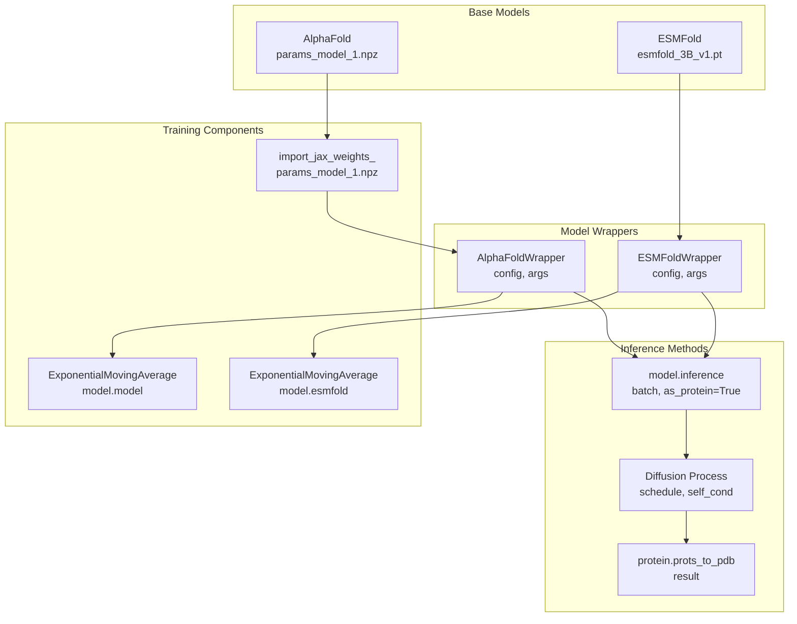
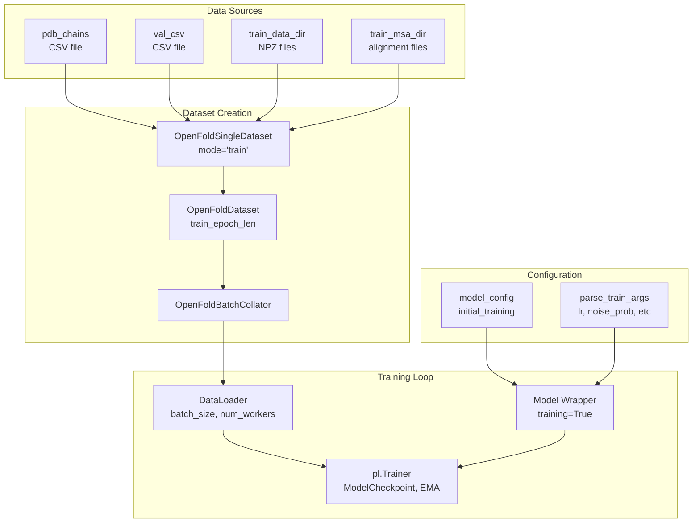
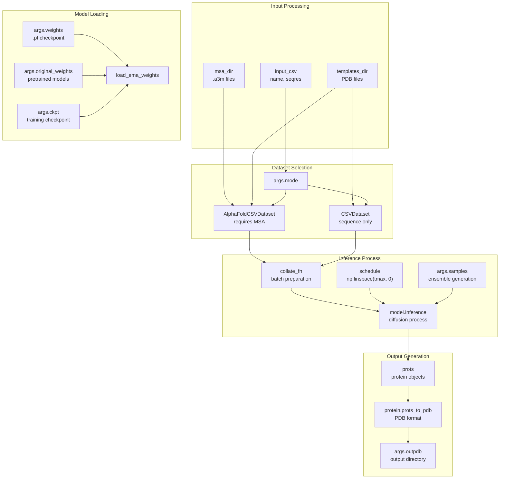
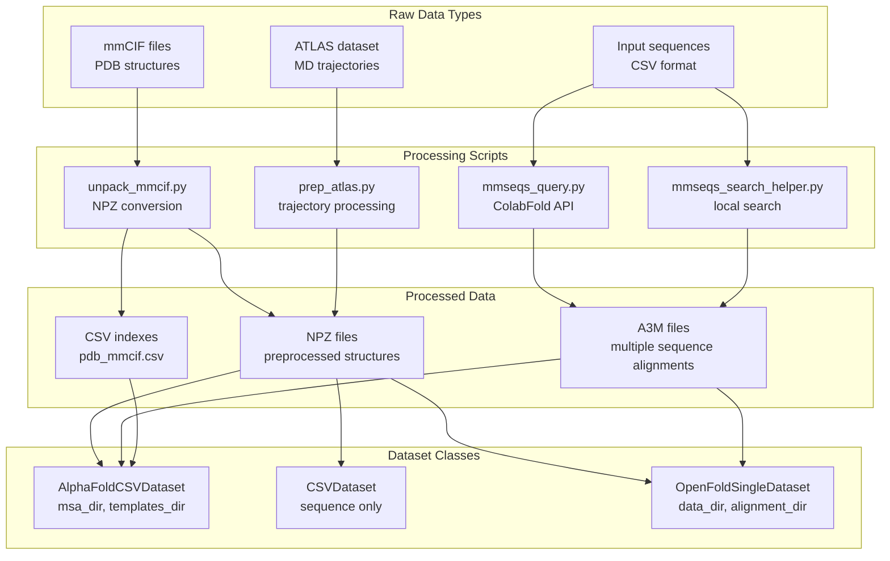

# System Architecture

> **Relevant source files**
> * [README.md](https://github.com/bjing2016/alphaflow/blob/02dc0376/README.md?plain=1)
> * [predict.py](https://github.com/bjing2016/alphaflow/blob/02dc0376/predict.py)
> * [train.py](https://github.com/bjing2016/alphaflow/blob/02dc0376/train.py)

This document explains how the major components of the AlphaFlow system fit together, including the training pipeline, inference engine, and data processing components. It provides a technical overview of the system's modular architecture and data flow patterns.

For specific details about model variants and their training methodologies, see [Model Variants](/bjing2016/alphaflow/1.1-model-variants). For implementation details of individual components, see [Model Architecture](/bjing2016/alphaflow/5-model-architecture).

## Overall System Architecture

The AlphaFlow system is built around a modular architecture with distinct components for training, inference, and data processing. The system supports both AlphaFlow (modified AlphaFold) and ESMFlow (modified ESMFold) model families.

**Sources**: [predict.py L1-L134](https://github.com/bjing2016/alphaflow/blob/02dc0376/predict.py#L1-L134)

 [train.py L1-L163](https://github.com/bjing2016/alphaflow/blob/02dc0376/train.py#L1-L163)

 [README.md L1-L215](https://github.com/bjing2016/alphaflow/blob/02dc0376/README.md?plain=1#L1-L215)

## Core Model Architecture

The system implements two main model families through wrapper classes that provide a unified interface for training and inference.

**Sources**: [train.py L124-L146](https://github.com/bjing2016/alphaflow/blob/02dc0376/train.py#L124-L146)

 [predict.py L73-L99](https://github.com/bjing2016/alphaflow/blob/02dc0376/predict.py#L73-L99)

 [predict.py L119-L121](https://github.com/bjing2016/alphaflow/blob/02dc0376/predict.py#L119-L121)

## Training Pipeline Architecture

The training system uses PyTorch Lightning with custom dataset classes and supports various training stages (PDB, MD, MD+Templates).

**Sources**: [train.py L60-L104](https://github.com/bjing2016/alphaflow/blob/02dc0376/train.py#L60-L104)

 [train.py L107-L123](https://github.com/bjing2016/alphaflow/blob/02dc0376/train.py#L107-L123)

 [train.py L124-L139](https://github.com/bjing2016/alphaflow/blob/02dc0376/train.py#L124-L139)

## Inference Pipeline Architecture

The inference system processes input data through the trained models to generate protein structure ensembles.

**Sources**: [predict.py L62-L71](https://github.com/bjing2016/alphaflow/blob/02dc0376/predict.py#L62-L71)

 [predict.py L75-L99](https://github.com/bjing2016/alphaflow/blob/02dc0376/predict.py#L75-L99)

 [predict.py L106-L128](https://github.com/bjing2016/alphaflow/blob/02dc0376/predict.py#L106-L128)

## Data Processing Architecture

The system includes comprehensive data processing utilities for handling different types of protein structure data.

**Sources**: [README.md L88-L94](https://github.com/bjing2016/alphaflow/blob/02dc0376/README.md?plain=1#L88-L94)

 [README.md L126-L138](https://github.com/bjing2016/alphaflow/blob/02dc0376/README.md?plain=1#L126-L138)

 [predict.py L62-L70](https://github.com/bjing2016/alphaflow/blob/02dc0376/predict.py#L62-L70)

## Configuration and Data Flow

The system uses a centralized configuration system and supports multiple data flow patterns for different use cases.

| Component | Configuration Source | Data Flow Direction |
| --- | --- | --- |
| `model_config` | `initial_training` config | Training → Model Wrappers |
| `data_cfg` | Config data section | Datasets → DataLoaders |
| `loss_cfg` | Config loss section | Training → Loss computation |
| Command Line Args | `argparse` / `parse_train_args` | User → System behavior |
| Model Weights | `.pt` checkpoints | Storage → Model state |
| Input Data | CSV, MSA, Templates | Files → Dataset classes |

**Training Data Flow**:

1. Raw data (PDB, ATLAS) → Processing scripts → NPZ files
2. NPZ files + MSAs → Dataset classes → DataLoaders
3. DataLoaders → Model Wrappers → PyTorch Lightning Trainer
4. Trainer → Checkpoints + EMA weights

**Inference Data Flow**:

1. Input CSV + MSAs → Dataset classes → Batch preparation
2. Batch + Model weights → Inference engine → Protein objects
3. Protein objects → PDB format → Output files

**Sources**: [predict.py L42-L53](https://github.com/bjing2016/alphaflow/blob/02dc0376/predict.py#L42-L53)

 [train.py L21-L30](https://github.com/bjing2016/alphaflow/blob/02dc0376/train.py#L21-L30)

 [predict.py L106-L128](https://github.com/bjing2016/alphaflow/blob/02dc0376/predict.py#L106-L128)

 [train.py L92-L104](https://github.com/bjing2016/alphaflow/blob/02dc0376/train.py#L92-L104)