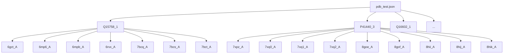
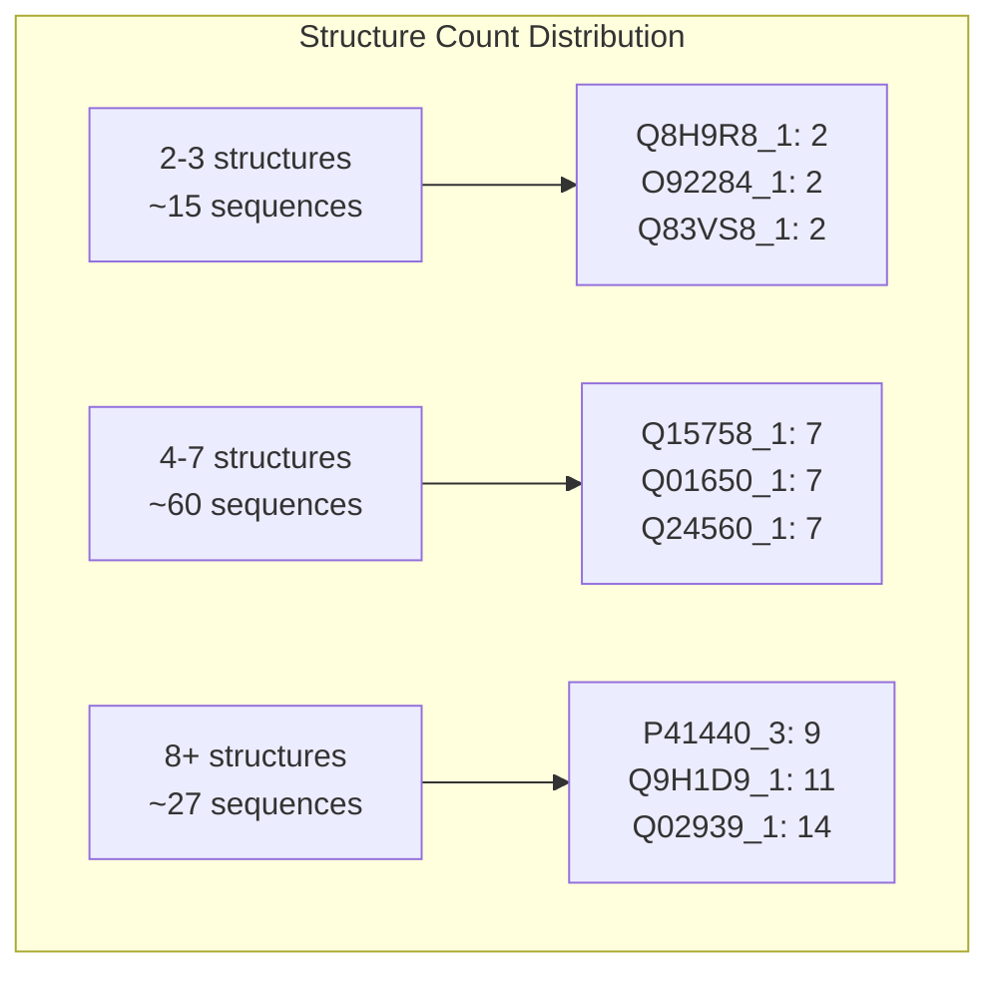
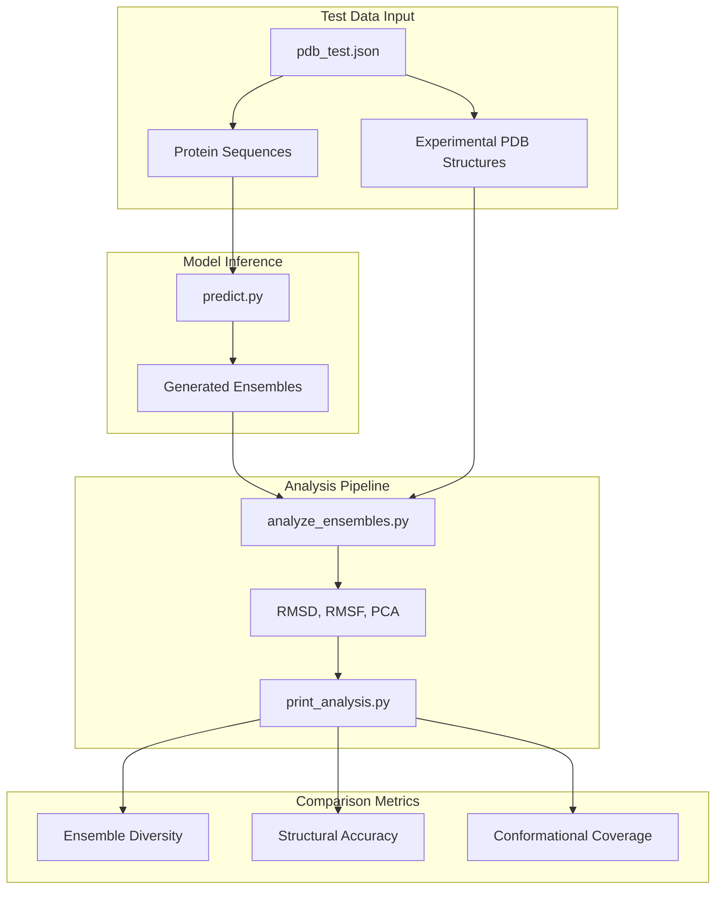

# Test Data Configuration

> **Relevant source files**
> * [splits/pdb_test.json](https://github.com/bjing2016/alphaflow/blob/02dc0376/splits/pdb_test.json)

This document explains the organization and structure of test data splits used for evaluating AlphaFlow and ESMFlow model performance. The test data configuration groups experimental protein structures by their underlying sequences to enable assessment of conformational ensemble generation capabilities.

For information about training data preparation, see [Training Data Preparation](/bjing2016/alphaflow/4.2-training-data-preparation). For details on how this test data is used in evaluation workflows, see [Ensemble Analysis](/bjing2016/alphaflow/7.1-ensemble-analysis).

## Purpose and Structure

The test data configuration organizes experimentally determined protein structures from the Protein Data Bank (PDB) into sequence-based groups. Each group contains multiple PDB entries representing different conformational states of the same protein sequence, enabling evaluation of the model's ability to generate diverse, biologically relevant structural ensembles.

### Data Organization Schema

The test data is structured as a JSON mapping where protein sequence identifiers serve as keys, each associated with lists of corresponding PDB structure entries:

**Sources:** [splits/pdb_test.json L1-L701](https://github.com/bjing2016/alphaflow/blob/02dc0376/splits/pdb_test.json#L1-L701)

### Protein Identifier Format

Protein identifiers follow the pattern `{UniProt_ID}_{variant_number}`, where:

* `UniProt_ID`: UniProt accession number for the protein sequence
* `variant_number`: Distinguishes different sequence variants or domains of the same protein

Examples from the test set:

* `Q15758_1`: Single variant of UniProt entry Q15758
* `P41440_3`: Third variant/domain of UniProt entry P41440
* `A0A1D5AKC8_2`, `A0A1D5AKC8_3`: Multiple variants of the same base sequence

### PDB Entry Format

PDB entries are specified as `{pdb_code}_{chain_id}`, identifying both the structure and specific protein chain:

* `6gct_A`: Chain A from PDB structure 6GCT
* `7xpz_A`: Chain A from PDB structure 7XPZ
* `6qw6_4B`: Chain 4B from PDB structure 6QW6 (multi-character chain ID)

## Statistical Overview

The test configuration contains diverse protein families with varying numbers of experimental structures per sequence:

| Metric | Value |
| --- | --- |
| Total Protein Sequences | ~102 |
| Total PDB Entries | ~702 |
| Average Structures per Sequence | ~6.9 |
| Min Structures per Sequence | 2 |
| Max Structures per Sequence | 14 |

### Distribution of Structure Counts

**Sources:** [splits/pdb_test.json L2-L701](https://github.com/bjing2016/alphaflow/blob/02dc0376/splits/pdb_test.json#L2-L701)

## Integration with Evaluation Pipeline

The test data configuration directly supports the ensemble evaluation workflow by providing ground truth structural diversity for comparison with generated ensembles.

### Evaluation Data Flow

**Sources:** [splits/pdb_test.json L1-L701](https://github.com/bjing2016/alphaflow/blob/02dc0376/splits/pdb_test.json#L1-L701)

## Usage in Model Evaluation

### Conformational Diversity Assessment

For each protein sequence in the test set, the multiple experimental structures enable evaluation of:

1. **Structural Diversity**: Whether generated ensembles capture the range of conformational states observed experimentally
2. **Native State Coverage**: How well the ensemble covers experimentally observed conformations
3. **Ensemble Quality**: Comparison of generated vs. experimental structural distributions

### Specific Test Cases

Notable protein families in the test set with high structural diversity:

| Protein ID | Structure Count | PDB Entries | Biological Context |
| --- | --- | --- | --- |
| `Q02939_1` | 14 | 7k01_2, 7ml0_2, 7ml1_2, ... | High conformational flexibility |
| `Q9H1D9_1` | 11 | 7a6h_P, 7ae1_P, 7ae3_P, ... | Multi-state protein |
| `P41440_3` | 9 | 7xpz_A, 7xq0_A, 7xq1_A, ... | Allosteric transitions |
| `Q9UU79_1` | 10 | 8esq_r, 8esr_r, 8etc_r, ... | Dynamic conformational states |

**Sources:** [splits/pdb_test.json L156-L171](https://github.com/bjing2016/alphaflow/blob/02dc0376/splits/pdb_test.json#L156-L171)

 [splits/pdb_test.json L259-L271](https://github.com/bjing2016/alphaflow/blob/02dc0376/splits/pdb_test.json#L259-L271)

 [splits/pdb_test.json L11-L21](https://github.com/bjing2016/alphaflow/blob/02dc0376/splits/pdb_test.json#L11-L21)

 [splits/pdb_test.json L342-L353](https://github.com/bjing2016/alphaflow/blob/02dc0376/splits/pdb_test.json#L342-L353)

## Configuration File Location

The test data configuration is stored at:

* **File Path**: `splits/pdb_test.json`
* **Format**: JSON object mapping protein IDs to PDB entry lists
* **Encoding**: UTF-8 text format

This configuration works in conjunction with other split files in the `splits/` directory to provide comprehensive train/validation/test partitioning for model development and evaluation.

**Sources:** [splits/pdb_test.json L1-L701](https://github.com/bjing2016/alphaflow/blob/02dc0376/splits/pdb_test.json#L1-L701)