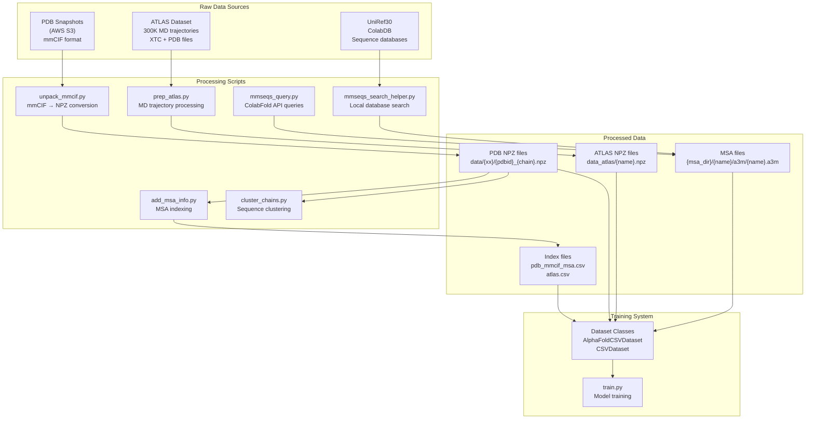
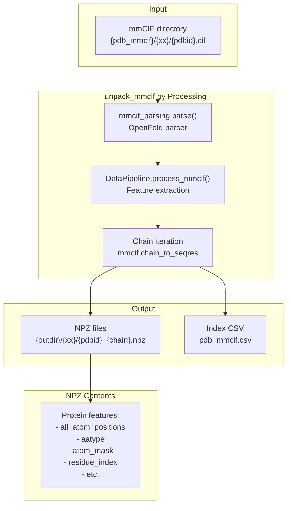
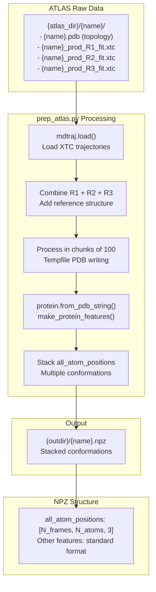
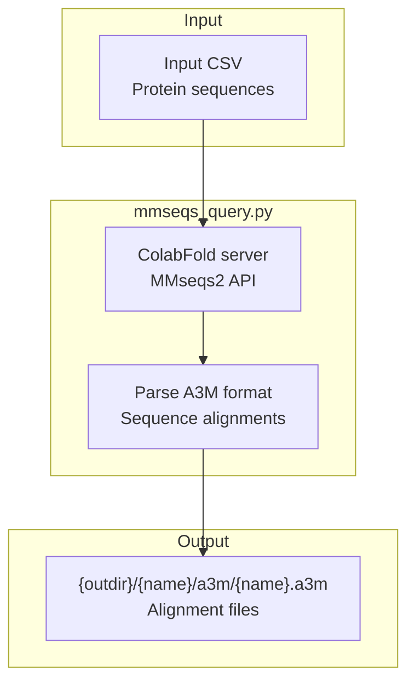
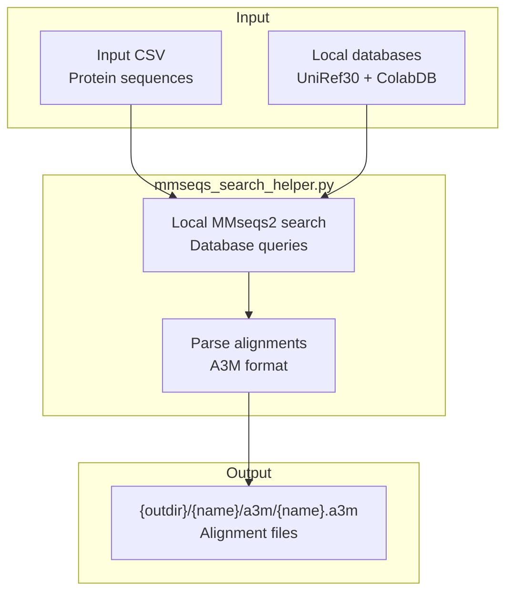

# Training Data Preparation

> **Relevant source files**
> * [README.md](https://github.com/bjing2016/alphaflow/blob/02dc0376/README.md?plain=1)
> * [scripts/prep_atlas.py](https://github.com/bjing2016/alphaflow/blob/02dc0376/scripts/prep_atlas.py)
> * [scripts/unpack_mmcif.py](https://github.com/bjing2016/alphaflow/blob/02dc0376/scripts/unpack_mmcif.py)

This document covers the preparation of training data for AlphaFlow and ESMFlow models, including processing of PDB structures, ATLAS MD trajectories, and MSA generation. The data preparation pipeline transforms raw structural data into NPZ format suitable for model training.

For information about the actual training process using prepared data, see [Training Pipeline](/bjing2016/alphaflow/4.1-training-pipeline). For details about dataset classes that load this prepared data, see [Dataset Classes](/bjing2016/alphaflow/5.2-dataset-classes).

## Overview

AlphaFlow training requires three main data sources:

* **PDB Structures**: Experimental protein structures from the Protein Data Bank for training base models
* **ATLAS MD Trajectories**: Molecular dynamics simulation data for training conformational ensemble models
* **Multiple Sequence Alignments (MSAs)**: Evolutionary information from sequence databases

The data preparation pipeline processes these raw sources into standardized NPZ files containing protein features compatible with the OpenFold data format.

## Data Sources and Flow

Sources: [README.md L124-L138](https://github.com/bjing2016/alphaflow/blob/02dc0376/README.md?plain=1#L124-L138)

 [scripts/unpack_mmcif.py L1-L73](https://github.com/bjing2016/alphaflow/blob/02dc0376/scripts/unpack_mmcif.py#L1-L73)

 [scripts/prep_atlas.py L1-L61](https://github.com/bjing2016/alphaflow/blob/02dc0376/scripts/prep_atlas.py#L1-L61)

## PDB Dataset Preparation

### Downloading and Extracting PDB Data

The PDB preparation process begins with downloading mmCIF structure files from AWS:

1. **Download PDB snapshot**: `aws s3 sync --no-sign-request s3://pdbsnapshots/20230102/pub/pdb/data/structures/divided/mmCIF pdb_mmcif`
2. **Extract compressed files**: `find pdb_mmcif -name '*.gz' | xargs gunzip`

### mmCIF Processing Pipeline

The `unpack_mmcif.py` script processes raw mmCIF files into training-ready NPZ format:

The processing extracts individual protein chains and creates metadata records:

| Field | Description |
| --- | --- |
| `name` | PDB ID + chain (e.g., `1abc_A`) |
| `release_date` | Structure release date |
| `seqres` | Sequence from SEQRES records |
| `resolution` | Experimental resolution |

Sources: [scripts/unpack_mmcif.py L38-L70](https://github.com/bjing2016/alphaflow/blob/02dc0376/scripts/unpack_mmcif.py#L38-L70)

 [README.md L126-L129](https://github.com/bjing2016/alphaflow/blob/02dc0376/README.md?plain=1#L126-L129)

### MSA Integration and Clustering

After processing structures, additional steps prepare the training splits:

1. **OpenProteinSet integration** via `add_msa_info.py` creates `pdb_mmcif_msa.csv` with MSA lookup information
2. **Sequence clustering** via `cluster_chains.py` generates `pdb_clusters` at 40% sequence similarity
3. **Validation MSAs** are generated for the CAMEO2022 validation split

Sources: [README.md L130-L133](https://github.com/bjing2016/alphaflow/blob/02dc0376/README.md?plain=1#L130-L133)

## ATLAS MD Dataset Preparation

### ATLAS Dataset Structure

The ATLAS dataset contains MD trajectories for protein conformational ensemble training:

### Processing Implementation

The `prep_atlas.py` script performs the core MD trajectory processing:

* **Trajectory loading**: Combines three replica runs plus reference structure using `mdtraj.load()`
* **Conformation extraction**: Processes trajectories in chunks of 100 frames to manage memory
* **Feature generation**: Uses OpenFold's `make_protein_features()` to create standardized protein features
* **Position stacking**: Creates 4D array with shape `[N_frames, N_residues, N_atoms, 3]` for conformational ensembles

The key difference from PDB processing is the stacked `all_atom_positions` array containing multiple conformations rather than a single structure.

Sources: [scripts/prep_atlas.py L38-L59](https://github.com/bjing2016/alphaflow/blob/02dc0376/scripts/prep_atlas.py#L38-L59)

 [README.md L135-L138](https://github.com/bjing2016/alphaflow/blob/02dc0376/README.md?plain=1#L135-L138)

## MSA Generation Pipeline

Multiple Sequence Alignments provide evolutionary context essential for AlphaFlow training. Two methods are supported for MSA generation:

### ColabFold API Method

Usage: `python -m scripts.mmseqs_query --split [PATH] --outdir [DIR]`

### Local Database Method

Usage: `python -m scripts.mmseqs_search_helper --split [PATH] --db_dir [DIR] --outdir [DIR]`

The local method requires downloading UniRef30 and ColabDB databases locally, while the API method uses the remote ColabFold service.

Sources: [README.md L91-L93](https://github.com/bjing2016/alphaflow/blob/02dc0376/README.md?plain=1#L91-L93)

## Training Data Integration

The prepared data integrates into the training system through standardized file structures and CSV indices:

| Data Type | File Pattern | Index File |
| --- | --- | --- |
| PDB Structures | `{data_dir}/{xx}/{pdbid}_{chain}.npz` | `pdb_mmcif_msa.csv` |
| ATLAS Trajectories | `{atlas_dir}/{name}.npz` | `splits/atlas.csv` |
| MSA Files | `{msa_dir}/{name}/a3m/{name}.a3m` | Referenced in CSV indices |
| Validation | Various | `splits/cameo2022.csv` |

The training system uses these standardized formats through dataset classes that handle loading and batching for model training.

Sources: [README.md L149-L174](https://github.com/bjing2016/alphaflow/blob/02dc0376/README.md?plain=1#L149-L174)