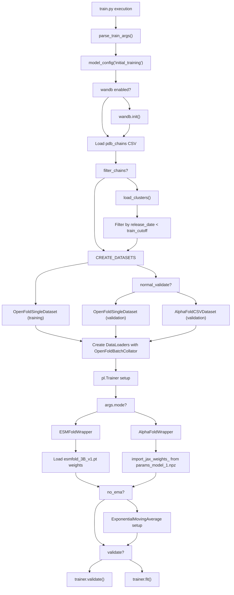
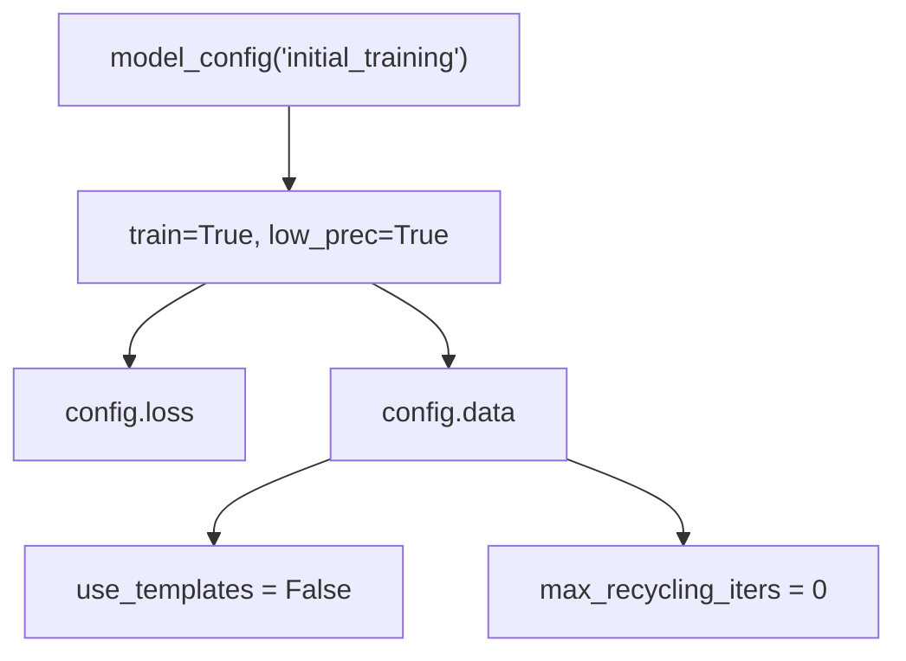
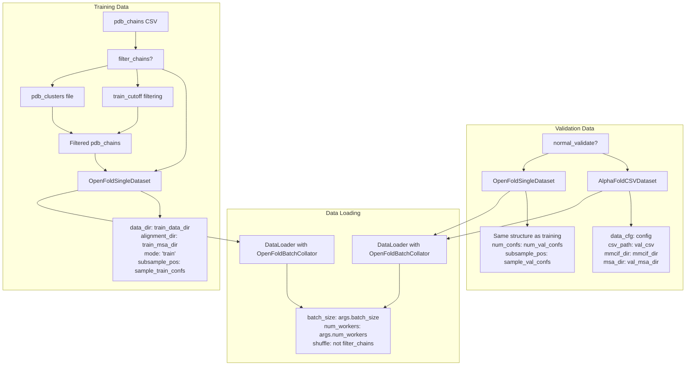
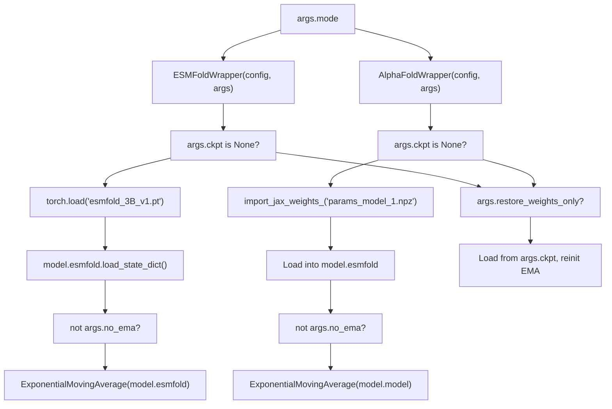
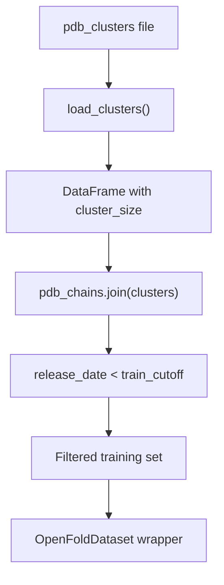

# Training Pipeline

> **Relevant source files**
> * [train.py](https://github.com/bjing2016/alphaflow/blob/02dc0376/train.py)

This document covers the core training pipeline implemented in `train.py`, which orchestrates the training of both AlphaFlow and ESMFlow models. The training system supports multiple training stages including PDB-based training, MD trajectory training, and template-guided training across different model architectures.

For information about preparing training data (PDB processing, ATLAS trajectories, MSA generation), see [Training Data Preparation](/bjing2016/alphaflow/4.2-training-data-preparation). For technical details about the model wrapper implementations, see [ESMFold and ModelWrapper](/bjing2016/alphaflow/5.1-esmfold-and-modelwrapper). For dataset class specifications, see [Dataset Classes](/bjing2016/alphaflow/5.2-dataset-classes).

## Training Pipeline Overview

The training pipeline follows a structured approach that handles both ESMFold and AlphaFold model variants through a unified interface using PyTorch Lightning.

Sources: [train.py L1-L163](https://github.com/bjing2016/alphaflow/blob/02dc0376/train.py#L1-L163)

## Command Line Interface

The training pipeline accepts configuration through command-line arguments parsed by `parse_train_args()`. Key argument categories include:

| Category | Key Arguments | Purpose |
| --- | --- | --- |
| **Data Paths** | `train_data_dir`, `train_msa_dir`, `val_csv` | Specify training data locations |
| **Model Config** | `mode` (esmfold/alphafold), `ckpt`, `no_ema` | Control model type and checkpoints |
| **Training Control** | `epochs`, `batch_size`, `grad_clip`, `accumulate_grad` | Training hyperparameters |
| **Data Filtering** | `filter_chains`, `pdb_clusters`, `train_cutoff` | Control training data selection |
| **Validation** | `normal_validate`, `val_freq`, `num_val_confs` | Validation configuration |
| **Monitoring** | `wandb`, `run_name`, `ckpt_freq` | Experiment tracking |

Sources: [train.py L1-L2](https://github.com/bjing2016/alphaflow/blob/02dc0376/train.py#L1-L2)

## Model Configuration Setup

The training pipeline initializes model configuration using a predefined setup optimized for training:

The configuration disables templates and recycling iterations for initial training stages, with these settings modified for advanced training stages.

Sources: [train.py L21-L30](https://github.com/bjing2016/alphaflow/blob/02dc0376/train.py#L21-L30)

## Dataset and Data Loading Architecture

The training system supports multiple dataset configurations depending on the training stage and validation approach:

Sources: [train.py L52-L104](https://github.com/bjing2016/alphaflow/blob/02dc0376/train.py#L52-L104)

## Model Wrapper Initialization

The training pipeline supports two model types through specialized wrapper classes:

Sources: [train.py L124-L155](https://github.com/bjing2016/alphaflow/blob/02dc0376/train.py#L124-L155)

## PyTorch Lightning Trainer Configuration

The training execution uses PyTorch Lightning with specific configurations optimized for protein structure prediction:

| Configuration | Value | Purpose |
| --- | --- | --- |
| `accelerator` | "gpu" | GPU-accelerated training |
| `max_epochs` | `args.epochs` | Training duration control |
| `gradient_clip_val` | `args.grad_clip` | Gradient stability |
| `accumulate_grad_batches` | `args.accumulate_grad` | Effective batch size scaling |
| `check_val_every_n_epoch` | `args.val_freq` | Validation frequency |
| `ModelCheckpoint` | Save every `args.ckpt_freq` epochs | Model persistence |

The trainer supports both training (`trainer.fit()`) and validation-only (`trainer.validate()`) modes based on the `args.validate` flag.

Sources: [train.py L107-L161](https://github.com/bjing2016/alphaflow/blob/02dc0376/train.py#L107-L161)

## Cluster-Based Data Filtering

For large-scale training, the pipeline supports cluster-based data filtering to manage dataset size and reduce redundancy:

The `load_clusters()` function processes cluster files where each line contains space-separated PDB names belonging to the same cluster, computing cluster sizes for downstream filtering.

Sources: [train.py L32-L39](https://github.com/bjing2016/alphaflow/blob/02dc0376/train.py#L32-L39)

 [train.py L55-L90](https://github.com/bjing2016/alphaflow/blob/02dc0376/train.py#L55-L90)

## Training Execution Flow

The final execution follows one of two paths:

**Validation Mode** (`args.validate=True`):

* Loads specified checkpoint
* Runs validation on validation dataset
* Reports metrics without parameter updates

**Training Mode** (`args.validate=False`):

* Starts training from checkpoint (if provided) or pretrained weights
* Alternates between training and validation phases
* Saves checkpoints at specified intervals
* Logs metrics to wandb (if enabled)

The system handles both fresh training starts and resume-from-checkpoint scenarios through the checkpoint loading mechanisms in the model wrapper classes.

Sources: [train.py L157-L161](https://github.com/bjing2016/alphaflow/blob/02dc0376/train.py#L157-L161)