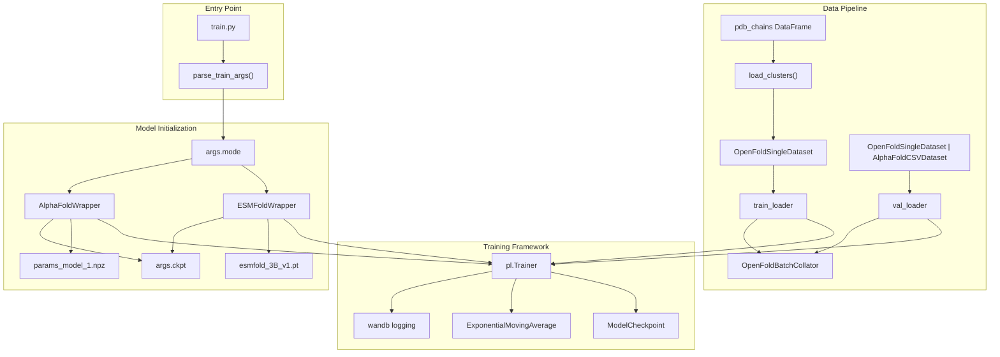
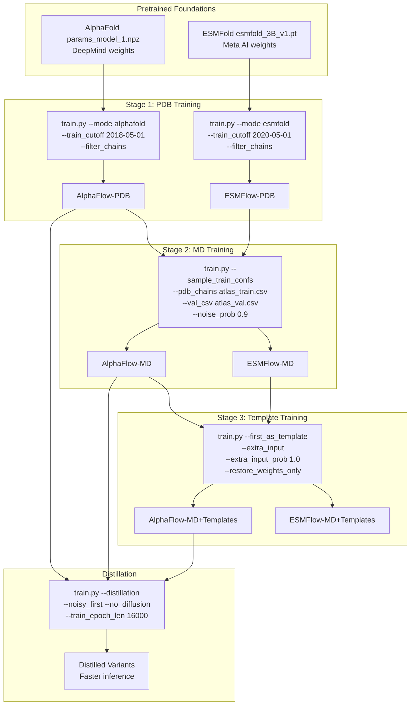
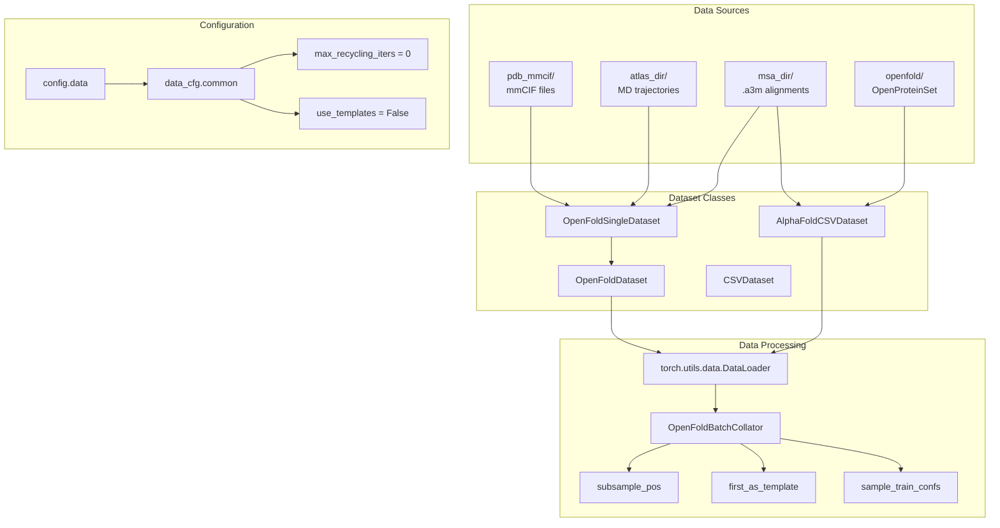
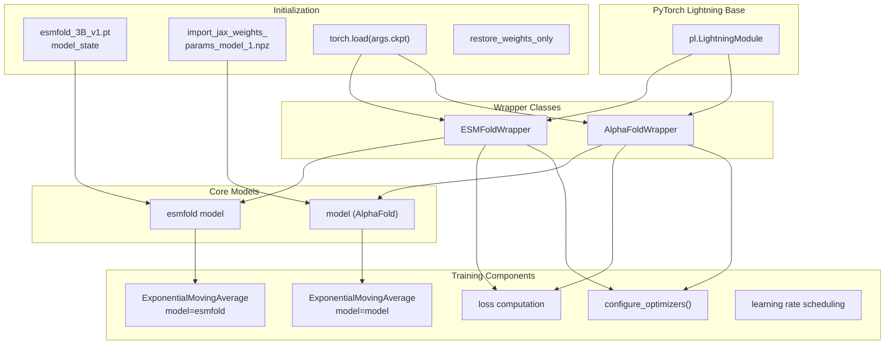

# Training System

> **Relevant source files**
> * [README.md](https://github.com/bjing2016/alphaflow/blob/02dc0376/README.md?plain=1)
> * [train.py](https://github.com/bjing2016/alphaflow/blob/02dc0376/train.py)

The training system provides comprehensive functionality for training AlphaFlow and ESMFlow models from scratch or fine-tuning existing checkpoints. It supports multiple training stages (PDB, MD, MD+Templates), model distillation, and handles the complex data pipeline required for protein structure prediction model training.

For information about running inference with trained models, see [Inference System](/bjing2016/alphaflow/3-inference-system). For details about the underlying model architectures, see [Model Architecture](/bjing2016/alphaflow/5-model-architecture).

## Training Pipeline Overview

The training system is orchestrated by the main `train.py` script, which coordinates data loading, model initialization, and the PyTorch Lightning training loop.

**Training Pipeline Architecture**



Sources: [train.py L1-L163](https://github.com/bjing2016/alphaflow/blob/02dc0376/train.py#L1-L163)

 [README.md L122-L175](https://github.com/bjing2016/alphaflow/blob/02dc0376/README.md?plain=1#L122-L175)

## Training Stages and Model Variants

The training system supports a hierarchical training approach with three main stages, each building upon the previous stage's checkpoint.

**Training Stage Progression**



### Stage 1: PDB Training

The first stage trains on experimental PDB structures to model conformational ensembles from X-ray crystallography and cryo-EM data.

| Parameter | AlphaFlow | ESMFlow |
| --- | --- | --- |
| Learning Rate | `5e-4` | `5e-4` |
| Training Cutoff | `2018-05-01` | `2020-05-01` |
| Noise Probability | `0.8` | `0.8` |
| Gradient Accumulation | `8` | `8` |
| Epoch Length | `80000` | `80000` |

### Stage 2: MD Training

The second stage continues training on ATLAS molecular dynamics trajectories at 300K to model physiological protein dynamics.

| Parameter | Value |
| --- | --- |
| Training Data | `atlas_train.csv` |
| Validation Data | `atlas_val.csv` |
| Noise Probability | `0.9` |
| Self-Conditioning | `0.0` |
| Configuration Sampling | `--sample_train_confs --sample_val_confs` |

### Stage 3: Template Training

The final stage adds template conditioning, allowing the model to take reference PDB structures as input.

| Parameter | Value |
| --- | --- |
| Template Mode | `--first_as_template` |
| Extra Input | `--extra_input --extra_input_prob 1.0` |
| Learning Rate | `1e-4` |
| Weight Restoration | `--restore_weights_only` |

Sources: [README.md L149-L175](https://github.com/bjing2016/alphaflow/blob/02dc0376/README.md?plain=1#L149-L175)

 [train.py L124-L146](https://github.com/bjing2016/alphaflow/blob/02dc0376/train.py#L124-L146)

## Data Pipeline Components

The training system uses a sophisticated data pipeline to handle multiple data sources and formats.

**Data Flow Architecture**



### Dataset Selection Logic

The training script selects between different dataset configurations based on the validation mode:

```markdown
# Normal validation uses OpenFoldSingleDatasetif args.normal_validate:    valset = OpenFoldSingleDataset(...)else:    # Standard validation uses AlphaFoldCSVDataset      valset = AlphaFoldCSVDataset(...)
```

### Chain Filtering and Clustering

When `--filter_chains` is enabled, the system applies sequence similarity clustering and release date filtering:

* Loads cluster information from `args.pdb_clusters`
* Filters chains by `args.train_cutoff` date
* Wraps training dataset in `OpenFoldDataset` with epoch length control

Sources: [train.py L60-L104](https://github.com/bjing2016/alphaflow/blob/02dc0376/train.py#L60-L104)

 [alphaflow/data/data_modules.py](https://github.com/bjing2016/alphaflow/blob/02dc0376/alphaflow/data/data_modules.py)

 [alphaflow/data/inference.py](https://github.com/bjing2016/alphaflow/blob/02dc0376/alphaflow/data/inference.py)

## Model Wrapper Architecture

The training system uses wrapper classes that extend PyTorch Lightning modules to handle the complex training logic for both ESMFold and AlphaFold architectures.

**Model Wrapper Hierarchy**



### Weight Initialization Logic

The system handles multiple weight initialization scenarios:

1. **Fresh Training**: Load pretrained weights from DeepMind/Meta AI
2. **Checkpoint Resume**: Load full training state from checkpoint
3. **Weight-Only Restore**: Load only model weights, reset training state

| Scenario | ESMFold | AlphaFold |
| --- | --- | --- |
| Fresh Training | `torch.load("esmfold_3B_v1.pt")` | `import_jax_weights_("params_model_1.npz")` |
| Checkpoint Resume | `ckpt_path=args.ckpt` in trainer | `ckpt_path=args.ckpt` in trainer |
| Weights Only | `load_state_dict(..., strict=False)` | `load_state_dict(..., strict=False)` |

Sources: [train.py L124-L155](https://github.com/bjing2016/alphaflow/blob/02dc0376/train.py#L124-L155)

 [alphaflow/model/wrapper.py](https://github.com/bjing2016/alphaflow/blob/02dc0376/alphaflow/model/wrapper.py)

## Training Configuration and Hyperparameters

The training system uses a comprehensive configuration system that controls model behavior, data processing, and training dynamics.

### Core Training Parameters

| Parameter | Default | Purpose |
| --- | --- | --- |
| `lr` | `5e-4` | Learning rate |
| `noise_prob` | `0.8` | Probability of adding noise during training |
| `accumulate_grad` | `8` | Gradient accumulation steps |
| `train_epoch_len` | `80000` | Training samples per epoch |
| `batch_size` | - | Batch size for training |
| `epochs` | - | Maximum training epochs |

### Distillation Parameters

| Parameter | Purpose |
| --- | --- |
| `--distillation` | Enable distillation mode |
| `--noisy_first` | Use noisy first frame for distilled models |
| `--no_diffusion` | Disable diffusion process |
| `--train_epoch_len 16000` | Shorter epochs for distillation |

### Validation and Checkpointing

| Parameter | Default | Purpose |
| --- | --- | --- |
| `val_freq` | `1` | Validation frequency (epochs) |
| `ckpt_freq` | `1` | Checkpoint saving frequency |
| `limit_batches` | `1.0` | Fraction of batches to process |
| `grad_clip` | - | Gradient clipping threshold |

Sources: [train.py L107-L123](https://github.com/bjing2016/alphaflow/blob/02dc0376/train.py#L107-L123)

 [alphaflow/utils/parsing.py](https://github.com/bjing2016/alphaflow/blob/02dc0376/alphaflow/utils/parsing.py)

## Monitoring and Logging

The training system integrates with Weights & Biases for experiment tracking and uses PyTorch Lightning's built-in logging capabilities.

### Weights & Biases Integration

```
if args.wandb:    wandb.init(        entity=os.environ["WANDB_ENTITY"],        project="alphaflow",         name=args.run_name,        config=args,    )
```

### Model Checkpointing Strategy

The system uses PyTorch Lightning's `ModelCheckpoint` callback with the following configuration:

* **Save Location**: `os.environ["MODEL_DIR"]`
* **Save Strategy**: `save_top_k=-1` (save all checkpoints)
* **Frequency**: Every `args.ckpt_freq` epochs
* **Resume**: Automatic checkpoint resumption via `ckpt_path`

Sources: [train.py L43-L50](https://github.com/bjing2016/alphaflow/blob/02dc0376/train.py#L43-L50)

 [train.py L115-L119](https://github.com/bjing2016/alphaflow/blob/02dc0376/train.py#L115-L119)