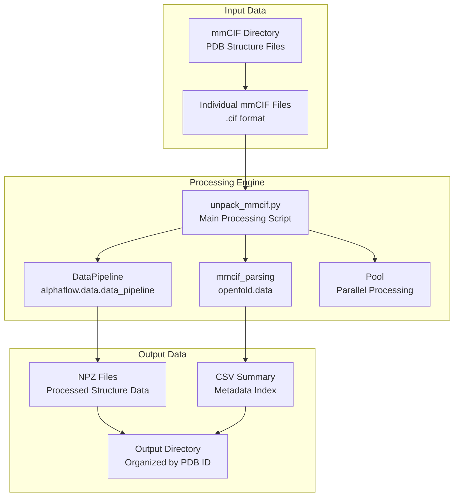
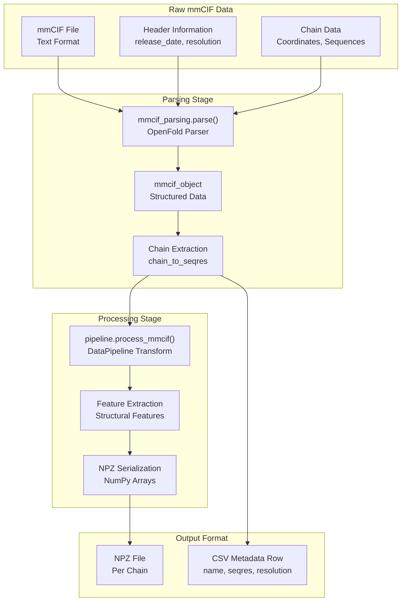
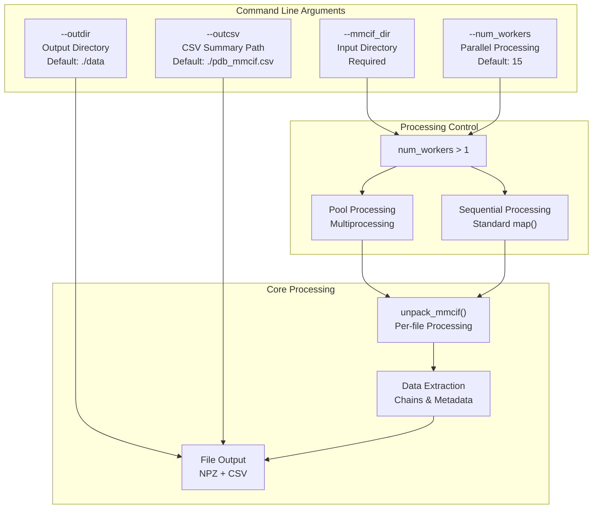
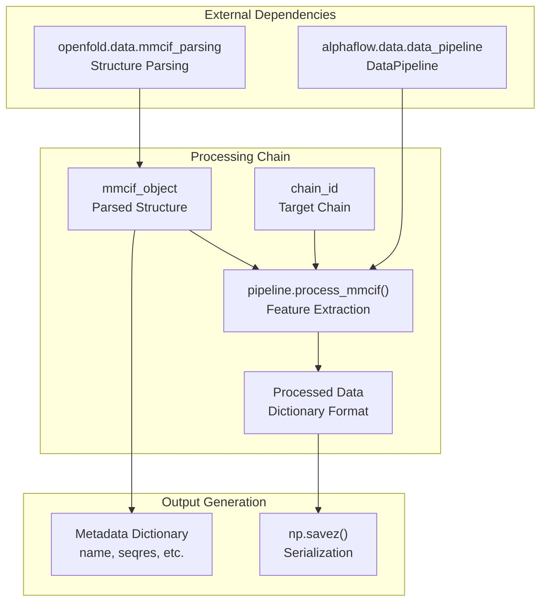

# mmCIF Processing

> **Relevant source files**
> * [scripts/unpack_mmcif.py](https://github.com/bjing2016/alphaflow/blob/02dc0376/scripts/unpack_mmcif.py)

This document covers the conversion of mmCIF (macromolecular Crystallographic Information File) structure files into processed NPZ format suitable for training AlphaFlow models. The mmCIF processing pipeline extracts protein structural data and metadata from PDB database files and transforms them into the standardized NumPy format used throughout the training pipeline.

For information about processing MD trajectory data, see [MD Trajectory Processing](/bjing2016/alphaflow/6.2-md-trajectory-processing). For details about MSA preparation, see [MSA Generation](/bjing2016/alphaflow/6.1-msa-generation).

## Processing Pipeline Overview

The mmCIF processing system is implemented in `unpack_mmcif.py` and serves as a critical data preprocessing step that converts raw crystallographic structure data into the format required by the AlphaFlow training system.

**Sources:** [scripts/unpack_mmcif.py L1-L73](https://github.com/bjing2016/alphaflow/blob/02dc0376/scripts/unpack_mmcif.py#L1-L73)

## Data Transformation Process

The core transformation converts mmCIF structural data through several stages, handling both the 3D coordinate data and associated metadata.

**Sources:** [scripts/unpack_mmcif.py L38-L70](https://github.com/bjing2016/alphaflow/blob/02dc0376/scripts/unpack_mmcif.py#L38-L70)

## File Organization Structure

The processing system maintains a hierarchical directory structure that mirrors PDB organization conventions for efficient data access and management.

| Component | Format | Example | Purpose |
| --- | --- | --- | --- |
| Input mmCIF | `{pdb_id}.cif` | `1abc.cif` | Raw structure file |
| Directory Structure | `{first_2_chars}/{pdb_id}.cif` | `1a/1abc.cif` | Organized input layout |
| Output NPZ | `{pdb_id}_{chain}.npz` | `1abc_A.npz` | Processed per-chain data |
| Output Directory | `{outdir}/{first_2_chars}/` | `./data/1a/` | Organized output layout |
| CSV Summary | `{outcsv}` | `pdb_mmcif.csv` | Metadata index |

The directory organization follows the pattern where files are grouped by the first two characters of their PDB ID, as implemented in the path construction logic.

**Sources:** [scripts/unpack_mmcif.py L39](https://github.com/bjing2016/alphaflow/blob/02dc0376/scripts/unpack_mmcif.py#L39-L39)

 [scripts/unpack_mmcif.py L64-L66](https://github.com/bjing2016/alphaflow/blob/02dc0376/scripts/unpack_mmcif.py#L64-L66)

## Processing Configuration

The `unpack_mmcif.py` script accepts several command-line parameters to control the processing behavior:

**Sources:** [scripts/unpack_mmcif.py L3-L8](https://github.com/bjing2016/alphaflow/blob/02dc0376/scripts/unpack_mmcif.py#L3-L8)

 [scripts/unpack_mmcif.py L23-L28](https://github.com/bjing2016/alphaflow/blob/02dc0376/scripts/unpack_mmcif.py#L23-L28)

## Data Pipeline Integration

The processing integrates with the broader AlphaFlow data pipeline through the `DataPipeline` class, which handles the core structural feature extraction.

The `DataPipeline` is initialized with `template_featurizer=None`, indicating this processing mode focuses on structure data extraction rather than template preparation.

**Sources:** [scripts/unpack_mmcif.py L14](https://github.com/bjing2016/alphaflow/blob/02dc0376/scripts/unpack_mmcif.py#L14-L14)

 [scripts/unpack_mmcif.py L17](https://github.com/bjing2016/alphaflow/blob/02dc0376/scripts/unpack_mmcif.py#L17-L17)

 [scripts/unpack_mmcif.py L63](https://github.com/bjing2016/alphaflow/blob/02dc0376/scripts/unpack_mmcif.py#L63-L63)

## Output Format and Metadata

Each processed mmCIF file generates multiple outputs corresponding to individual protein chains, along with comprehensive metadata tracking.

### NPZ File Contents

The NPZ files contain the processed structural features as generated by `DataPipeline.process_mmcif()`. The exact contents depend on the pipeline configuration but typically include coordinate arrays, atom masks, and other structural features required for training.

### CSV Metadata Schema

The summary CSV file contains the following fields for each processed chain:

| Field | Description | Source |
| --- | --- | --- |
| `name` | Chain identifier (`{pdb_id}_{chain}`) | Constructed ID |
| `release_date` | Structure release date | `mmcif.header["release_date"]` |
| `seqres` | Amino acid sequence | `mmcif.chain_to_seqres[chain]` |
| `resolution` | Experimental resolution | `mmcif.header["resolution"]` |

The CSV uses the `name` field as the index, providing a lookup table for accessing processed structures during training.

**Sources:** [scripts/unpack_mmcif.py L55-L61](https://github.com/bjing2016/alphaflow/blob/02dc0376/scripts/unpack_mmcif.py#L55-L61)

 [scripts/unpack_mmcif.py L35-L36](https://github.com/bjing2016/alphaflow/blob/02dc0376/scripts/unpack_mmcif.py#L35-L36)