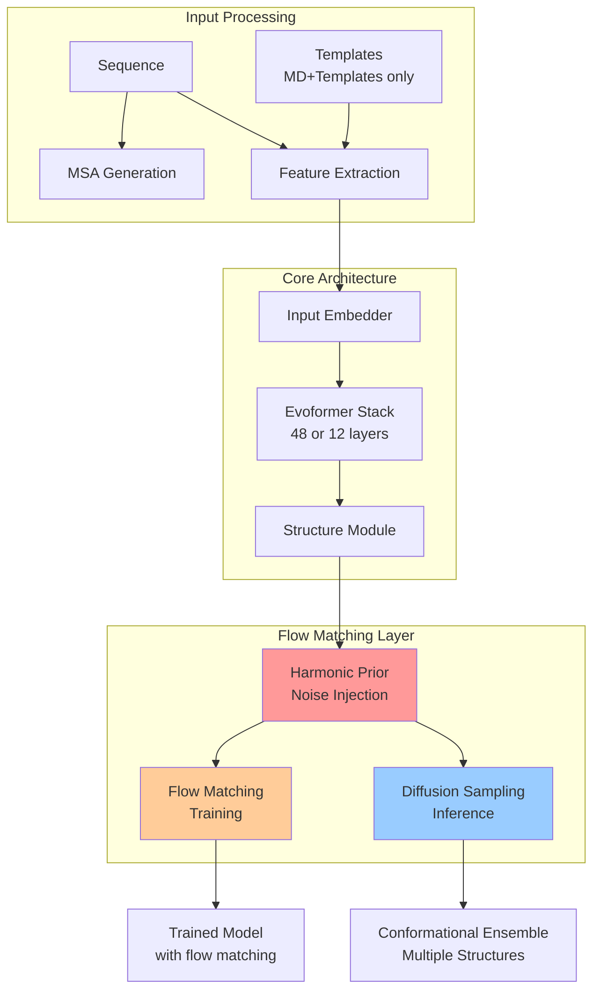

---
slug:1-overview
blog_type:normal
---


AlphaFlow 是一个创新的蛋白质结构预测系统，它扩展了 AlphaFold 的能力，能够生成**构象集合**——即代表蛋白质在不同条件下动态特性的多种蛋白质结构。传统的 AlphaFold 预测单一静态结构，而 AlphaFlow 利用流匹配目标来模拟蛋白质的柔性，从而生成与**实验条件**（X 射线晶体学、冷冻电镜）以及生理温度下的**分子动力学集合**相关的多样化结构状态。

来源：[README.md](README.md#L1-L15), [alphafold.py](alphaflow/model/alphafold.py#L37-L62)

## AlphaFlow 的独特之处

AlphaFlow 的核心创新在于将**流匹配**与经过验证的 AlphaFold 架构相结合。这种方法使模型能够学习蛋白质构象的分布，而不仅仅是预测单一的最佳结构。该系统可以为给定的蛋白质序列生成多个结构样本，每个样本代表蛋白质在不同条件下可能采用的一种合理构象。


上面的动画展示了 AlphaFlow 生成构象多样性的能力，展示了蛋白质在分子动力学模拟过程中可以探索的多种结构状态。

来源：[README.md](README.md#L16-L28), [diffusion.py](alphaflow/utils/diffusion.py#L1-L60)

## 系统架构

AlphaFlow 建立在 OpenFold 实现的 AlphaFold 2 之上，引入了几个关键修改以支持集合生成。该架构由三个主要组件组成，它们在一个统一的流程中协同工作。



流匹配层集成了一个**谐波先验**，它沿蛋白质链生成噪声，使模型能够学习如何去噪并恢复物理上合理的构象。在训练期间，模型学习如何预测从噪声状态到清洁结构的转换；而在推理期间，它可以通过从不同噪声级别采样来生成多种多样的构象。

来源：[wrapper.py](alphaflow/model/wrapper.py#L38-L52), [diffusion.py](alphaflow/utils/diffusion.py#L32-L48), [alphafold.py](alphaflow/model/alphafold.py#L56-L80)

## 项目结构

该仓库被组织成清晰的功能模块，支持训练和推理工作流程。

```
alphaflow/
├── config.py              # Model and training configurations
├── data/                  # Data processing and pipeline
│   ├── data_modules.py    # Dataset and data loader classes
│   ├── data_pipeline.py   # Feature extraction pipeline
│   ├── feature_pipeline.py # Feature engineering
│   ├── inference.py       # Inference data handling
│   └── input_pipeline.py  # Input preprocessing
├── model/                 # Neural network architectures
│   ├── alphafold.py       # AlphaFold-based model
│   ├── esmfold.py         # ESMFold-based model
│   ├── wrapper.py         # Lightning module wrapper
│   └── layers.py          # Custom neural network layers
└── utils/                 # Utility functions
    ├── diffusion.py       # Flow matching utilities
    ├── loss.py            # Loss functions
    └── protein.py         # Protein structure utilities
```

这种模块化设计允许轻松尝试不同的模型变体和训练策略，同时保持清晰的关注点分离。

来源：[data_modules.py](alphaflow/data/data_modules.py#L1-L30), [wrapper.py](alphaflow/model/wrapper.py#L1-L20), [config.py](alphaflow/config.py#L1-L30)

## 模型变体

AlphaFlow 提供两个模型家族，每个都针对不同场景进行了优化：**AlphaFlow**（基于 AlphaFold 2）和 **ESMFlow**（基于 ESMFold）。这两个家族都支持多种训练变体和配置。

| 模型家族 | 训练数据 | 使用场景 | 输入要求 |
|-------------|---------------|----------|-------------------|
| **AlphaFlow-PDB** | PDB 结构 | 不同条件下的实验集合 | 序列 + MSA |
| **AlphaFlow-MD** | 300K 下的 MD 轨迹 | 分子动力学集合 | 序列 + MSA |
| **AlphaFlow-MD+Templates** | MD 轨迹 + PDB 模板 | 带有参考结构的 MD 集合 | 序列 + MSA + 模板 |
| **ESMFlow-PDB** | PDB 结构 | 更快的实验集合 | 仅序列 |
| **ESMFlow-MD** | 300K 下的 MD 轨迹 | 更快的 MD 集合 | 仅序列 |
| **ESMFlow-MD+Templates** | MD 轨迹 + PDB 模板 | 带有参考的更快 MD 集合 | 序列 + 模板 |

<CgxTip>当有 MSA 数据可用时，选择 AlphaFlow 模型以获得最高精度。ESMFlow 模型提供 10-20 倍更快的推理速度，但可能会牺牲一些精度，特别是对于进化信息有限的序列。</CgxTip>

每个模型家族提供**三个版本**以平衡速度和精度：**base**（完整的 48 层 Evoformer）、**distilled**（更快，精度略有权衡）和 **12-layer**（比 base 快 2.5 倍，对于 MD+Templates 模型精度损失极小）。

来源：[README.md](README.md#L61-L105), [predict.py](predict.py#L10-L30), [train.py](train.py#L20-L30)

## 主要功能和特性

**构象集合生成**：与标准的结构预测不同，AlphaFlow 为每个蛋白质序列生成多种多样的结构。这是通过训练期间的流匹配目标实现的，该目标学习构象的分布而不是单一结构。在推理期间，你可以指定样本数（默认：10）和采样步数（默认：10）来控制多样性和质量。

**模板集成**：MD+Templates 模型接受参考 PDB 结构作为输入，允许模型围绕已知的起始结构生成集合。这对于探索实验确定结构周围的构象变化特别有用。

**灵活的噪声调度**：推理管道通过 `--tmax` 参数支持可自定义的噪声调度，从而能够控制多样性（较高的 tmax）和精度（较低的 tmax）之间的权衡。还可以启用自调节，通过迭代改进来提高样本质量。

**全面的训练管道**：该系统支持在 PDB 结构和分子动力学轨迹上进行训练，并提供数据预处理、MSA 生成和评估的脚本。训练管道集成了多种损失函数，包括 FAPE、扭转角损失和流匹配损失，以确保高质量的集合生成。

来源：[predict.py](predict.py#L31-L45), [train.py](train.py#L1-L50), [loss.py](alphaflow/utils/loss.py#L40-L65)

## 安装和快速开始

AlphaFlow 需要 Python 3.9 和支持 CUDA 11 的 PyTorch 1.12.1。安装过程包括设置 OpenFold 作为依赖项，它提供了 AlphaFlow 所基于的核心 AlphaFold 实现。

该仓库提供了两个主要入口点：`train.py` 用于训练新模型，`predict.py` 用于使用预训练权重运行推理。对于推理，你需要准备输入文件，包括序列（CSV 格式）、MSA（用于 AlphaFlow 模型）以及可选的模板（用于 MD+Templates 模型）。

来源：[README.md](README.md#L30-L60), [predict.py](predict.py#L1-L45), [train.py](train.py#L1-L30)

## 后续步骤

要开始使用 AlphaFlow：

1. **[快速开始](2-quick-start)** - 设置你的环境并运行你的第一次推理
2. **[AlphaFlow 与 ESMFlow 模型家族](3-alphaflow-vs-esmflow-model-families)** - 了解模型家族之间的差异并选择适合你需求的模型
3. **[模型版本：Base、Distilled 和 12 层配置](4-model-versions-base-distilled-and-12-layer-configurations)** - 了解不同模型变体之间的速度与精度权衡

为了更深入的技术理解：

4. **[与 AlphaFold 集成的流匹配目标](6-flow-matching-objective-integration-with-alphafold)** - 了解集合生成背后的核心创新
5. **[推理管道和采样过程](14-inference-pipeline-and-sampling-process)** - 学习如何在生成过程中控制多样性和质量
6. **[PDB 和 MD 数据集的训练管道](10-training-pipeline-for-pdb-and-md-datasets)** - 探索如何训练自定义 AlphaFlow 模型