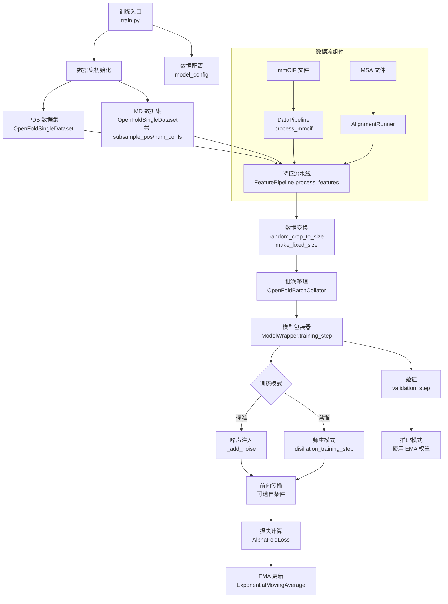

---
slug:10-training-pipeline-for-pdb-and-md-datasets
blog_type:normal
---


本文档详细介绍了 AlphaFlow 模型在 PDB（静态）和 MD（动态/分子动力学）数据集上的完整训练架构。该流程实现了一个复杂的流匹配目标，并与 AlphaFold 的结构预测架构集成，支持标准结构预测训练和带噪声注入的生成式训练。

## 流水线架构概述

训练流水线遵循模块化架构，在数据加载、特征处理、模型训练和优化组件之间实现了清晰的关注点分离。该系统支持两种主要数据模态的训练：包含静态实验结构的 **PDB 数据集**，以及包含来自分子动力学模拟的多个构象快照的 **MD 数据集**。



该流水线通过 **PyTorch Lightning** 框架（`trainer.py` L107-L123）运行，提供自动混合精度训练、梯度裁剪、检查点保存和分布式训练功能。训练循环由 `ModelWrapper` 类编排，该类实现了标准和蒸馏训练模式。

来源：[train.py](train.py#L1-L163), [alphaflow/model/wrapper.py](alphaflow/model/wrapper.py#L51-L175)

## 数据集配置和初始化

### 数据源配置

训练流水线从包含链元数据和训练参数配置的 CSV 文件指定的数据集开始。该系统支持 **PDB 数据集**（来自蛋白质数据库的实验结构）和 **MD 数据集**（来自分子动力学模拟的构象系综）。

```python
# PDB 训练的数据集初始化
trainset = OpenFoldSingleDataset(
    data_dir=args.train_data_dir,           # 包含 mmCIF/PDB 文件的目录
    alignment_dir=args.train_msa_dir,         # 预计算的 MSA 比对
    pdb_chains=pdb_chains,                   # 包含链元数据的 DataFrame
    config=data_cfg,
    mode='train',
    subsample_pos=args.sample_train_confs,  # 对于 MD：随机构象选择
    first_as_template=args.first_as_template,  # 使用第一个构象作为模板
)
```

对于 **MD 数据集**，流水线引入了两个关键参数来处理多个构象：

- **`subsample_pos`**：启用时（`True`），从每个训练样本的多个可用构象中随机采样单个构象（`data_modules.py` L178-L181）。这使模型能够从构象多样性中学习，同时保持恒定的输入维度。

- **`num_confs`**：指定每条链使用的固定构象数量，实现跨周期的确定性采样（`data_modules.py` L162-L163, L182-L183）。这对于可重现性很重要的验证特别有用。

来源：[train.py](train.py#L60-L68), [alphaflow/data/data_modules.py](alphaflow/data/data_modules.py#L160-L198)

### 随机数据过滤

AlphaFlow 实现了 **随机过滤**（stochastic filtering）以模仿 AlphaFold 的训练策略，该策略创建了一个加权采样方案，将训练分布偏向于多样化和具有代表性的结构。

过滤系统结合了 **硬确定性过滤器** 和 **软概率过滤器**：

**确定性过滤器**（`data_modules.py` L201-L221）：
- **分辨率截断**：排除分辨率差于 9.0 Å 的结构
- **序列组成**：拒绝任何单个氨基酸超过序列 80% 的链（同聚物过滤器）

**随机过滤器**（`data_modules.py` L224-L242）：
- **基于聚类的采样**：概率与聚类大小成反比（1/cluster_size），减少序列家族的过度代表性
- **基于长度的采样**：概率与 min(chain_length, 512) 成正比，在实际范围内偏向长序列

总体概率计算为各个随机过滤器概率的乘积，确保在多样化的蛋白质结构空间中进行高效采样。

来源：[alphaflow/data/data_modules.py](alphaflow/data/data_modules.py#L201-L242)

### 数据集包装

当启用随机过滤（`args.filter_chains`）时，基本的 `OpenFoldSingleDataset` 被包装在一个实现逐周期采样的 `OpenFoldDataset` 中（`train.py` L90）。此包装器创建一个 **固定周期长度** 的数据集（`train_epoch_len`，默认 50,000 个样本），根据计算的过滤器概率从底层数据集中随机采样，确保跨周期的训练工作量一致。

来源：[train.py](train.py#L89-L90), [alphaflow/data/data_modules.py](alphaflow/data/data_modules.py#L245-L321)

## 特征处理流水线

训练流水线通过多阶段特征提取和转换系统处理原始结构和序列数据。

### 原始特征提取

对于每个训练样本，流水线从预计算文件中提取原始特征：

```python
# 加载预计算的 mmCIF 特征（包括结构、MSA、模板）
path = f"{self.data_dir}/{name}.npz"
mmcif_feats = dict(np.load(path, allow_pickle=True))

# 如果启用了 first_as_template，则添加额外的模板信息
if self.first_as_template:
    extra_all_atom_positions = mmcif_feats['all_atom_positions'][0]
    mmcif_feats['extra_all_atom_positions'] = extra_all_atom_positions
```

原始特征包括：
- **原子坐标**：标准原子排序中所有原子的 3D 位置
- **序列信息**：氨基酸序列、残基索引
- **MSA 特征**：多序列比对谱和删除矩阵
- **模板信息**：启用模板时，来自相关蛋白质的结构模板
- **元数据**：链标识符、序列长度、实验分辨率

来源：[alphaflow/data/data_modules.py](alphaflow/data/data_modules.py#L167-L186)

### 特征变换

`FeaturePipeline` 应用一系列变换以准备模型输入的特征：

1. **基于配置的特征选择**：根据训练模式和配置，从完整集合中选择相关特征（`feature_pipeline.py` L51-L70）

2. **数据类型转换**：将 numpy 数组转换为 PyTorch 张量（`feature_pipeline.py` L30-L48）

3. **特定模式的处理**：应用训练时增强，包括：
   - **随机裁剪**：`random_crop_to_size` 将序列随机裁剪到训练窗口大小（默认 256 个残基），并正确处理模板裁剪（`input_pipeline.py` L26-L109）
   - **固定大小填充**：`make_fixed_size` 将序列填充到固定维度以进行批处理（`input_pipeline.py` L110-L144）
   - **MSA 子采样**：将 MSA 深度减少到训练限制（`max_extra_msa`，`max_msa_clusters`）
   - **模板子采样**：随机选择可用模板的子集

4. **FAPE 钳位配置**：在训练期间随机应用钳位的 FAPE 损失以提高定位精度（`feature_pipeline.py` L97-L104）

变换系统是高度可配置的，针对初始训练、微调和推理有不同的预设。

来源：[alphaflow/data/feature_pipeline.py](alphaflow/data/feature_pipeline.py#L73-L132), [alphaflow/data/input_pipeline.py](alphaflow/data/input_pipeline.py#L25-L144)

### 批次组合

`OpenFoldBatchCollator`（`data_modules.py` L336-L342）通过以下方式为模型训练准备批次：
- 将多个样本的特征整理为批次张量
- 应用批次级增强（模板掩码、额外 MSA 掩码）
- 通过适当的填充和掩码处理可变长度序列
- 添加批次属性（残基掩码、链掩码）以进行损失计算

整理器确保在需要时（例如，用于验证）批次组合是确定性的，而对于训练数据增强则是随机的。

来源：[alphaflow/data/data_modules.py](alphaflow/data/data_modules.py#L336-L342)

## 训练模式和目标

流水线支持针对不同数据类型和训练目标优化的多种训练模式。

### 标准训练模式

标准训练应用带有噪声注入的 **流匹配目标**（flow matching objective）进行生成式结构预测：

```python
def training_step(self, batch, batch_idx, stage='train'):
    # 1. 可选噪声注入
    if torch.rand(1, generator=self.generator).item() < self.args.noise_prob:
        self._add_noise(batch)  # 添加随机 t 的谐波先验噪声
    
    # 2. 可选额外模板输入
    if torch.rand(1, generator=self.generator).item() < self.args.extra_input_prob:
        pass  # 保留 extra_all_atom_positions
    else:
        del batch['extra_all_atom_positions']
    
    # 3. 可选自条件
    if torch.rand(1, generator=self.generator).item() < self.args.self_cond_prob:
        with torch.no_grad():
            outputs = self.model(batch)
    
    # 4. 主前向传播
    outputs = self.model(batch, prev_outputs=outputs)
    
    # 5. 损失计算
    loss, loss_breakdown = self.loss(outputs, batch, _return_breakdown=True)
    
    return loss
```

**噪声注入机制**（`wrapper.py` L52-L70）对流匹配至关重要：
1. 从 **谐波先验**（内部坐标上的高斯分布）中采样噪声
2. 在真实结构和噪声之间应用 **基于 SVD 的对齐**，以确保正确的空间关系
3. 均匀计算 **插值参数** t ∈ [0, 1]
4. 创建 **噪声结构**：`noisy_beta = (1-t) * ground_truth + t * noise`
5. 将 **噪声距离矩阵** 添加到批次中用于流匹配损失

来源：[alphaflow/model/wrapper.py](alphaflow/model/wrapper.py#L52-L175)

### 蒸馏训练模式

蒸馏训练使用多步去噪计划将知识从 **教师模型**（通常是 AlphaFold 或 ESMFold）转移到 **学生模型**（AlphaFlow）：

```python
def disillation_training_step(self, batch):
    schedule = np.linspace(1, 0, 11)  # 从 t=1 到 t=0 的 11 步计划
    
    # 通过去噪计划进行教师前向传播
    prev_outputs = None
    with torch.no_grad():
        for t, s in zip(schedule[:-1], schedule[1:]):
            output = self.teacher(batch, prev_outputs=prev_outputs)
            pseudo_beta = pseudo_beta_fn(batch['aatype'], output['final_atom_positions'], None)
            noisy = rmsdalign(pseudo_beta, noisy)
            noisy = (s / t) * noisy + (1 - s / t) * pseudo_beta
            batch['noised_pseudo_beta_dists'] = compute_distances(noisy)
            batch['t'] = s
            prev_outputs = output
    
    # 学生从教师生成的中间结构中学习
    student_output = self.model(orig_batch)
    loss = self.loss(student_output, orig_batch)
```

蒸馏过程创建了从噪声到结构的 **去噪轨迹**，学生模型学习预测沿此轨迹的中间结构。这使学生能够学习复杂的去噪行为，而无需对去噪过程进行显式监督。

来源：[alphaflow/model/wrapper.py](alphaflow/model/wrapper.py#L72-L124)

### 自条件

流水线实现了 **自条件**（self-conditioning）（训练期间的分类器自由指导），其中模型使用其自己的预测作为后续传递的条件：

```python
if torch.rand(1, generator=self.generator).item() < self.args.self_cond_prob:
    with torch.no_grad():
        outputs = self.model(batch)  # 无条件传递
outputs = self.model(batch, prev_outputs=outputs)  # 有条件传递
```

这通过使模型暴露于有条件和无条件生成场景来提高训练稳定性，防止坍缩到确定性输出。

来源：[alphaflow/model/wrapper.py](alphaflow/model/wrapper.py#L155-L160)

## 损失计算

训练流水线采用 **多组件损失函数**，结合了针对结构预测精度和物理合理性优化的几个目标。

### 损失组件

`AlphaFoldLoss` 类（`loss.py` L1522-L1538）聚合了以下组件：

| 损失组件 | 目的 | 权重（典型） |
|----------------|---------|------------------|
| **FAPE 损失** | 骨架和侧链位置的帧对齐点误差 | 1.0 |
| **扭转角损失** | χ 和骨架角的监督 | 0.1-0.5 |
| **距离图损失** | 残基间距离预测 | 0.1 |
| **违例损失** | 空间位阻和键几何违例 | 1.0 |
| **LDDT 损失** | 基于距离的置信度预测 | 0.01 |
| **TM 损失** | 模板建模分数预测（PTM 模式） | 0.1 |
| **掩码 MSA 损失** | MSA 重建（MSA 掩码语言模型） | 0.01 |

**FAPE（帧对齐点误差）** 损失是主要的结构监督，通过以下方式计算：
1. 将预测的帧与真实帧进行刚体对齐
2. 计算骨架和侧链原子的逐点误差
3. 将误差钳位到最大距离（通常为 10 Å）
4. 按残基和原子掩码加权

**流匹配损失** 通过噪声注入机制集成，其中模型学习预测来自谐波先验噪声的去噪方向。

来源：[alphaflow/utils/loss.py](alphaflow/utils/loss.py#L1522-L1618), [alphaflow/model/wrapper.py](alphaflow/model/wrapper.py#L162)

### 训练配置预设

流水线在 `config.py` 中为不同训练阶段提供了几个 **训练预设**：

| 预设 | 裁剪大小 | 最大额外 MSA | 模板 | 违例权重 | 用例 |
|--------|-----------|---------------|-----------|------------------|----------|
| **initial_training** | 256 | 1024 | 禁用 | 0.0 | 早期阶段训练 |
| **finetuning** | 384 | 5120 | 启用 | 1.0 | 优化阶段 |
| **finetuning_no_templ** | 384 | 5120 | 禁用 | 1.0 | 无模板优化 |
| **finetuning_ptm** | 384 | 5120 | 启用 | 1.0 | 启用 PTM 的优化 |

预设通过扩展序列长度、增加 MSA 深度和启用结构监督（违例损失）系统地增加了训练难度。

来源：[alphaflow/config.py](alphaflow/config.py#L59-L94)

## 优化和训练基础设施

### EMA（指数移动平均）

训练流水线维护 **指数移动平均** 权重以进行稳定推理：

```python
def on_before_zero_grad(self, *args, **kwargs):
    if not self.args.no_ema:
        self.ema.update(self.model)  # 在每个优化器步骤后更新 EMA

def load_ema_weights(self):
    # 缓存当前权重
    self.cached_weights = tensor_tree_map(clone_param, self.model.state_dict())
    # 加载 EMA 权重进行验证
    self.model.load_state_dict(self.ema.state_dict()["params"])
```

EMA 权重在验证期间使用并保存到检查点，与振荡的训练权重相比，提供更稳定的模型参数。

来源：[alphaflow/model/wrapper.py](alphaflow/model/wrapper.py#L235-L246), [alphaflow/model/wrapper.py](alphaflow/model/wrapper.py#L271-L275)

### 验证策略

流水线实现了两种验证模式：

**标准验证**（`normal_validate=True`）：
- 在验证数据上运行相同的训练步骤
- 计算验证集上的损失和指标
- 用于监控训练进度

**生成式验证**（`normal_validate=False`）：
- 对每个验证样本运行多次采样的推理（`val_samples`，通常 5-10 次）
- 计算将预测与参考结构进行比较的指标：
  - **参考指标**：相对于真实的 RMSD、GDT-TS、GDT-HA、TM-score
  - **自一致性指标**：来自同一序列的多个预测之间的多样性
- 使用 EMA 权重进行更稳定的预测

来源：[train.py](train.py#L69-L88), [alphaflow/model/wrapper.py](alphaflow/model/wrapper.py#L177-L228)

### 训练配置

通过命令行参数控制的关键训练参数：

| 参数 | 描述 | 默认/典型值 |
|-----------|-------------|----------------------|
| `batch_size` | 训练批次大小 | 1-4（取决于 GPU） |
| `epochs` | 训练周期数 | 100+ |
| `accumulate_grad_batches` | 梯度累积步数 | 1-8 |
| `grad_clip` | 梯度裁剪值 | 0.1-1.0 |
| `ckpt_freq` | 检查点频率（周期） | 1-5 |
| `val_freq` | 验证频率（周期） | 1-5 |
| `noise_prob` | 噪声注入概率 | 0.5-1.0 |
| `self_cond_prob` | 自条件概率 | 0.1-0.5 |
| `train_epoch_len` | 每周期样本数（随机过滤） | 50,000 |

来源：[train.py](train.py#L107-L123)

## MD 数据集特定注意事项

### 构象采样

由于每个蛋白质序列存在多个构象，MD 数据集需要特殊处理：

**随机子采样**（`subsample_pos=True`）：
```python
N = mmcif_feats['all_atom_positions'].shape[0]  # 构象数量
conf_idx = np.random.randint(0, N)  # 随机选择
mmcif_feats['all_atom_positions'] = mmcif_feats['all_atom_positions'][conf_idx]
```

这种方法使模型能够接触多样化的构象，同时保持计算效率。每个周期看到不同的构象，有效地增强了训练数据。

**固定子采样**（`num_confs=N`）：
```python
idx, conf_idx = idx // self.num_confs, idx % self.num_confs
mmcif_feats['all_atom_positions'] = mmcif_feats['all_atom_positions'][conf_idx]
```

确定性的选择对于验证和可重现的实验很有用。

来源：[alphaflow/data/data_modules.py](alphaflow/data/data_modules.py#L178-L183)

### MD 数据与模板集成

当将 MD 数据集与模板一起使用时（`first_as_template=True`），流水线使用第一个构象作为结构模板：

```python
if self.first_as_template:
    extra_all_atom_positions = mmcif_feats['all_atom_positions'][0]
    mmcif_feats['extra_all_atom_positions'] = extra_all_atom_positions
```

即使模板来自不同的构象状态，这也为模型提供了构象背景，提高了模型捕获构象灵活性的能力。

来源：[alphaflow/data/data_modules.py](alphaflow/data/data_modules.py#L174-L176)

## 训练工作流摘要

完整的训练工作流遵循以下顺序：

1. **初始化**：加载配置，初始化模型包装器，设置 EMA
2. **数据加载**：使用适当的随机过滤和构象采样创建数据集
3. **周期循环**：对于每个周期，根据过滤器概率采样 50,000 个训练样本
4. **批次处理**：对于每个批次：
   - 应用特征变换（裁剪、填充、掩码）
   - 以概率 `noise_prob` 注入谐波先验噪声
   - 以概率 `self_cond_prob` 进行可选自条件传递
   - 通过 AlphaFlow 模型前向传播
   - 计算多组件损失
   - 反向传播和优化器步骤
   - 更新 EMA 权重
5. **验证**：使用 EMA 权重进行定期评估，计算参考和多样性指标
6. **检查点保存**：以指定间隔保存模型权重、EMA 状态和优化器状态

来源：[train.py](train.py#L41-L160), [alphaflow/model/wrapper.py](alphaflow/model/wrapper.py#L126-L175)

## 后续步骤

要深入了解特定组件：

- **流匹配目标**：请参阅 [流匹配目标与 AlphaFold 的集成](6-flow-matching-objective-integration-with-alphafold) 以了解生成式训练目标的数学基础

- **损失函数**：请参阅 [损失函数：FAPE、扭转角损失和流匹配损失](12-loss-functions-fape-torsion-angle-loss-and-flow-matching-loss) 以详细分析每个损失组件

- **蒸馏过程**：请参阅 [蒸馏过程和师生训练](11-distillation-process-and-teacher-student-training) 以了解知识转移方法

- **数据预处理**：请参阅 [PDB 和 ATLAS 数据集的数据预处理](20-data-preprocessing-for-pdb-and-atlas-datasets) 以了解上游数据准备流水线

- **推理流水线**：请参阅 [推理流水线和采样过程](14-inference-pipeline-and-sampling-process) 以了解如何使用训练好的模型进行结构生成