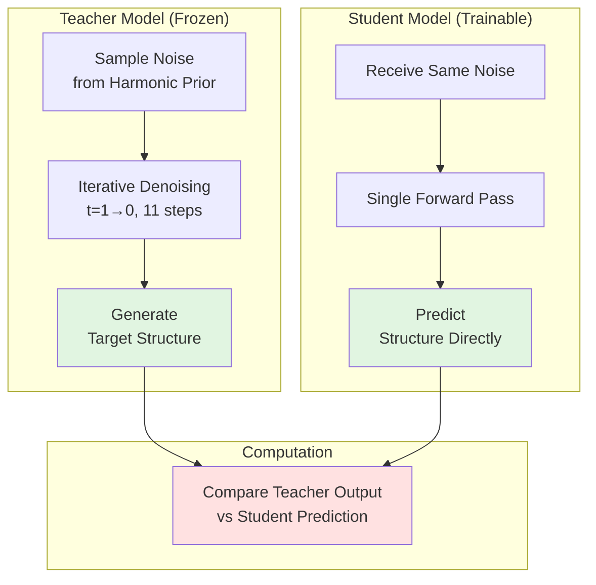
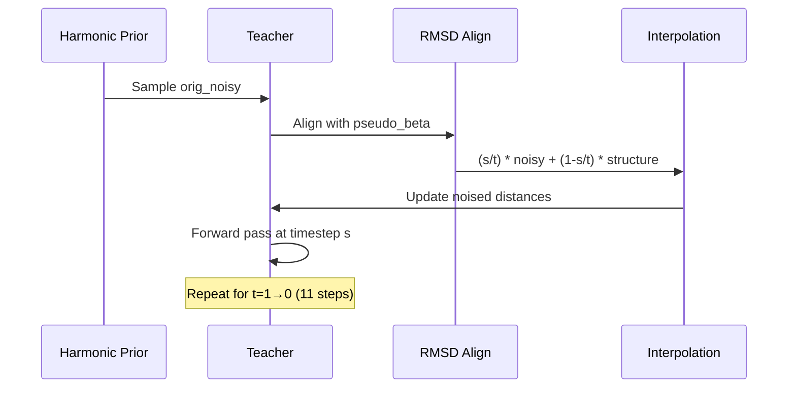

---
slug:11-distillation-process-and-teacher-student-training
blog_type:normal
---


AlphaFlow 中的蒸馏（Distillation）代表一种**知识转移机制**，它将迭代的流匹配去噪过程压缩为单步预测。这种方法以轻微的精度降低换取了显著的推理速度提升，使其在大规模集成生成和资源受限的部署场景中特别有价值。

## 蒸馏架构概述

蒸馏框架建立了一种师生关系，其中教师模型——一个拥有完整流匹配去噪链的完全训练好的 AlphaFlow——为学生模型生成训练信号，学生模型学习直接从初始噪声分布预测最终结构。



师生训练范式利用了**知识蒸馏**原则：教师的多步推理轨迹作为软目标，引导学生学习从噪声分布到结构空间的直接映射。
来源：[alphaflow/model/wrapper.py](alphaflow/model/wrapper.py#L72-L125), [alphaflow/model/wrapper.py](alphaflow/model/wrapper.py#L491-L515)

## 教师模型初始化

教师模型被实例化为完整的 AlphaFold 架构，配置与学生模型相同。当通过 `--distillation` 标志启用蒸馏时，`AlphaFoldWrapper` 会在主学生模型旁边创建一个独立的教师实例。

教师模型在整个训练过程中处于**评估模式**，禁用梯度计算以保留其预训练知识。这种设计确保教师作为一个稳定的参考点，防止学生通过梯度反馈破坏教师的权重。

```python
# Teacher initialization occurs when distillation is enabled
if args and 'distillation' in args.__dict__ and args.distillation:
    self.teacher = AlphaFold(config, extra_input=...)
```

教师在整个蒸馏过程中保持冻结状态，在学生试图通过单次前向传播逼近教师的多步去噪轨迹时，维持其预训练的流匹配能力。
来源：[alphaflow/model/wrapper.py](alphaflow/model/wrapper.py#L491-L515), [alphaflow/utils/parsing.py](alphaflow/utils/parsing.py#L49)

## 蒸馏训练循环

蒸馏训练步骤实现了一个**两阶段过程**：首先，教师通过迭代去噪生成目标结构；其次，学生尝试直接从初始噪声预测这些目标。

### 教师前向传播

教师接收一个批次，并在从 `t=1.0` 到 `t=0.0` 的 11 个时间步内执行完整的流匹配去噪过程。对于每个时间步转换 `(t, s)`：



教师通过当前噪声估计值与预测的 pseudo-beta 结构之间的**线性插值**逐步对结构进行去噪。在每个转换 `s/t` 处，算法计算：

```
noisy = (s/t) * noisy + (1 - s/t) * pseudo_beta
```

该公式逐步将表示从纯噪声（t=1）转移到最终结构（t=0），插值因子控制着噪声调度。
来源：[alphaflow/model/wrapper.py](alphaflow/model/wrapper.py#L72-L125)

### 学生训练步骤

一旦教师完成其去噪轨迹，学生接收原始噪声样本并尝试直接预测教师的最终输出。关键的设计选择是，学生处理的是与教师处理过的**相同的初始噪声**，确保了公平比较并使学生能够学习压缩映射。

学生的输入批次包含原始噪声特征：

```python
orig_batch['noised_pseudo_beta_dists'] = compute_distances(orig_noisy)
orig_batch['t'] = torch.ones(batch_dims, device=device)  # t=1.0 (initial noise)
```

学生执行单次前向传播，并通过标准的 AlphaFlow 损失函数接收反馈，该损失函数将其预测与教师生成的结构进行比较。
来源：[alphaflow/model/wrapper.py](alphaflow/model/wrapper.py#L72-L125), [alphaflow/utils/loss.py](alphaflow/utils/loss.py#L1522-L1538)

## 谐波先验和噪声采样

**HarmonicPrior** 类为教师和学生生成初始噪声分布。该先验实现了一个谐波链模型，即使在缺乏结构信息的情况下也能生成物理上合理的类似蛋白质的构象。

谐波先验构建了一个代表相邻残基之间弹簧连接的**三对角雅可比矩阵**：

```python
J = torch.zeros(N, N)
for i, j in zip(np.arange(N-1), np.arange(1, N)):
    J[i,i] += a
    J[j,j] += a
    J[i,j] = J[j,i] = -a
```

特征值分解 `J = P @ D @ P^T` 实现了高效采样：

```
sample = P @ (sqrt(D_inv) * random_normal)
```

该公式生成的噪声尊重蛋白质结构固有的**局部连通性**约束，与各向同性高斯噪声相比，为流匹配过程提供了更具信息量的起点。参数 `a = 3/(3.8^2)` 近似模拟了典型键距离处 C-alpha 原子之间的弹簧常数。
来源：[alphaflow/utils/diffusion.py](alphaflow/utils/diffusion.py#L40-L66)

## 用于结构比较的 RMSD 对齐

**rmsdalign** 函数实现了基于 Kabsch 算法的对齐，以实现教师和学生预测之间的有意义的比较。这至关重要，因为谐波先验以任意方向采样结构，需要在计算损失之前进行对齐。

对齐过程：

1. **中心化**：从两个结构中减去加权平均值
2. **SVD**：计算互协方差矩阵 `B = W @ A^T @ B` 的奇异值分解
3. **校正**：通过确保 `det(U @ V^T) ≥ 0` 来处理不当旋转
4. **变换**：应用旋转矩阵 `C = U @ V^T` 将结构 B 对齐到结构 A

在蒸馏期间，RMSD 对齐确保教师的去噪轨迹和学生的预测在**同一坐标系**中进行比较，使损失计算有意义。在更新噪声表示时，对齐应用于每个教师时间步：

```python
noisy = rmsdalign(pseudo_beta, noisy)
noisy = (s/t) * noisy + (1 - s/t) * pseudo_beta
```

来源：[alphaflow/utils/diffusion.py](alphaflow/utils/diffusion.py#L5-L31), [alphaflow/model/wrapper.py](alphaflow/model/wrapper.py#L84-L87)

## 自条件选项

蒸馏支持由 `--distill_self_cond` 标志控制的可选**自条件**模式。启用后，教师将其最终时间步的输出作为条件信息提供给学生。

启用自条件后：

```python
if self.args.distill_self_cond:
    prev_outputs = output  # Teacher's final outputs become student condition
```

这为学生提供了来自教师回收机制的**中间表示**（`m_1_prev`、`z_prev`、`x_prev`），可能帮助学生学会模仿教师的内部推理过程。自条件信息通过回收嵌入器传递并集成到学生的输入表示中。

如果没有自条件，学生必须纯粹从初始噪声学习解决去噪任务，这更具挑战性，但能产生更压缩的模型。
来源：[alphaflow/model/wrapper.py](alphaflow/model/wrapper.py#L88-L91), [alphaflow/model/alphafold.py](alphaflow/model/alphafold.py#L179-L197)

## 训练配置和性能权衡

### 模型变体和特征

| 模型类型 | 架构 | 训练模式 | 相对于基准的速度 | 相对于基准的精度 |
|------------|--------------|---------------|---------------|------------------|
| AlphaFlow-PDB Base | 48 Evoformer 层 | Flow matching | 1.0x | 1.0x |
| AlphaFlow-PDB Distilled | 48 Evoformer 层 | Distillation | 快约 3 倍 | 低约 2-5% |
| AlphaFlow-MD+Templates Base | 48 Evoformer 层 | Flow matching + Templates | 1.0x | 1.0x |
| AlphaFlow-MD+Templates 12l-Base | 12 Evoformer 层 | Flow matching + Templates | 快 2.5 倍 | 轻微损失 |
| AlphaFlow-MD+Templates 12l-Distilled | 12 Evoformer 层 | Distillation + Templates | 快约 7.5 倍 | 中等损失 |

蒸馏模型通过消除迭代去噪过程实现了显著的速度增益。在推理过程中，蒸馏模型通过单次前向传播预测最终结构，而基准模型需要多个时间步（通常为 10-20 步）才能获得相当的质量。

来源：[README.md](README.md#L23-L27), [README.md](README.md#L44-L66)

### 蒸馏的训练参数

蒸馏过程需要特定的训练配置调整：

**PDB 训练配置：**
```bash
python train.py --distillation --ckpt [BASE_MODEL_PATH] \
    --lr 5e-4 \
    --train_epoch_len 16000 \  # Shorter than base (40000)
    --train_data_dir [DIR] \
    --train_msa_dir [DIR] \
    --run_name distilled_pdb
```

**与基准训练的主要区别：**
- **移除梯度累积**：蒸馏通常不使用 `--accumulate_grad`
- **更短的训练周期**：从基准 PDB 训练的 40,000 减少到 16,000
- **忽略的概率**：`--self_cond_prob` 和 `--noise_prob` 被蒸馏逻辑覆盖
- **必需的检查点**：必须指定指向预训练教师模型的 `--ckpt`

较短的训练持续时间反映了这样一个事实：学生从高质量的教师目标中学习，而不是探索完整的去噪轨迹，这降低了训练复杂度。
来源：[README.md](README.md#L164-L167), [train.py](train.py#L21-L29)

## 损失计算和指标

在蒸馏训练期间，学生接收与标准 AlphaFlow 训练相同的**多组件损失**，该损失是针对教师的输出计算的：

```python
loss, loss_breakdown = self.loss(student_output, orig_batch, _return_breakdown=True)
```

损失分解通常包括：
- **FAPE loss**：骨架位置的框架对齐点误差
- **Sidechain loss**：侧链原子的旋转异构体和结构精度
- **Torsion angle loss**：二面角预测精度
- **Violation loss**：结构几何约束

此外，还计算验证指标以监控蒸馏质量：

```python
metrics = self._compute_validation_metrics(orig_batch, student_output, 
                                           superimposition_metrics=False)
```

这些指标包括 RMSD、GDT-TS 和其他结构相似性评分，是针对教师生成的结构而不是真实的 PDB 坐标计算的。
来源：[alphaflow/model/wrapper.py](alphaflow/model/wrapper.py#L119-L125), [alphaflow/utils/loss.py](alphaflow/utils/loss.py#L1522-L1538)

## 使用蒸馏模型进行推理

当使用蒸馏模型运行推理时，需要进行特定的配置更改以适应单步预测的性质：

```bash
python predict.py --mode alphafold \
    --input_csv [PATH] \
    --msa_dir [DIR] \
    --weights [DISTILLED_MODEL_PATH] \
    --samples [N] \
    --outpdb [DIR] \
    --noisy_first \      # Required for distilled models
    --no_diffusion       # Required for distilled models
```

`--noisy_first` 标志确保模型从初始噪声样本开始，而不是尝试迭代去噪，而 `--no_diffusion` 禁用采样循环。这些参数对于蒸馏模型的正确操作**至关重要**。

对于具有 12 层的蒸馏 MD+Templates 模型，可能会应用额外的性能调整：

```bash
--tmax 0.2 --steps 2
```

这截断了推理过程以提高精度，但牺牲了多样性，反映了压缩模型架构的不同权衡空间。
来源：[README.md](README.md#L97-L103), [predict.py](predict.py)

## 与训练管道的集成

蒸馏过程通过训练步骤路由逻辑无缝集成到更广泛的 AlphaFlow 训练管道中：

```python
def training_step(self, batch, batch_idx, stage='train'):
    # ... initialization code ...
    
    if self.args.distillation:
        return self.disillation_training_step(batch)
    
    # Standard flow matching training continues...
```

这种设计允许通过简单地切换 `--distillation` 标志在标准训练和蒸馏之间**无缝切换**，而所有其他训练组件（数据加载、日志记录、检查点保存）保持不变。蒸馏训练步骤自动处理师生协调、噪声采样和损失计算，而无需更改训练基础设施。

模块化架构支持渐进式蒸馏：模型可以使用流匹配进行训练，然后进行蒸馏以创建更快的变体，蒸馏模型可选地可以作为教师进行进一步压缩。
来源：[alphaflow/model/wrapper.py](alphaflow/model/wrapper.py#L126-L176)

<CgxTip>
蒸馏过程展示了生成建模中的一个基本权衡：将多步生成过程压缩为单次前向传播不可避免地会损失一些表达能力，但提供了巨大的计算优势。对于集成规模比单个预测精度更重要的高吞吐量应用，蒸馏模型提供了极好的价值。
</CgxTip>

## 后续步骤

- 继续阅读 [损失函数：FAPE、扭转角损失和流匹配损失](12-loss-functions-fape-torsion-angle-loss-and-flow-matching-loss)，以了解蒸馏期间使用的详细损失计算
- 查看 [推理管道和采样过程](14-inference-pipeline-and-sampling-process)，以比较蒸馏模型与基准模型的推理模式
- 探索 [模型版本：基准、蒸馏和 12 层配置](4-model-versions-base-distilled-and-12-layer-configurations)，以获取比较模型规范