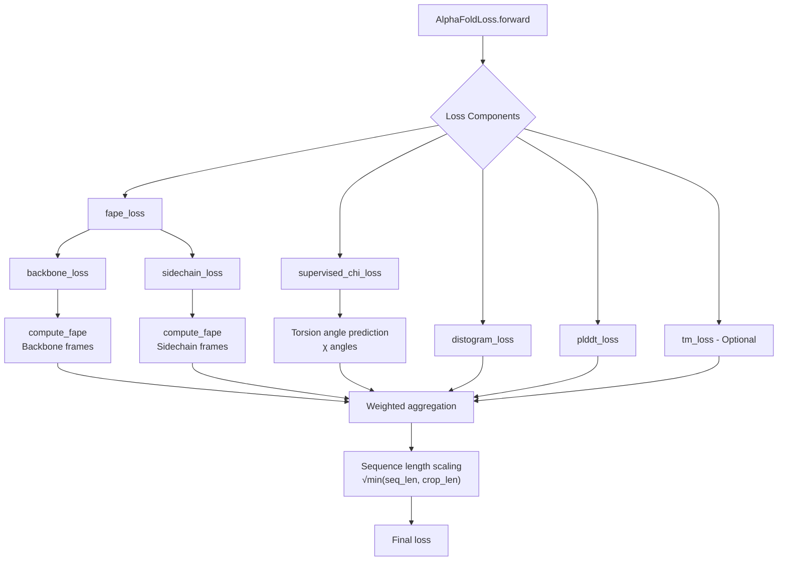
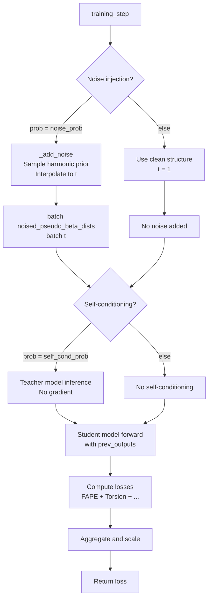

---
slug:12-loss-functions-fape-torsion-angle-loss-and-flow-matching-loss
blog_type:normal
---


本页面将探讨 AlphaFlow 的损失函数架构，该架构结合了 AlphaFold 2 的结构预测损失与条件流匹配训练策略。该框架整合了 FAPE（帧对齐点误差）以确保结构准确性，使用二面角损失保证双面体几何精度，并通过训练期间的条件噪声注入实现流匹配原则。

## 损失函数架构概述

AlphaFlow 采用了一种多组件损失函数，它在扩展 AlphaFold 2 原始损失的同时，集成了基于流的生成训练。主要的损失组件作用于蛋白质结构的不同方面：

- **FAPE 损失**：使用刚性帧变换测量主链和侧链的结构对齐情况
- **扭转角损失**：监督 χ 角预测以确保侧链旋转异构体准确性
- **流匹配**：通过条件噪声注入实现，而非使用单独的损失函数

`AlphaFoldLoss` 类通过 `alphaflow/utils/loss.py` [1522-1618](alphaflow/utils/loss.py#L1522-L1618) 中的加权聚合方案来协调这些组件。每个损失组件独立计算，按可配置权重缩放，并组合成最终目标。



来源：[loss.py](alphaflow/utils/loss.py#L1522-L1618), [loss.py](alphaflow/utils/loss.py#L260-L285)

## FAPE 损失：帧对齐点误差

FAPE 损失是 AlphaFlow 中的主要结构目标，它通过不变坐标系评估预测蛋白质结构的准确性。该损失通过在局部定义的参考坐标系内比较预测结构和目标结构来运行，从而确保旋转和平移不变性。

### 数学基础

FAPE 计算首先建立预测帧与目标帧之间的对齐。`compute_fape` 函数实现了这一变换 [78-151](alphaflow/utils/loss.py#L78-L151)：

```python
def compute_fape(
    pred_frames: Rigid,
    target_frames: Rigid,
    frames_mask: torch.Tensor,
    pred_positions: torch.Tensor,
    target_positions: torch.Tensor,
    positions_mask: torch.Tensor,
    length_scale: float,
    l1_clamp_distance: Optional[float] = None,
    eps=1e-8,
) -> torch.Tensor:
```

该变换通过刚体变换将位置从预测帧映射到目标帧。该实现计算变换后位置之间的 L1 距离，并应用可选的截断以防止离群值主导。

### 主链 FAPE 组件

`backbone_loss` 函数将 FAPE 应用于主链结构 [152-188](alphaflow/utils/loss.py#L152-L188)：

```python
pred_aff = Rigid.from_tensor_7(traj)
pred_aff = Rigid(
    Rotation(rot_mats=pred_aff.get_rots().get_rot_mats(), quats=None),
    pred_aff.get_trans(),
)

gt_aff = Rigid.from_tensor_4x4(backbone_rigid_tensor)

fape_loss = compute_fape(
    pred_aff,
    gt_aff[None],
    backbone_rigid_mask[None],
    pred_aff.get_trans(),
    gt_aff[None].get_trans(),
    backbone_rigid_mask[None],
    l1_clamp_distance=clamp_distance,
    length_scale=loss_unit_distance,
    eps=eps,
)
```

值得注意的是，该实现包含了一个数值稳定性考虑：它直接使用旋转矩阵，而不是像原始 AlphaFold 实现那样将旋转矩阵转换为四元数再转换回来，从而避免了重复变换可能带来的数值不稳定性 [158-162](alphaflow/utils/loss.py#L158-L162)。

### 侧链 FAPE 组件

侧链结构通过 `sidechain_loss` 进行评估 [210-258](alphaflow/utils/loss.py#L210-L258)，该函数处理模糊侧链原子的一级和替代命名约定。该函数使用由 `compute_renamed_ground_truth` [1357-1464](alphaflow/utils/loss.py#L1357-L1464) 计算的重命名真实位置来处理对称侧链（例如，芳香环翻转）。

侧链损失整合了来自多个来源的信息：

- **侧链帧**：侧链坐标系的刚体变换
- **刚性组**：模糊原子的替代帧配置
- **Atom14 位置**：14 原子表示中的全原子位置
- **Alt 命名**：指示替代命名约定的布尔标志

### 截断策略

FAPE 损失实现支持截断距离（默认 10.0Å），以防止大的离群值主导梯度。`backbone_loss` 函数可选地通过 `use_clamped_fape` 参数 [172-180](alphaflow/utils/loss.py#L172-L180) 使用动态截断策略，混合截断和未截断的 FAPE 计算：

```python
fape_loss = fape_loss * use_clamped_fape + unclamped_fape_loss * (
    1 - use_clamped_fape
)
```

这种自适应方法允许模型在不同的训练阶段从鲁棒性（截断）和敏感性（未截断）中受益。

来源：[loss.py](alphaflow/utils/loss.py#L78-L151), [loss.py](alphaflow/utils/loss.py#L152-L188), [loss.py](alphaflow/utils/loss.py#L210-L258)

## 扭转角损失：χ 角监督

扭转角损失对侧链旋转异构体几何提供直接监督，用角度约束补充基于位置的 FAPE 损失。`supervised_chi_loss` 函数实现了 AlphaFold 2 的算法 27 用于扭转角损失 [285-370](alphaflow/utils/loss.py#L285-L370)。

### 实现结构

该函数处理具有以下签名的预测角度：

```python
def supervised_chi_loss(
    angles_sin_cos: torch.Tensor,              # [*, N, 7, 2] predicted angles
    unnormalized_angles_sin_cos: torch.Tensor, # Unnormalized version
    aatype: torch.Tensor,                     # [*, N] residue indices
    seq_mask: torch.Tensor,                   # [*, N] sequence mask
    chi_mask: torch.Tensor,                   # [*, N, 7] angle mask
    chi_angles_sin_cos: torch.Tensor,         # [*, N, 7, 2] ground truth
    chi_weight: float,                        # Weight for angle component
    angle_norm_weight: float,                 # Weight for normalization
    eps=1e-6,
    **kwargs,
) -> torch.Tensor:
```

角度预测被分为主链角度（phi, psi, omega）和侧链 χ 角 [285-309](alphaflow/utils/loss.py#L285-L309)。损失计算两个组件：

1. **角度偏差损失**：测量预测值与真实值的 sin/cos 表示之间的 L1 距离
2. **归一化损失**：鼓励预测角度在 sin/cos 表示中具有单位幅度

### 周期性处理

损失通过 sin/cos 角度表示处理周期性，确保角度差在 2π 边界处正确回绕。这对于 0° 和 360° 代表等效构象的扭转角至关重要。

该函数还通过 `aatype` 独热编码考虑残基特异性特征，允许根据每种氨基酸类型定义的 χ 角进行逐残基掩码 [298-304](alphaflow/utils/loss.py#L298-L304)。

来源：[loss.py](alphaflow/utils/loss.py#L285-L370)

## 流匹配集成

AlphaFlow 通过训练期间的条件噪声注入实现流匹配原则，而不是通过单独的损失组件。这种方法使模型能够学习从谐先验分布到天然蛋白质结构的轨迹。

### 谐先验

流匹配框架始于 `alphaflow/utils/diffusion.py` [40-57](alphaflow/utils/diffusion.py#L40-L57) 中定义的谐先验：

```python
class HarmonicPrior:
    def __init__(self, N = 256, a =3/(3.8**2)):
        self.N = N
        self.a = a
        self.bins = torch.linspace(0, torch.pi, N + 1)
        cbins = (self.bins[1:] + self.bins[:-1]) / 2
        self.probs = a * torch.sin(cbins)
        self.probs = self.probs / self.probs.sum()
```

谐先验表示基于几何约束的残基间距离的简单分布，参数 `a = 3/(3.8²)` 反映了典型的蛋白质键几何结构。

### 条件噪声注入

`ModelWrapper._add_noise` 方法实现了流匹配训练策略 [52-68](alphaflow/model/wrapper.py#L52-L68)：

```python
def _add_noise(self, batch):
    device = batch['aatype'].device
    batch_dims = batch['seq_length'].shape
    
    noisy = self.harmonic_prior.sample(batch_dims)
    try:
        noisy = rmsdalign(batch['pseudo_beta'], noisy, 
                         weights=batch['pseudo_beta_mask']).detach()
    except:
        logger.warning('SVD failed to converge!')
        batch['t'] = torch.ones(batch_dims, device=device)
        return
    
    t = torch.rand(batch_dims, device=device)
    noisy_beta = (1 - t[:,None,None]) * batch['pseudo_beta'] + \
                 t[:,None,None] * noisy
    
    pseudo_beta_dists = torch.sum(
        (noisy_beta.unsqueeze(-2) - noisy_beta.unsqueeze(-3)) ** 2, 
        dim=-1)**0.5
    batch['noised_pseudo_beta_dists'] = pseudo_beta_dists
    batch['t'] = t
```

训练过程使用由 `noise_prob` 控制的概率沿流轨迹采样中间结构。流使用时间参数 `t ∈ [0, 1]` 在真实结构和谐先验样本之间进行插值，其中 t=0 对应于天然结构，t=1 对应于先验分布。

<CgxTip>
使用 Kabsch 算法的 RMSD 对齐步骤确保以旋转不变的方式添加噪声。这种对齐防止模型学习虚假的旋转依赖性，而这种依赖性无法推广到新的蛋白质方向。
</cgtip>

### 训练集成

在训练期间，模型基于噪声输入有条件地生成结构。`ModelWrapper.training_step` 中的训练步骤将流匹配与标准监督损失集成 [126-165](alphaflow/model/wrapper.py#L126-L165)：

```python
if torch.rand(1, generator=self.generator).item() < self.args.noise_prob:
    self._add_noise(batch)
    self.log('time', [batch['t'].mean().item()])
else:
    self.log('time', [1])

# ... (self-conditioning logic) ...

outputs = self.model(batch, prev_outputs=outputs)
loss, loss_breakdown = self.loss(outputs, batch, _return_breakdown=True)
```

模型在流匹配训练迭代期间接收噪声距离信息 (`noised_pseudo_beta_dists`) 和时间信息 (`t`)，学习将结构去噪至天然构象。

来源：[diffusion.py](alphaflow/utils/diffusion.py#L40-L57), [wrapper.py](alphaflow/model/wrapper.py#L52-L68), [wrapper.py](alphaflow/model/wrapper.py#L126-L165)

## 损失聚合与缩放

`AlphaFoldLoss.forward` 方法实现了基于序列长度的最终损失聚合和缩放 [1529-1580](alphaflow/utils/loss.py#L1529-L1580)：

```python
loss_fns = {
    "distogram": lambda: distogram_loss(...),
    "fape": lambda: fape_loss(out, batch, self.config.fape) ** 2,
    "supervised_chi": lambda: supervised_chi_loss(...),
    # ... (other losses)
}

cum_loss = 0.
for loss_name, loss_fn in loss_fns.items():
    weight = self.config[loss_name].weight
    loss = loss_fn()
    if(torch.isnan(loss) or torch.isinf(loss)):
        logging.warning(f"{loss_name} loss is NaN. Skipping...")
        loss = loss.new_tensor(0., requires_grad=True)
    cum_loss = cum_loss + weight * loss

# Scale by sequence length
seq_len = torch.mean(batch["seq_length"].float())
crop_len = batch["aatype"].shape[-1]
cum_loss = cum_loss * torch.sqrt(min(seq_len, crop_len))
```

### 损失组件权重

`alphaflow/config.py` 中的配置系统定义了每个损失组件的默认权重。损失聚合包括：

- **FAPE 损失**：平方和加权（默认权重可配置）
- **监督 χ 损失**：直接扭转角监督
- **Distogram 损失**：残基间距离预测（辅助损失）
- **pLDDT 损失**：置信度预测监督
- **TM 损失**：可选的模板建模损失（为 PTM 模型启用）

<CgxTip>
序列长度缩放因子 (√min(seq_len, crop_len)) 确保对不同长度的蛋白质进行公平比较。这种归一化防止在使用可变裁剪大小的混合批次训练中，较长序列主导损失。
</cg-tip>

### NaN 处理

该实现包括强大的 NaN 处理，以防止个别损失组件中的数值问题导致训练不稳定 [1558-1562](alphaflow/utils/loss.py#L1558-L1562)。当损失组件产生 NaN 或 Inf 值时，它被替换为保持梯度流的零张量，允许训练继续进行，同时记录问题以便调试。

来源：[loss.py](alphaflow/utils/loss.py#L1529-L1580), [config.py](alphaflow/config.py#L100-L250)

## 训练流程集成

`ModelWrapper.training_step` 中的完整训练循环将流匹配与标准监督损失集成 [126-165](alphaflow/model/wrapper.py#L126-L165)：



### 自条件化

AlphaFlow 在训练期间可选地采用自条件化 [146-148](alphaflow/model/wrapper.py#L146-L148)，其中模型自身的预测（教师输出）条件化后续的学生预测。这种类似分类器自由指导的条件化实现通过允许自一致性检查来提高推理期间的模型性能。

### 训练模式变化

系统通过 `config.py` 中的 `model_config` 函数支持多种训练配置：

- **初始训练**：没有结构违规的基础配置
- **微调**：减少的 MSA 大小，启用违规损失
- **PTM 变体**：添加的模板建模头和损失
- **无模板变体**：为消融研究禁用模板集成

每个配置根据 AlphaFold 2 补充表 4 的规范修改损失权重和超参数。

来源：[wrapper.py](alphaflow/model/wrapper.py#L126-L165), [config.py](alphaflow/config.py#L21-L100)

## 总结

AlphaFlow 的损失函数架构结合了成熟的结构预测损失（FAPE、扭转角）与现代流匹配原则。FAPE 损失提供主链和侧链结构监督，扭转角损失确保旋转异构体准确性，而通过条件噪声注入实现的流匹配使模型能够学习从简单先验到天然结构的生成轨迹。这种混合方法利用了监督和生成训练范式的优势。

有关针对不同训练场景配置这些损失的实际实现细节，请参阅 [PDB 和 MD 数据集的训练流程](10-training-pipeline-for-pdb-and-md-datasets)。有关基于此流匹配基础的推理采样和计划调度的信息，请参阅 [推理流程和采样过程](14-inference-pipeline-and-sampling-process) 和 [针对多样性与精度权衡的调度调整](16-schedule-tuning-for-diversity-vs-precision-trade-off)。