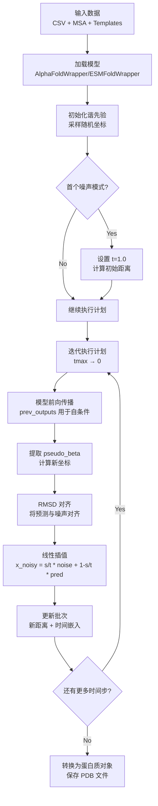
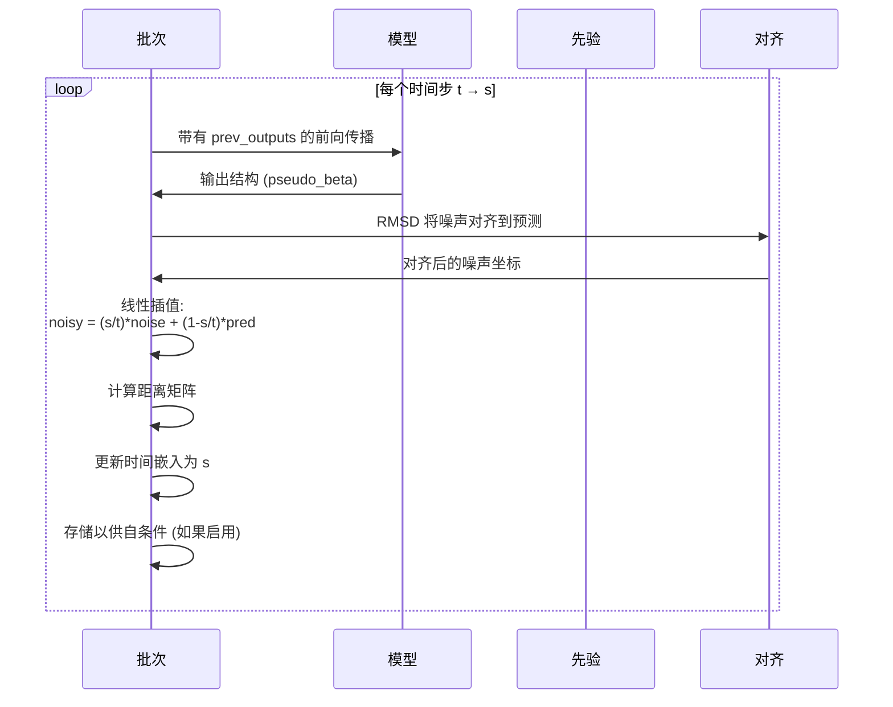

---
slug:14-inference-pipeline-and-sampling-process
blog_type:normal
---


推理管道通过迭代流匹配过程，将初始噪声分布转化为蛋白质结构。本指南解释了从输入准备到结构生成的完整采样工作流程，涵盖了谐先验初始化、去噪计划以及能够实现多样化且准确的蛋白质结构预测的自条件机制。

## 管道概述

推理过程遵循确定性时间步轨迹，逐步将噪声坐标精炼为类似蛋白质的结构。该管道协调多个组件：谐先验采样、通过 AlphaFold 主干网络进行迭代去噪、可选的自条件，以及每个步骤的结构对齐。



管道入口点是 `predict.py`，它处理包含蛋白质目标的输入序列或 CSV 文件，并使用可配置的采样计划为每个目标生成多个结构样本 [predict.py](predict.py#L60-L132)。

## 输入数据准备

推理管道通过包含蛋白质序列或 PDB 标识符的 CSV 文件接受输入。系统从指定目录加载预计算的 MSA 和可选模板，为模型创建批次输入。

来源：[predict.py](predict.py#L62-L70)

两个数据集类处理不同的模型架构：

- **AlphaFoldCSVDataset**：专为具有完整 AlphaFold 风格输入的 AlphaFlow 模型设计
- **CSVDataset**：专为具有简化输入要求的 ESMFlow 模型配置

这两个数据集共享一个通用接口用于加载序列、MSA 和模板特征，确保跨模型变体的一致预处理 [alphaflow/data/inference.py](alphaflow/data/inference.py#L17-L91)。

## 谐先验和噪声初始化

推理过程从谐先验分布采样开始，该分布提供了尊重蛋白质链连接性的物理上合理的起始坐标。`HarmonicPrior` 类实现了一个弹簧-质量系统模型，其中相邻残基通过平衡间距为 3.8Å 的谐振弹簧连接。

```python
class HarmonicPrior:
    def __init__(self, N=256, a=3/(3.8**2)):
        # 构造具有最近邻弹簧的耦合矩阵 J
        J = torch.zeros(N, N)
        for i, j in zip(np.arange(N-1), np.arange(1, N)):
            J[i,i] += a
            J[j,j] += a
            J[i,j] = J[j,i] = -a
        # 用于采样的特征值分解
        D, P = torch.linalg.eigh(J)
```

来源：[alphaflow/utils/diffusion.py](alphaflow/utils/diffusion.py#L40-L51)

采样过程在耦合矩阵的特征基中生成高斯噪声，然后变换回坐标空间。这确保了随机起点具有天然的类似蛋白质的构象，而不是完全随机的噪声：

```python
def sample(self, batch_dims=()):
    return self.P @ (torch.sqrt(self.D_inv)[:,None] * 
                     torch.randn(*batch_dims, self.N, 3))
```

来源：[alphaflow/utils/diffusion.py](alphaflow/utils/diffusion.py#L57-L58)

在推理期间，根据序列长度实例化谐先验并进行采样以生成初始噪声坐标 [alphaflow/model/wrapper.py](alphaflow/model/wrapper.py#L354-L356)。

## 采样计划配置

去噪过程遵循从最大噪声 (tmax) 到干净结构 (t=0) 的线性计划。每个计划步骤代表一个流匹配时间步，其中模型预测指向更干净结构的方向。

### 计划参数

| 参数 | 描述 | 默认值 | 影响 |
|-----------|-------------|---------|--------|
| `--steps` | 去噪步数 | 10 | 更多步骤 = 更高质量，推理更慢 |
| `--tmax` | 最大噪声水平 | 1.0 | 较高值需要更多步骤才能收敛 |
| `--schedule` | 自定义时间步数组 | `[1.0, 0.75, 0.5, 0.25, 0.1, 0]` | 非线性计划可以平衡速度/质量 |

来源：[predict.py](predict.py#L8-L9), [predict.py](predict.py#L47-L49), [alphaflow/model/wrapper.py](alphaflow/model/wrapper.py#L369-L371)

计划构造如下：

```python
schedule = np.linspace(args.tmax, 0, args.steps+1)
if args.tmax != 1.0:
    schedule = np.array([1.0] + list(schedule))  # 包含纯噪声起始
```

每次迭代处理一个时间步 `t`（当前噪声水平）和 `s`（目标噪声水平），根据比率 `s/t` 在噪声和模型预测之间进行插值。

## 迭代去噪循环

核心推理循环遍历计划，通过模型预测和坐标混合逐步精炼坐标：



来源：[alphaflow/model/wrapper.py](alphaflow/model/wrapper.py#L373-L383)

### 步骤 1：模型前向传播

模型处理批次，可选择使用先前时间步的自条件：

```python
output = self.model(batch, prev_outputs=prev_outputs)
```

AlphaFold 模型将噪声距离矩阵整合到成对表示中：

```python
if 'noised_pseudo_beta_dists' in batch:
    inp_z = self._get_input_pair_embeddings(
        batch['noised_pseudo_beta_dists'], 
        batch['pseudo_beta_mask'],
    )
    inp_z = inp_z + self.input_time_embedding(
        self.input_time_projection(batch['t'])
    )[:,None,None]
z = add(z, inp_z, inplace=inplace_safe)
```

来源：[alphaflow/model/alphafold.py](alphaflow/model/alphafold.py#L220-L235)

时间嵌入允许模型在去噪过程中区分不同的噪声水平。

### 步骤 2：坐标提取与对齐

模型输出原子位置，从中提取 Cα/Cβ 伪 beta 坐标用于下一次迭代：

```python
pseudo_beta = pseudo_beta_fn(batch['aatype'], 
                             output['final_atom_positions'], None)
```

使用 Kabsch 算法将噪声坐标与预测结构对齐：

```python
noisy = rmsdalign(pseudo_beta, noisy)
```

来源：[alphaflow/model/wrapper.py](alphaflow/model/wrapper.py#L375-L377)

`rmsdalign` 函数计算最佳旋转矩阵以最小化两个坐标集之间的 RMSD [alphaflow/utils/diffusion.py](alphaflow/utils/diffusion.py#L5-L28)。

### 步骤 3：线性插值 (流匹配步骤)

核心流匹配操作根据计划比率在对齐的噪声和模型预测之间进行插值：

```python
noisy = (s / t) * noisy + (1 - s / t) * pseudo_beta
```

这实现了条件流路径，其中在每个时间步，坐标向更干净的预测移动。比率 `s/t` 决定了保留多少噪声先验与融入多少模型预测。

<CgxTip>
插值公式遵循整流流 (RF) 公式，其中从噪声到数据的轨迹是线性的。这等同于使用最优传输路径的流匹配，确保推理期间的高效收敛。插值前的对齐步骤至关重要——它确保混合发生在一致的参考系中，防止模型在旋转不变性学习上浪费容量。
</CgxTip>

### 步骤 4：批次更新与自条件

插值坐标被转换回距离矩阵，并更新时间嵌入：

```python
batch['noised_pseudo_beta_dists'] = torch.sum(
    (noisy.unsqueeze(-2) - noisy.unsqueeze(-3)) ** 2, dim=-1
)**0.5
batch['t'] = torch.ones(1, device=noisy.device) * s
```

来源：[alphaflow/model/wrapper.py](alphaflow/model/wrapper.py#L379-L380)

如果启用了自条件，当前模型输出将存储以供下一个时间步使用：

```python
if self_cond:
    prev_outputs = output
```

来源：[alphaflow/model/wrapper.py](alphaflow/model/wrapper.py#L381-L382)

## 自条件机制

自条件允许模型访问其来自先前时间步的预测，创建一个反馈循环，从而提高结构一致性和准确性。

### 实现

AlphaFold 模型通过回收嵌入器接收先前时间步的输出 (`m_1_prev`, `z_prev`, `x_prev`)：

```python
m_1_prev, z_prev, x_prev = prev_outputs['m_1_prev'], 
                           prev_outputs['z_prev'], 
                           prev_outputs['x_prev']
m_1_prev_emb, z_prev_emb = self.recycling_embedder(
    m_1_prev, z_prev, x_prev, inplace_safe=inplace_safe,
)
m[..., 0, :, :] += m_1_prev_emb
z = add(z, z_prev_emb, inplace=inplace_safe)
```

来源：[alphaflow/model/alphafold.py](alphaflow/model/alphafold.py#L196-L216)

这些嵌入为模型提供关于以下方面的信息：
- **m_1_prev**：序列位置上的先前 MSA 表示
- **z_prev**：先前的成对表示
- **x_prev**：先前的坐标预测（转换为 pseudo_beta 距离）

### 对采样的影响

| 配置 | 描述 | 用例 |
|--------------|-------------|----------|
| `--self_cond` (默认) | 使用先前时间步的预测 | 用于最佳质量的标准推理 |
| `--no_self_cond` | 禁用自条件 | 更快的推理，质量略低 |
| `--noisy_first` | 在 t=1.0 时使用完整噪声初始化 | 更适合探索构象多样性 |

来源：[predict.py](predict.py#L18-L19), [alphaflow/model/wrapper.py](alphaflow/model/wrapper.py#L358-L361)

自条件对于在时间步之间维持全局折叠一致性特别重要，因为它允许后期的去噪步骤纠正早期步骤引入的局部误差。

## 特殊推理模式

### 无扩散模式

`--no_diffusion` 标志完全绕过采样过程，运行没有任何噪声的单次前向传播：

```python
if no_diffusion:
    output = self.model(batch)
    if as_protein:
        return protein.output_to_protein({**output, **batch})
```

来源：[alphaflow/model/wrapper.py](alphaflow/model/wrapper.py#L362-L367)

此模式适用于：
- 测试模型前向传播
- 将流匹配输出与标准 AlphaFold 预测进行比较
- 在没有采样复杂性的情况下调试管道问题

### 噪声优先模式

`--noisy_first` 标志在第一次去噪步骤之前使用最大噪声 (t=1.0) 初始化批次：

```python
if noisy_first:
    batch['noised_pseudo_beta_dists'] = torch.sum(
        (noisy.unsqueeze(-2) - noisy.unsqueeze(-3)) ** 2, dim=-1
    )**0.5
    batch['t'] = torch.ones(1, device=noisy.device)
```

来源：[alphaflow/model/wrapper.py](alphaflow/model/wrapper.py#L358-L361)

这确保模型在第一次迭代中处理纯噪声，当从同一起始点采样多个结构时，可以提高一致性。

## 输出生成与保存

完成所有时间步后，管道将模型输出转换为蛋白质对象并将其保存为 PDB 文件：

```python
if as_protein:
    prots = []
    for output in outputs:
        prots.extend(protein.output_to_protein(output))
    return prots
```

来源：[alphaflow/model/wrapper.py](alphaflow/model/wrapper.py#L385-L389)

在 `predict.py` 中，每个目标生成多个样本（由 `--samples` 控制），每个样本保存为单独的 PDB 文件：

```python
for j in tqdm.trange(args.samples):
    prots = model.inference(batch, as_protein=True, 
                           noisy_first=args.noisy_first,
                           no_diffusion=args.no_diffusion, 
                           schedule=schedule, 
                           self_cond=args.self_cond)
    result.append(prots[-1])  # 获取最终时间步输出

# 将所有样本保存为单个 PDB 文件
with open(f'{args.outpdb}/{item["name"]}.pdb', 'w') as f:
    f.write(protein.prots_to_pdb(result))
```

来源：[predict.py](predict.py#L112-L127)

最终输出 (`prots[-1]`) 包含来自最后一个时间步 (t=0) 的最干净结构，该结构具有最小的噪声内容。

## 运行时与性能优化

推理管道包括运行时跟踪并支持各种优化标志：

| 优化功能 | 实现 | 性能影响 |
|---------------------|----------------|-------------------|
| **EMA 权重** | `model.load_ema_weights()` | 更好的泛化能力，轻微的内存开销 |
| **无覆盖** | 跳过现有的 PDB 文件 | 适用于恢复中断的任务 |
| **运行时 JSON** | 跟踪每个样本的计时 | 性能分析 |
| **高精度矩阵乘** | `torch.set_float32_matmul_precision("high")` | 在兼容的 GPU 上获得更好的精度 |

来源：[predict.py](predict.py#L40), [predict.py](predict.py#L97-L98), [predict.py](predict.py#L109-L110), [predict.py](predict.py#L129-L131)

对于批量处理多个目标，管道支持对 MSA 聚类进行子采样以减少内存使用：

```python
if args.subsample:
    data_cfg.predict.max_msa_clusters = args.subsample // 2
    data_cfg.predict.max_extra_msa = args.subsample
```

来源：[predict.py](predict.py#L55-L57)

## 后续步骤

要深入了解推理管道组件：

- **自条件和噪声注入策略**：探索高级条件技术和噪声注入模式 [自条件和噪声注入策略](15-self-conditioning-and-noise-injection-strategies)
- **多样性 vs 精度的计划调整**：了解如何调整采样计划以实现不同的权衡 [针对多样性与精度权衡的计划调整](16-schedule-tuning-for-diversity-vs-precision-trade-off)
- **批处理与优化技术**：优化大规模结构生成的推理 [批处理与优化技术](17-batch-processing-and-optimization-techniques)

对于理论基础：

- **流匹配目标与 AlphaFold 的集成**：了解实现这种推理方法的训练目标 [流匹配目标与 AlphaFold 的集成](6-flow-matching-objective-integration-with-alphafold)
- **谐先验与噪声计划**：深入研究噪声分布设计 [谐先验与噪声计划](7-harmonic-prior-and-noise-scheduling)