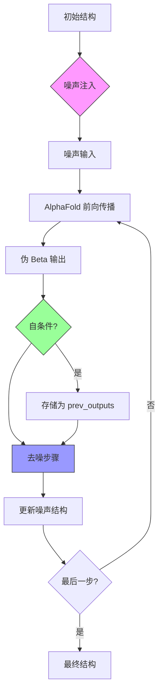

---
slug:15-self-conditioning-and-noise-injection-strategies
blog_type:normal
---

本页面记录了 AlphaFlow 在推理和训练过程中采用的双策略方法，通过受控的噪声注入和迭代自优化来生成多样化、高质量的蛋白质结构。

## 扩散框架概述

AlphaFlow 实现了基于流匹配（flow-matching）的扩散方法，该方法从先验分布中逐步对蛋白质结构进行去噪。该系统结合了两种互补的机制：自条件（利用之前的预测）和按照时间表进行的策略性噪声注入。这些策略在模型的前向传播过程中协同工作，AlphaFold 架构在此过程中接受当前输入和之前的输出作为条件信号。

来源：[alphafold.py](/alphaflow/model/alphafold.py#L150-L210)、[wrapper.py](/alphaflow/model/wrapper.py#L350-L392)

## 噪声注入机制

### 训练时的噪声注入

在训练期间，AlphaFlow 采用随机噪声注入来教导模型从受损的输入中恢复出清洁的结构。`_add_noise()` 方法通过从 HarmonicPrior 分布中采样，并基于从 [0, 1] 中均匀采样的时间参数 `t` 在清洁坐标和噪声坐标之间进行插值来实现这一点 [wrapper.py#L52-L70](/alphaflow/model/wrapper.py#L52-L70)。

噪声注入过程遵循以下步骤：

1. 从 HarmonicPrior 采样随机坐标
2. 使用 RMSD 对齐将采样的噪声与真实结构对齐
3. 采样时间参数 `t ~ Uniform(0, 1)`
4. 线性插值：`noisy_beta = (1 - t) * pseudo_beta + t * sampled_noise`
5. 根据噪声坐标计算成对距离矩阵

这种方法在训练期间由 `noise_prob` 参数控制进行概率性应用，使模型能够学习整个扩散轨迹的去噪 [wrapper.py#L143-L145](/alphaflow/model/wrapper.py#L143-L145)。

### 推理时的扩散时间表

在推理时，噪声注入遵循确定性时间表，而不是随机采样。去噪过程通过一系列时间步 进行迭代，其中 `t > s`，逐步将噪声水平从纯先验（t=1.0）降低到清洁结构（t=0.0）[wrapper.py#L369-L382](/alphaflow/model/wrapper.py#L369-L382)。

<CgxTip>关键创新在于线性插值公式：`noisy = (s/t) * noisy + (1 - s/t) * pseudo_beta`。这在保持扩散过程期望值的同时，逐步将影响力从先验转移到模型的预测。</CgxTip>

**默认推理时间表**：`[1.0, 0.75, 0.5, 0.25, 0.1, 0.0]`

可以通过 `--tmax` 和 `--steps` 命令行参数自定义时间表，从而控制起始噪声水平和去噪迭代次数 [predict.py#L47-L49](/predict.py#L47-L49)。

### 时间嵌入架构

为了使模型根据当前的噪声水平进行条件化，AlphaFlow 将时间嵌入注入到成对表示中。时间参数 `t` 首先通过学习到的线性层进行投影，然后通过嵌入层，最后广播到所有残基对 [alphafold.py#L220-L235](/alphaflow/model/alphafold.py#L220-L235)。

该时间嵌入被添加到基于噪声距离的成对嵌入中，使网络能够理解其在去噪过程中的位置，并相应地调整其预测。

## 自条件策略

### 回收之前的输出

自条件利用 AlphaFold 原生的回收机制来逐步完善预测。在每次推理步骤中，模型上一次迭代的输出作为当前迭代的条件信号反馈回来 [wrapper.py#L374-L382](/alphaflow/model/wrapper.py#L374-L382)。

回收的输出由三个关键组件组成：

- **m_1_prev**：上一次迭代的第一个 MSA 表示 [alphafold.py#L190-L194](/alphaflow/model/alphafold.py#L190-L194)
- **z_prev**：上一次迭代的成对表示
- **x_prev**：上一次迭代的 3D 原子坐标

这些表示通过回收嵌入器进行变换，并添加到当前输入中，创建一个反馈循环，从而实现迭代优化 [alphafold.py#L205-L216](/alphaflow/model/alphafold.py#L205-L216)。

### 训练时的自条件

在训练期间，自条件由 `self_cond_prob` 控制随机应用。当被激活时，模型执行一个不带梯度的前向传播以生成初始预测，然后以这些预测为条件执行第二个前向传播 [wrapper.py#L156-L160](/alphaflow/model/wrapper.py#L156-L160)。

这种训练期间的教师强迫方法有助于模型学习有效地利用其自身的预测作为条件信号，从而提高推理时的稳定性和收敛性。

## 配置与使用

### 命令行界面

推理脚本提供了几个标志来控制噪声注入和自条件策略：

| 参数 | 类型 | 默认值 | 描述 |
|-----------|------|---------|-------------|
| `--self_cond` | flag | False | 在推理期间启用自条件 |
| `--noisy_first` | flag | False | 从纯噪声开始，而不是使用初始的 AlphaFold 预测 |
| `--no_diffusion` | flag | False | 完全禁用扩散（单次前向传播） |
| `--steps` | int | 10 | 时间表中的去噪步数 |
| `--tmax` | float | 1.0 | 噪声注入的最大时间值 |

来源：[predict.py#L16-L19](/predict.py#L16-L19)、[predict.py#L119-L120](/predict.py#L119-L120)

### 特殊模式

**Noisy First 模式**：启用后，直接从从 HarmonicPrior 采样的纯噪声初始化去噪过程，绕过任何初始结构预测。这对于生成完全新颖的结构而不依赖模型的单次预测能力非常有用 [wrapper.py#L358-L360](/alphaflow/model/wrapper.py#L358-L360)。

**No Diffusion 模式**：完全禁用迭代去噪过程，对 AlphaFold 模型执行单次前向传播。此模式相当于标准 AlphaFold 推理，并作为比较的基线 [wrapper.py#L362-L367](/alphaflow/model/wrapper.py#L362-L367)。

## 性能考虑

### 计算权衡

自条件和扩散采样会随着步数的增加线性增加计算成本。每次迭代都需要完整的 Evoformer 和结构模块前向传播。默认的 6 步时间表在质量和效率之间提供了良好的平衡，但可以根据可用的计算资源进行调整。

<CgxTip>为了快速探索或处理大批量数据，请考虑减少步数或使用 `--no_diffusion`。为了在具有挑战性的目标上获得最大质量，请增加步数或使用更精细的时间表。</CgxTip>

### 内存管理

实现在推理期间累积所有中间输出（存储在 `outputs` 列表中），这对于具有多个步骤的长序列可能会消耗大量内存。对于内存受限的环境，请考虑修改代码以仅保留最终输出或实现梯度检查点。

## 与训练流水线的集成

噪声注入和自条件策略是训练方法不可或缺的一部分，而不仅仅是推理技术。在训练期间：

1. 随机噪声注入（`noise_prob` 参数）教导去噪
2. 随机自条件（`self_cond_prob` 参数）教导回收
3. 蒸馏模式使用固定的时间表进行师生训练
4. 教师模型遵循完整的去噪轨迹，而学生学习最终的清洁目标

来源：[wrapper.py#L72-L120](/alphaflow/model/wrapper.py#L72-L120)、[wrapper.py#L143-L160](/alphaflow/model/wrapper.py#L143-L160)

## 后续步骤

要了解这些策略的理论基础，请参阅 [Flow Matching Objective Integration with AlphaFold](6-flow-matching-objective-integration-with-alphafold) 和 [Harmonic Prior and Noise Scheduling](7-harmonic-prior-and-noise-scheduling)。要了解如何针对特定用例调整这些策略，请参阅 [Schedule Tuning for Diversity vs Precision Trade-off](16-schedule-tuning-for-diversity-vs-precision-trade-off)。