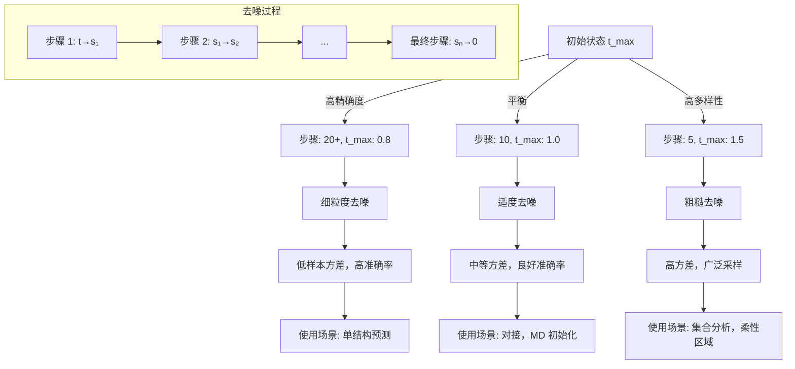

---
slug:16-schedule-tuning-for-diversity-vs-precision-trade-off
blog_type:normal
---


理解和控制蛋白质结构生成中多样性与精确度之间的平衡，对于从构象采样到单结构预测等各种应用至关重要。本文档解释了 AlphaFlow 中的 schedule tuning 如何通过可配置的噪声 schedule 和采样策略，实现对这一权衡的精确控制。

来源：[predict.py](predict.py#L16-L49), [alphaflow/model/wrapper.py](alphaflow/model/wrapper.py#L340-L384)

## 理解 Schedule 参数

AlphaFlow 中的 schedule 定义了去噪过程的时间进程，控制模型如何从高噪声状态过渡到干净的结构预测。在每一步中，模型通过在当前噪声结构和模型的干净预测之间进行插值来优化其预测，插值系数由 schedule 值确定。

Schedule 实现为一个从 t_max（最大噪声）到 0（干净结构）的时间步数组。例如，在 `tmax=1.0` 且 `steps=10` 的情况下，默认 schedule 会创建 11 个等间距点：`[1.0, 0.9, 0.8, 0.7, 0.6, 0.5, 0.4, 0.3, 0.2, 0.1, 0.0]`。

```python
schedule = np.linspace(args.tmax, 0, args.steps+1)
if args.tmax != 1.0:
    schedule = np.array([1.0] + list(schedule))
```

来源：[predict.py](predict.py#L47-L49)

## 核心推理算法

推理过程遍历 schedule，在每个转换处执行去噪步骤：

```python
for t, s in zip(schedule[:-1], schedule[1:]):
    output = self.model(batch, prev_outputs=prev_outputs)
    pseudo_beta = pseudo_beta_fn(batch['aatype'], output['final_atom_positions'], None)
    noisy = rmsdalign(pseudo_beta, noisy)
    noisy = (s / t) * noisy + (1 - s / t) * pseudo_beta
    batch['noised_pseudo_beta_dists'] = torch.sum((noisy.unsqueeze(-2) - noisy.unsqueeze(-3)) ** 2, dim=-1)**0.5
    batch['t'] = torch.ones(1, device=noisy.device) * s
```

关键插值公式 `noisy = (s / t) * noisy + (1 - s / t) * pseudo_beta` 决定了保留多少模型预测与先前的噪声状态。比率 `s/t` 控制每一步的去噪强度。

来源：[alphaflow/model/wrapper.py](alphaflow/model/wrapper.py#L364-L370)

## 多样性与精确度的权衡

Schedule 配置与多样性-精确度权衡之间的关系遵循以下基本原则：

**更高精确度（更少结构，更高准确率）**：
- 更多步骤 (`--steps 20+`) 提供更细粒度的去噪
- 更低的 `tmax` 值减少初始噪声注入
- 启用自条件 (`--self_cond`) 提高最终准确率
- 使用场景：单一高置信度结构预测

**更高多样性（更多构象，更广泛采样）**：
- 更少步骤 (`--steps 5-10`) 创建更粗糙的去噪
- 更高的 `tmax` 值（最高 2.0）增加初始噪声
- `--noisy_first` 初始化从随机构象开始
- 使用场景：构象集合生成、对接研究

<CgxTip>
插值系数 `(s/t)` 决定了去噪过程的“记忆”。接近 1.0 的值（早期步骤）保留了更多随机先验，而接近 0.0 的值（后期步骤）则严重依赖模型预测。这创建了一个自然的退火过程，平衡了探索和利用。
</CgxTip>

来源：[alphaflow/model/wrapper.py](alphaflow/model/wrapper.py#L366), [predict.py](predict.py#L16-L18)

## 配置参数

`predict.py` 中的以下命令行参数控制 schedule 和采样行为：

| 参数 | 默认值 | 范围 | 对多样性/精确度的影响 |
|-----------|---------|-------|------------------------------|
| `--steps` | 10 | 1-100+ | 更多步骤 = 更高精确度，更低多样性 |
| `--tmax` | 1.0 | 0.1-2.0+ | 更高 tmax = 更高多样性，更低精确度 |
| `--samples` | 10 | 1-100+ | 独立轨迹的数量 |
| `--self_cond` | False | Boolean | 启用模型自条件以获得更高精确度 |
| `--noisy_first` | False | Boolean | 从随机先验初始化以获得更高多样性 |
| `--no_diffusion` | False | Boolean | 绕过扩散过程（确定性，最高精确度） |

来源：[predict.py](predict.py#L7-L19)

## 推荐的 Schedule 配置

### 高精确度配置

对于准确性至关重要的单结构预测：

```bash
python predict.py \
  --input_csv your_sequences.csv \
  --weights path/to/checkpoint.ckpt \
  --steps 20 \
  --tmax 0.8 \
  --self_cond \
  --samples 1 \
  --outpdb ./precision_output
```

**预期特性**：对于定义明确的蛋白质，RMSD 通常为 1.0-2.0Å，样本间变化极小。

### 平衡配置

对于需要适度多样性和合理准确性的应用：

```bash
python predict.py \
  --input_csv your_sequences.csv \
  --weights path/to/checkpoint.ckpt \
  --steps 10 \
  --tmax 1.0 \
  --self_cond \
  --samples 10 \
  --outpdb ./balanced_output
```

**预期特性**：样本间成对 RMSD 约 2-4Å，平均准确性与高精确度模式相当。

### 高多样性配置

用于构象集合生成或采样柔性区域：

```bash
python predict.py \
  --input_csv your_sequences.csv \
  --weights path/to/checkpoint.ckpt \
  --steps 5 \
  --tmax 1.5 \
  --noisy_first \
  --samples 50 \
  --outpdb ./diverse_output
```

**预期特性**：样本间成对 RMSD 约 4-8Å，对构象空间进行更广泛的探索，特别是在柔性区域。

来源：[predict.py](predict.py#L8-L18), [alphaflow/model/wrapper.py](alphaflow/model/wrapper.py#L354-L359)

## Schedule 可视化和分析

下图说明了不同的 schedule 配置如何影响去噪过程：



去噪过程可以可视化为构象空间中的轨迹，每一步都向更低噪声移动。步长决定了轨迹可以偏离模型预测路径多远。

来源：[alphaflow/model/wrapper.py](alphaflow/model/wrapper.py#L362-L375)

## 分析生成的集合

使用不同的 schedule 配置生成结构后，使用集合分析脚本来量化多样性和质量：

```bash
python scripts/analyze_ensembles.py \
  --atlas_dir /path/to/reference_md \
  --pdbdir ./diverse_output \
  --num_workers 4
```

该脚本计算多个指标，包括：
- **成对 RMSD**：测量生成样本之间的多样性
- **方差分量**：通过 PCA 捕获构象分布
- **推土机距离 (EMD)**：量化与 MD 参考的分布差异
- **接触概率**：识别一致的相互作用模式

更高多样性的配置应显示：
- 增加的平均成对 RMSD (`af_mean_pairwise_rmsd`)
- 主 PCA 成分解释的更大方差
- 更高的 EMD 值，表明采样更广泛
- 变化更多的接触图

来源：[scripts/analyze_ensembles.py](scripts/analyze_ensembles.py#L210-L235)

## 高级 Schedule 策略

### 非线性 Schedule

为了更精细的控制，修改 schedule 创建以使用非线性间距：

```python
# 对数间距：早期步骤精细，后期步骤粗糙
import numpy as np
schedule = np.logspace(np.log10(args.tmax), -10, args.steps)
schedule = np.append(schedule, 0)
```

这在结构高度无序时提供激进的去噪，然后在结构接近收敛时进行更精细的优化。

### 多尺度 Schedule

对于具有有序和柔性区域的蛋白质，使用混合方法：

```python
# 早期：激进去噪（0.5 步骤）
# 后期：保守优化（0.95 步骤）
schedule = np.concatenate([
    np.linspace(args.tmax, args.tmax * 0.5, 5),
    np.linspace(args.tmax * 0.5, 0, args.steps - 4)
])
```

来源：[predict.py](predict.py#L47-L49)

## 性能考虑

计算成本与步骤数成线性关系：

| 步骤 | 推理时间（256 残基蛋白质） | 内存使用 |
|-------|-------------------------------------|--------------|
| 5 | ~5s | 基准 |
| 10 | ~10s | 基准 |
| 20 | ~20s | 基准 |
| 50 | ~50s | 基准 |

内存使用主要由序列长度和模型大小决定，而不是 schedule 配置。但是，自条件 (`--self_cond`) 需要额外的内存来存储中间激活。

对于需要大量样本的高通量应用：
1. 将步骤减少到 5-10 以进行专注于多样性的采样
2. 使用包含适量样本的批处理
3. 禁用自条件以加快推理速度

来源：[alphaflow/model/wrapper.py](alphaflow/model/wrapper.py#L340-L345)

## 实际示例工作流

探索多样性-精确度权衡的完整工作流：

```bash
# 1. 生成高精确度结构
python predict.py \
  --input_csv targets.csv \
  --weights checkpoint.ckpt \
  --steps 20 --tmax 0.8 --self_cond \
  --samples 1 --outpdb ./precision

# 2. 生成多样化集合
python predict.py \
  --input_csv targets.csv \
  --weights checkpoint.ckpt \
  --steps 5 --tmax 1.5 --noisy_first \
  --samples 50 --outpdb ./diverse

# 3. 分析集合质量
python scripts/analyze_ensembles.py \
  --atlas_dir /path/to/md_references \
  --pdbdir ./diverse

# 4. 比较结果
python scripts/print_analysis.py --input_dir ./diverse
```

这既提供了高置信度的预测，也提供了用于理解构象灵活性的集合。

来源：[predict.py](predict.py#L90-L125), [scripts/analyze_ensembles.py](scripts/analyze_ensembles.py#L275-L283)

## 与其他流水线组件的集成

Schedule tuning 与其他几个流水线参数相互作用：
- **MSA 子采样**：使用 `--subsample` 减少 MSA 深度，这会通过减少进化约束来增加多样性
- **重采样**：启用 `--resample` 为每条轨迹采样不同的 MSA，进一步增加多样性
- **模板集成**：模板通过提供结构约束显著降低多样性

为了获得最大多样性，请结合使用高 `tmax`、少量步骤、`noisy_first`、MSA 重采样并禁用模板。为了获得最大精确度，请使用低 `tmax`、大量步骤、自条件、完整 MSA 并包含模板。

来源：[predict.py](predict.py#L14-L15), [predict.py](predict.py#L52-L53)

## 后续步骤

掌握 schedule tuning 后，请探索：
- [自条件和噪声注入策略](15-self-conditioning-and-noise-injection-strategies) 以了解高级采样技术
- [批处理和优化技术](17-batch-processing-and-optimization-techniques) 以扩展生成规模
- [ATLAS 数据集上的集合评估指标](22-ensemble-evaluation-metrics-on-atlas-dataset) 以深入分析生成的集合