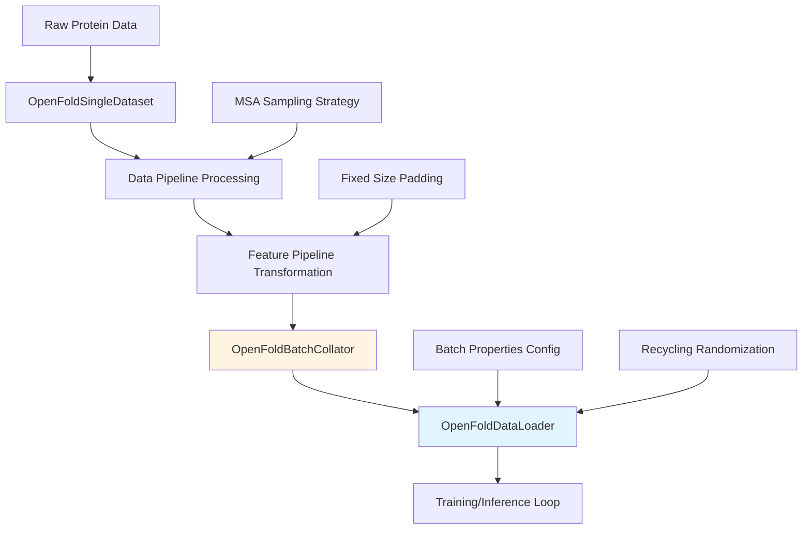

---
slug:17-batch-processing-and-optimization-techniques
blog_type:normal
---

AlphaFlow 实现了一套全面的批处理机制和优化策略，旨在最大化计算效率的同时保持模型准确性。这些技术涵盖数据加载、训练优化、推理加速和内存管理，从而能够有效地从单序列分析扩展到大规模蛋白质结构生成。

## 批处理架构

批处理基础设施建立在分层设计之上，通过针对蛋白质的特定优化扩展了 PyTorch 的标准数据加载功能。核心是 `OpenFoldBatchCollator`，它通过堆叠张量条目同时保留非张量元数据，将异构蛋白质数据高效聚合成统一的批次张量。`OpenFoldDataLoader` 进一步通过动态批次属性管理扩展了此功能，包括随机回收迭代选择，使模型在训练期间经历不同数量的 Evoformer 循环。这种设计能够在保持流匹配目标所需的随机特性的同时，高效训练不同大小的蛋白质。

**来源**: [alphaflow/data/data_modules.py](alphaflow/data/data_modules.py#L336-L342), [alphaflow/data/data_modules.py](alphaflow/data/data_modules.py#L355-L434)

### 训练批次组成

训练批次通过多阶段过程动态组成。`OpenFoldBatchCollator` 采用张量堆叠策略，其中 `torch.stack(x, dim=0)` 应用于所有张量字段，而非张量字段则聚合为列表。`OpenFoldDataLoader` 通过从预计算的概率分布中进行多项式采样，利用随机属性增强每个批次。对于回收迭代，配置支持在允许值上的均匀分布或最大迭代次数的确定性选择。这些采样的属性随后被广播以匹配批次维度，然后注入到批次字典中，确保在批次中的所有样本上一致应用。

**来源**: [alphaflow/data/data_modules.py](alphaflow/data/data_modules.py#L336-L342), [alphaflow/data/data_modules.py](alphaflow/data/data_modules.py#L367-L434)

## 训练优化技术

AlphaFlow 采用多种优化技术来加速训练，同时保持数值稳定性和模型性能。混合精度训练通过 `low_prec=True` 参数配置，以更少的内存占用实现更快的计算。矩阵乘法精度在训练和推理脚本中通过 `torch.set_float32_matmul_precision("high")` 设置为 "high"，在速度和准确性之间取得平衡。通过 PyTorch Lightning 的 `accumulate_grad_batches` 参数支持梯度累积，允许有效批次大小超过 GPU 内存限制所允许的范围。梯度裁剪通过训练器配置中的 `gradient_clip_val` 参数实现，防止训练期间的梯度爆炸。

<CgxTip>混合精度训练与高精度矩阵乘法的结合提供了最佳平衡——减少了中间激活的内存使用，同时保持了注意力机制等关键操作的准确性。</CgxTip>

**来源**: [train.py](train.py#L16), [train.py](train.py#L21-L24), [train.py](train.py#L96-L101)

### 指数移动平均 (EMA)

AlphaFlow 为模型权重稳定实现了 EMA，这对于基于流匹配的生成特别有益。EMA 权重与训练权重分开维护，并在验证和推理期间应用。EMA 衰减参数可通过 `config.ema.decay` 配置，典型值约为 0.999，用于缓慢更新。包装器类在加载 EMA 权重进行验证时缓存非 EMA 权重，确保无缝恢复以继续训练。EMA 更新在 `on_before_zero_grad` 回调中执行，与优化器步进周期同步。

**来源**: [alphaflow/model/wrapper.py](alphaflow/model/wrapper.py#L235-L244), [alphaflow/model/wrapper.py](alphaflow/model/wrapper.py#L244-L248)

### 内存优化策略

集成了多种内存优化技术以处理大型蛋白质结构和广泛的 MSA 数据。可以通过 `config.model.template.offload_templates` 启用模板卸载，当模板特征不主动需要时，将其移动到 CPU 内存。`chunk_size` 参数控制注意力计算的分块，在内存使用和计算效率之间进行权衡。对于长序列，`long_sequence_inference` 标志会调整配置参数以优化内存使用。此外，可以通过 `config.globals.use_flash` 启用 FlashAttention 集成以优化注意力计算，这需要安装 flash_attn 包。

**来源**: [alphaflow/config.py](alphaflow/config.py#L14-L51), [alphaflow/config.py](alphaflow/model_config)

## 数据流水线优化

高效的数据处理对于批训练吞吐量至关重要。AlphaFlow 实现了多种策略来优化数据流水线，同时保持数据完整性和训练信号。

### 固定大小填充和裁剪

变长蛋白质序列通过两阶段过程转换为固定维度：随机裁剪后跟固定大小填充。`random_crop_to_size` 转换将序列随机裁剪为 `mode_cfg.crop_size` 个残基，并通过 `mode_cfg.subsample_templates` 控制可选的模板子采样。随后，`make_fixed_size` 转换根据 `pad_msa_clusters`（MSA 深度）、`mode_cfg.max_extra_msa`、`mode_cfg.crop_size`（残基数）和 `mode_cfg.max_templates` 将裁剪后的数据填充为一致的维度。此转换对于高效的 GPU 利用至关重要，因为它消除了每批次填充的需要，并允许预先分配内存缓冲区。

**来源**: [alphaflow/data/input_pipeline.py](alphaflow/data/input_pipeline.py#L26-L108), [alphaflow/data/input_pipeline.py](alphaflow/data/input_pipeline.py#L229-L285)

### MSA 采样策略

多序列比对 (MSA) 数据可能计算成本很高，特别是对于有许多同系物的蛋白质。AlphaFlow 实现了自适应 MSA 采样策略来控制计算成本。`sample_msa` 转换从可用 MSA 中采样 `max_msa_clusters` 个序列，并通过 `keep_extra=True` 可选地保留额外的 MSA 数据。`sample_msa_distillation` 转换通过 `mode_cfg.max_distillation_msa_clusters` 为蒸馏训练提供了额外的控制。额外的 MSA 被裁剪为 `max_extra_msa` 个序列，如果不需要则完全删除。可以通过 `common_cfg.msa_cluster_features` 启用 MSA 聚类特征，以在保留系统发育信息的同时减少有效的 MSA 维度。

**来源**: [alphaflow/data/input_pipeline.py](alphaflow/data/input_pipeline.py#L195-L228)

### 模板子采样

启用模板时，AlphaFlow 实现了几种模板优化策略。`reduce_msa_clusters_by_max_templates` 配置会调整 MSA 聚类计数以考虑模板使用，保持一致的计算预算。训练期间的模板子采样通过在解析前从前 k 个模板命中中随机选择来近似 DeepMind 的训练方案，由 `shuffle_top_k_prefiltered` 控制。`max_template_hits` 参数限制了考虑的模板总数，并根据 `mode_cfg.max_templates` 应用进一步的子采样。

**来源**: [alphaflow/data/input_pipeline.py](alphaflow/data/input_pipeline.py#L191-L195), [alphaflow/data/data_modules.py](alphaflow/data/data_modules.py#L36-L58)

## 推理批处理

推理期间的批处理能够高效生成多个蛋白质结构，这对于集成生成和探索构象多样性特别有用。

### 多样本推理

推理流水线支持通过可配置参数对每个序列的多个样本进行批处理。`--samples` 参数控制为每个输入生成的独立结构数量，每个样本都经过完整的流匹配调度处理。可以通过 `--resample` 标志启用 MSA 重采样，以为每个样本生成不同的 MSA 表示，由 `--subsample` 参数控制以减少 MSA 深度以加快推理速度。样本在结果字典中聚合并按顺序写入输出 PDB 文件，可以通过 `--no_overwrite` 防止覆盖。

**来源**: [predict.py](predict.py#L3-L21), [predict.py](predict.py#L95-L112)

### 基于调度的批处理推理

可以通过 `--steps` 和 `--tmax` 参数为批处理推理自定义流匹配调度。调度计算为 `np.linspace(args.tmax, 0, args.steps+1)`，如果 `args.tmax != 1.0`，则在 t=1.0 处有一个可选的初始步骤。这允许在生成速度和多样性之间进行权衡——较少的步骤和较大的 t 增量产生更快但可能不太准确的结构，而更多的步骤和更细的梯度产生更高质量的结果，但计算成本增加。调度在批次中的所有样本上一致应用，每个样本在遍历调度之前独立地从噪声分布中采样。

**来源**: [predict.py](predict.py#L47-L49), [predict.py](predict.py#L100-L112)

## 性能优化配置

配置系统提供了多种针对不同场景优化的预设配置，包括训练效率和推理速度。

### 训练预设

训练预设通过精心调整的参数在准确性和计算成本之间取得平衡。`initial_training` 预设提供适合初始训练周期的基准配置。`finetuning` 预设将裁剪大小增加到 384 个残基，max_extra_msa 增加到 5120，max_msa_clusters 增加到 512，以进行更细粒度的优化，并调整了违 规（1.0）和实验解析（0.01）项的损失权重。无模板变体（`finetuning_no_templ`）禁用模板处理，适用于模板不可用或不理想的情况。PTM（预测 TM-score）变体启用 pTM 头并增加额外的损失权重（0.1）以进行质量感知训练。

**来源**: [alphaflow/config.py](alphaflow/config.py#L51-L119)

### 推理预设

推理预设针对保留数据上的最大预测性能进行了优化。模型变体（1-5）提供不同的模板配置：模型 1 和 2 使用带有扭转角的模板，模型 3 和 4 无模板，模型 5 是最小配置。模型 1 和 2 中的 `reduce_max_clusters_by_max_templates` 设置会调整 MSA 聚类计数以考虑模板使用。PTM 变体启用 pTM 头以进行置信度估计。可以通过 `long_sequence_inference` 参数启用长序列推理，它会调整配置以处理超过标准训练裁剪大小的序列。

**来源**: [alphaflow/config.py](alphaflow/config.py#L120-L180)

## 批处理权衡

| 优化技术 | 优势 | 注意事项 | 配置 |
|------------------------|----------|----------------|---------------|
| 混合精度训练 | 训练速度提升 2 倍，内存减少 50% | 潜在的数值不稳定性 | model_config 中的 `low_prec=True` |
| 固定大小填充 | 消除动态批处理开销 | 可能通过裁剪丢弃信息 | `mode_cfg.fixed_size=True` |
| MSA 采样 | 降低计算成本 | 可能丢弃信息丰富的序列 | `max_msa_clusters`、`max_extra_msa` |
| 模板卸载 | 减少内存占用 | CPU-GPU 传输开销 | `offload_templates=True` |
| FlashAttention | 更快的注意力计算 | 需要安装特定的包 | `use_flash=True` |
| EMA 权重 | 改进推理质量 | 需要 EMA 副本的额外内存 | `no_ema=False` |
| 梯度累积 | 更大的有效批次大小 | 增加训练时间 | `accumulate_grad_batches` |

<CgxTip>在优化长序列（2000+ 残基）时，请优先考虑模板卸载和减少 MSA 聚类。这些技术在保持大部分预测准确性的同时提供最大的内存节省，从而能够在 otherwise 不可行的硬件上进行推理。</CgxTip>

**来源**: [alphaflow/config.py](alphaflow/config.py#L51-L180)

## 实现模式

### 批次属性广播

`OpenFoldDataLoader` 为批次属性实现了复杂的广播机制。从多项式分布采样的属性（例如，回收迭代）最初是标量值。这些属性使用视图操作扩展以匹配批次维度：`sample_tensor.view((1,) * len(batch_dims) + sample_tensor.shape + (1,))`，然后扩展到 `batch_dims + orig_shape + (recycling_dim,)`。这允许无需每次迭代的逻辑即可进行每样本属性分配，保持矢量化优势。回收维度根据采样迭代计数通过 `resample_recycling = lambda t: t[..., :no_recycling + 1]` 动态截断，并通过 `tensor_tree_map` 递归应用。

**来源**: [alphaflow/data/data_modules.py](alphaflow/data/data_modules.py#L397-L432)

### 高效批次整理

`OpenFoldBatchCollator` 通过根据数据类型应用不同策略来实现高效的批次整理。使用 `torch.stack(x, dim=0)` 堆叠张量以创建带有添加批次维度的批次张量。非张量条目（例如，字符串、列表）作为 Python 列表聚合并不加转换。这种方法在优化张量操作的内存布局的同时，保留了复杂嵌套字典的结构。`dict_multimap` 函数递归地将整理逻辑应用于嵌套字典，处理蛋白质特征字典的分层结构。

**来源**: [alphaflow/data/data_modules.py](alphaflow/data/data_modules.py#L336-L349)

## 后续步骤

理解批处理和优化技术对于在生产环境中有效部署 AlphaFlow 至关重要。有关实现这些技术的实用指导，请参阅 [推理流水线和采样过程](14-inference-pipeline-and-sampling-process)，其中详细说明了批处理如何与流匹配采样调度集成。有关优化输入数据吞吐量的见解，请参阅 [PDB 和 ATLAS 数据集的数据预处理](20-data-preprocessing-for-pdb-and-atlas-datasets)，其中讨论了 MSA 生成策略和特征提取优化。要了解这些优化选择如何影响模型性能指标，请参阅 [ATLAS 数据集上的集成评估指标](22-ensemble-evaluation-metrics-on-atlas-dataset)。

**来源**: [alphaflow/data/data_modules.py](alphaflow/data/data_modules.py#L1-L680), [alphaflow/model/wrapper.py](alphaflow/model/wrapper.py#L350-L393), [train.py](train.py#L1-L163), [predict.py](predict.py#L1-L134)