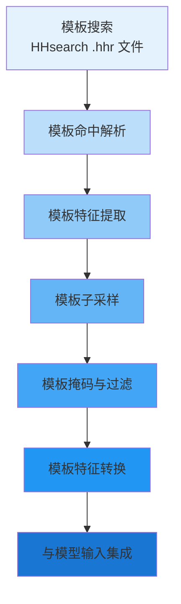

---
slug:19-template-processing-and-feature-extraction
blog_type:normal
---


模板处理是 AlphaFlow 架构中的关键组件，它使模型能够利用同源蛋白质的结构信息来提高预测准确性。本文档解释了如何发现、解析模板，将其转换为特征，并集成到模型的输入流程中。

## 概述：模板处理架构

模板处理流程采用多阶段架构，将原始模板搜索结果转换为模型可用的结构化特征。该流程在保持效率的同时，通过战略性子采样和裁剪操作整合了来自同源蛋白质的结构信息。



模板流程与 MSA 和序列处理并行运行，最终在将所有特征流输入模型输入堆栈之前进行合并。这种架构允许模型同时从进化信息（MSA）和结构信息（模板）中学习。

## 模板发现与解析

模板发现始于存储在 `.hhr` 文件中的 HHsearch 比对结果。DataPipeline 的 `_parse_template_hits` 方法从单个文件或索引数据库中提取这些命中结果，以实现高效的批处理 [alphaflow/data/data_pipeline.py](alphaflow/data/data_pipeline.py#L480-L518)。

```python
def _parse_template_hits(
    self,
    alignment_dir: str,
    alignment_index: Optional[Any] = None
) -> Mapping[str, Any]:
    all_hits = {}
    if(alignment_index is not None):
        fp = open(os.path.join(alignment_dir, alignment_index["db"]), 'rb')
        
        def read_template(start, size):
            fp.seek(start)
            return fp.read(size).decode("utf-8")
        
        for (name, start, size) in alignment_index["files"]:
            ext = os.path.splitext(name)[-1]
            
            if(ext == ".hhr"):
                hits = parsers.parse_hhr(read_template(start, size))
                all_hits[name] = hits
```

解析支持两种模式：用于单个比对的基于文件的模式，以及用于训练期间批处理的基于索引的模式。使用索引模式时，系统可以高效地定位到特定的字节偏移量以读取模板数据，而无需将整个数据库文件加载到内存中。

## 模板特征提取

模板特征通过 OpenFold 库的模板处理工具提取，这些工具将来自 mmCIF 文件的原始结构数据转换为标准化的特征张量。DataPipeline 接受一个 `template_featurizer` 参数，用于自定义模板处理逻辑 [alphaflow/data/data_pipeline.py](alphaflow/data/data_pipeline.py#L409-L416)。

特征提取过程生成多种张量类型：

| 特征张量 | 形状 | 描述 |
|----------------|-------|-------------|
| `template_aatype` | `[NUM_TEMPLATES, NUM_RES]` | 每个模板位置的氨基酸类型 |
| `template_all_atom_positions` | `[NUM_TEMPLATES, NUM_RES, 37, 3]` | 37 种原子类型的笛卡尔坐标 |
| `template_all_atom_mask` | `[NUM_TEMPLATES, NUM_RES, 37]` | 指示原子存在的二进制掩码 |
| `template_sum_probs` | `[NUM_TEMPLATES, None]` | HHsearch 比对的概率总和 |
| `template_mask` | `[NUM_TEMPLATES]` | 模板级别的有效性掩码 |
| `template_torsion_angles_sin_cos` | `[NUM_TEMPLATES, NUM_RES, 14, 2]` | 14 个扭转角的正弦/余弦 |
| `template_pseudo_beta` | `[NUM_TEMPLATES, NUM_RES, 3]` | 伪-beta Cβ 坐标 |

这些特征既捕获了原子级别的几何结构，也捕获了主链扭转角，为模型提供了丰富的结构信息。

## 模板子采样策略

在训练期间，会对模板进行策略性子采样，以管理内存使用并提高泛化能力。OpenFoldSingleDataset 初始化时使用 `max_template_hits` 参数（默认值：4），该参数控制所考虑模板数量的上限 [alphaflow/data/data_modules.py](alphaflow/data/data_modules.py#L44-L84)。

```python
def __init__(self,
    ...
    max_template_hits: int = 4,
    shuffle_top_k_prefiltered: Optional[int] = None,
    ...
):
    """
    Args:
        max_template_hits:
            考虑的模板数量的上限。在训练期间，
            最终使用的模板是从这个总量中子采样出来的。
        shuffle_top_k_prefiltered:
            在解析其中的 max_template_hits 之前，
            是否对前 k 个模板命中进行均匀随机打乱。
            这可用于更高效地近似 DeepMind 的训练时间
            模板子采样方案。
        """
```

输入流程中的 `random_crop_to_size` 函数执行实际的模板子采样，随机选择模板并对每个模板应用随空间裁剪 [alphaflow/data/input_pipeline.py](alphaflow/data/input_pipeline.py#L26-L106)。这种随机方法防止模型过拟合于特定的模板顺序或位置。

<CgxTip>
训练期间的模板子采样有两个关键目的：(1) 它通过在每个 epoch 中向模型展示不同的模板子集来对模型进行正则化；(2) 它在处理具有大蛋白质结构的多个模板时减少内存占用。子采样通过随机排列执行，以确保在所有可用模板中进行无偏学习。
</CgxTip>

## 模板特征转换流程

提取后，模板特征通过输入流程经历一系列转换。当配置中启用模板时，`nonensembled_transform_fns` 函数会协调这些转换 [alphaflow/data/input_pipeline.py](alphaflow/data/input_pipeline.py#L146-L283)。

```python
def nonensembled_transform_fns(common_cfg, mode_cfg):
    """输入流程中非集成的数据转换器。"""
    transforms = [
        data_transforms.cast_to_64bit_ints,
        data_transforms.correct_msa_restypes,
        data_transforms.squeeze_features,
        data_transforms.randomly_replace_msa_with_unknown(0.0),
        data_transforms.make_seq_mask,
        data_transforms.make_msa_mask,
        data_transforms.make_hhblits_profile,
    ]
    if common_cfg.use_templates:
        transforms.extend(
            [
                data_transforms.fix_templates_aatype,
                data_transforms.make_template_mask,
                data_transforms.make_pseudo_beta("template_"),
            ]
        )
        if common_cfg.use_template_torsion_angles:
            transforms.extend(
                [
                    data_transforms.atom37_to_torsion_angles("template_"),
                ]
            )
```

转换序列包括：

1. **模板 Aatype 修正**：确保氨基酸类型使用正确的索引方案
2. **模板掩码生成**：为模板原子和残基创建有效性掩码
3. **伪-Beta 计算**：从原子位置计算 Cβ 坐标以进行几何表示
4. **扭转角转换**：将 37 原子表示转换为主链扭转角（启用时）

`use_template_torsion_angles` 配置标志控制是否生成扭转角特征，使模型能够除了从笛卡尔坐标学习外，还能从主链二面角学习 [alphaflow/config.py](alphaflow/config.py#L102)。

## 模板裁剪与填充

模板特征经过空间裁剪和填充，以满足模型的序列处理要求。`random_crop_to_size` 函数在所有模板维度上应用同步裁剪 [alphaflow/data/input_pipeline.py](alphaflow/data/input_pipeline.py#L26-L106)。

```python
if subsample_templates:
    templates_crop_start = _randint(0, num_templates)
    templates_select_indices = torch.randperm(
        num_templates, device=protein["seq_length"].device, generator=g
    )

for k, v in protein.items():
    if k not in shape_schema or (
        "template" not in k and NUM_RES not in shape_schema[k]
    ):
        continue
    
    # 在裁剪模板之前随机排列它们。
    if k.startswith("template") and subsample_templates:
        v = v[templates_select_indices]
    
    slices = []
    for i, (dim_size, dim) in enumerate(zip(shape_schema[k], v.shape)):
        is_num_res = dim_size == NUM_RES
        if i == 0 and k.startswith("template"):
            crop_size = num_templates_crop_size
            crop_start = templates_crop_start
        else:
            crop_start = num_res_crop_start if is_num_res else 0
            crop_size = num_res_crop_size if is_num_res else dim
        slices.append(slice(crop_start, crop_start + crop_size))
    protein[k] = v[slices]
```

裁剪操作在所有模板特征之间同步：对原子位置、掩码和扭转角应用相同的空间裁剪，以保持结构一致性。这确保裁剪后的模板仍然是蛋白质片段的结构连贯表示。

## 模板配置变体

AlphaFlow 支持在模型预设中定义的多种模板处理配置 [alphaflow/config.py](alphaflow/config.py#L96-L156)。

| 模型变体 | 启用模板 | 扭转角 | 最大额外 MSA | 使用场景 |
|---------------|------------------|----------------|---------------|----------|
| `model_1`, `model_2` | True | True | 5120 | 具有完整模板信息的高精度推理 |
| `model_1_ptm`, `model_2_ptm` | True | True | 5120 | 具有 pTM 置信度预测的高精度 |
| `model_3`, `model_4`, `model_5` | False | N/A | 5120 | 无模板，用于提速或模板不可用时 |
| `finetuning` | True | True | 5120 | 使用模板增强进行微调 |
| `finetuning_no_templ` | False | N/A | 5120 | 不依赖模板进行微调 |

`reduce_max_clusters_by_max_templates` 配置选项在存在模板时调整 MSA 聚类，防止模板和 MSA 信息之间的特征冗余 [alphaflow/config.py](alphaflow/config.py#L284)。

<CgxTip>
使用模板时，请考虑预测准确性与计算成本之间的权衡。启用模板的模型（model_1、model_2）对于具有良好同源物的蛋白质提供更高的准确性，但需要额外的 HHsearch 预处理和模板特征化开销。无模板模型（model_3、model_4、model_5）速度更快，适用于结构同源物有限的新颖折叠。
</cgx-tip>

## 内存优化技术

对于长序列或在推理期间，可以使用配置中定义的两种内存高效方法来优化模板特征 [alphaflow/config.py](alphaflow/config.py#L158-L174)：

1. **模板平均**：`model.template.average_templates` 将所有模板平均为单个表示，将内存占用从 O(NUM_TEMPLATES) 减少到 O(1)
2. **模板卸载**：`model.template.offload_templates` 在处理期间增量加载模板特征，减少峰值内存使用

这些优化对于长序列推理模式会自动启用：

```python
if long_sequence_inference:
    assert(not train)
    c.globals.offload_inference = True
    c.globals.use_lma = True
    c.globals.use_flash = False
    c.model.template.offload_inference = True
```

模板处理中的 `chunk_size` 参数控制分块操作的粒度，在内存使用和计算效率之间进行权衡。

## 与特征流程集成

FeaturePipeline 协调模板特征与其他特征流的最终组装 [alphaflow/data/feature_pipeline.py](alphaflow/data/feature_pipeline.py#L115-L132)。

```python
class FeaturePipeline:
    def __init__(
        self,
        config: ml_collections.ConfigDict,
    ):
        self.config = config
    
    def process_features(
        self,
        raw_features: FeatureDict,
        mode: str = "train", 
    ) -> FeatureDict:
        return np_example_to_features(
            np_example=raw_features,
            config=self.config,
            mode=mode,
        )
```

该流程根据 `use_templates` 配置标志有选择地包含模板特征，将它们与序列、MSA 和结构特征连接到最终特征字典中 [alphaflow/data/feature_pipeline.py](alphaflow/data/feature_pipeline.py#L64-L66)。

## 数据加载与批处理

OpenFoldDataModule 管理训练、验证和预测阶段的模板特征加载 [alphaflow/data/data_modules.py](alphaflow/data/data_modules.py#L443-L658)。

```python
class OpenFoldDataModule(pl.LightningDataModule):
    def __init__(self,
        config: mlc.ConfigDict,
        template_mmcif_dir: str,
        max_template_date: str,
        train_data_dir: Optional[str] = None,
        train_alignment_dir: Optional[str] = None,
        ...
    ):
```

数据模块需要：
- `template_mmcif_dir`：包含用于特征提取的模板 mmCIF 文件的目录
- `max_template_date`：模板选择的截止日期（确保时间拆分的完整性）
- 包含模板命中 HHsearch 结果的比对目录

模板特征在迭代期间按需加载，OpenFoldBatchCollator 处理具有不同数量有效命中的模板之间的批处理和填充 [alphaflow/data/data_modules.py](alphaflow/data/data_modules.py#L336-L343)。

## 后续步骤

了解模板处理流程后，你可能需要探索：

- [PDB 和 ATLAS 数据集的数据预处理](20-data-preprocessing-for-pdb-and-atlas-datasets) - 如何准备原始结构文件以进行模板搜索
- [序列、结构和 MSA 的特征工程](21-feature-engineering-for-sequence-structure-and-msa) - 详细检查所有特征类型
- [输入堆栈和特征表示](9-input-stack-and-feature-representations) - 处理后的特征如何在模型中嵌入和转换
- [MD+Templates 模型的模板集成](13-template-integration-for-md-templates-models) - MD 增强训练的专用模板处理