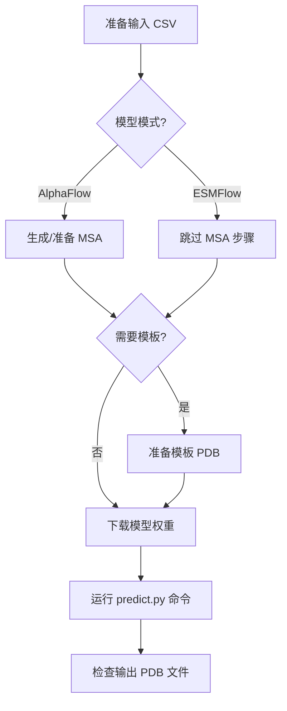
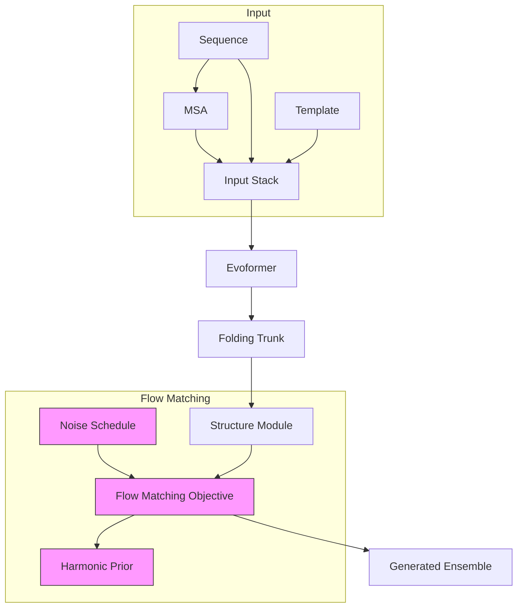

---
slug:2-quick-start
blog_type:normal
---


AlphaFlow 是 AlphaFold 的一个修改版本，使用流匹配目标进行微调，专为蛋白质构象集的生成建模而设计。本快速入门指南将帮助你在几分钟内上手运行 AlphaFlow，无论你是想根据 PDB 建模实验构象集，还是模拟生理温度下的分子动力学构象集。


AlphaFlow 扩展了原始 AlphaFold 架构的功能，能够生成代表蛋白质构象集的多种构象，而不仅仅是单一的静态结构。这使得研究人员能够探索蛋白质的柔性、构象动力学以及在功能上可能相关的替代结构状态。该框架还包括 ESMFlow，这是对 ESMFold 的类似微调，适用于那些更喜欢基于序列的方法的用户。

来源：[README.md](README.md#L1-L30), [predict.py](predict.py#L1-L20)

## 安装和环境设置

AlphaFlow 需要 Python 3.9 和支持 CUDA 的 GPU（推荐 CUDA 11）。最简单的安装方法是使用 conda 环境来清晰地管理依赖项。

```bash
conda create -n alphaflow python=3.9
conda activate alphaflow
pip install numpy==1.21.2 pandas==1.5.3
pip install torch==1.12.1+cu113 -f https://download.pytorch.org/whl/torch_stable.html
pip install biopython==1.79 dm-tree==0.1.6 modelcif==0.7 ml-collections==0.1.0 scipy==1.7.1 absl-py einops
pip install pytorch_lightning==2.0.4 fair-esm mdtraj==1.9.9 wandb
pip install 'openfold @ git+https://github.com/aqlaboratory/openfold.git@103d037'
```

如果你的系统具有不兼容的 CUDA 版本，你可以在安装 OpenFold 之前在你的 conda 环境中安装 CUDA 11。这种方法隔离了所需的 CUDA 版本，而不会影响你系统范围的安装。OpenFold 安装特别需要 CUDA 11，因为其自定义的 PyTorch 内核是针对该版本编译的。

对于更喜欢容器化环境的用户，代码库中提供了一个 Dockerfile，它是基于 OpenFold 容器构建的。这种方法确保了可复现性，对于部署或在不同机器上工作特别有用。Docker 镜像大约为 20GB（不包含权重），如果包含预下载的模型权重，则大约为 25GB。

来源：[README.md](README.md#L34-L49), [Dockerfile](Dockerfile#L1-L87)

## 下载模型权重

AlphaFlow 提供了针对不同用例优化的多种模型变体。所有模型权重都托管在 Google Cloud Storage 上，可以直接下载。主要的三个模型系列是：

- **AlphaFlow-PDB**：在 PDB 结构上训练，用于在不同条件下模拟来自 X 射线晶体学或冷冻电镜的实验构象集。
- **AlphaFlow-MD**：在 300K 下全原子显式溶剂 MD 轨迹上训练。
- **AlphaFlow-MD+Templates**：接受 PDB 结构作为输入，并模拟 300K 下相应的 MD 构象集。

每个系列都有基础版本和精简版本。精简模型运行速度显著更快，但代价是精度略有降低，正如论文中详述的那样。对于 MD+Templates 系列，还提供 12 层变体，推理速度快 2.5 倍，性能损失很小。

| Model Family | Base Version | Distilled Version | 12-Layer Base | 12-Layer Distilled |
|--------------|-------------|------------------|---------------|-------------------|
| AlphaFlow-PDB | alphaflow_pdb_base_202402.pt | alphaflow_pdb_distilled_202402.pt | - | - |
| AlphaFlow-MD | alphaflow_md_base_202402.pt | alphaflow_md_distilled_202402.pt | - | - |
| AlphaFlow-MD+Templates | alphaflow_md_templates_base_202402.pt | alphaflow_md_templates_distilled_202402.pt | alphaflow_12l_md_templates_base_202406.pt | alphaflow_12l_md_templates_distilled_202406.pt |

要下载模型，只需使用 wget 或 curl：

```bash
# 示例：下载 AlphaFlow-MD+Templates 基础版本
wget https://storage.googleapis.com/alphaflow/params/alphaflow_md_templates_base_202402.pt
```

对于大多数用户，从 MD+Templates 基础版本或精简版本开始可以在性能和计算效率之间取得良好的平衡。如果你需要更快的推理或处理更大的蛋白质，12 层版本尤其有吸引力。

来源：[README.md](README.md#L60-L81), [assets/12l_md_templates.md](assets/12l_md_templates.md#L1-L17)

## 准备输入数据

AlphaFlow 接受特定格式的输入数据，具体取决于你运行的是 AlphaFlow 还是 ESMFlow 模型，以及你是否需要模板结构。

### 创建输入 CSV

准备一个包含两个必需列的 CSV 文件：`name` 和 `seqres`。每一行代表你想要生成构象集的蛋白质序列。名称将用于组织输出文件并查找相应的 MSA 和模板。

```csv
name,seqres
6o2v_A,GWNDPDRMLLRDVKALTLHYDRYTTSRRLDPIPQLKCVGGTAGCDSYTPKVIQCQNKGWDGYDVQWECCTDLDIAYKFGKTVVSCEGYESSEDQYVLRGSCGLEYNLDYTELGLQKLKESGKQHGFCSFSDYYYK
7ead_A,GLPYPEGYRFWTHVKSMELKPGHPLYESFGGLHHIYVNPTGLRTYLEGKKAPFPKGTVIVFDLLEAKVEGNALLEGPRKLIGVMAKDPGRYPDTGGWGYYAFGPDKKPLAIDPKACHACHQGAANTDYVFSAFRP
```

代码库在 `splits` 目录中包含示例文件，例如 `splits/atlas_test.csv`，它们演示了预期的格式 [splits/atlas_test.csv](splits/atlas_test.csv#L1-L10)。

### 准备 MSA（仅限 AlphaFlow）

AlphaFlow 模型需要 A3M 格式的多序列比对。MSA 应按如下目录结构组织：

```
alignment_dir/
├── 6o2v_A/
│   └── a3m/
│       └── 6o2v_A.a3m
├── 7ead_A/
│   └── a3m/
│       └── 7ead_A.a3m
```

如果你没有预先生成的 MSA，你可以使用两种方法创建它们。第一种是查询 ColabFold 服务器，这适合小规模使用：

```bash
python -m scripts.mmseqs_query --split [PATH_TO_CSV] --outdir [OUTPUT_DIR]
```

对于大规模使用或当你需要更多控制时，你可以在本地下载 UniRef30 和 ColabDB 数据库并离线运行搜索。这需要遵循 ColabFold 设置说明来下载数据库，然后运行：

```bash
python -m scripts.mmseqs_search_helper --split [PATH_TO_CSV] --db_dir [DB_DIR] --outdir [OUTPUT_DIR]
```

辅助脚本自动执行 MSA 搜索过程并将结果组织成预期的目录结构 [scripts/mmseqs_search_helper.py](scripts/mmseqs_search_helper.py#L1-L30)。

### 准备模板（仅限 MD+Templates 模型）

使用 MD+Templates 模型时，你需要为输入 CSV 中的每个蛋白质提供一个参考 PDB 结构。将模板 PDB 文件放在模板目录中，文件名与 CSV 中的名称匹配。每个 PDB 文件应只包含单条链，没有残基缺口。

```
templates_dir/
├── 6o2v_A.pdb
├── 7ead_A.pdb
```

模板结构作为起点，模型生成一个构象集，代表该参考结构在生理温度（300K）下的构象空间。

来源：[README.md](README.md#L83-L95), [alphaflow/data/inference.py](alphaflow/data/inference.py#L1-L91)

## 运行推理

一旦你的数据准备就绪，你就可以使用 `predict.py` 脚本运行 AlphaFlow 推理。基本工作流程包括选择模型模式、提供输入路径和指定输出选项。



### 基本 AlphaFlow 推理

AlphaFlow 推理的最低命令是：

```bash
python predict.py \
    --mode alphafold \
    --input_csv [PATH_TO_CSV] \
    --msa_dir [MSA_DIRECTORY] \
    --weights [PATH_TO_WEIGHTS] \
    --samples 10 \
    --outpdb [OUTPUT_DIRECTORY]
```

对于 PDB 模型，作者建议添加 `--self_cond --resample` 标志以提高性能 [predict.py](predict.py#L1-L20)。

### 基本 ESMFlow 推理

ESMFlow 遵循类似的模式，但不需要 MSA：

```bash
python predict.py \
    --mode esmfold \
    --input_csv [PATH_TO_CSV] \
    --weights [PATH_TO_WEIGHTS] \
    --samples 10 \
    --outpdb [OUTPUT_DIRECTORY]
```

ESMFlow 在你希望在不进行 MSA 生成步骤的情况下加快推理速度，或者处理可用同源序列有限的序列时特别有用。

### 常用命令行选项

| 选项 | 描述 | 默认值 |
|--------|-------------|---------|
| `--mode` | 模型类型：`alphafold` 或 `esmfold` | `alphafold` |
| `--input_csv` | 输入 CSV 文件的路径 | `splits/transporters_only.csv` |
| `--msa_dir` | 包含 MSA 文件的目录 | `./alignment_dir` |
| `--templates_dir` | 包含模板 PDB 的目录 | `None` |
| `--weights` | 模型权重文件的路径 | `None` |
| `--samples` | 要生成的构象数量 | `10` |
| `--steps` | 扩散采样步数 | `10` |
| `--outpdb` | PDB 文件的输出目录 | `./outpdb/default` |
| `--pdb_id` | 要处理的特定蛋白质（空格分隔） | `[]` (全部) |

### 模型变体的高级选项

运行精简模型时，追加 `--noisy_first --no_diffusion` 以使用针对这些更快模型优化的专用推理管道。为了以较低的多样性提高精度，你可以使用调度参数截断推理过程：

```bash
python predict.py \
    --mode alphafold \
    --input_csv [PATH] \
    --msa_dir [DIR] \
    --weights [PATH] \
    --samples 10 \
    --tmax 0.2 --steps 2 \
    --outpdb [DIR]
```

默认设置使用 `--tmax 1.0 --steps 10`，这在多样性和精度之间提供了良好的平衡。论文附录 B.1 提供了这些权衡的详细分析。

要从 CSV 中选择特定的蛋白质，请使用带有空格分隔标识符的 `--pdb_id` 标志：

```bash
python predict.py --mode alphafold --input_csv splits/atlas_test.csv \
    --msa_dir alignment_dir --weights params/alphaflow_md_templates_base_202402.pt \
    --pdb_id 6o2v_A 7ead_A --samples 10 --outpdb ./outpdb/test
```

来源：[README.md](README.md#L97-L115), [predict.py](predict.py#L1-L50), [predict.py](predict.py#L100-L134)

## 理解输出

AlphaFlow 生成包含请求数量构象的输出 PDB 文件。每个输出文件将所有采样的结构组合成一个多模型 PDB 文件。

输出文件根据输入 CSV 中的 `name` 字段命名，并放置在 `--outpdb` 指定的目录中。例如，如果你使用 10 个样本处理 `6o2v_A`，你将得到：

```
outpdb/
└── 6o2v_A.pdb  # 包含 10 个模型 (MODEL 1 到 MODEL 10)
```

可以使用标准的分子可视化工具（如 PyMOL、ChimeraX 或 VMD）可视化 PDB 文件。这些工具允许你检查构象集并分析构象多样性。

对于高级分析，代码库提供了用于根据参考数据（如 ATLAS 数据集）评估构象集的脚本。`analyze_ensembles.py` 脚本计算成对 RMSD、RMSF 和接触变异性等指标 [scripts/analyze_ensembles.py](scripts/analyze_ensembles.py#L1-L80)。

<CgxTip>
在解释构象集时，请记住每个构象代表从模型分布中采样的合理结构状态。样本之间的多样性反映了模型对该蛋白质在指定条件（例如，PDB 模型的实验条件或 MD 模型的 300K）下预测的构象柔性。
</CgxTip>

### 架构概览

AlphaFlow 建立在 AlphaFold 架构之上，并进行了关键修改以支持生成式构象集建模：



该架构结合了流匹配目标，用生成过程取代了 AlphaFold 的单结构预测。噪声调度和谐先导指导采样过程，能够受控地生成多样化的构象。有关深层架构细节，请参阅 [Evoformer 和 Folding Trunk 架构](8-evoformer-and-folding-trunk-architecture) 页面。

来源：[alphaflow/model/alphafold.py](alphaflow/model/alphafold.py), [alphaflow/utils/diffusion.py](alphaflow/utils/diffusion.py)

## 后续步骤

既然你已经运行了 AlphaFlow，你可以探索更多高级功能和能力。有关为你的特定用例选择合适模型的指导，请参阅 [为你的用例选择合适的模型](5-choosing-the-right-model-for-your-use-case)。如果你想了解 AlphaFlow 和 ESMFlow 系列之间的区别，请查阅 [AlphaFlow 与 ESMFlow 模型系列](3-alphaflow-vs-esmflow-model-families)。

为了更深入的技术理解，核心架构页面解释了 [流匹配目标与 AlphaFold 的集成](6-flow-matching-objective-integration-with-alphafold) 和 [谐先导和噪声调度](7-harmonic-prior-and-noise-scheduling) 机制，这些机制实现了构象集生成。[推理管道和采样过程](14-inference-pipeline-and-sampling-process) 页面提供了有关如何针对特定应用自定义生成的详细信息。

如果你计划处理更大的数据集或生产系统，请查看 [批处理和优化技术](17-batch-processing-and-optimization-techniques) 指南以获取性能提示。对于根据参考数据的评估，[ATLAS 数据集上的构象集评估指标](22-ensemble-evaluation-metrics-on-atlas-dataset) 页面提供了全面的基准和分析方法。