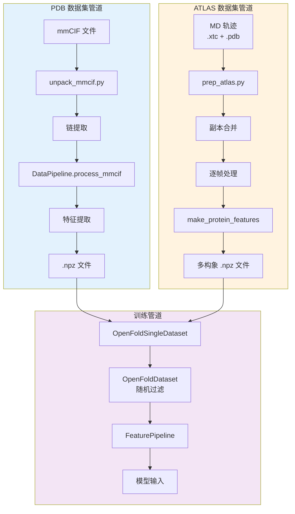

---
slug:20-data-preprocessing-for-pdb-and-atlas-datasets
blog_type:normal
---

数据预处理构成了 AlphaFlow 训练和推理管道的基础。本页面详细介绍了用于准备两个关键数据集的架构模式和实现细节：蛋白质数据库 (PDB) 结构和 ATLAS 分子动力学轨迹集合。预处理管道将原始结构数据转化为 flow matching 模型可以高效消费的标准化特征表示。

## 预处理架构概述

预处理架构采用模块化设计，为不同的数据源提供不同的管道。PDB 和 ATLAS 数据集都汇聚于同一种特征表示格式（.npz 文件），但采用适合其各自源特性的专门提取策略。架构由三个核心层组成：数据摄取、特征提取和数据集准备。

`DataPipeline` 类作为中央编排器，管理从原始结构格式到特征字典的转换。该管道独立于下游模型组件运行，通过多处理和并行处理策略实现高效预处理。

来源：[alphaflow/data/data_pipeline.py](alphaflow/data/data_pipeline.py#L409-L415), [alphaflow/data/data_modules.py](alphaflow/data/data_modules.py#L36-L65)

## PDB 数据集预处理

PDB 数据集预处理将来自蛋白质数据库 (PDB) 的大分子结构转化为可用于训练的特征表示。该过程从 mmCIF（大分子晶体学信息文件）解析开始，提取每个蛋白质链的结构元数据、原子坐标和链序列。

`unpack_mmcif.py` 脚本实现了批处理预处理工作流。对于每个 mmCIF 文件，脚本使用 `mmcif_parsing.parse()` 解析结构，遍历结构中的所有链，并提取链特定的信息，包括序列残基、发布日期和分辨率。然后，脚本通过 DataPipeline 处理每条链以生成结构特征，并将其保存为按 PDB ID 子目录组织的压缩 .npz 文件（例如，对于 PDB ID 1ABC 的 A 链，保存为 `data/ab/1abc_A.npz`）。这种组织方式实现了训练期间的高效查找，并符合标准 PDB 目录结构。

特征提取过程创建包含原子位置、残基掩码、序列特征和元数据的综合表示。`make_mmcif_features` 函数构建包含 `all_atom_positions`（每个原子的 3D 坐标）、`all_atom_mask`（指示有效原子）、`resolution`（实验分辨率值）、`release_date`（结构沉积日期）和 `is_distillation` 标志（对于 PDB 结构设置为 0）的特征字典。这些特征随后与由 `make_sequence_features` 生成的序列衍生特征相结合，后者对氨基酸类型、残基位置和链标识符进行编码。

来源：[scripts/unpack_mmcif.py](scripts/unpack_mmcif.py#L38-L67), [alphaflow/data/data_pipeline.py](alphaflow/data/data_pipeline.py#L52-L87), [alphaflow/data/data_pipeline.py](alphaflow/data/data_pipeline.py#L617-L646)

## ATLAS 数据集预处理

ATLAS 数据集预处理管道处理分子动力学轨迹数据，这与静态 PDB 结构有着根本的不同，因为每个蛋白质包含多个构象状态。ATLAS 数据库为每个蛋白质系统提供了三个独立的 MD 副本（R1, R2, R3），捕捉了训练蛋白质动力学生成模型所必需的构象多样性。

`prep_atlas.py` 脚本通过首先使用 MDTraj 加载并连接所有三个副本轨迹来编排 ATLAS 预处理，从而创建一个统一的轨迹对象。对于每个轨迹帧，脚本保存一个临时 PDB 结构，使用 `protein.from_pdb_string` 对其进行解析，并通过 `make_protein_features` 提取特征。关键是，脚本不是独立处理每一帧，而是将所有帧位置堆叠到单个数组中，创建多构象特征表示，其中 `all_atom_positions` 的形状为 `(num_frames, num_residues, num_atoms, 3)`。这种堆叠使得训练管道能够在训练期间对构象进行采样，让模型接触多样化的结构状态。

脚本以 100 帧为批次进行处理，以平衡内存效率与吞吐量，利用处理后被删除的临时文件。每个 ATLAS 条目生成一个包含所有构象的 .npz 文件，其中 `all_atom_positions` 张量维度代表时间轴。相应的 CSV 拆分文件（`splits/atlas.csv`）为 MSA 生成和比对提供序列信息。这种多构象表示对于学习蛋白质构象的分布（而不仅仅是静态结构）至关重要。

来源：[scripts/prep_atlas.py](scripts/prep_atlas.py#L38-L61), [splits/atlas.csv](splits/atlas.csv#L1-L20), [scripts/download_atlas.sh](scripts/download_atlas.sh#L1-L6)

<CgxTip>
ATLAS 预处理将所有轨迹帧堆叠到形状为 `(num_frames, num_res, num_atoms, 3)` 的单个张量中。这种设计允许数据加载器使用 `num_confs` 参数随机选择帧，从而在训练期间实现高效的构象采样，模拟多样化的结构状态，而无需为每一帧提供单独的文件。
</CgxTip>

## 数据集加载和过滤

`OpenFoldSingleDataset` 类提供了在训练期间加载预处理数据的主要接口。该类支持多种数据格式（.cif, .core, .pdb, .npz），并根据预处理阶段实现灵活的数据加载策略。对于预处理的 .npz 文件，加载器直接加载压缩的特征字典，避免了 mmCIF 文件昂贵的重新解析。该类通过 `data_pipeline._process_msa_feats` 方法整合来自比对目录的 MSA 特征，将结构特征与进化信息结合起来。

加载过程通过 `subsample_pos` 和 `num_confs` 参数处理单构象（PDB）和多构象（ATLAS）情况。对于 ATLAS 数据，`subsample_pos=True` 从堆叠位置中随机采样单个构象，而 `num_confs=N` 允许对每个样本的 N 个构象进行系统迭代。这种灵活性允许从单结构学习到基于集成的构象采样的训练策略。`first_as_template` 标志提供了一种机制，可以将第一帧作为下游处理的模板特征。

来源：[alphaflow/data/data_modules.py](alphaflow/data/data_modules.py#L160-L200)

## 随机过滤策略

`OpenFoldDataset` 类实现了 AlphaFold 的随机过滤策略，该策略动态选择训练样本以平衡数据集组成并强调代表性不足的数据。过滤结合了硬性确定性过滤器和概率性软过滤器，创建了防止大蛋白质家族过度表达或过度采样序列簇的训练分布。

确定性过滤器应用硬性质量标准，包括分辨率阈值（拒绝分辨率 > 9.0 Å 的结构）和序列组成检查（拒绝任何单一氨基酸占残基 > 80% 的序列）。这些过滤器移除了可能对训练产生负面影响的低质量结构和退化序列。

随机过滤器基于两个因素计算接受概率：簇大小和链长度。对于基于簇的过滤，接受概率为 `1/cluster_size`，确保大蛋白质家族根据其多样性而非丰富度做出贡献。对于基于长度的过滤，概率使用公式 `(1/512) * max(min(chain_length, 512), 256)` 随链长度缩放，为较长的链（256-512 个残基）赋予更高的概率，同时为较短的序列保持合理的概率。最终的接受概率是所有单个概率的乘积，从而实现乘法过滤。

`reroll()` 方法实现了按周期重采样，为每个训练周期生成新的数据集选择。这种设计防止了对特定样本子集的过拟合，并确保了跨周期的多样化训练接触。

来源：[alphaflow/data/data_modules.py](alphaflow/data/data_modules.py#L201-L322)

| 过滤器类型 | 参数 | 条件 | 操作 |
|-------------|-----------|-----------|--------|
| 确定性 | 分辨率 | > 9.0 Å | 拒绝样本 |
| 确定性 | 单个氨基酸比例 | > 80% | 拒绝样本 |
| 随机 | 簇大小 | > 0 | 概率 = 1/cluster_size |
| 随机 | 链长度 | 任意 | 概率 = (1/512) × max(min(len, 512), 256) |

## 特征处理管道

一旦加载了原始特征，`FeaturePipeline` 类就会通过基于配置的处理将它们转化为模型就绪的张量。`process_features` 方法调用 `np_example_to_features`，后者执行张量转换、删除矩阵转换和循环迭代设置。

处理管道应用特定于模式的转换：对于训练模式，基于 `config.supervised.clamp_prob` 的随机概率决定是否使用 clamped FAPE（帧对齐点误差）损失，而评估模式禁用 clamping。管道添加了形状为 `[max_recycling_iters + 1]` 的 `use_clamped_fape` 张量，控制跨循环迭代的损失计算。

`input_pipeline.process_tensors_from_config` 函数应用完整的 AlphaFold 特征处理管道，包括 MSA 处理、模板整合和基于配置参数的特征掩码。这确保了预处理数据接收到与推理时处理的数据相同的特征转换，从而保持训练-推理管道的一致性。

来源：[alphaflow/data/feature_pipeline.py](alphaflow/data/feature_pipeline.py#L73-L132)

<CgxTip>
特征管道将删除矩阵从整数格式转换为 float32 格式，并应用循环特定的转换。`use_clamped_fape` 张量控制是否应用 clamped FAPE 损失，该损失在早期训练周期约束距离预测以稳定学习。这在训练期间以 `clamp_prob` 概率启用，并在评估期间始终禁用。
</CgxTip>

## 与训练管道的集成

`OpenFoldDataModule` 将所有预处理组件集成到 PyTorch Lightning 数据模块中，管理数据集创建、数据加载器实例化以及训练/验证/预测拆分。数据模块支持三种不同的数据集类型：标准训练数据（通常是 PDB 结构）、蒸馏数据（自蒸馏或增强结构）和验证数据。

`setup()` 方法为每个具有适当配置的数据源实例化 `OpenFoldSingleDataset` 对象。对于训练，数据模块在单个数据集周围创建 `OpenFoldDataset` 包装器，以应用随机过滤和样本平衡。`_gen_dataloader()` 方法根据训练阶段配置批次整理、属性增强和迭代设置。

数据加载器实现通过 `OpenFoldBatchCollator` 处理批次组装，将特征字典堆叠到批次张量中。`OpenFoldDataLoader` 扩展了 PyTorch 的 DataLoader，以根据配置概率添加批次属性增强，从而在训练期间启用随机掩码和 MSA 子采样等技术。

来源：[alphaflow/data/data_modules.py](alphaflow/data/data_modules.py#L443-L660)

## 下一步

随着数据预处理的完成，接下来的逻辑步骤是了解这些特征如何通过 MSA 生成得到丰富。[使用 MMseqs2 进行 MSA 生成](18-msa-generation-with-mmseqs2) 页面详细介绍了向结构特征添加关键协同进化信息的进化比对过程。或者，要全面了解特征是如何转换和整合的，请继续阅读 [序列、结构和 MSA 的特征工程](21-feature-engineering-for-sequence-structure-and-msa)。