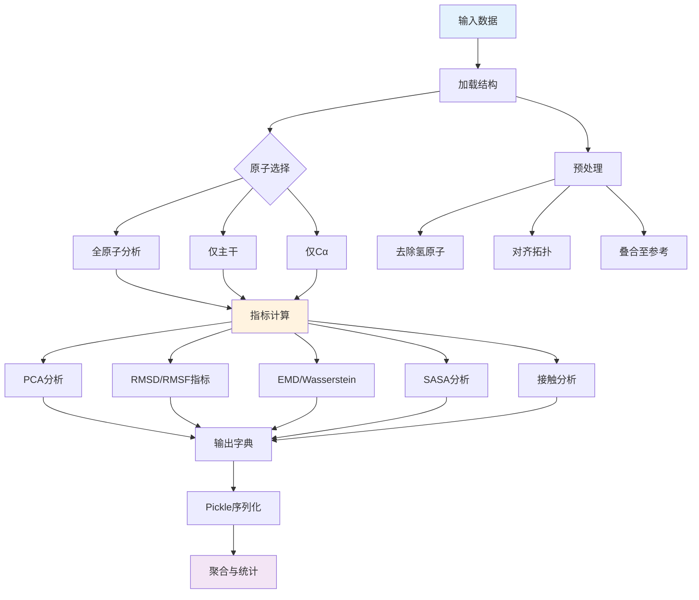
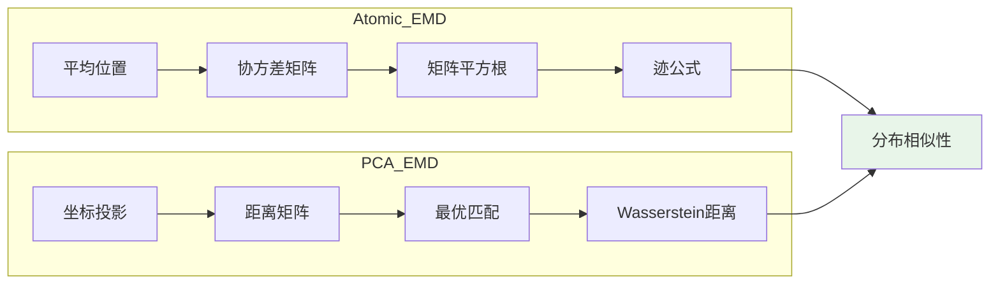

---
slug:22-ensemble-evaluation-metrics-on-atlas-dataset
blog_type:normal
---

ATLAS 数据集提供了一个全面的基准，用于通过将生成的蛋白质构象与生理温度下的显式溶剂分子动力学（MD）轨迹进行比较，来评估构象集合生成的质量。该评估框架量化了集合模型捕捉真实蛋白质动力学中存在的构象异质性的程度，超越了静态结构预测，评估了集合层面的保真度。

## 指标计算框架

集合评估流水线通过两个协调的脚本运行：`analyze_ensembles.py` 执行针对每个目标的指标计算，`print_analysis.py` 聚合多个目标的结果以进行统计分析。该工作流加载 MD 参考轨迹、生成的构象集合和晶体结构，然后计算一套全面的几何和统计指标。该流水线支持大规模评估的并行处理和灵活的原子选择（全原子、仅主干或仅 Cα），以专注于分析特定的结构方面。

来源：[scripts/analyze_ensembles.py](scripts/analyze_ensembles.py#L1-L100), [scripts/print_analysis.py](scripts/print_analysis.py#L1-L20)

## 主成分分析 (PCA) 指标

基于 PCA 的指标捕捉了构象方差的主要方向，并比较了集合模型与 MD 轨迹中观察到的主导运动模式的吻合程度。该分析对三个不同的坐标集执行 PCA：参考 MD 轨迹、生成的集合以及结合两者的联合分布。这种多维 PCA 方法使得能够比较不同空间中主成分所解释的方差，计算公式为 `explained_variance / n_atoms * 100` 以进行归一化。

参考集合和生成集合的第一主成分之间的余弦相似度量化了主导运动方向的一致性，接近 1.0 的值表示在主要构象模式上具有极好的对应关系。该框架还计算了坐标在不同 PCA 子空间中的投影，允许在降维空间中计算参考分布与生成分布之间的 Wasserstein 距离。典型的实现使用 K=2 个主成分，以便在效率和信息量之间取得平衡，进行分布比较。

来源：[scripts/analyze_ensembles.py](scripts/analyze_ensembles.py#L19-L27), [scripts/analyze_ensembles.py](scripts/analyze_ensembles.py#L132-L148)

<CgxTip>
联合 PCA 空间对于公平的分布比较特别有价值，因为它消除了在仅源自单一来源的空间中比较集合时可能产生的偏差。K=2 的维度选择在计算效率与捕捉最显著构象差异的能力之间取得了平衡，因为前几个 PC 通常解释了蛋白质系统中大部分生物学相关的运动。</CgxTip>

## RMSD 和 RMSF 指标

均方根偏差（RMSD）和均方根涨落（RMSF）指标提供了集合相似性和灵活性模式的原子级别见解。成对 RMSD 分布评估构象多样性的广度：框架使用广播操作计算每个集合内部以及集合之间的平均 RMSD 值和均方根（RMS）成对 RMSD 值。平均成对 RMSD 反映了平均的结构离散度，而 RMS 指标则赋予较大偏差更大的权重，使其对可能代表罕见但重要状态的异常值构象敏感。

RMSF 轮廓通过在将集合成员与参考结构对齐后计算原子位置的标准差，来量化每个残基的灵活性。评估计算 MD 参考轨迹和生成集合两者的 RMSF，然后计算这些轮廓之间的 Pearson、Spearman 和 Kendall 相关系数。高相关性表明集合模型准确地再现了 MD 模拟中观察到的相对灵活性模式，捕捉了哪些蛋白质区域是刚性的，哪些是柔性的。分析可以在全原子、仅主干或仅 Cα 表示上执行，以专注于构象动力学的特定方面。

来源：[scripts/analyze_ensembles.py](scripts/analyze_ensembles.py#L25-L32), [scripts/analyze_ensembles.py](scripts/analyze_ensembles.py#L149-L151), [scripts/print_analysis.py](scripts/print_analysis.py#L8-L13)

| 指标 | 描述 | 解读 |
|--------|-------------|----------------|
| 平均成对 RMSD | 所有构象对之间的平均 RMSD | 较高的值表示更大的构象多样性 |
| RMS 成对 RMSD | 成对 RMSD 分布的均方根 | 对大的构象异常值敏感 |
| 每个目标的 RMSF 相关性 | 每个蛋白质的 RMSF 轮廓的 Pearson 相关性 | 衡量灵活性模式再现的准确性 |
| 全局 RMSF 相关性 | 所有目标中所有残基的相关性 | 相对灵活性的整体一致性 |

## Earth Mover's Distance (EMD) 指标

Earth Mover's Distance，通过 Wasserstein 距离指标实现，提供了一种衡量构象集合之间分布不相似性的严格方法。该分析计算来自位置协方差矩阵的原子级 EMD 和来自坐标投影的 PCA 子空间 EMD。对于原子 EMD，框架计算两个集合的平均位置和协方差矩阵，然后应用矩阵平方根公式：`trace(Σ_ref + Σ_af - 2√(Σ_ref @ Σ_af))^0.5`，该公式量化了拟合到原子位置的多维高斯分布之间的最优传输成本。

PCA 子空间 EMD 通过在应用最优传输公式之前降低维度，提供了更易于处理的计算。该实现使用匈牙利算法（通过 `scipy.optimize.linear_sum_assignment`）计算集合成员之间的最优匹配，然后计算 Wasserstein-2 距离为 `distmat[row_ind, col_ind].mean()^(1/p)`。该分析计算多种 EMD 变体：参考集合内部以建立基线变异性、参考集合和生成集合之间以评估分布相似性，以及集合到参考结构的距离以量化收敛性。这些指标在参考 PCA 空间、生成集合 PCA 空间和联合 PCA 空间中计算，以进行全面比较。

来源：[scripts/analyze_ensembles.py](scripts/analyze_ensembles.py#L70-L88), [scripts/analyze_ensembles.py](scripts/analyze_ensembles.py#L154-L175)

<CgxTip>
由于集合大小有限导致的数值问题，当协方差矩阵不是半正定时，原子 EMD 计算可能会失败。该实现会捕获此异常并回退到计算 `trace(covar)^0.5` 作为更简单的基于方差的距离指标，确保在不同集合大小和蛋白质系统中的鲁棒性。</CgxTip>

## 溶剂可及表面积 (SASA) 分析

SASA 指标评估集合模型再现 MD 模拟中观察到的残基溶剂暴露模式的程度。该框架使用 Shrake-Rupley 算法（探针半径为 0.28 nm）计算每个残基的 SASA 值，然后通过对每个残基内除主干原子（CA, C, N, O, OXT）以外的原子求和，来压缩侧链 SASA 值。该分析应用阈值（0.02）将连续的 SASA 值转换为二元暴露状态，然后计算每个残基在集合成员中被暴露的概率。

互信息矩阵通过计算所有残基对的二元暴露状态之间的互信息，量化了协调的残基暴露模式。对于每个残基对（i, j），计算构建一个 2×2 联合概率矩阵，代表四种可能的暴露组合（暴露-暴露、暴露-埋藏、埋藏-暴露、埋藏-埋藏），然后使用公式 `MI = Σ p(x,y) log(p(x,y)/p(x)p(y))` 计算互信息。对角线元素设置为零以排除平凡的自信息。该分析计算参考集合和生成集合两者的互信息矩阵，然后计算这些矩阵之间的相关性，以评估协调的残基暴露网络的保留情况。

来源：[scripts/analyze_ensembles.py](scripts/analyze_ensembles.py#L34-L53), [scripts/analyze_ensembles.py](scripts/analyze_ensembles.py#L176-L189)

## 接触图分析

接触图分析通过比较参考 MD 轨迹和生成集合之间的接触概率，评估了残基间相互作用模式的保留情况。该框架计算每个集合中所有构象的成对距离矩阵，然后应用 0.8 nm 的阈值来定义接触。每个残基对的接触概率表示集合成员中存在该接触的比例，捕捉了相互作用在整个构象集合中的稳定性或短暂性。

该分析根据晶体结构参考和集合行为对接触进行分类：弱接触定义为存在于晶体结构中（距离 < 0.8 nm）但在少于 90% 的集合成员中观察到的接触，表明相互作用不稳定。瞬时接触定义为在晶体结构中不存在但在超过 10% 的集合成员中观察到的接触，捕捉了动态的相互作用形成。交并比（IoU）分数，计算为 `(mask_ref & mask_af).sum() / (mask_ref | mask_af).sum()`，量化了弱接触和瞬时接触类别中接触识别的一致性。此外，该框架通过将 SASA 阈值应用于在晶体结构中被归类为埋藏的残基，评估了埋藏残基的暴露，量化了这些残基预测暴露模式的 IoU。

来源：[scripts/analyze_ensembles.py](scripts/analyze_ensembles.py#L190-L199), [scripts/print_analysis.py](scripts/print_analysis.py#L21-L46)

| 接触类别 | 定义 | 评估指标 |
|------------------|------------|-------------------|
| 晶体接触 | 晶体结构中距离 < 0.8 nm | 二元比较 |
| 弱接触 | 存在于晶体中但在集合中概率 < 0.9 | IoU 分数 |
| 瞬时接触 | 在晶体中不存在但在集合中概率 > 0.1 | IoU 分数 |
| 埋藏残基暴露 | 晶体 SASA < 阈值且集合概率 > 0.1 | IoU 分数 |

## 统计聚合与报告

`print_analysis.py` 脚本在多个目标之间执行统计聚合，以生成集合级别的性能摘要。对于在每个目标分析中计算的每个指标，框架计算所有目标的中位数值，提供对异常值具有鲁棒性的稳健中心趋势估计。该分析还报告 MD 和生成集合指标之间的相关系数，以评估模型是否一致地再现特定目标的模式。

关键的聚合指标包括中位数值成对 RMSD（分别为 MD 和生成集合）、RMSF 相关性（全局每个残基和每个目标）、结合均值和方差分量的复合 RMWD（RMS Wasserstein 距离），以及在不同坐标空间中计算的 PCA Wasserstein 距离。该报告主成分余弦相似度超过 0.5 的目标百分比，量化了正确捕捉主导运动方向的频率。对于接触和 SASA 分析，脚本报告中位数 IoU 分数以及计算可行的目标比例（非 NaN 率），提供关于指标在不同系统中适用性的透明度。

来源：[scripts/print_analysis.py](scripts/print_analysis.py#L74-L111)

## 数据结构与输出格式

分析流水线将结果存储在具有 PDB 标识符作为顶级键的分层字典结构中。每个目标条目包含针对每个残基的指标数组（RMSF、SASA 概率、互信息矩阵）、针对集合级别比较的标量指标（成对 RMSD 值、EMD 分量）以及接触概率矩阵数组。`cosine_sim` 字段存储第一主成分的点积，而 `ref_variance`、`af_variance` 和 `joint_variance` 数组包含每个主成分解释的归一化方差。

所有目标的完整分析结果被序列化为路径为 `{pdbdir}/out.pkl` 的 pickle 文件，使得无需重新计算昂贵的轨迹指标即可进行后续的聚合和统计分析。聚合输出呈现一个为了可读性而转置的 DataFrame，行代表不同的指标，列代表不同的分析路径（通常是不同的模型配置或参数设置）。这种格式能够在全面的指标套件中快速比较集合生成方法。

来源：[scripts/analyze_ensembles.py](scripts/analyze_ensembles.py#L281-L286), [scripts/print_analysis.py](scripts/print_analysis.py#L110-L111)

## 后续步骤

有关集合评估的实际执行，请参阅 [运行集合分析脚本](23-running-ensemble-analysis-scripts)，其中提供了命令行用法详细信息和参数配置选项。要了解这些指标如何根据物理模拟进行验证，请参阅 [与 MD 轨迹的基准测试](24-benchmarking-against-md-trajectories)，其中讨论了解读指南和不同 AlphaFlow 模型变体的性能基准。