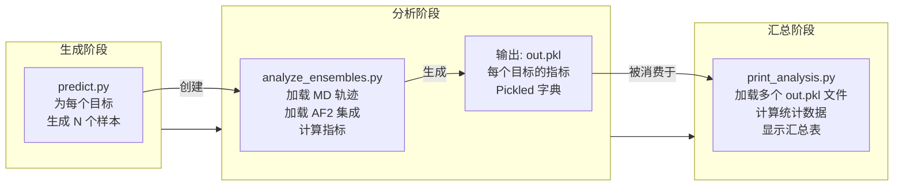
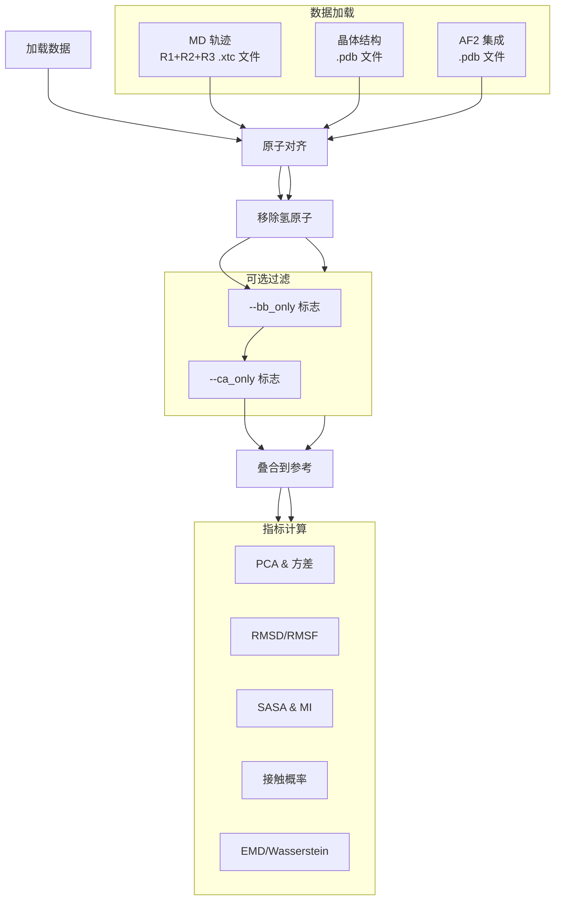

---
slug:23-running-ensemble-analysis-scripts
blog_type:normal
---


AlphaFlow 中的集成分析脚本提供了全面的评估指标，用于将生成的结构集成与分子动力学参考轨迹进行比较。这些脚本从多个维度量化集成多样性、结构准确性和构象采样质量，包括 RMSD 分布、主成分分析和基于接触的指标。

## 分析流程概述

集成分析工作流由三个相互关联的阶段组成：集成生成、比较分析和结果汇总。该流程能够系统性地评估 AlphaFlow 集成在多大程度上捕捉到了 MD 模拟中观察到的构象景观。



## 使用 predict.py 生成集成

在运行集成分析之前，你必须使用预测脚本生成结构集成。控制集成规模的关键参数是 `--samples`，它指定为每个目标序列生成的独立构象数量。

**基本集成生成命令：**

```bash
python predict.py \
  --input_csv splits/atlas.csv \
  --mode alphafold \
  --samples 50 \
  --steps 50 \
  --outpdb ./ensembles/atlas_ensemble \
  --weights path/to/checkpoint.pt
```

集成生成的关键参数包括：
- `--samples N`: 为每个序列生成 N 个独立构象（建议分析时使用 10-50 个）
- `--steps K`: 影响结构多样性的去噪步数（较高的值可能会降低多样性）
- `--tmax VALUE`: 控制探索范围的最大噪声调度值（默认 1.0）
- `--self_cond`: 启用自条件化以改善结构连贯性
- `--noisy_first`: 在第一步注入噪声以增强多样性

来源：[predict.py](scripts/predict.py#L2-L22)

## 使用 analyze_ensembles.py 运行集成分析

`analyze_ensembles.py` 脚本在生成的集成与来自 ATLAS 数据集的参考 MD 轨迹之间执行全面比较。它需要访问 ATLAS 目录（包含 MD 轨迹）和包含生成的集成 PDB 文件的目录。

**基本用法：**

```bash
python scripts/analyze_ensembles.py \
  --atlas_dir path/to/atlas \
  --pdbdir ./ensembles/atlas_ensemble \
  --num_workers 4
```

**命令行参数：**

| 参数 | 类型 | 必需 | 默认值 | 描述 |
|----------|------|----------|---------|-------------|
| `--atlas_dir` | str | 是 | - | 包含 ATLAS 数据集和 MD 轨迹的目录 |
| `--pdbdir` | str | 是 | - | 包含生成的集成 PDB 文件的目录 |
| `--pdb_id` | list | 否 | [] | 要分析的特定 PDB ID（如果为空则分析全部） |
| `--bb_only` | flag | 否 | False | 仅分析骨架原子（CA, C, N, O, OXT） |
| `--ca_only` | flag | 否 | False | 仅分析 C-alpha 原子 |
| `--num_workers` | int | 否 | 1 | 用于分析的并行进程数 |

来源：[analyze_ensembles.py](scripts/analyze_ensembles.py#L1-L10)

<CgxTip>
`--bb_only` 和 `--ca_only` 标志是互斥的，并提供不同级别的结构分辨率。使用 `--ca_only` 对大型集成进行快速筛选，使用 `--bb_only` 进行中等分辨率分析。全原子分析（默认）提供最全面的指标，但需要更多的计算时间。
</CgxTip>

## 计算的综合指标

分析脚本计算一组多维度的指标，用于评估几何精度和集成多样性。这些指标分为结构类、构象类和功能类。

### 结构指标

**RMSD 分析：**
- `ref_mean_pairwise_rmsd`: MD 帧之间的平均成对 RMSD（基线多样性）
- `af_mean_pairwise_rmsd`: 集成预测之间的平均成对 RMSD
- 使用 C-alpha 叠加测量每个集成内的结构多样性

**RMSF (均方根波动):**
- `ref_rmsf`: MD 轨迹中每个残基的波动
- `af_rmsf`: 生成集成中每个残基的波动
- 相对于晶体结构参考计算，能够识别柔性区域

来源：[analyze_ensembles.py](scripts/analyze_ensembles.py#L219-L220), [analyze_ensembles.py](scripts/analyze_ensembles.py#L185-L186)

### 构象景观指标

**主成分分析 (PCA):**
该脚本执行三种不同的 PCA 分析来比较构象空间：

1. **参考 PCA**: 在 MD 轨迹上训练的 PCA，应用于两个集成
2. **AF2 PCA**: 在 AF2 集成上训练的 PCA，应用于两个集成
3. **联合 PCA**: 在拼接的 MD + AF2 集成上训练的 PCA

对于每个 PCA，脚本计算：
- 解释方差比 (`ref_variance`, `af_variance`, `joint_variance`)
- 两个集成和晶体结构的坐标投影
- 主主成分之间的余弦相似度 (`cosine_sim`)

来源：[analyze_ensembles.py](scripts/analyze_ensembles.py#L166-L183), [analyze_ensembles.py](scripts/analyze_ensembles.py#L228)

**Wasserstein 距离 (推土机距离 - EMD):**
多个 EMD 指标量化集成之间的分布重叠：

- **分布之间的 EMD**: `ref|af` - 集成到集成的完整距离
- **均值到均值的距离**: `ref mean|af mean` - 集成质心之间的距离
- **内部集成距离**: `ref|ref mean`, `af|af mean` - 内在集成分布
- **参考到晶体的距离**: `ref|seed`, `af|seed` - 距晶体结构的距离

这些指标在三个 PCA 空间中计算：参考、AF2 和联合，从而提供构象相似性的全面视图。

来源：[analyze_ensembles.py](scripts/analyze_ensembles.py#L231-L266)

### 表面和接触指标

**溶剂可及表面积 (SASA) 分析：**
- 使用 0.02 nm² 阈值进行二元 SASA 分类
- `ref_sa_prob`: 每个残基在 MD 中溶剂可及的概率
- `af_sa_prob`: 每个残基在集成中溶剂可及的概率
- `crystal_sasa`: 晶体结构的静态 SASA

**侧链 SASA 凝聚：**
`condense_sidechain_sasas` 函数通过汇总所有非骨架原子（排除 CA, C, N, O, OXT）的贡献，将原子级 SASA 聚合为每个残基的值。

来源：[analyze_ensembles.py](scripts/analyze_ensembles.py#L198-L210), [analyze_ensembles.py](scripts/analyze_ensembles.py#L34-L52)

**接触概率分析：**
- `ref_contact_prob`: MD 中残基间接触的频率 (<0.8 nm)
- `af_contact_prob`: 生成集成中接触的频率
- `crystal_distmat`: 来自晶体结构的静态接触距离

接触分类识别三个类别：
- **弱接触**: 存在于晶体中但概率 <0.9
- **瞬时接触**: 晶体中不存在但动力学中概率 >0.1
- **强接触**: 存在于晶体中且概率 >0.9

来源：[analyze_ensembles.py](scripts/analyze_ensembles.py#L212-L217)

**互信息 (暴露子分析):**
`sasa_mi` 函数计算 SASA 状态之间的成对互信息，识别相关的表面暴露模式。这种“暴露子”分析揭示了残基可及性变化的协同性。

来源：[analyze_ensembles.py](scripts/analyze_ensembles.py#L54-L67)

## 数据处理流程

分析遵循系统的数据处理序列，确保结构对齐和一致的原子选择。



`align_tops` 函数识别轨迹和集成之间的交叉原子，确保所有计算的一致索引。使用固定种子 (137) 的随机采样 (`RAND1`, `RAND2`, `RAND1K`) 确保 MD 帧的可重现子采样，以便与集成进行比较。

来源：[analyze_ensembles.py](scripts/analyze_ensembles.py#L89-L97), [analyze_ensembles.py](scripts/analyze_ensembles.py#L146-L161)

## 输出格式和存储

`analyze_ensembles.py` 脚本输出一个单独的 pickled 字典 (`out.pkl`)，其中包含每个分析蛋白的所有计算指标。输出结构如下：

```python
{
    'protein_id': {
        'ca_mask': [...],                          # C-alpha 原子索引
        'ref_variance': np.array,                  # 解释方差比
        'af_variance': np.array,
        'joint_variance': np.array,
        'af_rmsf': np.array,                      # 每残基 RMSF
        'ref_rmsf': np.array,
        'emd_mean': np.array,                      # 每原子平均 EMD
        'emd_var': np.array,                       # 每原子方差 EMD
        'crystal_sasa': np.array,                  # 每残基晶体 SASA
        'ref_sa_prob': np.array,                   # MD SASA 概率
        'af_sa_prob': np.array,                    # 集成 SASA 概率
        'ref_mi_mat': np.array,                    # MD SASA 互信息
        'af_mi_mat': np.array,                     # 集成 SASA MI
        'ref_contact_prob': np.array,              # MD 接触概率矩阵
        'af_contact_prob': np.array,               # 集成接触概率
        'crystal_distmat': np.array,               # 晶体距离矩阵
        'ref_mean_pairwise_rmsd': float,           # MD 集成多样性
        'af_mean_pairwise_rmsd': float,            # 集成多样性
        'cosine_sim': float,                       # PC1 对齐
        'EMD,ref': {...},                          # 参考 PCA EMD 指标
        'EMD,af2': {...},                          # AF2 PCA EMD 指标
        'EMD,joint': {...}                         # 联合 PCA EMD 指标
    },
    ...
}
```

来源：[analyze_ensembles.py](scripts/analyze_ensembles.py#L285-L286)

## 使用 print_analysis.py 汇总结果

`print_analysis.py` 脚本汇总来自多个 `out.pkl` 文件的指标，并显示全面的汇总表。这使得能够比较不同模型、采样参数或实验条件。

**用法：**

```bash
python scripts/print_analysis.py \
  path/to/experiment1/out.pkl \
  path/to/experiment2/out.pkl \
  path/to/experiment3/out.pkl
```

**计算的汇总统计：**

| 指标 | 描述 | 计算 |
|--------|-------------|-------------|
| MD pairwise RMSD | 中位数 MD 集成多样性 | `ref_mean_pairwise_rmsd` |
| Pairwise RMSD | 中位数生成集成多样性 | `af_mean_pairwise_rmsd` |
| Pairwise RMSD r | 多样性之间的相关性 | Pearson 相关 |
| MD RMSF | 中位数 MD 每残基波动 | `ref_rmsf` |
| RMSF | 中位数集成每残基波动 | `af_rmsf` |
| Global RMSF r | 全局 RMSF 相关性 | 拼接 RMSF 上的 Pearson |
| Per target RMSF r | 中位数每目标 RMSF 相关性 | 每目标 RMSF 上的 Pearson |
| RMWD | 组合 平均+方差 EMD | √(emd_mean² + emd_var²) |
| RMWD trans | 均值分量 EMD | `emd_mean` |
| RMWD var | 方差分量 EMD | `emd_var` |
| MD PCA W2 | 中位数参考 PCA Wasserstein | 来自联合 PCA 的 `refemd` |
| Joint PCA W2 | 中位数联合 PCA Wasserstein | `jointemd` |
| PC sim > 0.5 % | PC1 对齐 > 0.5 的百分比 | `(cosine_sim > 0.5).mean()` |
| Weak contacts J | 中位数弱接触 IoU | Jaccard 指数 |
| Transient contacts J | 中位数瞬时接触 IoU | Jaccard 指数 |
| Exposed residue J | 中位数暴露 SASA IoU | Jaccard 指数 |
| Exposed MI matrix ρ | 中位数暴露子 MI 相关性 | Spearman 相关 |

来源：[print_analysis.py](scripts/print_analysis.py#L8-L108)

**为 RMSF 和 SASA 互信息计算的相关性指标**：
- Pearson 相关：线性关系
- Spearman 相关：单调关系
- Kendall tau：序数关联

这些相关性量化了集成是否捕捉到了正确的残基柔性 (RMSF) 和协同表面暴露 (暴露子 MI) 模式。

来源：[print_analysis.py](scripts/print_analysis.py#L8-L13)

## 并行处理和性能

两个分析脚本都支持并行执行，以高效处理大型数据集：

**analyze_ensembles.py:**
- 使用 Python 多进程 Pool 和 `--num_workers` 参数
- 独立处理每个 PDB ID
- 通过 tqdm 进度条跟踪进度
- 建议：典型工作负载使用 4-8 个工作进程

**并行执行示例：**

```bash
# 使用 8 个并行进程
python scripts/analyze_ensembles.py \
  --atlas_dir path/to/atlas \
  --pdbdir ./ensembles/atlas_ensemble \
  --num_workers 8
```

<CgxTip>
对于 ATLAS 数据集分析（约 100 个蛋白质），在典型硬件上，并行处理可将分析时间从约 2 小时（单进程）减少到约 15 分钟（8 个进程）。请确保有足够的内存可用，因为每个工作进程会将完整轨迹加载到内存中。
</CgxTip>

来源：[analyze_ensembles.py](scripts/analyze_ensembles.py#L275-L283)

## 解释关键指标

理解输出指标能够对集成质量进行有依据的评估：

**多样性指标：**
- `Pairwise RMSD` 接近 `MD pairwise RMSD`：集成捕捉到了适当的构象多样性
- `Pairwise RMSD >> MD pairwise RMSD`：过度多样化，可能是有噪声的集成
- `Pairwise RMSD << MD pairwise RMSD`：多样性不足，探索不充分

**精度指标：**
- `RMWD trans` (均值 EMD)：低值表示集成质心接近 MD 平均值
- `RMWD var` (方差 EMD)：低值表示集成分布匹配 MD 变异性
- `Global RMSF r` > 0.7：每残基柔性模式有强相关性

**构象指标：**
- `PC sim > 0.5 %`：捕捉到主要运动方向的蛋白质百分比
- `MD PCA W2` vs `Joint PCA W2`：较低的联合 PCA 距离表示构象子空间对齐更好

**表面/接触指标：**
- `Weak contacts J`：高 IoU 表示正确识别了边缘稳定的接触
- `Transient contacts J`：高 IoU 表示正确采样了非晶体相互作用
- `Exposed MI matrix ρ`：高相关性表示适当的协同表面动力学

来源：[print_analysis.py](scripts/print_analysis.py#L83-L110)

## 常见问题故障排除

**问题：对齐后原子计数不匹配**

```
ValueError: The number of atoms in top (X) didn't match the number of SASAs provided (Y)
```

**解决方案**：确保使用原子级 SASA 计算模式（mdtraj 中的 `mode='atom'`）。`condense_sidechain_sasas` 函数在处理之前验证原子计数。

来源：[analyze_ensembles.py](scripts/analyze_ensembles.py#L37-L43)

**问题：EMD 计算中出现奇异矩阵错误**

```
LinAlgError: Matrix is singular
```

**解决方案**：脚本捕获此异常并回退到使用 `np.trace(ref_covar)` 的对角线方差计算。当集成协方差矩阵由于多样性不足而接近奇异时，会发生这种情况。

来源：[analyze_ensembles.py](scripts/analyze_ensembles.py#L192-L195)

**问题：缺少晶体接触或 SASA 指标**

**解决方案**：这些指标要求 ATLAS 目录中存在晶体结构。验证所有分析蛋白的 `{name}.pdb` 文件是否存在。

## 完整工作流示例

```bash
# 步骤 1：为 ATLAS 蛋白生成集成
python predict.py \
  --input_csv splits/atlas_train.csv \
  --mode alphafold \
  --samples 50 \
  --steps 50 \
  --tmax 1.0 \
  --self_cond \
  --outpdb ./ensembles/alphaflow_atlas \
  --weights checkpoints/alphaflow_base.pt

# 步骤 2：运行集成分析
python scripts/analyze_ensembles.py \
  --atlas_dir ./data/atlas \
  --pdbdir ./ensembles/alphaflow_atlas \
  --num_workers 8

# 步骤 3：汇总并显示结果
python scripts/print_analysis.py \
  ./ensembles/alphaflow_atlas/out.pkl
```

此工作流程对 AlphaFlow 集成与 MD 轨迹进行综合评估，从而能够对生成模型在结构、构象和功能维度的性能进行定量评估。

有关特定指标及其物理意义的详细解释，请参阅 [ATLAS 数据集上的集成评估指标](22-ensemble-evaluation-metrics-on-atlas-dataset)。有关基准测试方法和与其他方法的比较分析，请参阅 [与 MD 轨迹的基准测试](24-benchmarking-against-md-trajectories)。