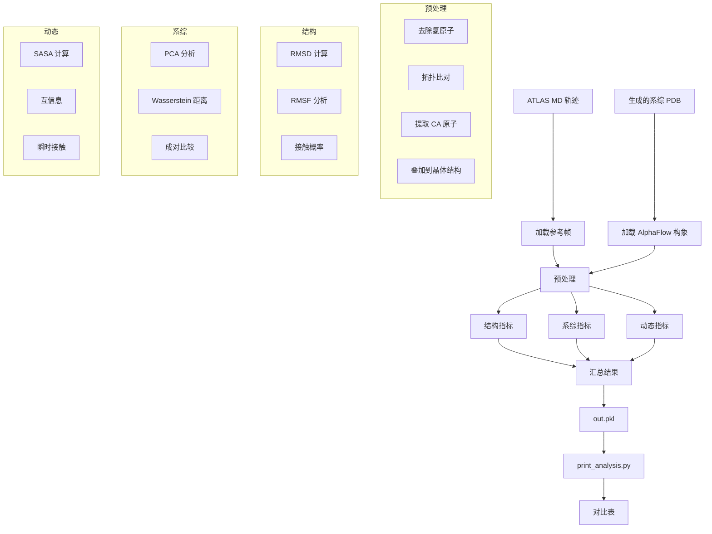

---
slug:24-benchmarking-against-md-trajectories
blog_type:normal
---


本页面详细介绍了用于评估 AlphaFlow 生成的构象系综与 ATLAS 数据集中的分子动力学（MD）轨迹相比的综合基准测试框架。该评估流程通过严格的统计指标，对结构相似性、系综多样性和动态行为进行了多方面的分析。

来源：[README.md](README.md#L100-L111), [scripts/analyze_ensembles.py](scripts/analyze_ensembles.py#L1-L10)

## 基准测试架构概述

基准测试框架作为一个系统化的流程运行，用于将生成的系综与参考 MD 轨迹进行比较。该工作流程整合了轨迹比对、结构分析和统计评估，涵盖了蛋白质动力学的多个维度。



## 核心评估指标

### 均方根偏差（RMSD）分析

基准测试框架通过多次成对比较计算 RMSD，以评估系综多样性和对参考结构的保真度。该实现支持广播操作，利用 numpy 广播机制实现高效的全对全比较。RMSD 值以埃（Ångströms）为单位报告，并除以原子数的平方根进行归一化，以便在不同蛋白质大小之间进行公平比较。

系统计算了参考轨迹（`ref_mean_pairwise_rmsd`）和生成系综（`af_mean_pairwise_rmsd`）的平均成对 RMSD，以及均方根成对 RMSD 值，以捕捉结构多样性的方差。随机采样策略（RAND1, RAND2）确保从大型轨迹集中进行稳健的统计估计。

来源：[scripts/analyze_ensembles.py](scripts/analyze_ensembles.py#L25-L33), [scripts/analyze_ensembles.py](scripts/analyze_ensembles.py#L220-L223)

### 均方根涨落（RMSF）相关性

RMSF 分析捕捉了整个系综中每个残基的柔性模式。该框架通过计算相对于晶体结构的涨落，为 MD 轨迹和生成的构象计算 RMSF。在参考和 AlphaFlow 的 RMSF 谱之间计算相关系数，包含三个聚合级别：所有残基的全局相关性、每个目标的相关性以及全原子 RMSF 值。

高 RMSF 相关性表明 AlphaFlow 成功捕捉了 MD 模拟中观察到的构象动力学，包括识别柔性环区和刚性二级结构元件。

来源：[scripts/analyze_ensembles.py](scripts/analyze_ensembles.py#L178-L179), [scripts/print_analysis.py](scripts/print_analysis.py#L8-L14)

### 主成分分析（PCA）

在三个不同的坐标空间上执行 PCA，以全面评估系综重叠度：

1. **参考 PCA**：在 MD 轨迹坐标上计算 PCA，并将 AlphaFlow 构象投影到该子空间中
2. **AlphaFlow PCA**：在生成的系综坐标上计算 PCA，并将 MD 帧投影到该子空间中
3. **联合 PCA**：在连接的 MD 和 AlphaFlow 轨迹上计算 PCA，以分析共享方差

该框架计算第一主成分之间的余弦相似度（`cosine_sim`）以评估主要运动模式的对齐情况。每个主成分解释的方差除以原子数进行归一化，从而能够比较不同蛋白质大小的结果。

来源：[scripts/analyze_ensembles.py](scripts/analyze_ensembles.py#L154-L166), [scripts/analyze_ensembles.py](scripts/analyze_ensembles.py#L230)

### Wasserstein 距离（Earth Mover's Distance）

该框架计算 Wasserstein 距离（特别是 W₂）以量化 PCA 子空间中系综之间的分布差异。该实现使用通过 `linear_sum_assignment` 调用的匈牙利算法来高效解决最优传输问题。

计算了三种类型的 Wasserstein 距离：
- **参考空间**：在参考 PCA 坐标中 MD 帧与 AlphaFlow 构象之间的 W₂
- **AlphaFlow 空间**：在 AlphaFlow PCA 坐标中计算的 W₂
- **联合空间**：在联合 PCA 子空间中的 W₂

基准测试还使用公式 `emd_int = sqrt(emd^2 - emd_tr^2)` 分离了平均位移和方差（内部）差异的贡献，其中 `emd_tr` 代表仅由均值差异产生的贡献。

来源：[scripts/analyze_ensembles.py](scripts/analyze_ensembles.py#L70-L83), [scripts/analyze_ensembles.py](scripts/analyze_ensembles.py#L193-L196)

## 接触和溶剂可及性分析

### 接触概率分析

接触分析评估生成的系综是否捕捉到了在 MD 中观察到的残基-残基相互作用模式。该框架计算所有帧对的距离矩阵，并使用 8Å 截断阈值计算接触概率。

计算了两种专门的接触指标：

1. **弱接触**：存在于晶体结构中（< 8Å）但在系综中出现概率 < 0.9 的接触，捕捉边缘或瞬时天然相互作用
2. **瞬时接触**：在晶体结构中不存在但在系综中出现概率 > 0.1 的接触，代表非天然或替代构象

交并比（IoU）指标量化了参考和 AlphaFlow 接触模式之间关于弱接触和瞬时接触的一致性。

来源：[scripts/analyze_ensembles.py](scripts/analyze_ensembles.py#L205-L206), [scripts/print_analysis.py](scripts/print_analysis.py#L27-L41)

### 溶剂可及表面积（SASA）和互信息

SASA 分析评估表面暴露模式和相关的残基行为。该框架使用 Shrake-Rupley 算法配合 2.8Å 探针半径计算原子级 SASA，然后将侧链 SASA 聚合为每个残基的值。

如果 SASA 超过 0.02 nm² 阈值，残基被分类为“暴露”。该框架使用以下公式计算所有暴露残基对之间的互信息矩阵：

`MI(X,Y) = Σ P(x,y) log(P(x,y) / P(x)P(y))`

该互信息矩阵捕捉相关的表面行为模式，这可能表明变构通信或协同折叠事件。参考和 AlphaFlow MI 矩阵展平值之间的相关性（`exposon_mi_pearsonr`）量化了这些高级动力学的保留程度。

来源：[scripts/analyze_ensembles.py](scripts/analyze_ensembles.py#L34-L53), [scripts/analyze_ensembles.py](scripts/analyze_ensembles.py#L200-L203), [scripts/print_analysis.py](scripts/print_analysis.py#L55-L64)

## 运行基准测试流程

### 先决条件和数据准备

基准测试流程需要包含每个目标的 MD 轨迹和晶体结构的 ATLAS 数据集。在运行分析之前，必须下载并预处理数据集。

步骤 1：下载 ATLAS 数据集，其中包含每个目标的 MD 轨迹（通常是三个副本模拟 `prod_R1`, `prod_R2`, `prod_R3`，格式为 `.xtc`）以及参考 PDB 结构。

步骤 2：准备 PDB 格式的生成系综文件。每个目标应该有一个包含 250 个构象模型的 PDB 文件。构象的数量会影响某些指标，不同数量之间的比较不具有直接可比性。

来源：[README.md](README.md#L100-L111), [scripts/analyze_ensembles.py](scripts/analyze_ensembles.py#L99-L110)

### 执行命令

分析分两个阶段进行：系综分析和结果汇总。

**阶段 1：运行系综分析**

```bash
python -m scripts.analyze_ensembles \
  --atlas_dir [ATLAS_路径] \
  --pdbdir [系综_路径] \
  --num_workers [N] \
  [--pdb_id TARGET1 TARGET2 ...] \
  [--bb_only] \
  [--ca_only]
```

命令行参数提供了分析范围的灵活性：

- `--atlas_dir`：包含 MD 轨迹和参考 PDB 的目标目录的 ATLAS 数据集路径
- `--pdbdir`：包含生成的系综 PDB 文件的目录路径（每个目标一个）
- `--num_workers`：用于多目标分析的并行进程数（默认：1）
- `--pdb_id`：要分析的特定目标 ID 的可选列表；如果未指定，则处理 `--pdbdir` 中的所有目标
- `--bb_only`：仅分析骨架原子（CA, C, N, O, OXT）的标志
- `--ca_only`：仅分析 C-alpha 原子以进行更高级别比较的标志

该脚本在 `--pdbdir` 中输出一个 `out.pkl` 文件，其中包含为每个分析的目标计算指标的字典。

来源：[scripts/analyze_ensembles.py](scripts/analyze_ensembles.py#L1-L10), [scripts/analyze_ensembles.py](scripts/analyze_ensembles.py#L275-L283)

**阶段 2：汇总并打印结果**

```bash
python -m scripts.print_analysis [PATH1/out.pkl] [PATH2/out.pkl] ...
```

该脚本接受多个 `out.pkl` 路径，并生成一个格式化的对比表，其中包含所有目标的平均指标。输出包括 RMSF 和 MI 矩阵的 Pearson 相关系数、平均 EMD 值以及接触和 SASA 分析的 IoU 分数。

来源：[scripts/print_analysis.py](scripts/print_analysis.py#L1-L7), [scripts/print_analysis.py](scripts/print_analysis.py#L110-L111)

### 内部流程工作流

对于每个目标，分析流程遵循以下顺序：

1. **加载轨迹**：将三个 MD 副本轨迹（R1, R2, R3）连接成一个统一的参考轨迹，并从 PDB 加载 AlphaFlow 构象
2. **预处理**：去除氢原子，使用原子表示的交集对齐参考和生成结构之间的拓扑，并提取 CA 原子用于 CA 侧重分析
3. **叠加**：将参考轨迹和生成的构象都与晶体结构对齐，以确保一致的坐标系
4. **计算指标**：执行上述描述的所有结构、系综和动态分析
5. **存储结果**：返回一个包含该目标所有计算指标的字典

随机种子（137）确保所有随机操作的可重复采样，包括选择用于成对比较的 MD 帧以及均值/协方差计算。

来源：[scripts/analyze_ensembles.py](scripts/analyze_ensembles.py#L99-L120), [scripts/analyze_ensembles.py](scripts/analyze_ensembles.py#L137-L153)

## 模型性能对比

### 48 层 vs 12 层模型变体

该框架已用于基准测试不同的模型配置，揭示了准确性和计算效率之间的权衡。以下对比总结了 ATLAS 数据集上不同模型变体的关键指标：

| 指标 | 48l (base) | 48l (distilled) | 12l (base) | 12l (distilled) |
|:---|:---:|:---:|:---:|:---:|
| 成对 RMSD | 2.18 Å | 1.73 Å | 1.94 Å | 1.40 Å |
| 成对 RMSD $r$ | 0.94 | 0.92 | 0.81 | 0.76 |
| 全原子 RMSF | 1.31 Å | 1.00 Å | 1.01 Å | 0.76 Å |
| 全局 RMSF $r$ | 0.91 | 0.89 | 0.78 | 0.74 |
| 每个目标的 RMSF $r$ | 0.90 | 0.88 | 0.89 | 0.86 |
| 均方根 $\mathcal{W}_2$-dist | 1.95 Å | 2.18 Å | 2.26 Å | 2.43 Å |
| MD PCA $\mathcal{W}_2$-dist | 1.25 Å | 1.41 Å | 1.40 Å | 1.56 Å |
| 联合 PCA $\mathcal{W}_2$-dist | 1.58 Å | 1.68 Å | 1.78 Å | 1.90 Å |
| % PC-sim > 0.5 | 44% | 43% | 46% | 39% |
| 弱接触 $J$ | 0.62 | 0.51 | 0.60 | 0.56 |
| 瞬时接触 $J$ | 0.47 | 0.42 | 0.36 | 0.24 |
| 暴露残基 $J$ | 0.50 | 0.47 | 0.47 | 0.44 |
| 暴露 MI 矩阵 $\rho$ | 0.25 | 0.18 | 0.21 | 0.13 |
| **运行时间** | **38 s** | **3.8 s** | **15.2 s** | **1.56 s** |

<CgxTip>蒸馏模型实现了约 10 倍的加速，而 RMSF 相关性（0.89→0.88）和 PCA 相似性指标仅有适度下降，使其适用于高通量应用。</CgxTip>

12 层变体比 48 层基础模型提供 2.5 倍的加速，同时在大多数指标上保持有竞争力的性能。蒸馏的 12 层模型提供最快的推理速度（1.56s），并且对于许多应用来说具有可接受的准确性。

来源：[assets/12l_md_templates.md](assets/12l_md_templates.md), [README.md](README.md#L9-L10)

### 指标解释指南

使用此基准测试框架评估模型性能时，请考虑以下指标类别：

**结构保真度指标**
- **成对 RMSD**：较低的值表示构象多样性较少；接近 MD 参考值的值表示适当的系综广度
- **成对 RMSD $r$**：成对 RMSD 矩阵之间的相关系数；值 > 0.8 表示对结构关系的强保留
- **全原子 RMSF**：平均涨落幅度；较低的值可能表示结构过于刚性
- **全局 RMSF $r$**：每个残基涨落的相关性；> 0.85 表示对柔性模式的准确捕捉

**分布相似性指标**
- **MD PCA $\mathcal{W}_2$-dist**：较低的值（1.2-1.6 Å）表示在 MD PCA 子空间中有更好的分布重叠
- **联合 PCA $\mathcal{W}_2$-dist**：捕捉共享方差空间中的重叠；值 < 2.0 Å 被认为是好的
- **% PC-sim > 0.5**：第一主成分余弦相似度 > 0.5 的目标百分比；> 40% 表示一致的主模式对齐

**动态行为指标**
- **弱接触 $J$**：边缘天然接触的 IoU；较高的值（> 0.5）表示对边缘相互作用的更好捕捉
- **瞬时接触 $J$**：非天然接触的 IoU；值 0.2-0.5 表示对替代构象的适当探索
- **暴露 MI 矩阵 $\rho$**：互信息模式的相关性；> 0.2 表示对相关表面行为的保留

<CgxTip>一个平衡的模型应该实现高 RMSF 相关性（> 0.85）、良好的 Wasserstein 对齐（在 MD PCA 空间中 < 1.6 Å）和适中的瞬时接触 IoU（> 0.3），表明既保真又具有适当的系综多样性。</CgxTip>

来源：[scripts/print_analysis.py](scripts/print_analysis.py#L16-L73), [assets/12l_md_templates.md](assets/12l_md_templates.md)

## 与模型选择的集成

基准测试结果根据应用需求指导模型选择：

- **高精度应用**：当精度至关重要且计算资源可用时，使用 48 层基础模型
- **平衡性能**：12 层基础模型提供 2.5 倍的加速，且准确性损失最小（大多数指标上 5-10%）
- **高通量筛选**：蒸馏模型提供 10 倍的加速，且具有可接受的初步分析退化
- **模板条件建模**：MD+Templates 模型利用已知结构在模板可用时提高准确性

有关基于用例选择模型的详细指导，请参阅 [Choosing the Right Model for Your Use Case](5-choosing-the-right-model-for-your-use-case)。有关模板集成方法论，请参考 [Template Integration for MD+Templates Models](13-template-integration-for-md-templates-models)。