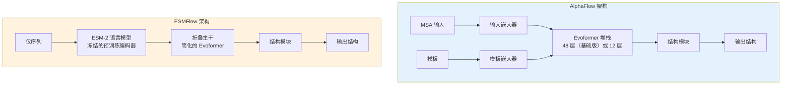
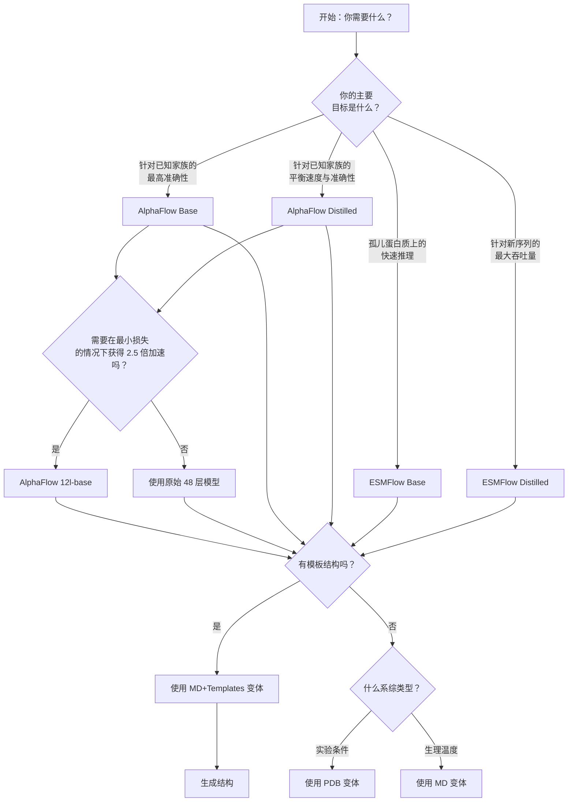

---
slug:3-alphaflow-vs-esmflow-model-families
blog_type:normal
---


AlphaFlow 提供两个不同的模型系列——AlphaFlow 和 ESMFlow，它们基于不同的基础架构构建，但都通过流匹配（flow matching）进行了增强，用于生成式蛋白质系综建模。本指南将帮助你理解它们之间的关键差异，并为你的用例选择合适的模型。

## 架构概览

这两个系列之间的根本区别在于它们的序列表示策略：AlphaFlow 通过 Evoformer 架构利用多重序列比对（MSA）信息，而 ESMFlow 使用预训练蛋白质语言模型（ESM-2）作为其序列编码器。



### AlphaFlow：基于 MSA 的架构

AlphaFlow 基于 AlphaFold 2 架构构建，包含了完整的 Evoformer 流水线以及 MSA 处理能力。该模型由几个关键组件组成：用于初始特征处理的 InputEmbedder 和 RecyclingEmbedder，用于处理额外 MSA 序列的可选 ExtraMSAEmbedder 和 ExtraMSAStack，用于迭代表示优化的核心 EvoformerStack，以及用于 3D 坐标预测的 StructureModule [alphafold.py#L40-L95](alphaflow/model/alphafold.py#L40-L95)。

<CgxTip>
Evoformer 堆栈是 AlphaFlow 的计算核心，它执行多达 48 层（基础模型）或 12 层（12l 模型）的迭代注意力操作，以优化 MSA 和成对表示。这是模型学习将来自 MSA 的进化信息与结构约束相结合的地方。
</CgxTip>

AlphaFlow 模型通过模板嵌入和模板成对堆栈支持可选的模板信息，当存在同源结构时，这可以显著提高准确性。该架构包含流匹配组件，具有输入成对嵌入和时间投影，用于生成目标 [alphafold.py#L100-L115](alphaflow/model/alphafold.py#L100-L115)。

### ESMFlow：基于语言模型的架构

ESMFlow 用 ESM-2 蛋白质语言模型替代了依赖 MSA 的 Evoformer，它提供了丰富的序列表示，而无需外部 MSA 数据。该架构包括预训练的 ESM 模型（冻结、半精度）、具有可学习权重的 ESM 特征组合层、用于将 ESM 特征转换为适当维度的 MLP，以及处理 LM 特征的简化 FoldingTrunk [esmfold.py#L49-L95](alphaflow/model/esmfold.py#L49-L95)。

ESM 模型对原始氨基酸序列进行操作，并在所有 Transformer 层上生成嵌入，然后使用学习权重将这些嵌入组合起来。这消除了生成 MSA 的需要，使 ESMFlow 非常适合快速推理，特别是对于同源物很少的序列 [esmfold.py#L137-L155](alphaflow/model/esmfold.py#L137-L155)。

<CgxTip>
ESM-2 在训练期间保持冻结（禁用梯度计算），这显著减少了内存使用并加快了训练速度。可学习的 esm_s_combine 参数允许模型对来自冻结语言模型不同层的表示进行最佳加权。
</cgt_tip>

## 输入要求对比

这两个系列之间最实际的区别在于它们的输入要求，这会影响设置时间、计算成本以及在不同场景下的适用性。

| 要求 | AlphaFlow | ESMFlow |
|-------------|-----------|---------|
| **主要输入** | 序列 + MSA（.a3m 文件） | 仅序列 |
| **可选输入** | 模板结构（PDB 文件） | 模板结构（仅限 MD+Templates 模型） |
| **MSA 生成** | 必需（MMseqs2 搜索或 ColabFold 服务器） | 不需要 |
| **序列限制** | ~700-1000 个残基（使用分块处理） | ~700-1000 个残基（使用分块处理） |
| **设置复杂度** | 高（需要 MSA 数据库和搜索） | 低（仅需序列输入） |

### AlphaFlow 数据流水线

运行 AlphaFlow 需要预先计算好的 A3M 格式 MSA 比对结果。模型期望 MSA 组织在目录结构中，路径类似于 `{alignment_dir}/{name}/a3m/{name}.a3m`。对于没有现有 MSA 的用户，AlphaFlow 提供了两种选择：通过 mmseqs_query 脚本查询 ColabFold 服务器，或针对 UniRef30 和 ColabDB 数据库运行本地 MMseqs2 搜索 [README.md#L73-L81](README.md#L73-L81)。

对于 MD+Templates 变体，还必须提供模板 PDB 文件，其中包含无残基缺口单链。这些模板提供结构指导，可以显著提高准确性，特别是对于远缘同源序列 [README.md#L82-L84](README.md#L82-L84)。

### ESMFlow 数据流水线

ESMFlow 仅需要氨基酸序列，极大地简化了工作流程。该模型提供了方便的推理方法（`infer_pdb`、`infer_pdbs`），可以直接接受原始序列，使其成为快速原型设计和大规模生成任务的理想选择 [esmfold.py#L422-L424](alphaflow/model/esmfold.py#L422-L424)。

该模型在内部处理分词，将 AF2 氨基酸索引转换为 ESM 的编码方案。可以提供可选的掩码模式以探索不同的构象样本，尽管这通常仅用于研究而非标准推理 [esmfold.py#L133-L136](alphaflow/model/esmfold.py#L133-L136)。

## 模型变体和版本

AlphaFlow 和 ESMFlow 系列共享相同的变体命名方案，其中模型针对特定系综类型在不同数据集上进行了训练：

### 特定数据集变体

| 模型类型 | 训练数据 | 目标应用 |
|------------|---------------|-------------------|
| **PDB** | 来自 PDB 的实验结构 | 建模实验系综（不同条件下的 X 射线/冷冻电镜） |
| **MD** | 300K 下的全原子显式溶剂 MD 轨迹 | 建模生理温度下的热力学系综 |
| **MD+Templates** | 带有 PDB 参考结构的 MD 轨迹 | 建模由已知结构指导的 MD 系综 |

### 大小和速度配置

在每个数据集类型中，提供了针对不同用例优化的不同配置的模型：

| 配置 | 描述 | 速度 | 准确性 |
|--------------|-------------|-------|----------|
| **Base** | 完整的 48 层 Evoformer (AlphaFlow) 或完整的 ESM-2 (ESMFlow) | 基准 | 最高准确性 |
| **Distilled** | 降低精度、更小的网络 | 比基础版快 2-3 倍 | 准确性略有降低 |
| **12l-base**（仅 AlphaFlow） | 12 层 Evoformer 而非 48 层 | 比 48 层基础版快 2.5 倍 | 性能小幅下降 |

蒸馏版本使用较低精度权重和减少参数数量等技术来加速推理，使其适用于在可接受一定准确性损失的高通量生成任务。12 层 AlphaFlow 变体提供了一个折中方案，在最小准确性损失的情况下提供了显著的加速（快 2.5 倍）[README.md#L24-L26](README.md#L24-L26)。

## 性能和权衡

在模型系列和变体之间进行选择时，请考虑以下关键权衡：

### AlphaFlow 与 ESMFlow 的权衡

**AlphaFlow 优势：**
- 当丰富的 MSA 信息可用时，准确性更高
- 在具有许多同源物的蛋白质上表现更好
- 更具可解释性（MSA 注意力模式提供进化见解）
- 模板集成更成熟且经过充分测试

**AlphaFlow 劣势：**
- 需要 MSA 生成（缓慢、计算成本高）
- 对于同源物很少的孤儿蛋白质性能下降
- 设置复杂度和基础设施要求更高
- 由于 MSA 处理开销，推理速度较慢

**ESMFlow 优势：**
- 仅序列输入（无需 MSA）
- 更快的推理（无需 MSA 搜索或处理）
- 在同源物很少的孤儿蛋白质上表现更好
- 设置复杂度和基础设施要求更低
- 在所有蛋白质家族中表现一致

**ESMFlow 劣势：**
- 当丰富的 MSA 可用时，通常准确性较低
- 模型尺寸较大（ESM-2 约有 650M 参数）
- 可解释性较差（LM 表示更难分析）
- 模板集成不太成熟

### 实际考虑

对于涉及具有可用同源物的经过充分研究的蛋白质家族的大多数用例，AlphaFlow-PDB 或 AlphaFlow-MD 模型将提供最佳结果。MSA 生成的额外计算成本是合理的，特别是当建模实验系综或高精度应用时。

对于孤儿蛋白质、快速探索许多序列或 MSA 基础设施不可用的情况，ESMFlow 模型以更简单的设置提供出色的结果。ESMFlow 对于大规模筛选任务或处理没有进化亲属的新型蛋白质设计特别有价值。

## 模型选择指南

根据你的特定用例，遵循以下决策流程：



### 快速参考表

| 用例 | 推荐模型 | 基本原理 |
|----------|-------------------|-----------|
| 高精度实验系综（丰富 MSA） | AlphaFlow-PDB base | 利用进化信息获得最佳准确性 |
| 具有参考结构的热力学系综 | AlphaFlow-MD+Templates base | 模板指导 + MD 训练 |
| 新型蛋白质的大规模筛选 | ESMFlow-PDB distilled | 无需 MSA 的快速推理 |
| 新序列的快速原型设计 | ESMFlow-MD base | 良好的准确性，仅序列输入 |
| 计算预算紧张的生产部署 | AlphaFlow 12l-distilled 或 ESMFlow distilled | 针对速度优化 |
| 孤儿蛋白质构象采样 | ESMFlow-MD base | 比使用糟糕 MSA 的 AlphaFlow 更好 |

## 推理入门

这两个系列的推理接口略有不同。对于 AlphaFlow 模型，请使用带有 MSA 目录的 `--mode alphafold` 标志：

```bash
python predict.py --mode alphafold \
  --input_csv splits/atlas_test.csv \
  --msa_dir ./alignment_dir \
  --weights params/alphaflow_pdb_base_202402.pt \
  --samples 10 \
  --outpdb ./output
```

对于 ESMFlow 模型，使用 `--mode esmfold` 并省略 MSA 目录：

```bash
python predict.py --mode esmfold \
  --input_csv splits/atlas_test.csv \
  --weights params/esmflow_pdb_base_202402.pt \
  --samples 10 \
  --outpdb ./output
```

predict.py 脚本根据模式标志自动配置适当的模型并加载指定的权重 [predict.py#L6-L7](predict.py#L6-L7)，[predict.py#L42-L46](predict.py#L42-L46)。

## 后续步骤

既然你了解了 AlphaFlow 和 ESMFlow 系列之间的差异，请探索更多详细方面：

- 在 [模型版本：Base、Distilled 和 12 层配置](4-model-versions-base-distilled-and-12-layer-configurations) 中了解特定模型配置及其权衡
- 在 [为你的用例选择合适的模型](5-choosing-the-right-model-for-your-use-case) 中获取针对你的特定场景选择最佳模型的指导
- 在 [Evoformer 和折叠主干架构](8-evoformer-and-folding-trunk-architecture) 中深入了解架构基础