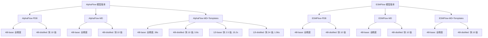

---
slug:4-model-versions-base-distilled-and-12-layer-configurations
blog_type:normal
---


AlphaFlow 提供了多种模型配置，旨在平衡准确性、计算效率和特定的应用需求。本页面详细介绍了可用的模型版本、它们的架构差异、性能特征，以及为你的用例选择合适模型的指导。

## 模型版本概述

AlphaFlow 在其模型系列中提供了三个主要配置维度：

1. **基础模型**：具有 48 个 Evoformer 层的全精度模型
2. **蒸馏模型**：通过知识蒸馏训练的压缩版本，以实现更快的推理
3. **12 层模型**：具有 12 个 Evoformer 层的浅层架构变体，以实现最大效率

这些配置在三个模型系列中可用：**AlphaFlow-PDB**（在实验结构上训练）、**AlphaFlow-MD**（在 MD 轨迹上训练）和 **AlphaFlow-MD+Templates**（带有模板输入的 MD 模型）。同样，ESMFlow 模型也提供了基于 ESMFold 架构的相应配置。

来源：[README.md](README.md#L47-L56)，[alphaflow/config.py](alphaflow/config.py#L400-L419)

## 基础模型架构

基础模型代表了 AlphaFlow 架构的全容量实现，紧密遵循 AlphaFold2 的设计，同时结合了用于生成式建模的流匹配修改。

### 核心架构组件

基础模型利用包含 48 个处理块的深层 Evoformer 堆栈，从而能够从序列和结构信息中进行复杂的表征学习。该架构包含几个关键模块：

- **输入嵌入**：使用 InputEmbedder 将原始序列和 MSA 特征转换为初始表征，MSA 特征的维度为 c_m=256，成对特征的维度为 c_z=128
- **Evoformer 堆栈**：48 个迭代细化块，通过注意力操作和成对池化更新 MSA 和成对表征，捕获复杂的生物模式
- **结构模块**：通过 8 个不变点注意力块将最终表征转换为原子坐标，生成全原子蛋白质结构
- **辅助头**：预测距离图、LDDT 分数和其他辅助输出，用于训练和评估

流匹配目标通过高斯傅里叶投影集成，该投影将噪声时间步 t 嵌入到成对表征中，从而实现对构象集合的生成式建模。训练过程以 `noise_prob` 的概率随机采样噪声水平，并可选择性地以 `self_cond_prob` 的概率应用自条件化。

来源：[alphaflow/model/alphafold.py](alphaflow/model/alphafold.py#L59-L100)，[alphaflow/config.py](alphaflow/config.py#L469-L485)，[alphaflow/model/wrapper.py](alphaflow/model/wrapper.py#L88-L113)

### 训练配置

基础模型经历多阶段训练：

1. **初始训练**：在 PDB 结构上进行预训练，并使用流匹配进行微调，使用诸如 crop_size=256、max_msa_clusters=128 等参数和标准数据增强
2. **微调**：通过调整超参数并可能使用更大的上下文窗口（crop_size=384，max_msa_clusters=512）来适应特定领域（PDB 集合或 MD 轨迹）
3. **模板集成**：对于 MD+Templates 模型，额外的训练通过 `extra_input` 机制以 `extra_input_prob` 的概率整合模板结构

训练流水线采用具有衰减参数的指数移动平均（EMA）来稳定模型权重，推理期间使用 EMA 权重以提高泛化能力。

来源：[alphaflow/config.py](alphaflow/config.py#L23-L58)，[alphaflow/model/wrapper.py](alphaflow/model/wrapper.py#L243-L249)

## 蒸馏模型

蒸馏模型通过知识蒸馏提供速度与精度的权衡，其中学生模型学习近似较大的教师模型的行为。这种方法在最小性能下降的情况下显著减少了推理时间。

### 蒸馏过程

蒸馏训练利用师生框架，其中教师（通常是基础模型）生成轨迹预测，学生模型学习复现这些预测。该过程的关键组件包括：

- **教师轨迹生成**：教师模型使用 11 个时间步（np.linspace(1, 0, 11)）进行带调度的去噪过程执行完整的流匹配，在每个时间步生成中间构象
- **直接学生学习**：学生模型仅接收教师的最终预测作为目标，学习在单次前向传播中预测完整轨迹，推理设置使用 `no_diffusion=True` 和 `noisy_first=True`
- **自条件化选项**：当启用 `distill_self_cond` 时，学生可以使用教师的中间输出作为条件信号

这种方法有效地将迭代去噪过程压缩为单个预测，极大地降低了推理成本。学生模型保持相同的架构，但学习直接从噪声扰动的结构预测最终构象。

来源：[alphaflow/model/wrapper.py](alphaflow/model/wrapper.py#L62-L101)，[alphaflow/model/wrapper.py](alphaflow/model/wrapper.py#L115-L124)，[alphaflow/utils/parsing.py](alphaflow/utils/parsing.py#L46-L49)

### 性能特征

蒸馏模型提供了显著的速度提升，并伴随适度的精度权衡：

| 指标 | 基础模型 | 蒸馏模型 | 变化 |
|--------|-----------|-----------------|---------|
| 运行时间 | 38.0 | 3.8 | **快 10 倍** |
| 成对 RMSD | 2.18 | 1.73 | -20.6% |
| 全原子 RMSF | 1.31 | 1.00 | -23.7% |
| 全局 RMSF 相关性 | 0.91 | 0.89 | -2.2% |
| 弱接触 J | 0.62 | 0.51 | -17.7% |

对于 ESMFlow 模型，蒸馏版本提供了类似的加速比，使它们特别适用于可以接受适度精度的高通量应用。

来源：[assets/12l_md_templates.md](assets/12l_md_templates.md#L1-L17)，[README.md](README.md#L61-L74)

### 推理配置

使用蒸馏模型时，需要特定的推理参数：

```bash
# 蒸馏模型的基本参数
python predict.py --mode alphafold --input_csv [PATH] --msa_dir [DIR] \
    --weights [DISTILLED_WEIGHTS] --samples [N] --outpdb [DIR] \
    --noisy_first --no_diffusion
```

`--noisy_first` 参数确保模型生成初始噪声结构，而 `--no_diffusion` 禁用迭代去噪过程，因为蒸馏模型是直接进行预测的。这些设置对于实现预期的性能特征至关重要。

来源：[README.md](README.md#L117-L123)

## 12 层配置

12 层（12l）模型代表了针对 AlphaFlow-MD+Templates 模型系列的架构优化，将模型深度从 48 个 Evoformer 块减少到 12 个，同时保持必要的建模能力。当有参考结构（PDB 或 AlphaFold 预测）可用时，这种配置特别有价值。

### 架构修改

12 层配置实施了几个关键的架构更改：

- **减少的 Evoformer 深度**：从 48 个块减少到 12 个（`no_blocks: 12`），将计算复杂度降低了大约 4 倍
- **保持的维度**：保持相同的特征维度（c_z=128，c_m=256）以保持表征能力
- **优化的结构模块**：结构模块参数保持一致（8 个块，c_s=384），确保最终结构生成质量

深度的减少主要影响迭代细化过程，模型更新表征的机会减少。然而，剩余的块经过优化以捕获最关键的模式，特别是当模板信息指导预测时。

来源：[alphaflow/config.py](alphaflow/config.py#L469-L485)，[alphaflow/model/trunk.py](alphaflow/model/trunk.py#L72-L88)

### 性能比较

12 层配置为模板引导的建模提供了卓越的速度和精度平衡：

| 指标 | 48l-Base | 12l-Base | 48l-Distilled | 12l-Distilled |
|--------|----------|---------|---------------|---------------|
| 运行时间 | 38.0 | 15.2 | 3.8 | **1.56** |
| 成对 RMSD | 2.18 | 1.94 | 1.73 | 1.40 |
| 成对 RMSD 相关性 | 0.94 | 0.81 | 0.92 | 0.76 |
| 全原子 RMSF | 1.31 | 1.01 | 1.00 | 0.76 |
| 全局 RMSF 相关性 | 0.91 | 0.78 | 0.89 | 0.74 |
| 均方根 W₂ 距离 | 1.95 | 2.26 | 2.18 | 2.43 |
| 瞬时接触 J | 0.47 | 0.36 | 0.42 | 0.24 |

值得注意的是，12l-base 模型在某些指标上实际上优于 48l-base（更低的成对 RMSD 和全原子 RMSF），这表明当有模板可用时，减少深度可能会减少过拟合。然而，相关性指标显示了预期的权衡，12 层模型在模式复现保真度方面较低。

来源：[assets/12l_md_templates.md](assets/12l_md_templates.md#L1-L17)，[README.md](README.md#L57-L60)

<CgxTip>12l-distilled 模型比 48l-base 模型实现了显著的 24.4 倍加速（38.0s → 1.56s），同时保持了许多应用可接受的性能，使其成为大规模模板引导预测的理想选择。</CgxTip>

## 模型系列变体

除了架构配置（基础/蒸馏/12l）外，AlphaFlow 模型还根据训练数据和能力进行分类：

### AlphaFlow-PDB 模型

这些模型在 PDB 的实验结构上训练，旨在捕获在不同实验条件（X 射线晶体学、冷冻电镜、NMR）下观察到的构象异质性。它们擅长建模：

- 晶体结构中存在的替代构象
- 不同实验条件下的集合变化
- 实验数据中捕获的自然结构灵活性

当使用具有实验结构可用作参考点的蛋白质时，PDB 模型特别适用。

### AlphaFlow-MD 模型

这些模型在 300K 生理温度下的全原子显式溶剂分子动力学轨迹上训练，学习蛋白质运动的物理动力学。它们针对以下方面进行了优化：

- 预测生理条件下的热力学集合
- 建模现实的构象路径
- 捕获随时间变化的结构波动

MD 模型在推理期间不需要模板输入，仅依赖序列和 MSA 信息。

### AlphaFlow-MD+Templates 模型

这些模型结合了 MD 训练数据和模板集成，将 PDB 结构作为额外输入。这种混合方法提供了：

- 当有参考结构可用时提高准确性
- 更好地建模相对于已知状态的构象变化
- 提高同源序列的性能

MD+Templates 系列是目前唯一提供 12 层配置的系列，因为模板信息有助于补偿减少的模型容量。

### ESMFlow 模型

ESMFlow 变体使用 ESMFold 架构（ESM-2 3B 参数语言模型）作为主干，而不是 AlphaFold2 架构。它们提供了：

- 更快的无 MSA 推理（无需生成 MSA）
- 来自语言模型的不同表征偏差
- 在许多应用中与 AlphaFlow 相当的性能

ESMFlow 模型遵循相同的基础/蒸馏配置模式，但目前没有 12 层变体。

来源：[README.md](README.md#L18-L24)，[README.md](README.md#L47-L74)

## 模型选择指南

选择合适的模型版本取决于你的具体要求和约束：

### 优先考虑准确性

- **AlphaFlow-MD+Templates (48l-base)**：当有模板可用时，MD 应用程序的最佳整体准确性
- **AlphaFlow-MD (48l-base)**：无模板的 MD 预测的最佳选择
- **AlphaFlow-PDB (48l-base)**：实验集合建模的最佳选择

这些模型提供最高保真度的预测，但需要最多的计算资源。

### 优先考虑速度

- **AlphaFlow-MD+Templates (12l-distilled)**：最快的模板引导预测（比 48l-base 快 24.4 倍）
- **AlphaFlow-MD+Templates (distilled)**：比 48l-base 快 10 倍，适度精度损失
- **ESMFlow-PDB (distilled)**：最快的无 MSA 预测

在处理大量蛋白质或推理时间至关重要时，使用蒸馏或 12 层模型。

### 内存受限环境

- **12 层模型**：由于深度减少，内存占用显著降低
- **蒸馏模型**：单次推理带来的适度内存节省
- 在配置中启用 `--use_lma` 或 `--offload_inference` 标志以获得额外的内存节省

### 模板可用性

- **有模板**：AlphaFlow-MD+Templates（任何配置）以获得最佳结果
- **无模板**：AlphaFlow-MD 或 AlphaFlow-PDB 模型
- **有模板但想要速度**：AlphaFlow-MD+Templates 12l-distilled 以获得最佳权衡

### 特定应用程序建议

| 应用程序 | 推荐模型 | 基本原理 |
|-------------|-------------------|-----------|
| 药物设计流水线 | AlphaFlow-MD+Templates 48l-base | 结合位点建模的最大准确性 |
| 大规模蛋白质组分析 | AlphaFlow-MD+Templates 12l-distilled | 处理数千个蛋白质的速度至关重要 |
| 冷冻电镜图谱解释 | AlphaFlow-PDB 48l-base | 匹配实验条件 |
| MD 轨迹初始化 | AlphaFlow-MD 48l-base | 物理动力学建模 |
| 实时预测 | ESMFlow-PDB distilled | 无 MSA 推理以提高速度 |

来源：[README.md](README.md#L57-L60)，[README.md](README.md#L117-L127)，[alphaflow/config.py](alphaflow/config.py#L251-L278)

## 性能比较总结

以下全面比较总结了所有模型版本的关键特征：



**关键性能指标**（针对标准推理上的 AlphaFlow-MD+Templates）：

| 配置 | 准确性 | 速度 | 最适用于 |
|---------------|----------|-------|----------|
| 48l-base | ★★★★★ | ★☆☆☆☆ | 最大准确性，研究应用 |
| 48l-distilled | ★★★★☆ | ★★★☆☆ | 平衡性能，生产使用 |
| 12l-base | ★★★☆☆ | ★★★★☆ | 具有良好准确性的模板引导预测 |
| 12l-distilled | ★★☆☆☆ | ★★★★★ | 带模板的高通量应用 |

来源：[assets/12l_md_templates.md](assets/12l_md_templates.md#L1-L17)，[README.md](README.md#L61-L74)

## 可用的模型权重

所有模型权重均公开可用，可下载用于推理或微调：

### AlphaFlow 模型权重

| 模型 | 版本 | 权重 URL |
|-------|---------|-------------|
| AlphaFlow-PDB | base | https://storage.googleapis.com/alphaflow/params/alphaflow_pdb_base_202402.pt |
| AlphaFlow-PDB | distilled | https://storage.googleapis.com/alphaflow/params/alphaflow_pdb_distilled_202402.pt |
| AlphaFlow-MD | base | https://storage.googleapis.com/alphaflow/params/alphaflow_md_base_202402.pt |
| AlphaFlow-MD | distilled | https://storage.googleapis.com/alphaflow/params/alphaflow_md_distilled_202402.pt |
| AlphaFlow-MD+Templates | base | https://storage.googleapis.com/alphaflow/params/alphaflow_md_templates_base_202402.pt |
| AlphaFlow-MD+Templates | distilled | https://storage.googleapis.com/alphaflow/params/alphaflow_md_templates_distilled_202402.pt |
| AlphaFlow-MD+Templates | 12l-base | https://storage.googleapis.com/alphaflow/params/alphaflow_12l_md_templates_base_202406.pt |
| AlphaFlow-MD+Templates | 12l-distilled | https://storage.googleapis.com/alphaflow/params/alphaflow_12l_md_templates_distilled_202406.pt |

### ESMFlow 模型权重

| 模型 | 版本 | 权重 URL |
|-------|---------|-------------|
| ESMFlow-PDB | base | https://storage.googleapis.com/alphaflow/params/esmflow_pdb_base_202402.pt |
| ESMFlow-PDB | distilled | https://storage.googleapis.com/alphaflow/params/esmflow_pdb_distilled_202402.pt |
| ESMFlow-MD | base | https://storage.googleapis.com/alphaflow/params/esmflow_md_base_202402.pt |
| ESMFlow-MD | distilled | https://storage.googleapis.com/alphaflow/params/esmflow_md_distilled_202402.pt |
| ESMFlow-MD+Templates | base | https://storage.googleapis.com/alphaflow/params/esmflow_md_templates_base_202402.pt |
| ESMFlow-MD+Templates | distilled | https://storage.googleapis.com/alphaflow/params/esmflow_md_templates_distilled_202402.pt |

<CgxTip>所有模型的训练检查点可根据要求提供用于研究合作， enabling 专门应用的微调或持续训练。</CgxTip>

来源：[README.md](README.md#L61-L84)

## 后续步骤

既然你了解了可用的模型版本及其特征，你可能想要探索：

- **[为你的用例选择合适的模型](5-choosing-the-right-model-for-your-use-case)** - 基于特定应用程序要求和约束的模型选择详细指导
- **[AlphaFlow 与 ESMFlow 模型系列](3-alphaflow-vs-esmflow-model-families)** - 两种主要模型架构的比较分析
- **[推理流水线和采样过程](14-inference-pipeline-and-sampling-process)** - 使用不同模型配置运行推理的技术细节

如需动手实践，请参阅 [快速入门](2-quick-start) 指南来设置你的环境，并使用最适合你需求的模型运行你的第一次预测。