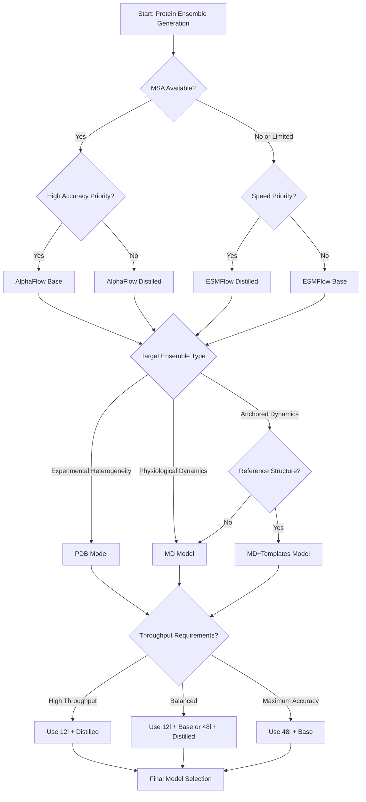

---
slug:5-choosing-the-right-model-for-your-use-case
blog_type:normal
---

本页面提供了一个系统化的框架，用于根据你的具体用例、性能要求和可用的计算资源，选择合适的 AlphaFlow 或 ESMFlow 模型变体。理解这些权衡对于在蛋白质构象系综生成中获得最佳结果至关重要。

## 模型系列：AlphaFlow 与 ESMFlow

第一个决策点涉及在两个架构系列之间进行选择，每个系列都具有适合不同场景的独特特征。

*展示流匹配方法的蛋白质构象系综生成动画*

**AlphaFlow 模型**利用 AlphaFold 架构，使用多序列比对（MSA）来获取进化信息。这些模型通常在具有深度 MSA 和保守序列良好的靶标上实现更高的精度，因为进化上下文提供了强大的结构约束 [predict.py](/predict.py#L3-L22)。预先计算 MSA 的要求增加了预处理开销，但在许多实验结构建模任务中能够实现卓越的性能 [predict.py](/predict.py#L5-L6)。

**ESMFlow 模型**基于 ESMFold 构建，后者使用蛋白质语言模型嵌入而不是 MSA。这完全消除了 MSA 生成的需求，显著减少了预处理时间。ESMFlow 对于同源物有限的新颖序列或需要快速迭代的情况特别有利 [predict.py](/predict.py#L6-L22)。对于孤儿蛋白或具有浅层 MSA 的序列，ESMFlow 由于从大规模无监督预训练中学习到的鲁棒表示，通常优于 AlphaFlow。

<CgxTip>
根本的架构差异决定了你的数据管道：AlphaFlow 需要一个包含 `.a3m` 格式文件的 MSA 目录，位于 `{alignment_dir}/{name}/a3m/{name}.a3m`，而 ESMFlow 直接从序列输入运行。
</CgxTip>

## 训练目标：PDB vs MD vs MD+Templates

一旦你选择了一个架构系列，接下来就要选择与你的应用领域一致的训练目标。这个选择决定了模型生成的构象系综的类型。

| 模型类型 | 训练数据 | 最佳用例 | 系综特征 |
|------------|---------------|---------------|--------------------------|
| **AlphaFlow-PDB** | PDB 实验结构（X-ray，cryo-EM） | 从实验数据建模构象异质性 | 捕获不同实验条件下的静态快照 |
| **AlphaFlow-MD** | 300K 下的全原子显式溶剂 MD 轨迹 | 生成与生理学相关的构象景观 | 产生反映生理温度下热波动的动态系综 |
| **AlphaFlow-MD+Templates** | 带有参考结构条件化的 MD 轨迹 | 当存在高质量参考结构时的系综生成 | 利用模板信息引导围绕已知构象的系综多样性 |

[README.md](/README.md#L40-L52)

**PDB 模型**专为那些想要理解在实验环境中观察到的结构变异性的场景而设计。这些系综反映了不同晶体形式、cryo-EM 重建或实验条件之间的构象差异，使其成为研究 PDB 中捕获的功能性构象变化的理想选择。

**MD 模型**针对不同的目标：生成与在 300K 下进行的分子动力学模拟中观察到的热波动相匹配的系综。这些模型学习蛋白质构象在生理温度下的玻尔兹曼分布，使其适用于研究内在动力学、变构机制，或为下游计算任务生成训练数据。

**MD+Templates 模型**代表了一种混合方法。通过条件化于参考 PDB 结构（templates_dir 参数），这些模型生成锚定于已知构象的类 MD 系综 [predict.py](/predict.py#L4-L14)。当你拥有高质量的实验或预测结构，并想要探索围绕该参考状态的可访问构象空间时，这特别有价值，其应用包括柔性对接、基于系综的药物设计，或在保持全局折叠完整性的同时研究局部动力学。

## 性能与速度：Base、Distilled 和 12-Layer 配置

最后一个维度涉及通过模型大小和训练方法来平衡准确性和计算成本。

### Base 与 Distilled 模型

**Distilled 模型**使用师生蒸馏进行训练，其中较大的基础模型作为教师指导较小的学生模型。这个过程显著减少了模型大小和推理时间，同时保持了大部分性能 [alphaflow/model/wrapper.py](/alphaflow/model/wrapper.py#L72-L125)。蒸馏变体使用减少的层数和隐藏维度，在一些基准测试中以适度的精度代价实现了 10 倍的加速 [assets/12l_md_templates.md](/assets/12l_md_templates.md#L1-L17)。

这种权衡在基准测试结果中得到了量化：对于 MD+Templates 模型，蒸馏版本将每个系综的运行时间从 38s 减少到 3.8s，同时 RMSF 指标的相关系数保持在 0.88 以上 [assets/12l_md_templates.md](/assets/12l_md_templates.md#L1-L17)。对于需要高通量生成或实时应用的生产环境，蒸馏模型通常代表了最佳平衡。

<CgxTip>
使用蒸馏模型时，你必须在推理期间附加 `--noisy_first --no_diffusion` 参数，因为这些模型是使用这种优化策略训练的 [predict.py](/predict.py#L17-L19)。
</CgxTip>

### 48-Layer 与 12-Layer 配置

一项较新的优化专门针对 MD+Templates 模型引入了 **12 层版本**，取代了标准的 48 层 Evoformer 层。这些模型实现了 2.5 倍的加速（Base 从 38s 降至 15.2s，Distilled 从 3.8s 降至 1.56s），且性能下降最小 [assets/12l_md_templates.md](/assets/12l_md_templates.md#L1-L17)。性能指标显示，12 层模型保持了大部分系综质量，RMSF 相关系数仍然具有竞争力（0.78-0.89 vs 48 层版本的 0.89-0.91）[assets/12l_md_templates.md](/assets/12l_md_templates.md#L1-L17)。

对于需要大量采样或批量处理大型蛋白质数据集的场景，12 层配置通常能提供最佳的计算投资回报，尤其是在与模板条件化结合使用时。

## 决策框架

此流程图引导你完成关键的决策点。在确定你的模型系列和训练目标后，请考虑 12 层变体是否能为你的需求提供足够的性能。对于大多数高通量应用，12 层蒸馏配置提供了卓越的性价比，而基准质量的结果则保证了 48 层基础模型。

## 按模型类型分类的配置要求

每个模型变体都有特定的推理要求，必须满足这些要求才能正确运行。

### AlphaFlow 模型

所有 AlphaFlow 模型都需要 MSA 并支持高级推理选项：

**必需参数：**
- `--mode alphafold`
- `--input_csv [PATH]` - 包含 name 和 seqres 列的 CSV 文件
- `--msa_dir [DIR]` - 包含 `.a3m` 格式 MSA 文件的目录
- `--weights [PATH]` - 模型权重的路径
- `--samples [N]` - 要生成的系综成员数量
- `--outpdb [DIR]` - PDB 文件的输出目录

[predict.py](/predict.py#L3-L12)

**PDB 模型的推荐选项：**
- `--self_cond --resample` - 通过启用自条件化和 MSA 重采样显著提高性能 [predict.py](/predict.py#L15-L16)

**蒸馏模型所必需：**
- `--noisy_first --no_diffusion` - 对于正确的蒸馏模型推理至关重要 [predict.py](/predict.py#L17-L18)

**其他选项：**
- `--pdb_id [ID]` - 从输入 CSV 中选择特定条目
- `--tmax [VALUE]` - 最大扩散时间（默认 1.0）
- `--steps [N]` - 扩散步数（默认 10）
- 较低的值（例如 `--tmax 0.2 --steps 2`）会提高精度但降低多样性 [predict.py](/predict.py#L16-L20)

### ESMFlow 模型

由于没有 MSA 处理，ESMFlow 模型的要求更简单：

**必需参数：**
- `--mode esmfold`
- `--input_csv [PATH]`
- `--weights [PATH]`
- `--samples [N]`
- `--outpdb [DIR]`

[predict.py](/predict.py#L3-L12)

**蒸馏模型所必需：**
- `--noisy_first --no_diffusion` [predict.py](/predict.py#L17-L18)

### MD+Templates 模型

这些模型需要额外的模板结构输入：

**额外必需参数：**
- `--templates_dir [DIR]` - 包含与 CSV 名称匹配的模板 PDB 文件的目录 [predict.py](/predict.py#L14)

模板 PDB 文件应仅包含单条链且没有残基间隙 [README.md](/README.md#L89-L92)。

## 用例推荐

基于架构维度和配置要求，以下是针对常见场景的具体推荐：

### 场景 1：高通量筛选

**推荐：** ESMFlow-PDB Distilled 或 AlphaFlow-PDB 12l-Distilled

对于筛选大量序列且速度至关重要、中等精度即可的情况，蒸馏的 ESMFlow 变体完全消除了 MSA 预处理开销。当进化信息至关重要且 MSA 可用时，AlphaFlow-PDB 12l-distilled 提供了速度和精度的最佳组合，可在标准 GPU 硬件上每分钟生成 10-20 个系综 [assets/12l_md_templates.md](/assets/12l_md_templates.md#L1-L17)。

### 场景 2：精确的 MD 系综生成

**推荐：** AlphaFlow-MD+Templates 48l-Base

当生成系综以与实际 MD 轨迹进行基准测试或研究细微动力学时，请使用带有模板条件化的基础 48 层模型。模板提供了强大的结构锚点，而完整的架构捕捉了细微的热波动。预计每个系综的运行时间约为 38 秒 [assets/12l_md_templates.md](/assets/12l_md_templates.md#L1-L17)。

### 场景 3：具有有限同源物的新颖蛋白质

**推荐：** ESMFlow-MD 或 ESMFlow-MD+Templates Base

对于孤儿蛋白或具有浅层 MSA 的序列，ESMFlow 架构利用了比依赖 MSA 的方法泛化能力更强的语言模型表示。使用基础模型以获得最大精度，如果存在任何结构同源物，请考虑模板条件化 [predict.py](/predict.py#L6-L22)。

### 场景 4：柔性对接准备

**推荐：** AlphaFlow-MD+Templates 12l-Distilled

在制备系综对接库时，12 层蒸馏模型提供了卓越的吞吐量，同时保持了足够的系综质量，以采样围绕参考结构的相关构象空间。每个系综约 1.56 秒的运行时间使得能够为每个靶标生成数千个构象 [assets/12l_md_templates.md](/assets/12l_md_templates.md#L1-L17)。

### 场景 5：基准测试和发表

**推荐：** AlphaFlow-PDB 或 AlphaFlow-MD 48l-Base

为了生成旨在发表或与实验数据进行严格基准测试的结果，请使用完整的 48 层基础模型并采用适当的采样设置。确保为 PDB 模型使用 `--self_cond --resample` 以获得最佳报告性能 [predict.py](/predict.py#L15-L16)。

## 与训练管道的集成

对于计划微调或扩展这些模型的用户，请理解不同的起始检查点服务于不同的目的：

- **AlphaFlow-PDB base** 是所有其他变体的基础，在 PDB 结构上使用标准流匹配微调进行训练 [train.py](/train.py#L21-L30)
- **MD 变体** 在 ATLAS 轨迹数据上继续训练，并带有额外的采样配置 [train.py](/train.py#L42-L52)
- **蒸馏** 使用带有教师模型检查点的 `--distillation` 标志 [train.py](/train.py#L53-L60)
- **12 层模型** 涉及对 Evoformer 堆栈深度的架构修改

在扩展这些模型时，请考虑你的计算资源：蒸馏训练所需的轮数减少 5 倍（`--train_epoch_len 16000` vs `80000`），并且可以省略梯度累积 [train.py](/train.py#L53-L60)。

## 下一步

选择你的模型后，请继续查看实现细节：

- 关于流匹配集成的理论基础，请参阅 [Flow Matching Objective Integration with AlphaFold](6-flow-matching-objective-integration-with-alphafold)
- 要了解推理机制和采样策略，请查看 [Inference Pipeline and Sampling Process](14-inference-pipeline-and-sampling-process)
- 要准备你的数据管道，请查阅 [MSA Generation with MMseqs2](18-msa-generation-with-mmseqs2) 和 [Template Processing and Feature Extraction](19-template-processing-and-feature-extraction)
- 要评估你生成的系综，请参考 [Ensemble Evaluation Metrics on ATLAS Dataset](22-ensemble-evaluation-metrics-on-atlas-dataset)