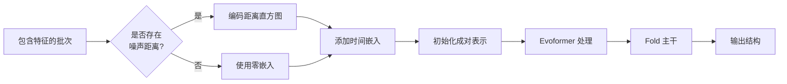
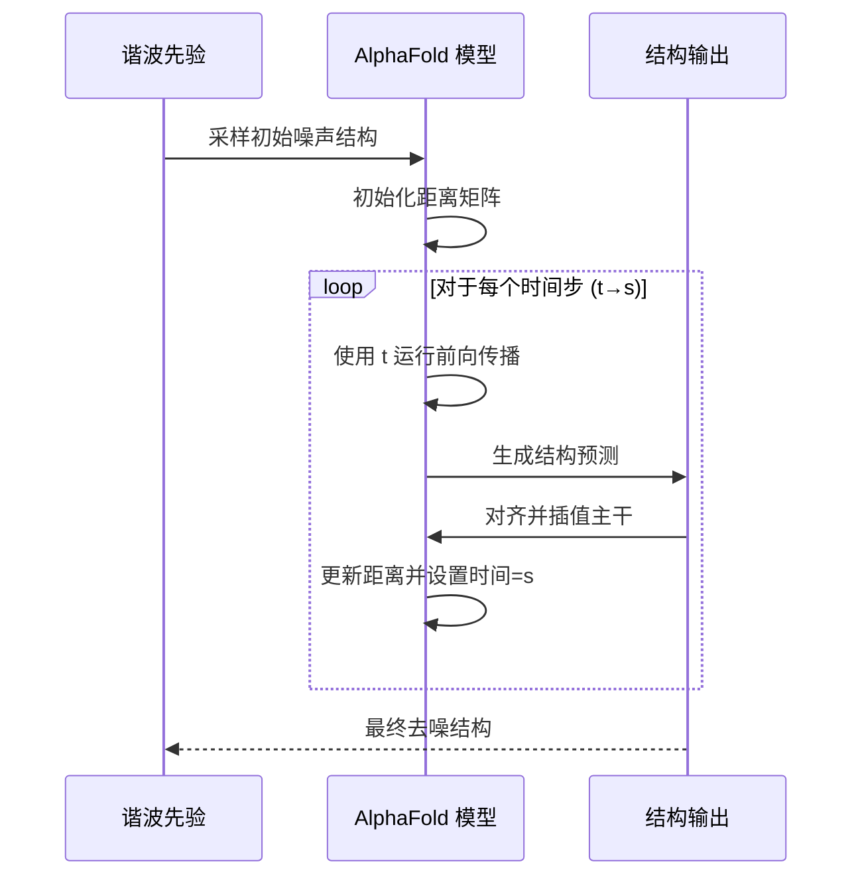

---
slug:6-flow-matching-objective-integration-with-alphafold
blog_type:normal
---


本页文档介绍了 AlphaFlow 如何将流匹配目标集成到 AlphaFold 架构中，从而通过迭代去噪实现蛋白质结构生成。该实现调整了确定性流匹配范式，使其能够与 AlphaFold 的成对表示嵌入和主干预测能力协同工作。

来源：[alphaflow/model/wrapper.py](alphaflow/model/wrapper.py#L52-L70), [alphaflow/model/alphafold.py](alphaflow/model/alphafold.py#L220-L235)

## 概念基础

AlphaFlow 实现了一个**连续时间流匹配目标**，旨在学习将简单的噪声分布（谐波先验）转化为天然蛋白质结构的复杂分布。与传统迭代添加和移除高斯噪声的扩散模型不同，该方法采用确定性插值方案，在整个去噪过程中保持结构的真实感。

其核心思想在训练过程中非常直观：根据时间参数 t ∈ [0,1]，在干净的主干结构和噪声样本之间进行插值，然后训练模型预测去噪方向。在推理阶段，这一过程被逆转，即沿着预定义的时间表迭代应用学习到的去噪步骤。

来源：[alphaflow/model/wrapper.py](alphaflow/model/wrapper.py#L52-L70), [alphaflow/utils/diffusion.py](alphaflow/utils/diffusion.py#L40-L58)

## 谐波先验分布

噪声分布由 `HarmonicPrior` 类建模，该类生成满足基本蛋白质几何约束的合理主干构型：

```python
class HarmonicPrior:
    def __init__(self, N=256, a=3/(3.8**2)):
        # N: 序列长度
        # a: 近似肽键刚度的弹簧常数
```

该先验从势能景观中采样结构，其中：
- 残基间距离遵循基于序列分离度的谐波约束
- 弹簧常数（a ≈ 3/3.8²）编码了预期的键长统计信息
- 采样的结构作为流匹配的“噪声”起始点

来源：[alphaflow/utils/diffusion.py](alphaflow/utils/diffusion.py#L40-L58)

## 训练流程集成

### 噪声注入策略

在训练期间，根据可配置的概率（`noise_prob`）随机注入噪声。`_add_noise` 方法执行插值操作：

1. 从谐波先验采样噪声主干
2. 使用 RMSD 对齐将噪声样本与真实主干对齐
3. 采样随机时间参数 t ~ Uniform(0,1)
4. 线性插值：`noisy_beta = (1-t) * ground_truth + t * noisy_sample`
5. 从插值后的主干计算成对距离矩阵
6. 将距离矩阵和时间参数存储在批次中

这构建了一种课程学习机制：早期训练（高 t）侧重于学习大规模结构，而后期训练（低 t）则细化原子细节。

来源：[alphaflow/model/wrapper.py](alphaflow/model/wrapper.py#L52-L70)

### 前向传播修改

AlphaFold 的前向传播经过修改，以融入噪声距离信息：



当批次中存在 `noised_pseudo_beta_dists` 时：

1. 将距离矩阵分箱为距离直方图（默认 39 个分箱，范围 3.25-20.75Å）
2. 将距离直方图嵌入到成对表示通道中
3. 根据时间参数 t 计算时间嵌入（256 维）并将其加到成对嵌入中
4. 然后将修改后的成对表示集成到标准的 AlphaFold 处理流程中

来源：[alphaflow/model/alphafold.py](alphaflow/model/alphafold.py#L220-L235), [alphaflow/config.py](alphaflow/config.py#L396-L403)

### 自条件

模型在训练期间可选择使用自条件（`self_cond_prob`）：运行一次无梯度的前序预测过程，并将其输出作为 `prev_outputs` 传递给主前向传播。这为模型提供了其自身的结构信念作为额外指导，类似于扩散模型中的无分类器引导。

来源：[alphaflow/model/wrapper.py](alphaflow/model/wrapper.py#L156-L160)

## 推理过程

### 迭代去噪时间表

推理遵循一个时间值递减的确定性时间表，通常为：[1.0, 0.75, 0.5, 0.25, 0.1, 0]。对于每一对：

1. 使用当前的噪声距离和时间 t 运行模型
2. 从预测结构中提取 pseudo_beta（Cα 位置）
3. 将先前的噪声主干与当前预测对齐
4. 插值：`noisy = (s/t) * noisy + (1 - s/t) * prediction`
5. 更新下一次迭代的距离矩阵和时间
6. 可选择通过输入先前的输出使用自条件

这创建了一条从随机噪声到类天然结构的平滑轨迹，每一步都逐步减少噪声的影响。

来源：[alphaflow/model/wrapper.py](alphaflow/model/wrapper.py#L350-L391)

### 推理期间的架构流程



来源：[alphaflow/model/wrapper.py](alphaflow/model/wrapper.py#L350-L391)

## 关键实现细节

### 距离分箱配置

距离直方图编码使用 39 个分箱，跨度为 3.25-20.75Å，并为掩码位置设置一个无限大分箱。这提供了足够的分辨率来捕获局部二级结构（短距离）和三级接触（长距离）。

来源：[alphaflow/config.py](alphaflow/config.py#L396-L403), [alphaflow/model/alphafold.py](alphaflow/model/alphafold.py#L117-L129)

### 时间嵌入架构

时间嵌入的计算方式如下：
1. 标量时间参数通过线性层进行投影
2. 将结果嵌入到成对表示空间
3. 广播到所有残基对

这为模型提供了一个关于去噪过程“进度”的连续信号，使其能够相应地调整预测。

来源：[alphaflow/model/alphafold.py](alphaflow/model/alphafold.py#L225), [alphaflow/config.py](alphaflow/config.py#L401-L402)

### 集成点

流匹配的修改集成在**成对表示层**，而不是修改核心架构。这是一个战略性的设计选择：

- 对 AlphaFold 成熟的架构干扰最小
- 允许预训练权重的迁移
- 成对表示自然地编码 3D 结构信息
- 与现有的训练流程和损失函数兼容

来源：[alphaflow/model/alphafold.py](alphaflow/model/alphafold.py#L235)

## 训练配置

流匹配训练引入了几个超参数：

| 参数 | 描述 | 典型值 |
|-----------|-------------|---------------|
| `noise_prob` | 每批次添加噪声的概率 | 0.5-1.0 |
| `self_cond_prob` | 自条件的概率 | 0.1-0.5 |
| `distillation` | 启用师生蒸馏 | False/True |
| `extra_input_prob` | 使用额外位置输入的概率 | 0.0-1.0 |

在蒸馏过程中，教师模型生成去噪目标，学生模型学习匹配这些目标。这使得知识能够从更大的教师模型转移到更小、更快的学生模型。

来源：[alphaflow/model/wrapper.py](alphaflow/model/wrapper.py#L139-L154), [alphaflow/model/wrapper.py](alphaflow/model/wrapper.py#L72-L124)

## 与标准 AlphaFold 损失的关系

流匹配目标与标准 AlphaFold 损失**正交**运行：

- **FAPE 损失**：优化预测结构与目标结构之间的帧对齐点误差
- **扭转角损失**：确保合理的主干二面角
- **违例损失**：防止空间位阻冲突和几何违例
- **流匹配**：引导从噪声到结构的去噪轨迹

在带噪声的训练期间，模型在满足这些结构约束的同时学习去噪。损失函数在配置文件中定义的加权和进行组合。

来源：[alphaflow/utils/loss.py](alphaflow/utils/loss.py#L1522-L1538)

<CgxTip>
时间嵌入对于成功的流匹配至关重要——它允许模型知道应该预测大规模的结构变化（早期时间）还是细粒度的细化（晚期时间）。如果没有这种条件约束，模型将难以连贯地导航去噪轨迹。
</CgxTip>

<CgxTip>
`_add_noise` 中的 RMSD 对齐是一个微妙但关键的细节。通过在插值前将噪声样本与真实对齐，我们确保噪声结构保持大致正确的方向。这从学习问题中消除了旋转自由度，使模型能够专注于构象变化而不是刚体变换。
</CgxTip>

## 后续步骤

要了解流匹配系统的互补组件，请探索：

- **[谐波先验与噪声调度](7-harmonic-prior-and-noise-scheduling)**：关于谐波先验实现和调度策略的详细信息
- **[推理流程与采样过程](14-inference-pipeline-and-sampling-process)**：完整的推理工作流程和采样变体
- **[损失函数：FAPE、扭转角损失与流匹配损失](12-loss-functions-fape-torsion-angle-loss-and-flow-matching-loss)**：全面的损失公式和加权策略