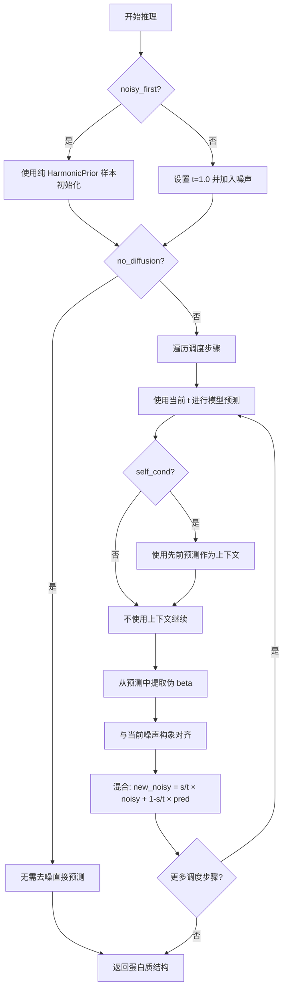

---
slug:7-harmonic-prior-and-noise-scheduling
blog_type:normal
---

AlphaFlow 的生成能力源于物理先验模型（HarmonicPrior）与策略性噪声调度机制的精妙结合。这些组件协同工作，将 AlphaFold2 从确定性预测器转变为能够探索构象多样性的生成采样器。

## 调和先验：高斯链模型

HarmonicPrior 基于简化的聚合物模型，实现了蛋白质主链构象的物理先验。它将蛋白质结构建模为由谐振弹簧连接的残基序列，其中相邻残基之间存在引力，平衡间距由参数 `a = 3/(3.8²)`（约 0.208 Å⁻²）决定，对应于蛋白质中典型的 Cα-Cα 键长。

数学公式构建了一个 N×N 三对角耦合矩阵 J，其中对角元素代表自相互作用，非对角元素代表相邻残基间的相互作用。该矩阵对称，遵循 J[i,i] = a 且对于所有相邻残基对 J[i,i+1] = J[i+1,i] = -a 的模式。

该耦合矩阵 J 经历特征值分解，产生正交特征向量 P 和相应的特征值 D。采样过程在特征基中生成随机高斯扰动，然后通过线性变换 P(√D⁻¹ × noise) 变换回坐标空间。采样过程中排除了零特征值模式以保持平移不变性，这对分子系统至关重要。

来源：[alphaflow/utils/diffusion.py](alphaflow/utils/diffusion.py#L40-L58)

## 训练期间的噪声注入

在标准训练期间，噪声以可控概率注入到输入数据中，该概率由 `noise_prob` 参数控制。当触发时，`_add_noise()` 方法执行多步骤破坏过程。

首先，HarmonicPrior 从其分布中采样一个随机构象，其批次维度与当前训练批次匹配。然后使用 RMSD 对齐（Kabsch 算法）将此随机结构与真实结构对齐，该算法通过最佳旋转和平移最小化对应原子之间的均方根偏差。对齐步骤确保噪声注入不会引入会干扰学习过程的任意旋转或平移。

为批次中的每个样本从 [0,1] 范围内均匀采样随机噪声水平 t。通过凸插值生成破坏的伪 beta 坐标：noisy_beta = (1-t) × true_pseudo_beta + t × aligned_random_structure，其中 t 作为控制破坏程度的插值系数。然后从这些破坏的坐标计算所有残基对之间的成对距离，并作为 `noised_pseudo_beta_dists` 存储在批次字典中。

这些带噪声的距离通过 `_get_input_pair_embeddings()` 方法作为网络的输入，该方法将连续距离离散化为直方图箱（可配置，默认 64 个箱，范围从 min_bin 到 max_bin）。生成的距离图表示通过嵌入层和 InputPairStack 处理，然后集成到主网络中。

来源：[alphaflow/model/wrapper.py](alphaflow/model/wrapper.py#L52-L71), [alphaflow/model/alphafold.py](alphaflow/model/alphafold.py#L113-L129)

## 结构化噪声调度的蒸馏训练

蒸馏训练采用独特的噪声调度策略，旨在将知识从教师模型转移到学生模型，同时教学生有效地去噪。该过程使用 11 步线性调度，范围从 t=1.0（最大噪声）到 t=0.0（无噪声）。

教师模型首先通过前向传递生成预测，从最大噪声逐步去噪到零噪声。在每个调度步骤 s，教师接收具有噪声水平 s 的输入并产生预测，然后这些预测用于构建噪声水平为 s_next 的下一步的输入。从教师预测中提取的伪 beta 坐标与当前噪声构象对齐，并根据调度进行混合：new_noisy = (s_next/s) × current_noisy + (1 - s_next/s) × teacher_pseudo_beta。

这创建了一种课程，学生从中学习从逐渐减少破坏的输入中预测更清晰的输出，遵循教师演示的反向扩散轨迹。

来源：[alphaflow/model/wrapper.py](alphaflow/model/wrapper.py#L72-L124)

## 渐进式去噪推理

在推理时，调度控制生成多样化构象的去噪过程。默认调度使用 6 个步骤：[1.0, 0.75, 0.50, 0.25, 0.10, 0.0]，尽管这可以通过命令行参数配置。该过程可根据应用需求以多种模式运行。

在标准扩散模式下，该过程从随机噪声（t=1.0）迭代去噪到最终结构（t=0.0）。在从噪声水平 t 到 s 的每次过渡中，模型给定当前噪声水平预测结构，产生伪 beta 坐标，并将它们与当前噪声构象对齐。使用与蒸馏中相同的凸组合公式更新新的噪声构象。调度的 t 值作为批次元数据（`batch['t']`）传播，以启用时间感知条件化。

自条件化选项使用模型的先前预测作为当前步骤的辅助输入，这可以通过为模型提供其自己的先前输出作为上下文来提高预测一致性。`noisy_first` 选项使用纯噪声初始化过程，而不是从 t=1.0 开始，这可以通过探索构象空间的不同区域来增强多样性。

来源：[alphaflow/model/wrapper.py](alphaflow/model/wrapper.py#L350-L391), [predict.py](predict.py#L47-L49)

<CgxTip>
训练和推理中的 RMSD 对齐至关重要——它确保噪声注入保持与真实值的正确空间关系，防止模型学习处理任意旋转/平移的噪声。这保留了去噪过程的物理可解释性。
</CgxTip>

## 配置和调优参数

几个关键参数控制噪声调度行为，可通过配置文件和命令行参数访问。`noise_prob` 参数控制接收噪声注入的训练批次比例，默认值通常在 0.5-0.7 左右。这控制模型练习去噪与学习预测清洁结构的频率。

对于推理，`--steps` 设置去噪步骤数（默认 10），`--tmax` 设置初始噪声水平（默认 1.0）。调度使用指定步数从 tmax 到 0 进行线性插值，如果 tmax 与 1.0 不同，可选择插入 t=1.0。这些参数提供了对多样性-精度权衡的明确控制——更多步骤和更小的 t 值通常产生更高质量的结构，但多样性会降低。

`--self_cond` 标志在推理时启用自条件化，其中每个去噪步骤接收模型自己的先前预测作为额外上下文。这通常提高预测一致性，但随着过程变得更加确定，可能会减少构象多样性。

<CgxTip>
调度选择从根本上影响多样性-精度权衡。较粗糙的调度（较少步骤）生成更多样化的结构，但精度可能较低；而较精细的调度（更多步骤）产生更精确的结构，但多样性减少。这种关系在 [Schedule Tuning for Diversity vs Precision Trade-off](16-schedule-tuning-for-diversity-vs-precision-trade-off) 中进一步讨论。
</CgxTip>

来源：[alphaflow/config.py](alphaflow/config.py#L51-L150), [predict.py](predict.py#L8-L19)

## 时间嵌入和条件化

噪声水平 t 不仅仅是插值的参数——它作为网络的信号条件。在训练和推理期间，t 存储在批次字典中并传播通过网络，启用时间感知预测。这允许模型学习不同噪声水平下的不同去噪行为，预期早期步骤（高 t）需要大规模结构校正，而后期步骤（低 t）专注于局部细化。

时间条件化对于流匹配目标特别重要，这需要模型学习指向从噪声分布到数据分布的速度场。通过显式地对 t 进行条件化，模型可以学习预测每个噪声水平的适当去噪方向和幅度。

来源：[alphaflow/model/wrapper.py](alphaflow/model/wrapper.py#L70), [alphaflow/model/wrapper.py](alphaflow/model/wrapper.py#L380)

## 与流匹配的集成

调和先验和噪声调度组件与 [Flow Matching Objective Integration with AlphaFold](6-flow-matching-objective-integration-with-alphafold) 中描述的流匹配训练目标深度集成。噪声注入过程创建流匹配所需的扰动样本，而调度定义模型学习预测速度场的时间轨迹。

在蒸馏训练期间，教师模型通过从 t=1.0 到 t=0.0 逐步减少噪声来演示去噪轨迹。学生模型通过在每个噪声水平匹配教师的输出来学习复制此轨迹，从而通过蒸馏而不是对流匹配目标的直接基于梯度的优化来有效地学习反向扩散过程。