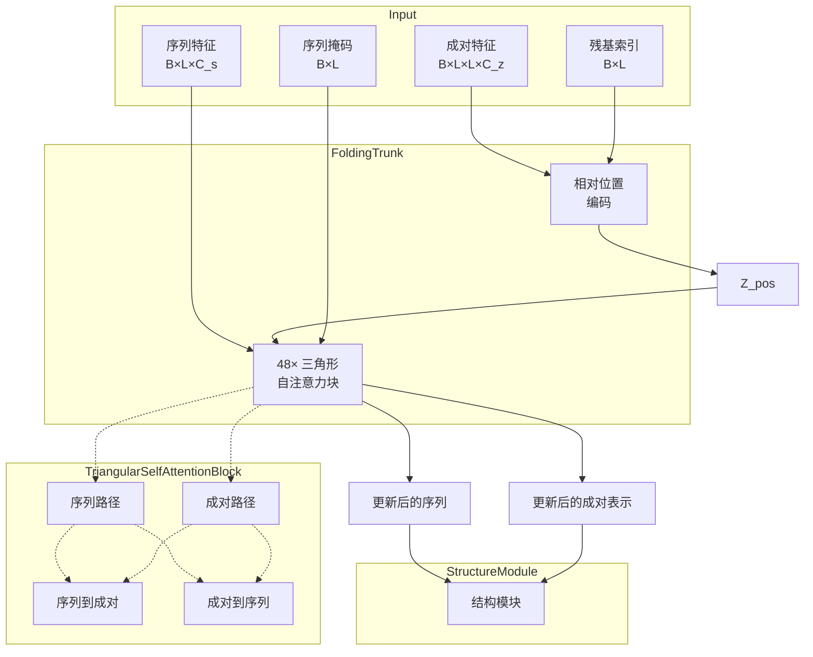
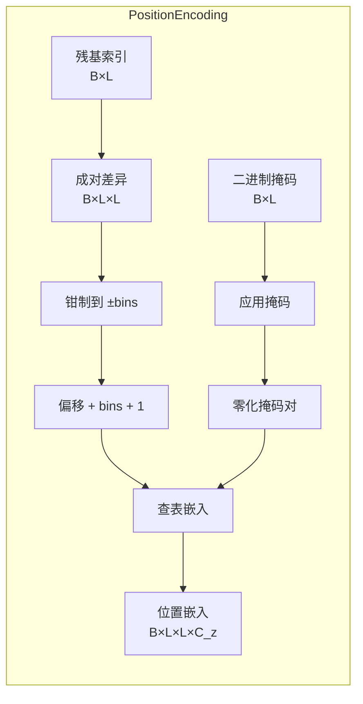
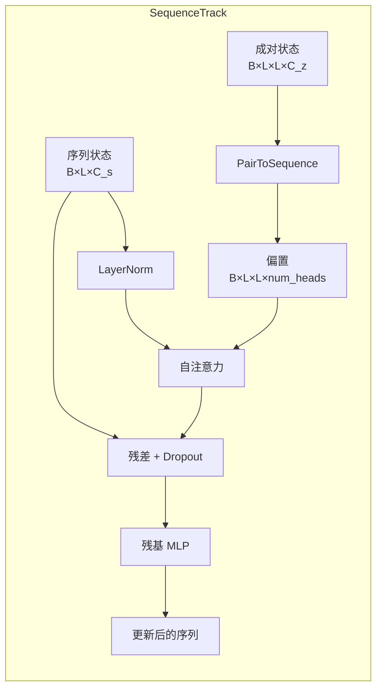
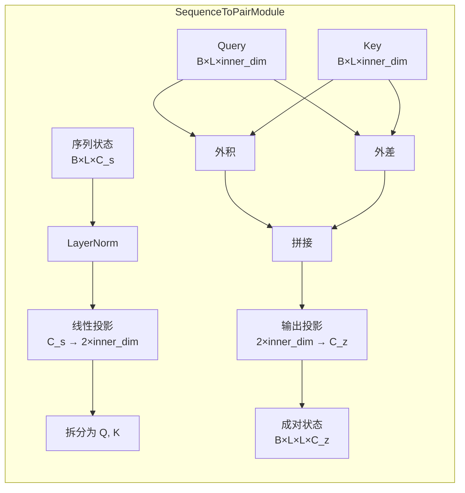

---
slug:8-evoformer-and-folding-trunk-architecture
blog_type:normal
---

AlphaFlow 架构实现了一个复杂的双轨表示系统，用于蛋白质结构预测，通过迭代变换结合序列级别和成对（残基-残基）信息。本文档将探讨实现准确结构推理的核心架构组件。

## 架构概述

主干架构采用双轨设计，其中序列表示 (s) 和成对表示 (z) 通过协同处理进行演化。序列轨道捕获每个残基的信息，而成对轨道对残基对之间的关系进行建模，使模型能够通过注意力机制推理 3D 几何结构。

来源: [trunk.py](alphaflow/model/trunk.py#L69-L175), [tri_self_attn_block.py](alphaflow/model/tri_self_attn_block.py#L25-L160)

## FoldingTrunk 架构

`FoldingTrunk` 类通过一系列三角形自注意力块来协调序列和成对表示的迭代优化。该组件作为核心推理引擎，逐步优化结构预测。

### 核心配置参数

主干架构由若干关键维度参数定义，这些参数在表示能力和计算效率之间取得了平衡：

| 参数 | 默认值 | 描述 |
|-----------|---------------|-------------|
| `num_blocks` | 48 | TriangularSelfAttentionBlock 层数 |
| `sequence_state_dim` (C_s) | 1024 | 序列表示的维度 |
| `pairwise_state_dim` (C_z) | 128 | 成对表示的维度 |
| `sequence_head_width` | 32 | 序列注意力的每头维度 |
| `pairwise_head_width` | 32 | 成对注意力的每头维度 |
| `position_bins` | 32 | 相对位置编码的 bin 数量 |

来源: [config.py](alphaflow/config.py#L514-L521)

### 位置编码策略

该架构通过 `RelativePosition` 模块整合相对位置信息，该模块将残基索引差异编码为可学习的嵌入。这种机制提供了捕获序列顺序依赖性所必需的空间上下文。

编码计算残基索引之间的成对差异，将其钳制到指定范围，并使用离散 bin 映射到嵌入。一个特殊的 bin（索引 0）为被掩码的残基对保留空间，从而能够稳健地处理可变长度序列。

来源: [trunk.py](alphaflow/model/trunk.py#L34-L66)

<CgxTip>
位置编码使用 2*bins+2 个嵌入槽位来容纳正/负差异以及特殊的填充/掩码 Token。第 0 个索引保留给被掩码的成对，其余槽位编码离散化的相对位置范围 [-bins, bins]。
</CgxTip>

### 通过分块进行内存优化

为了处理长序列，该架构通过 `chunk_size` 参数实现了分块注意力计算。这通过沿轴向维度在较小的分段中处理注意力操作，将内存复杂度从 O(L²) 降低到大约 O(L)。

分块策略使得能够在否则会超过 GPU 内存限制的序列上进行推理，分块大小通常根据可用内存和序列长度设置为 128 或 256。

来源: [trunk.py](alphaflow/model/trunk.py#L110-L115)

## TriangularSelfAttentionBlock

每个 `TriangularSelfAttentionBlock` 实现了一个复杂的变换模式，交替更新序列和成对表示，同时保持两条轨道之间的双向信息流。

### 序列轨道处理

序列轨道首先使用 `PairToSequence` 模块从成对表示生成注意力偏置。这些偏置引导自注意力机制将几何约束直接整合到序列更新中：

1. **偏置生成**: `PairToSequence` 层对成对表示进行归一化，并将其投影到与注意力头数匹配的偏置张量，为序列注意力提供几何上下文。
2. **门控自注意力**: 具有门控机制的多头注意力处理归一化的序列表示，并结合成对偏置来调制注意力模式。
3. **残差 MLP**: 具有 4 倍扩展和残差连接的 MLP 进一步变换序列表示。

来源: [tri_self_attn_block.py](alphaflow/model/tri_self_attn_block.py#L130-L138), [layers.py](alphaflow/model/layers.py#L154-L172)

### 成对轨道处理

成对轨道接收更新后的序列信息，并执行三角形乘法更新和轴向注意力操作：

1. **序列到成对投影**: `SequenceToPair` 模块使用外积操作（查询/键投影的乘积和差值）将序列表示变换为成对空间。
2. **三角形乘法更新**: 两个方向的更新（`TriangleMultiplicationOutgoing` 和 `TriangleMultiplicationIncoming`）沿成对矩阵的三角形结构传播信息。
3. **三角形轴向注意力**: 逐行和逐列注意力机制（`TriangleAttentionStartingNode` 和 `TriangleAttentionEndingNode`）在成对表示上执行轴向注意力。
4. **残差 MLP**: 具有 4 倍扩展和残差连接的 MLP 优化成对表示。

```mermaid
graph TB
    subgraph PairwiseTrack
        Z_in[成对状态<br/>B×L×L×C_z]
        S_out[更新后的序列<br/>B×L×C_s]
        
        Z_in --> ResSeq[残差]
        S_out --> S2P[SequenceToPair]
        S2P --> S2P_out[成对更新<br/>B×L×L×C_z]
        
        Z_in --> Res1[残差]
        Res1 --> TriMulOut[TriangleMulOutgoing]
        TriMulOut --> RowDrop1[行 Dropout]
        RowDrop1 --> Z1
        
        Z1 --> Res2[残差]
        Res2 --> TriMulIn[TriangleMulIncoming]
        TriMulIn --> ColDrop1[列 Dropout]
        ColDrop1 --> Z2
        
        Z2 --> Res3[残差]
        Res3 --> TriAttStart[TriangleAttStart]
        TriAttStart --> RowDrop2[行 Dropout]
        RowDrop2 --> Z3
        
        Z3 --> Res4[残差]
        Res4 --> TriAttEnd[TriangleAttEnd]
        TriAttEnd --> ColDrop2[列 Dropout]
        ColDrop2 --> Z4
        
        Z4 --> MLP[成对 MLP]
        MLP --> Z_out[更新后的成对表示]
    end
```

来源: [tri_self_attn_block.py](alphaflow/model/tri_self_attn_block.py#L139-L158), [layers.py](alphaflow/model/layers.py#L116-L151)

### SequenceToPair 变换

`SequenceToPair` 模块实现了序列和成对表示之间的关键桥梁。它通过外积分解从序列特征创建成对信息：

这种变换保留了乘法交互 (q×k) 和差值信息 (q−k)，允许成对表示捕获残基对之间的相关性和相对特征关系。

来源: [layers.py](alphaflow/model/layers.py#L116-L151)

## 结构模块集成

在最后的三角形自注意力块之后，主干通过学习的投影层将优化后的序列和成对表示传递给 `StructureModule`：

- **序列投影**: `trunk2sm_s` 从主干序列维度 (C_s=1024) 投影到结构模块维度 (c_s=384)。
- **成对投影**: `trunk2sm_z` 从主干成对维度 (C_z=128) 投影到结构模块维度 (c_z=128)。

然后，StructureModule 生成最终的 3D 坐标和辅助预测，包括距离图、扭转角和置信度指标。

来源: [trunk.py](alphaflow/model/trunk.py#L104-L107), [config.py](alphaflow/config.py#L526-L527)

## 初始化和正则化

该架构采用精心设计的初始化策略以确保稳定的训练：

- **零初始化**: 关键投影（注意力输出投影、MLP 最终层、三角形更新）初始化为零，使网络能够进行残差学习，最初表现得像恒等变换。
- **Dropout**: 行和列 Dropout（速率为 2×dropout_rate）应用于成对变换以防止过拟合。
- **层归一化**: 在所有主要变换之前应用，以保持稳定的训练动态。

来源: [tri_self_attn_block.py](alphaflow/model/tri_self_attn_block.py#L87-L104)

## 计算考量

| 方面 | 实现细节 |
|--------|----------------------|
| 梯度检查点 | 默认启用，`blocks_per_ckpt=1` |
| 分块大小 | 可通过 `chunk_size` 参数调整（默认值：4） |
| 内存优化 | 分块轴向注意力降低了 O(L²) 复杂度 |
| 精度 | 通过 ESMFold 集成支持 fp16 训练 |

<CgxTip>
梯度检查点和分块注意力的结合使得能够在消费级 GPU 上处理包含 1000+ 个残基的序列，使该架构适用于各种蛋白质结构预测任务。
</CgxTip>

来源: [config.py](alphaflow/config.py#L192-L193), [trunk.py](alphaflow/model/trunk.py#L110-L115)

## 模型变体配置

该架构支持针对不同用例定制的多种配置：

| 模型变体 | 块数量 | C_s | C_z | 用例 |
|---------------|------------|-----|-----|----------|
| Base | 48 | 1024 | 128 | 生产推理 |
| 12-Layer | 12 | 384 | 128 | 快速推理，蒸馏 |
| Distilled | 48 | 1024 | 128 | 学生模型训练 |

12 层配置提供了一个轻量级选项，适用于快速原型设计和集成生成，同时保持了完整模型的核心架构原则。

有关针对你的特定需求选择合适模型变体的详细指导，请参阅 [模型版本：Base、Distilled 和 12-Layer 配置](4-model-versions-base-distilled-and-12-layer-configurations)。