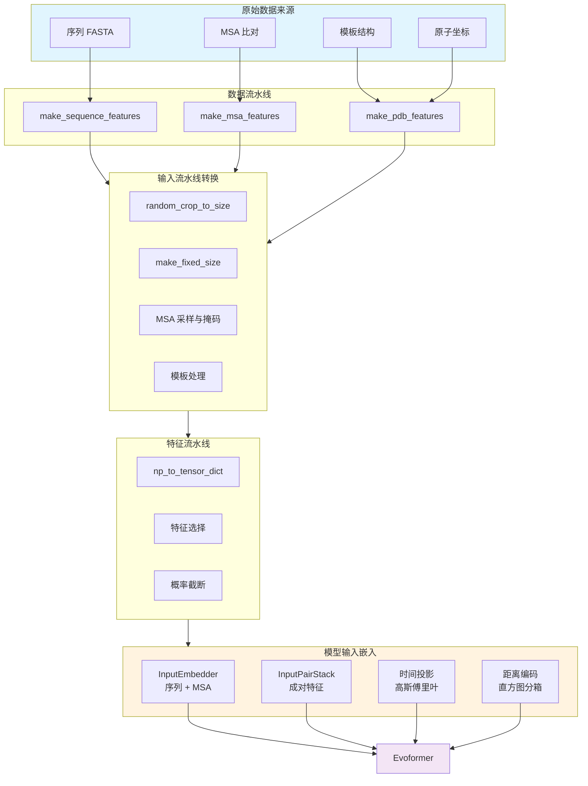

---
slug:9-input-stack-and-feature-representations
blog_type:normal
---

输入处理流水线是 AlphaFlow 蛋白质结构生成能力的关键基础。该架构将原始蛋白质数据（包括序列、多重序列比对 (MSA)、模板和结构信息）转换为模型可以处理的复杂张量表示。该设计集成了 AlphaFold 经过验证的特征提取模式，并针对生成式建模进行了流匹配特定的适配。

## 架构概览

输入处理系统通过三个相互连接的层运行：数据预处理将原始生物数据转换为结构化的特征字典，特征流水线管理张量转换和依赖于配置的特征选择，输入堆栈应用复杂的三角注意力机制来处理成对关系。

## 输入对堆栈架构

`InputPairStack` 实现了 AlphaFold 补充材料中的算法 16，通过三角注意力机制处理成对表示。该堆栈专注于通过关注残基对矩阵的行和列维度来理解蛋白质结构中的空间关系。

### 核心组件

`InputPairStackBlock` 在每一层中结合了四个不同的操作：起始和结束节点的三角注意力捕获沿矩阵边缘的方向关系，传出和传入的三角乘法通过乘法更新传播信息，对转换应用带有掩码的前馈转换。

来源：[input_stack.py](alphaflow/model/input_stack.py#L40-L168)，[input_stack.py](alphaflow/model/input_stack.py#L171-L284)

### 配置参数

该堆栈通过几个关键的超参数进行配置：`c_t=64` 定义了模板嵌入通道维度，`c_hidden_tri_att=16` 指定了三角注意力的每头隐藏维度，`c_hidden_tri_mul=64` 设置了三角乘法的隐藏维度，`no_blocks=2` 确定了堆叠块的数量，`no_heads=4` 控制注意力头数。

来源：[config.py](alphaflow/config.py#L187-L199)，[config.py](alphaflow/config.py#L427-L440)

### 内存优化

该实现包括复杂的内存管理：`tune_chunk_size` 能够为长序列自动调整分块大小，`blocks_per_ckpt` 支持激活检查点以减少内存使用，`use_lma`（低内存注意力）为资源受限的环境提供了替代的注意力算法。

来源：[input_stack.py](alphaflow/model/input_stack.py#L226-L274)，[config.py](alphaflow/config.py#L158-L166)

## 特征嵌入层

嵌入层通过多个专用嵌入器将原始特征转换为学习到的表示：`InputEmbedder` 处理序列和 MSA 特征，`RecyclingEmbedder` 处理回收的结构信息，自定义距离编码将空间关系转换为直方图分箱。

### 基于距离的成对嵌入

模型使用直方图分箱对成对距离进行编码。`_get_input_pair_embeddings` 方法通过将距离离散化为跨越 3.25Å 到 50.75Å 的 39 个分箱，创建残基之间的距离直方图。这捕获了对蛋白质折叠至关重要的局部二级结构模式和长程三级接触。

来源：[alphafold.py](alphaflow/model/alphafold.py#L113-L129)，[config.py](alphaflow/config.py#L397-L403)

### 流匹配的时间嵌入

AlphaFlow 使用 `GaussianFourierProjection` 为流匹配过程集成了时间维度。这通过具有 256 维嵌入大小的正弦特征嵌入扩散时间步，使模型能够根据去噪过程中的噪声水平来调节其预测。

来源：[alphafold.py](alphaflow/model/alphafold.py#L93-L100)，[alphafold.py](alphaflow/model/alphafold.py#L220-L235)，[layers.py](alphaflow/model/layers.py#L13-L28)

### 额外输入处理

当 `extra_input=True` 时，模型通过并行的嵌入路径处理额外的结构信息。这实现了多条件生成，其中额外的结构提供额外的指导，适用于 MD 轨迹生成或结构优化等场景。

来源：[alphafold.py](alphaflow/model/alphafold.py#L103-L109)，[alphafold.py](alphaflow/model/alphafold.py#L238-L254)

## 特征流水线架构

特征流水线通过三个主要阶段协调从原始数据到模型就绪张量的转换：从生物数据源中提取特征、依赖于配置的特征选择以及带填充的张量转换。

### 特征类别

配置定义了三个特征类别：`unsupervised_features` 包括始终可用的序列、MSA 和比对信息，`template_features` 包含启用时的结构模板信息，`supervised_features` 在训练期间提供真实的原子坐标。

来源：[feature_pipeline.py](alphaflow/data/feature_pipeline.py#L51-L70)，[config.py](alphaflow/config.py#L292-L304)

### 基于模式的数据配置

流水线根据执行模式调整特征处理：训练模式应用随机裁剪和监督特征，评估模式使用带有监督标签的较大裁剪大小，预测模式使用没有监督的固定大小。

来源：[feature_pipeline.py](alphaflow/data/feature_pipeline.py#L73-L112)，[config.py](alphaflow/config.py#L316-L360)

### MSA 和模板处理

多重序列比对特征经过采样、掩码和聚类转换。模板通过伪 beta 计算、扭转角提取和用于训练的可选子采样进行处理。`make_fixed_size` 操作将所有张量填充到配置参数定义的一致维度。

来源：[input_pipeline.py](alphaflow/data/input_pipeline.py#L146-L283)，[data_pipeline.py](alphaflow/data/data_pipeline.py#L409-L730)

## 通道维度和特征模式

该架构为不同的表示类型使用不同的通道维度：`c_z=128` 用于成对嵌入 (N×N×c_z)，`c_m=256` 用于 MSA 嵌入 (S×N×c_m)，`c_t=64` 用于模板嵌入，`c_e=64` 用于额外 MSA 嵌入，`c_s=384` 用于单残基表示。

### 特征形状模式

每个特征都有使用占位符常量定义的形状：`NUM_RES` 标记序列长度维度，`NUM_MSA_SEQ` 标记主要 MSA 序列维度，`NUM_EXTRA_SEQ` 标记额外 MSA 维度，`NUM_TEMPLATES` 标记模板维度。

来源：[config.py](alphaflow/config.py#L187-L204)，[config.py](alphaflow/config.py#L206-L276)

### 转换规则

`random_crop_to_size` 函数应用智能裁剪：序列被随机裁剪但可选择性地锚定用于 FAPE 截断，模板被随机排列然后裁剪，所有特征通过协调的切片操作保持维度一致性。

来源：[input_pipeline.py](alphaflow/data/input_pipeline.py#L26-L106)，[input_pipeline.py](alphaflow/data/input_pipeline.py#L110-L145)

## 与模型前向传播的集成

在前向执行期间，特征流经三个嵌入阶段：通过 `InputEmbedder` 生成初始 MSA 和成对表示，通过具有时间条件的 `InputPairStack` 添加基于距离的输入嵌入，以及用于多条件场景的可选额外输入处理。

### 嵌入流

前向传播按顺序协调特征转换：输入特征被嵌入到 MSA 表示 m 和成对表示 z 中，添加来自先前迭代的回收结构信息，通过输入对堆栈合并噪声条件的距离嵌入，以及在可用时合并额外的结构输入。

来源：[alphafold.py](alphaflow/model/alphafold.py#L149-L235)，[alphafold.py](alphaflow/model/alphafold.py#L183-L188)

### 回收集成

回收机制在迭代之间维护状态：`m_1_prev` 捕获上一个周期的第一个 MSA 行，`z_prev` 存储完整的成对表示，`x_prev` 保留预测的原子位置。这些通过 `RecyclingEmbedder` 与当前特征组合。

来源：[alphafold.py](alphaflow/model/alphafold.py#L189-L217)

<CgxTip>
输入对堆栈的三角注意力机制计算成本高昂，但对于捕获长程蛋白质相互作用至关重要。对于长序列（>1000 个残基），请在配置中启用 `use_lma` 或 `tune_chunk_size` 以有效管理内存，代价是计算时间略有增加。
</CgxTip>

<CgxTip>
使用额外输入进行多条件生成时，额外的结构信息通过具有相同架构的并行 InputPairStack 进行处理。这实现了无需架构修改的灵活调节，支持引导结构生成或集成预测等应用。
</CgxTip>

## 配置预设

不同的模型变体根据用例调整输入处理：`finetuning` 模式使用 crop_size=384 以提高训练效率，`model_1` 和 `model_2` 启用具有完整功能的模板，`model_3`、`model_4`、`model_5` 禁用模板以进行无模板预测，长序列推断禁用分块大小调整并启用卸载。

来源：[config.py](alphaflow/config.py#L51-L184)

## 下一步

要更深入地了解特征处理流水线，请参阅 [序列、结构和 MSA 的特征工程](21-feature-engineering-for-sequence-structure-and-msa)，其中详细说明了对原始数据应用的生物学转换。要了解这些嵌入如何在核心架构中使用，请继续阅读 [Evoformer 和折叠主干架构](8-evoformer-and-folding-trunk-architecture)。有关实际实现的指导，请参阅 [PDB 和 ATLAS 数据集的数据预处理](20-data-preprocessing-for-pdb-and-atlas-datasets)。