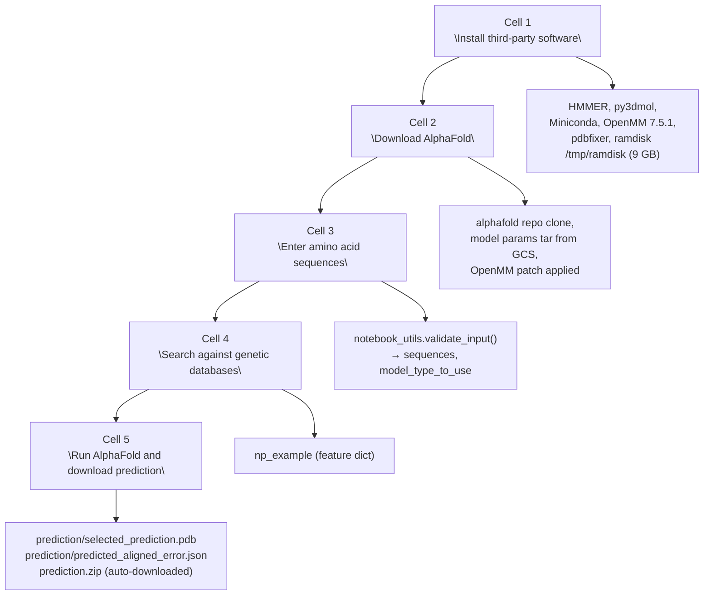
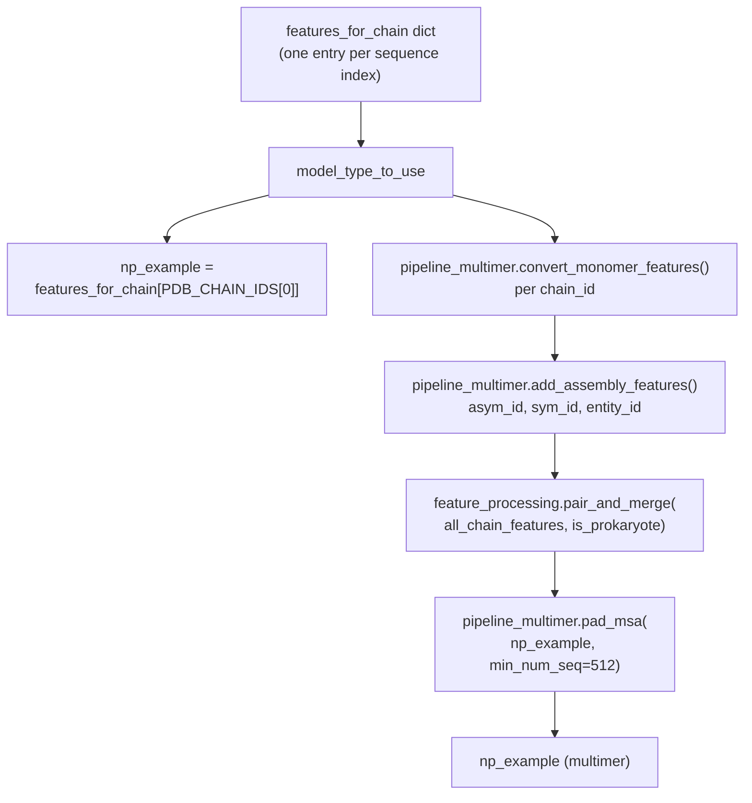
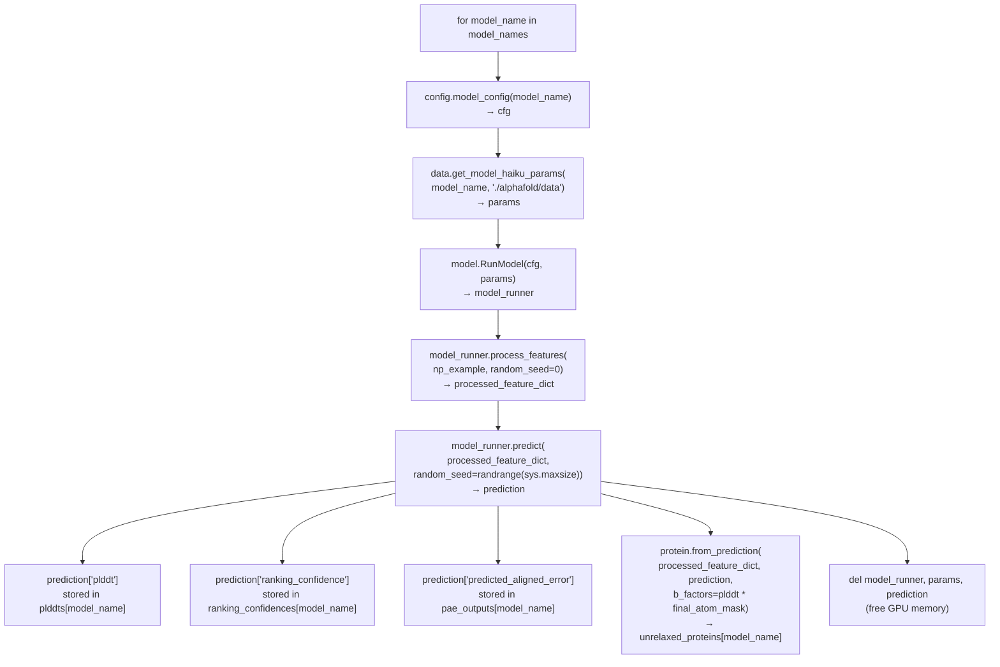

# Colab Notebook

> **Relevant source files**
> * [notebooks/AlphaFold.ipynb](https://github.com/jcheongs/alphafold-multimer/blob/8e419501/notebooks/AlphaFold.ipynb)

This page documents the `notebooks/AlphaFold.ipynb` notebook — a self-contained Google Colab environment for running AlphaFold predictions without a local database stack or Docker installation. It covers the notebook's setup procedure, how it streams databases from Google Cloud Storage, how it decides between monomer and multimer mode, how it generates MSAs and features, and what output files it produces.

For the full local execution pipeline (Docker or direct), see [Running Predictions](/jcheongs/alphafold-multimer/2.3-running-predictions). For a deep dive into the data pipeline modules that the notebook calls directly, see [Data Pipeline](/jcheongs/alphafold-multimer/4-data-pipeline).

---

## Overview and Differences from Full AlphaFold

The Colab notebook provides a simplified prediction path. The table below summarizes the key differences relative to a full local installation.

| Property | Full AlphaFold (local) | Colab Notebook |
| --- | --- | --- |
| Databases | Downloaded locally (~2.2 TB) | Streamed in chunks from GCS |
| Template search | HHSearch / Hmmsearch against PDB | **No templates** (empty placeholder features) |
| BFD variant | Full BFD + UniClust30 via HHBlits | `bfd-first_non_consensus_sequences.fasta` via Jackhmmer |
| Ensemble count | 8 (monomer) | **1** (reduced) |
| Models relaxed | All 5 | **Best model only** |
| GPU requirement | Optional (flag-controlled) | **Required** (TPU and CPU both rejected at startup) |
| Entry point | `run_alphafold.py` / `run_alphafold.sh` | `notebooks/AlphaFold.ipynb` |

Sources: [notebooks/AlphaFold.ipynb L9-L38](https://github.com/jcheongs/alphafold-multimer/blob/8e419501/notebooks/AlphaFold.ipynb#L9-L38)

---

## Notebook Structure

The notebook consists of five executable cells followed by markdown documentation.

**Notebook execution flow:**



Sources: [notebooks/AlphaFold.ipynb L52-L681](https://github.com/jcheongs/alphafold-multimer/blob/8e419501/notebooks/AlphaFold.ipynb#L52-L681)

---

## Cell 1: Install Third-Party Software

[notebooks/AlphaFold.ipynb L52-L117](https://github.com/jcheongs/alphafold-multimer/blob/8e419501/notebooks/AlphaFold.ipynb#L52-L117)

Actions performed in order:

1. Uninstalls the default Colab TensorFlow version.
2. Installs `hmmer` (provides the `jackhmmer` binary at `/usr/bin/jackhmmer`).
3. Installs `py3dmol` for in-notebook 3D visualization.
4. Installs Miniconda, then `openmm=7.5.1` and `pdbfixer` via conda.
5. Creates a **9 GB ramdisk** at `/tmp/ramdisk` using `tmpfs`. Database chunks are written here during streaming to give Jackhmmer fast I/O.
6. Downloads `stereo_chemical_props.txt` from the OpenStructure repository into `/content`.

---

## Cell 2: Download AlphaFold

[notebooks/AlphaFold.ipynb L119-L191](https://github.com/jcheongs/alphafold-multimer/blob/8e419501/notebooks/AlphaFold.ipynb#L119-L191)

Actions performed in order:

1. Clones the `deepmind/alphafold` repository into `/content/alphafold`.
2. Installs Python dependencies from `requirements.txt` and the package itself.
3. Applies `docker/openmm.patch` to the conda-installed OpenMM site-packages.
4. Copies `stereo_chemical_props.txt` into both the repo and the site-packages locations.
5. Downloads and extracts model parameters from: ```yaml https://storage.googleapis.com/alphafold/alphafold_params_colab_2022-01-19.tar ``` into `./alphafold/data/params`.
6. Validates the runtime is a GPU (raises `RuntimeError` if JAX detects a TPU or CPU backend).
7. Sets two environment variables required for JAX memory management: * `TF_FORCE_UNIFIED_MEMORY = 1` * `XLA_PYTHON_CLIENT_MEM_FRACTION = 2.0`

---

## Cell 3: Sequence Input and Validation

[notebooks/AlphaFold.ipynb L206-L250](https://github.com/jcheongs/alphafold-multimer/blob/8e419501/notebooks/AlphaFold.ipynb#L206-L250)

The notebook exposes eight string form fields (`sequence_1` through `sequence_8`). Non-empty entries are collected into `input_sequences`. `notebook_utils.validate_input()` applies the following constraints and returns two values:

| Variable | Value |
| --- | --- |
| `MIN_SINGLE_SEQUENCE_LENGTH` | 16 residues |
| `MAX_SINGLE_SEQUENCE_LENGTH` | 2500 residues |
| `MAX_MULTIMER_LENGTH` | 2500 residues (total) |

The returned `model_type_to_use` is a `notebook_utils.ModelType` enum value:

* **`ModelType.MONOMER`** — exactly one sequence provided.
* **`ModelType.MULTIMER`** — two or more sequences provided.

The `is_prokaryote` boolean flag (default `False`) is passed later to `feature_processing.pair_and_merge()` to control MSA pairing strategy (see [Multimer Data Pipeline](/jcheongs/alphafold-multimer/4.4-multimer-data-pipeline)).

---

## Cell 4: Database Streaming and Feature Construction

[notebooks/AlphaFold.ipynb L252-L457](https://github.com/jcheongs/alphafold-multimer/blob/8e419501/notebooks/AlphaFold.ipynb#L252-L457)

### GCS Region Selection

Before searching, the notebook races three HTTP requests to find the lowest-latency GCS bucket region:

```yaml
https://storage.googleapis.com/alphafold-colab/latest/...        (US)
https://storage.googleapis.com/alphafold-colab-europe/latest/... (Europe)
https://storage.googleapis.com/alphafold-colab-asia/latest/...   (Asia)
```

The first to respond wins. `DB_ROOT_PATH` is constructed from the winning `source` suffix.

### Database Configuration

| `db_name` | Chunks | `z_value` | Used for |
| --- | --- | --- | --- |
| `uniref90` | 59 | 135,301,051 | All runs |
| `smallbfd` | 17 | 65,984,053 | All runs |
| `mgnify` | 71 | 304,820,129 | All runs |
| `uniprot` | 98 | 219,740,215 | Heteromers only |

UniProt (Swiss-Prot + TrEMBL concatenated) is added to `MSA_DATABASES` only when `model_type_to_use == ModelType.MULTIMER` and `len(set(sequences)) > 1` — i.e., the complex has at least two distinct chains.

### Hit Limits

```
MAX_HITS = {    'uniref90': 10_000,    'smallbfd': 5_000,    'mgnify': 501,    'uniprot': 50_000,}
```

### get_msa() — Chunked Jackhmmer Search

The `get_msa(fasta_path)` function [notebooks/AlphaFold.ipynb L359-L382](https://github.com/jcheongs/alphafold-multimer/blob/8e419501/notebooks/AlphaFold.ipynb#L359-L382)

 iterates over `MSA_DATABASES` and for each one instantiates `jackhmmer.Jackhmmer` with:

* `num_streamed_chunks`: total chunks to download sequentially
* `streaming_callback`: updates a `tqdm` progress bar per chunk
* `z_value`: used for E-value normalisation

Each chunk is fetched from GCS, written to the ramdisk, searched with Jackhmmer, and the chunk file is deleted before the next is fetched. Results accumulate in `raw_msa_results[db_name]`.

### Feature Construction Per Sequence

For each unique sequence, the notebook builds a `feature_dict` by calling:

1. `pipeline.make_sequence_features(sequence, description, num_res)` — produces `aatype`, `residue_index`, etc.
2. `pipeline.make_msa_features(msas=single_chain_msas)` — produces `msa`, `deletion_matrix`, species identifiers.
3. `notebook_utils.empty_placeholder_template_features(num_templates=0, num_res=len(sequence))` — adds zero-filled template arrays (no template search is performed).

For heteromers, UniProt MSA hits are stored separately and used to construct `*_all_seq` features from `msa_pairing.MSA_FEATURES`.

### Monomer vs. Multimer Feature Merging

**Feature assembly decision diagram:**



Sources: [notebooks/AlphaFold.ipynb L385-L457](https://github.com/jcheongs/alphafold-multimer/blob/8e419501/notebooks/AlphaFold.ipynb#L385-L457)

---

## Cell 5: Model Execution, Relaxation, and Output

[notebooks/AlphaFold.ipynb L459-L681](https://github.com/jcheongs/alphafold-multimer/blob/8e419501/notebooks/AlphaFold.ipynb#L459-L681)

### Model Set Selection

| `model_type_to_use` | `model_names` |
| --- | --- |
| `ModelType.MONOMER` | `config.MODEL_PRESETS['monomer']` + `('model_2_ptm',)` |
| `ModelType.MULTIMER` | `config.MODEL_PRESETS['multimer']` |

Ensemble count is reduced to 1 for all models:

* Monomer: `cfg.data.eval.num_ensemble = 1`
* Multimer: `cfg.model.num_ensemble_eval = 1`

### Per-Model Execution Loop



Sources: [notebooks/AlphaFold.ipynb L493-L541](https://github.com/jcheongs/alphafold-multimer/blob/8e419501/notebooks/AlphaFold.ipynb#L493-L541)

### Model Ranking

After all models run:

```
best_model_name = max(ranking_confidences.keys(), key=lambda x: ranking_confidences[x])
```

* **Monomer**: `ranking_confidence` is mean pLDDT; the `model_2_ptm` model is excluded from ranking (only used for PAE output).
* **Multimer**: `ranking_confidence` is pTM + ipTM.

### AMBER Relaxation

Only `unrelaxed_proteins[best_model_name]` is relaxed. The `relax.AmberRelaxation` instance is configured as:

| Parameter | Value |
| --- | --- |
| `max_iterations` | `0` (unlimited inner loop) |
| `tolerance` | `2.39` |
| `stiffness` | `10.0` |
| `exclude_residues` | `[]` |
| `max_outer_iterations` | `3` |
| `use_gpu` | `True` |

If `run_relax` is `False` (user-configurable), `protein.to_pdb()` is called directly on the unrelaxed protein.

For full details on the relaxation procedure, see [Structure Relaxation](/jcheongs/alphafold-multimer/6-structure-relaxation).

### Output Files

| File | Contents |
| --- | --- |
| `prediction/selected_prediction.pdb` | Relaxed (or unrelaxed) best model structure |
| `prediction/predicted_aligned_error.json` | PAE matrix in EMBL-EBI format (if available) |
| `prediction.zip` | Archive of the above, auto-downloaded via `files.download()` |

### Visualization

The notebook renders two inline visualizations using `py3Dmol` and `matplotlib`:

1. **3D structure viewer** — colored by per-residue pLDDT confidence band. For multimers, a second view colored by chain is also shown.
2. **pLDDT plot** — line plot of per-residue pLDDT across the sequence.
3. **PAE heatmap** — (when available) predicted aligned error matrix with chain boundary lines overlaid in red.

The pLDDT color bands used for visualization are:

| Band | Range | Meaning |
| --- | --- | --- |
| `#FF7D45` | 0–50 | Very low |
| `#FFDB13` | 50–70 | Low |
| `#65CBF3` | 70–90 | Confident |
| `#0053D6` | 90–100 | Very high |

Sources: [notebooks/AlphaFold.ipynb L563-L680](https://github.com/jcheongs/alphafold-multimer/blob/8e419501/notebooks/AlphaFold.ipynb#L563-L680)

---

## Key Module Dependencies

The notebook directly imports from the `alphafold` package installed in cell 2. The diagram below maps notebook operations to the specific code entities they invoke.

```mermaid
flowchart TD

NB["AlphaFold.ipynb<br>(notebook)"]
NU["alphafold.notebooks.notebook_utils<br>• validate_input()<br>• merge_chunked_msa()<br>• show_msa_info()<br>• empty_placeholder_template_features()<br>• get_pae_json()"]
JK["alphafold.data.tools.jackhmmer<br>• Jackhmmer(<br>  num_streamed_chunks,<br>  streaming_callback,<br>  z_value<br>)"]
PL["alphafold.data.pipeline<br>• make_sequence_features()<br>• make_msa_features()"]
PM["alphafold.data.pipeline_multimer<br>• convert_monomer_features()<br>• add_assembly_features()<br>• pad_msa()"]
FP["alphafold.data.feature_processing<br>• pair_and_merge()"]
MP["alphafold.data.msa_pairing<br>• MSA_FEATURES"]
MC["alphafold.model.config<br>• model_config()<br>• MODEL_PRESETS"]
MD["alphafold.model.data<br>• get_model_haiku_params()"]
MM["alphafold.model.model<br>• RunModel(<br>  process_features(),<br>  predict()<br>)"]
PR["alphafold.common.protein<br>• from_prediction()<br>• to_pdb()<br>• PDB_CHAIN_IDS"]
RX["alphafold.relax.relax<br>• AmberRelaxation.process()"]
RU["alphafold.relax.utils<br>• overwrite_b_factors()"]

NB --> NU
NB --> JK
NB --> PL
NB --> PM
NB --> FP
NB --> MP
NB --> MC
NB --> MD
NB --> MM
NB --> PR
NB --> RX
NB --> RU
```



Sources: [notebooks/AlphaFold.ipynb L269-L296](https://github.com/jcheongs/alphafold-multimer/blob/8e419501/notebooks/AlphaFold.ipynb#L269-L296)

 [notebooks/AlphaFold.ipynb L359-L457](https://github.com/jcheongs/alphafold-multimer/blob/8e419501/notebooks/AlphaFold.ipynb#L359-L457)

 [notebooks/AlphaFold.ipynb L481-L561](https://github.com/jcheongs/alphafold-multimer/blob/8e419501/notebooks/AlphaFold.ipynb#L481-L561)

---

## Limitations and Known Issues

* **No templates**: all `template_*` features are zero-filled. Accuracy may be lower than full AlphaFold on targets where templates are critical.
* **Reduced database**: `smallbfd` (first non-consensus sequences only, 17 chunks) is used instead of full BFD + UniClust30.
* **Multimer timeout risk**: searching unique sequences against all databases sequentially can take hours. The notebook notes that Colab Pro or a local installation is recommended for large multimers.
* **Single-model relaxation**: unlike `run_alphafold.py` which relaxes all models when `run_relax=True`, the notebook relaxes only the best-ranked model.
* **num_ensemble=1**: the default ensemble size of 8 (monomer) is reduced to 1, which speeds up inference but may affect accuracy.