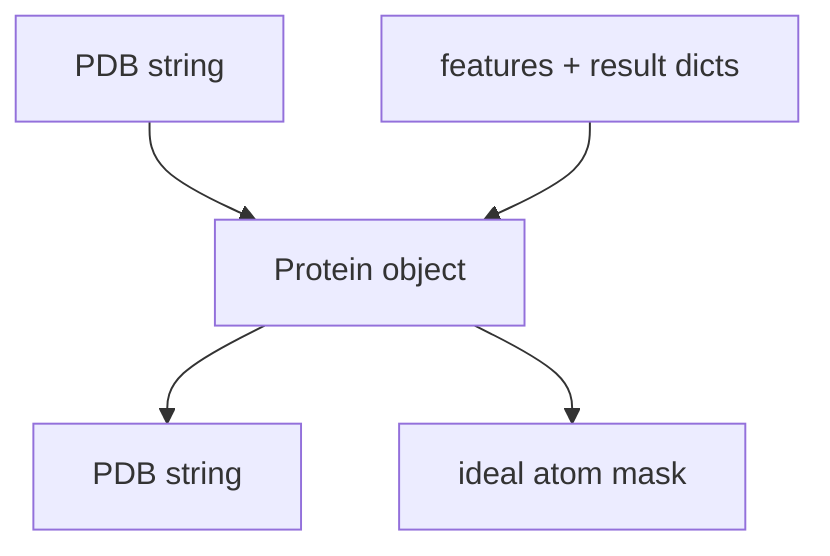
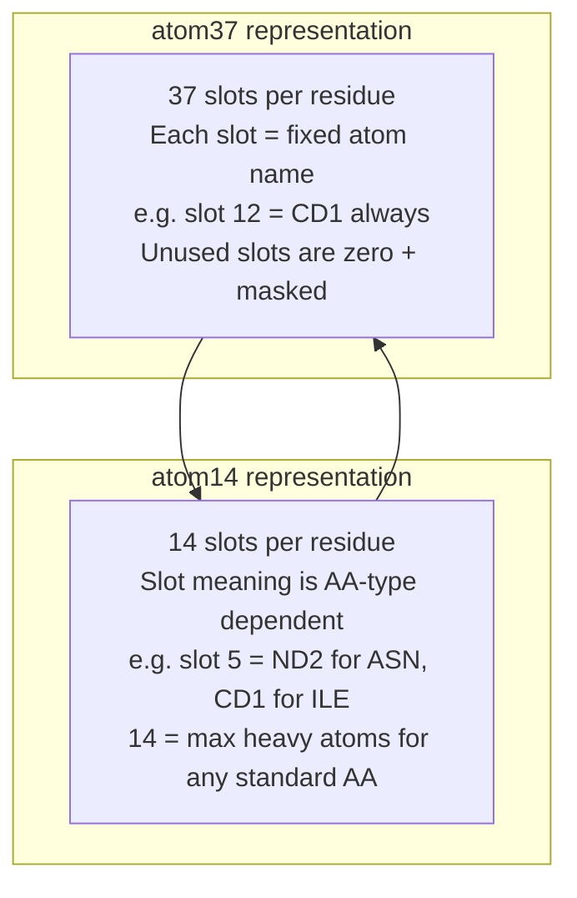
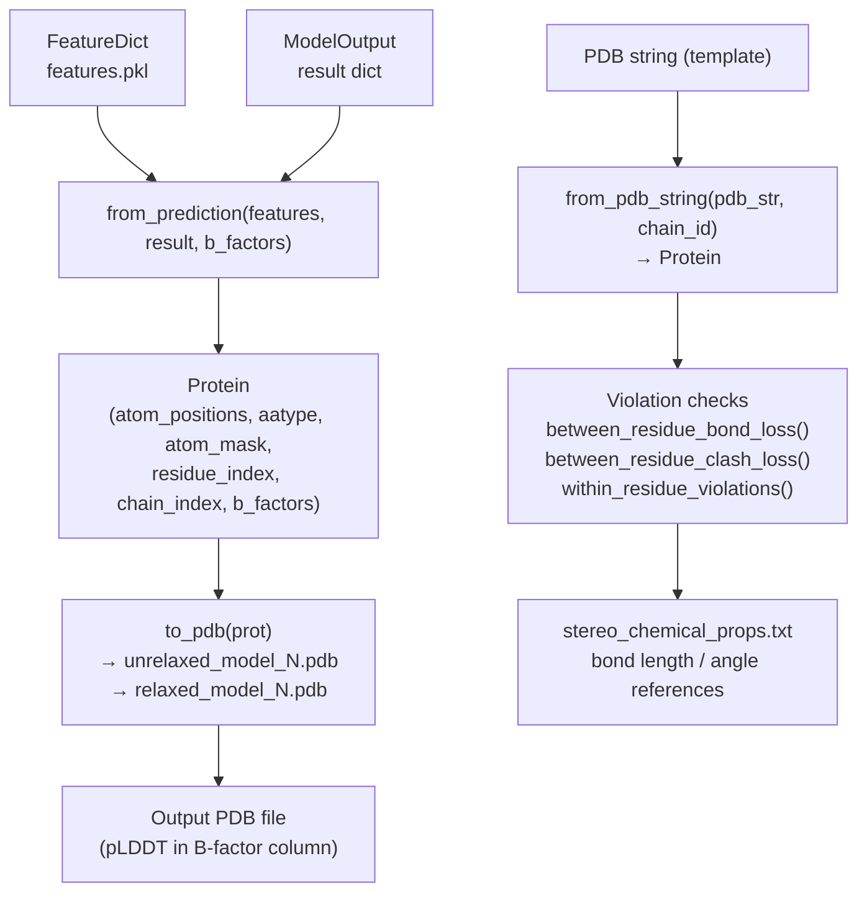

# Common Data Structures

> **Relevant source files**
> * [alphafold/common/protein.py](https://github.com/jcheongs/alphafold-multimer/blob/8e419501/alphafold/common/protein.py)
> * [alphafold/common/stereo_chemical_props.txt](https://github.com/jcheongs/alphafold-multimer/blob/8e419501/alphafold/common/stereo_chemical_props.txt)
> * [alphafold/model/all_atom.py](https://github.com/jcheongs/alphafold-multimer/blob/8e419501/alphafold/model/all_atom.py)
> * [alphafold/model/tf/protein_features.py](https://github.com/jcheongs/alphafold-multimer/blob/8e419501/alphafold/model/tf/protein_features.py)

This page documents the shared data structures used throughout the AlphaFold-Multimer codebase: the `Protein` dataclass and its I/O functions, the `FeatureDict` and `ModelOutput` type aliases, the feature metadata schema, and the `stereo_chemical_props.txt` reference data for geometric validation.

* For how features are constructed from raw sequences, see [Data Pipeline](/jcheongs/alphafold-multimer/4-data-pipeline).
* For how the model consumes these features at inference time, see [Neural Network Model](/jcheongs/alphafold-multimer/5-neural-network-model).
* For how geometric properties are used during relaxation, see [Structure Relaxation](/jcheongs/alphafold-multimer/6-structure-relaxation).

---

## The Protein Dataclass

The `Protein` class in [alphafold/common/protein.py L31-L63](https://github.com/jcheongs/alphafold-multimer/blob/8e419501/alphafold/common/protein.py#L31-L63)

 is the canonical in-memory representation of a protein structure throughout the codebase. It is a frozen dataclass, meaning all fields are immutable after construction.

### Fields

| Field | Shape | dtype | Description |
| --- | --- | --- | --- |
| `atom_positions` | `[num_res, num_atom_type, 3]` | `float` | Cartesian coordinates in Ångströms |
| `aatype` | `[num_res]` | `int` | Amino acid type index (0–19 = standard AA, 20 = unknown `X`) |
| `atom_mask` | `[num_res, num_atom_type]` | `float` | Binary mask: 1.0 if atom present, 0.0 if absent |
| `residue_index` | `[num_res]` | `int` | Residue number as stored in PDB; not necessarily zero-indexed or contiguous |
| `chain_index` | `[num_res]` | `int` | Zero-indexed integer identifying the chain each residue belongs to |
| `b_factors` | `[num_res, num_atom_type]` | `float` | Per-atom B-factors (temperature factors) in Ų |

The atom axis (`num_atom_type`) uses the **atom37** representation by default on output. See [Atom Representations](https://github.com/jcheongs/alphafold-multimer/blob/8e419501/Atom Representations)

 below.

`__post_init__` enforces that the number of unique chains does not exceed `PDB_MAX_CHAINS` (62), matching the PDB format limit [alphafold/common/protein.py L59-L63](https://github.com/jcheongs/alphafold-multimer/blob/8e419501/alphafold/common/protein.py#L59-L63)

Sources: [alphafold/common/protein.py L31-L63](https://github.com/jcheongs/alphafold-multimer/blob/8e419501/alphafold/common/protein.py#L31-L63)

---

## Chain ID Constraints

```
PDB_CHAIN_IDS = 'ABCDEFGHIJKLMNOPQRSTUVWXYZabcdefghijklmnopqrstuvwxyz0123456789'
PDB_MAX_CHAINS = 62
```

[alphafold/common/protein.py L27-L28](https://github.com/jcheongs/alphafold-multimer/blob/8e419501/alphafold/common/protein.py#L27-L28)

`chain_index` stores integers (0 to 61). When serialized to PDB, these integers are mapped to characters from `PDB_CHAIN_IDS` in order. Chain 0 → `A`, chain 1 → `B`, …, chain 25 → `Z`, chain 26 → `a`, etc.

---

## Protein I/O Functions

**Diagram: Protein I/O Flow**



Sources: [alphafold/common/protein.py L66-L278](https://github.com/jcheongs/alphafold-multimer/blob/8e419501/alphafold/common/protein.py#L66-L278)

### from_pdb_string

[alphafold/common/protein.py L66-L137](https://github.com/jcheongs/alphafold-multimer/blob/8e419501/alphafold/common/protein.py#L66-L137)

Parses a PDB string into a `Protein` using BioPython's `PDBParser`. Key behaviors:

* Only single-model PDBs are accepted (raises `ValueError` if more than one MODEL record is found).
* Non-standard residue types are mapped to `X` (index 20).
* Non-standard atoms (those not in `residue_constants.atom_types`) are silently skipped.
* Residues where no known atom positions are reported are skipped entirely.
* Insertion codes are not supported and raise a `ValueError`.
* Chain IDs (characters) are remapped to contiguous 0-indexed integers.
* An optional `chain_id` argument restricts parsing to a single named chain.

### to_pdb

[alphafold/common/protein.py L146-L223](https://github.com/jcheongs/alphafold-multimer/blob/8e419501/alphafold/common/protein.py#L146-L223)

Converts a `Protein` instance back to a PDB-format string. Key behaviors:

* Atoms where `atom_mask < 0.5` are omitted.
* TER records are inserted at chain boundaries.
* All lines are padded to exactly 80 characters (PDB columnar format requirement).
* `b_factors` are written to the B-factor column verbatim — by convention the model writes pLDDT scores here during prediction output (see [Confidence Metrics](/jcheongs/alphafold-multimer/5.3-confidence-metrics)).
* Output uses `MODEL 1` / `ENDMDL` framing.

### from_prediction

[alphafold/common/protein.py L242-L278](https://github.com/jcheongs/alphafold-multimer/blob/8e419501/alphafold/common/protein.py#L242-L278)

Constructs a `Protein` from the raw outputs of a model run. Used in the prediction loop in `run_alphafold.py`.

| Argument | Source |
| --- | --- |
| `aatype` | `features['aatype']` |
| `atom_positions` | `result['structure_module']['final_atom_positions']` |
| `atom_mask` | `result['structure_module']['final_atom_mask']` |
| `residue_index` | `features['residue_index'] + 1` (converted to 1-based) |
| `chain_index` | `features['asym_id']` if multimer; zeros otherwise |
| `b_factors` | Caller-supplied (typically per-atom pLDDT); zeros if `None` |

The `remove_leading_feature_dimension` flag (default `True`) strips the batch dimension from feature arrays.

### ideal_atom_mask

[alphafold/common/protein.py L226-L239](https://github.com/jcheongs/alphafold-multimer/blob/8e419501/alphafold/common/protein.py#L226-L239)

Returns a mask of atoms that *should* be present for each residue type according to chemistry, as opposed to `atom_mask` which reflects what was actually observed in experimental data. Computed from `residue_constants.STANDARD_ATOM_MASK[prot.aatype]`.

Sources: [alphafold/common/protein.py L66-L278](https://github.com/jcheongs/alphafold-multimer/blob/8e419501/alphafold/common/protein.py#L66-L278)

---

## Type Aliases

Defined at the top of `protein.py` [alphafold/common/protein.py L23-L24](https://github.com/jcheongs/alphafold-multimer/blob/8e419501/alphafold/common/protein.py#L23-L24)

:

| Alias | Definition | Used for |
| --- | --- | --- |
| `FeatureDict` | `Mapping[str, np.ndarray]` | Input feature dictionaries passed to the model |
| `ModelOutput` | `Mapping[str, Any]` | Nested dict returned by `RunModel.predict()` |

These aliases appear throughout the data pipeline and model code as type hints.

---

## Feature Metadata: FEATURES and FeatureType

[alphafold/model/tf/protein_features.py](https://github.com/jcheongs/alphafold-multimer/blob/8e419501/alphafold/model/tf/protein_features.py)

 defines the metadata schema for every named feature used by the model.

### FeatureType Enum

[alphafold/model/tf/protein_features.py L25-L29](https://github.com/jcheongs/alphafold-multimer/blob/8e419501/alphafold/model/tf/protein_features.py#L25-L29)

```
FeatureType.ZERO_DIM  → shape [x]
FeatureType.ONE_DIM   → shape [num_res, x]
FeatureType.TWO_DIM   → shape [num_res, num_res, x]
FeatureType.MSA       → shape [msa_length, num_res, x]
```

### FEATURES Dictionary

[alphafold/model/tf/protein_features.py L41-L65](https://github.com/jcheongs/alphafold-multimer/blob/8e419501/alphafold/model/tf/protein_features.py#L41-L65)

Maps feature name → `(tf.DType, shape_spec)`. Shape specs use two special placeholder strings:

| Placeholder | Resolved to |
| --- | --- |
| `NUM_RES` | number of residues in the protein |
| `NUM_SEQ` | number of sequences in the MSA |
| `NUM_TEMPLATES` | number of structural templates |

**Key entries:**

| Feature name | dtype | Shape spec |
| --- | --- | --- |
| `aatype` | float32 | `[NUM_RES, 21]` |
| `residue_index` | int64 | `[NUM_RES, 1]` |
| `msa` | int64 | `[NUM_SEQ, NUM_RES, 1]` |
| `deletion_matrix` | float32 | `[NUM_SEQ, NUM_RES, 1]` |
| `all_atom_positions` | float32 | `[NUM_RES, atom_type_num, 3]` |
| `all_atom_mask` | int64 | `[NUM_RES, atom_type_num]` |
| `template_aatype` | float32 | `[NUM_TEMPLATES, NUM_RES, 22]` |
| `template_all_atom_positions` | float32 | `[NUM_TEMPLATES, NUM_RES, atom_type_num, 3]` |

The derived dicts `FEATURE_TYPES` and `FEATURE_SIZES` provide indexed lookups into this data [alphafold/model/tf/protein_features.py L67-L68](https://github.com/jcheongs/alphafold-multimer/blob/8e419501/alphafold/model/tf/protein_features.py#L67-L68)

### shape() Function

[alphafold/model/tf/protein_features.py L80-L129](https://github.com/jcheongs/alphafold-multimer/blob/8e419501/alphafold/model/tf/protein_features.py#L80-L129)

Resolves all placeholders for a named feature given concrete values:

```markdown
shape('msa', num_residues=100, msa_length=512)# → [512, 100, 1]
```

Raises `ValueError` if a placeholder cannot be resolved.

### register_feature()

[alphafold/model/tf/protein_features.py L71-L77](https://github.com/jcheongs/alphafold-multimer/blob/8e419501/alphafold/model/tf/protein_features.py#L71-L77)

Allows extension of the feature schema at runtime by inserting into `FEATURES`, `FEATURE_TYPES`, and `FEATURE_SIZES`.

Sources: [alphafold/model/tf/protein_features.py](https://github.com/jcheongs/alphafold-multimer/blob/8e419501/alphafold/model/tf/protein_features.py)

---

## Atom Representations

The model uses two interchangeable dense layouts for heavy atoms, defined in [alphafold/model/all_atom.py L1-L34](https://github.com/jcheongs/alphafold-multimer/blob/8e419501/alphafold/model/all_atom.py#L1-L34)

**Diagram: atom14 vs atom37 representations**



Sources: [alphafold/model/all_atom.py L1-L34](https://github.com/jcheongs/alphafold-multimer/blob/8e419501/alphafold/model/all_atom.py#L1-L34)

 [alphafold/model/all_atom.py L76-L111](https://github.com/jcheongs/alphafold-multimer/blob/8e419501/alphafold/model/all_atom.py#L76-L111)

| Property | atom37 | atom14 |
| --- | --- | --- |
| Slots per residue | 37 | 14 |
| Slot → atom name mapping | Fixed across all residue types | Varies by residue type |
| Sparsity | Sparse (many zeros) | Dense |
| Where used | Output, PDB conversion | Internal model computations |

Conversion between the two representations requires lookup indices stored in the batch feature dict under keys `residx_atom37_to_atom14`, `residx_atom14_to_atom37`, `atom37_atom_exists`, and `atom14_atom_exists`.

---

## stereo_chemical_props.txt Reference Data

[alphafold/common/stereo_chemical_props.txt](https://github.com/jcheongs/alphafold-multimer/blob/8e419501/alphafold/common/stereo_chemical_props.txt)

 is a plain-text file providing experimentally derived geometric reference values for all 20 standard amino acids. It is used by the structural violation detection code in the relaxation pipeline (see [Structure Relaxation](/jcheongs/alphafold-multimer/6-structure-relaxation)).

The file has three sections:

### Bond Lengths

[alphafold/common/stereo_chemical_props.txt L1-L154](https://github.com/jcheongs/alphafold-multimer/blob/8e419501/alphafold/common/stereo_chemical_props.txt#L1-L154)

Tab-separated records: `Bond`, `Residue`, `Mean (Å)`, `StdDev (Å)`.

Example entries:

| Bond | Residue | Mean (Å) | StdDev (Å) |
| --- | --- | --- | --- |
| N-CA | ALA | 1.459 | 0.020 |
| CA-C | ALA | 1.525 | 0.026 |
| C-O | ALA | 1.229 | 0.019 |
| CA-CB | ALA | 1.520 | 0.021 |
| CB-SG | CYS | 1.812 | 0.016 |

The backbone bonds N-CA, CA-C, and C-O are consistent across most residue types. Sidechain bonds vary substantially (e.g., GLY has no CA-CB entry).

### Bond Angles

[alphafold/common/stereo_chemical_props.txt L157-L331](https://github.com/jcheongs/alphafold-multimer/blob/8e419501/alphafold/common/stereo_chemical_props.txt#L157-L331)

Tab-separated records: `Angle`, `Residue`, `Mean (°)`, `StdDev (°)`.

Example entries:

| Angle | Residue | Mean (°) | StdDev (°) |
| --- | --- | --- | --- |
| N-CA-C | ALA | 111.0 | 2.7 |
| CA-C-O | ALA | 120.1 | 2.1 |
| N-CA-CB | ALA | 110.1 | 1.4 |

PRO (proline) has unique geometry due to its ring: N-CA-CB is 103.3°, substantially smaller than the typical ~110°.

### Non-bonded Distances

[alphafold/common/stereo_chemical_props.txt L334-L344](https://github.com/jcheongs/alphafold-multimer/blob/8e419501/alphafold/common/stereo_chemical_props.txt#L334-L344)

Lower-bound distances and tolerances for non-bonded atom pairs, used for clash detection:

| Atom pair | Minimum dist (Å) | Tolerance |
| --- | --- | --- |
| C–C | 3.40 | 1.5 |
| C–N | 3.25 | 1.5 |
| C–O | 3.22 | 1.5 |
| N–N | 3.10 | 1.5 |
| N–O | 3.07 | 1.5 |
| O–O | 3.04 | 1.5 |
| S–S | 2.03 | 1.0 |

The tolerance column acts as a scaling factor on allowed violations. S–S has a tighter tolerance (1.0) to capture disulfide bridge geometry correctly.

---

## Data Flow: Structures in Context

**Diagram: `Protein` dataclass lifecycle across subsystems**



Sources: [alphafold/common/protein.py](https://github.com/jcheongs/alphafold-multimer/blob/8e419501/alphafold/common/protein.py)

 [alphafold/model/all_atom.py](https://github.com/jcheongs/alphafold-multimer/blob/8e419501/alphafold/model/all_atom.py)

 [alphafold/common/stereo_chemical_props.txt](https://github.com/jcheongs/alphafold-multimer/blob/8e419501/alphafold/common/stereo_chemical_props.txt)