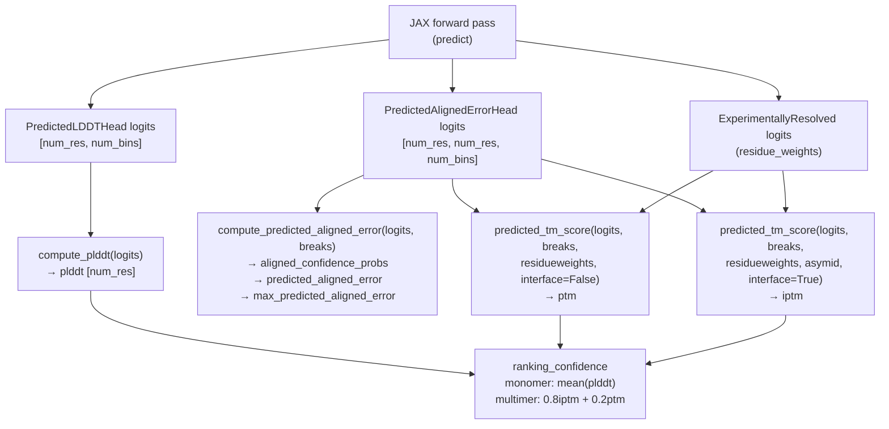
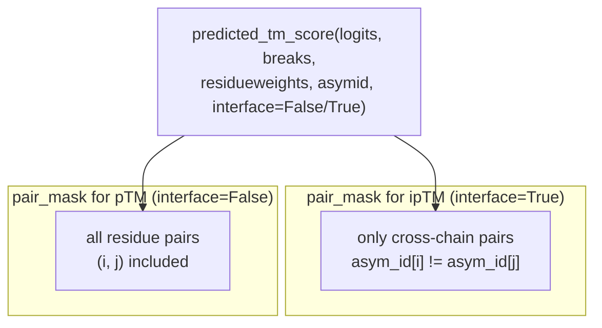
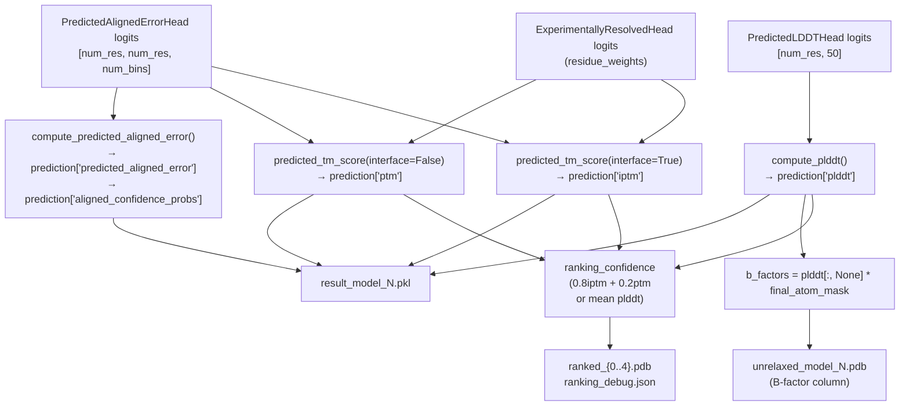

# Confidence Metrics

> **Relevant source files**
> * [README.md](https://github.com/jcheongs/alphafold-multimer/blob/8e419501/README.md?plain=1)
> * [alphafold/common/confidence.py](https://github.com/jcheongs/alphafold-multimer/blob/8e419501/alphafold/common/confidence.py)
> * [alphafold/data/tools/hhblits.py](https://github.com/jcheongs/alphafold-multimer/blob/8e419501/alphafold/data/tools/hhblits.py)
> * [alphafold/data/tools/hhsearch.py](https://github.com/jcheongs/alphafold-multimer/blob/8e419501/alphafold/data/tools/hhsearch.py)
> * [notebooks/AlphaFold.ipynb](https://github.com/jcheongs/alphafold-multimer/blob/8e419501/notebooks/AlphaFold.ipynb)

This page documents the four confidence outputs produced by AlphaFold after the neural network forward pass: **pLDDT**, **PAE**, **pTM**, and **ipTM**. It covers how each is computed from raw model logits, what each measures biologically, how pLDDT is written into PDB B-factor columns, and how `ranking_confidence` is derived for model selection.

For context on how the model produces the raw logits these functions consume, see the Neural Network Model overview ([5](https://github.com/jcheongs/alphafold-multimer/blob/8e419501/5)

). For details on the `Protein` dataclass and B-factor field, see Common Data Structures ([7](https://github.com/jcheongs/alphafold-multimer/blob/8e419501/7)

).

---

## Overview

The confidence metrics are implemented in [alphafold/common/confidence.py](https://github.com/jcheongs/alphafold-multimer/blob/8e419501/alphafold/common/confidence.py)

 and are called after every JAX forward pass. They convert raw output logits from specialist model heads into interpretable scalar and matrix metrics.

| Metric | Shape | Range | Higher = ? | Model Availability |
| --- | --- | --- | --- | --- |
| `plddt` | `[num_res]` | 0 – 100 | More confident | All models |
| `predicted_aligned_error` | `[num_res, num_res]` | 0 – `max_pae` | Less confident | pTM and multimer models |
| `ptm` | scalar | 0 – 1 | More confident | pTM and multimer models |
| `iptm` | scalar | 0 – 1 | More confident | Multimer models only |
| `ranking_confidence` | scalar | — | More confident | All models |

**Confidence metrics flow:**



Sources: [alphafold/common/confidence.py L1-L169](https://github.com/jcheongs/alphafold-multimer/blob/8e419501/alphafold/common/confidence.py#L1-L169)

 [notebooks/AlphaFold.ipynb](https://github.com/jcheongs/alphafold-multimer/blob/8e419501/notebooks/AlphaFold.ipynb)

---

## pLDDT — Per-Residue Local Distance Difference Test

### What it measures

pLDDT is a per-residue confidence score predicted by the model. It estimates how accurate the predicted local atomic geometry is, specifically the Cα–Cα distances to neighbours within 15 Å. A value of 100 indicates maximum confidence; 0 indicates minimum.

The four confidence bands used in visualisation are:

| Range | Label |
| --- | --- |
| ≥ 90 | Very high |
| 70 – 90 | Confident |
| 50 – 70 | Low |
| < 50 | Very low |

### How it is computed

**Function:** `compute_plddt` in [alphafold/common/confidence.py L22-L36](https://github.com/jcheongs/alphafold-multimer/blob/8e419501/alphafold/common/confidence.py#L22-L36)

The model's `PredictedLDDTHead` outputs a logit vector of shape `[num_res, num_bins]` (50 bins by default). `compute_plddt` converts this to a scalar score per residue:

1. Softmax the logits along the bin dimension to get probabilities.
2. Compute bin centres uniformly spaced across `[0, 1]` (one centre per bin).
3. Take the expected value: sum of `probs * bin_centers` along the bin axis.
4. Scale to the 0–100 range by multiplying by 100.

```
bin_width = 1.0 / num_bins
bin_centers = [0.5*bw, 1.5*bw, ..., (num_bins - 0.5)*bw]
plddt = softmax(logits) · bin_centers  × 100
```

Sources: [alphafold/common/confidence.py L22-L36](https://github.com/jcheongs/alphafold-multimer/blob/8e419501/alphafold/common/confidence.py#L22-L36)

### pLDDT in PDB B-factors

The per-residue pLDDT array is written into the B-factor column of every unrelaxed and relaxed PDB output. The construction in the Colab notebook makes the mapping explicit:

```
b_factors = prediction['plddt'][:, None] * final_atom_mask
```

This broadcasts the per-residue score across all atoms in that residue. Atoms not present (masked) receive zero. The same approach is used in the full pipeline via `protein.from_prediction()`.

> **Note:** Unlike a crystallographic B-factor (where lower = more ordered), a higher pLDDT value means higher confidence. Take care when using pLDDT B-factors for downstream tasks such as molecular replacement.

Sources: [notebooks/AlphaFold.ipynb L526-L534](https://github.com/jcheongs/alphafold-multimer/blob/8e419501/notebooks/AlphaFold.ipynb#L526-L534)

 [README.md L497-L499](https://github.com/jcheongs/alphafold-multimer/blob/8e419501/README.md?plain=1#L497-L499)

---

## PAE — Predicted Aligned Error

### What it measures

PAE is a pairwise confidence matrix of shape `[num_res, num_res]`. Entry `[i, j]` is the model's expected error (in Å) at the position of residue `i` when the predicted and true structures are aligned on residue `j`. Low values mean the model is confident about the relative position of the two residues after alignment on `j`.

PAE is most useful for assessing **inter-domain** and **inter-chain** confidence, whereas pLDDT captures intra-domain geometry. In multimer outputs, chain boundaries are visible as blocks in the PAE matrix.

### How it is computed

**Function:** `compute_predicted_aligned_error` in [alphafold/common/confidence.py L80-L108](https://github.com/jcheongs/alphafold-multimer/blob/8e419501/alphafold/common/confidence.py#L80-L108)

**Helper:** `_calculate_bin_centers` in [alphafold/common/confidence.py L39-L55](https://github.com/jcheongs/alphafold-multimer/blob/8e419501/alphafold/common/confidence.py#L39-L55)

**Helper:** `_calculate_expected_aligned_error` in [alphafold/common/confidence.py L58-L77](https://github.com/jcheongs/alphafold-multimer/blob/8e419501/alphafold/common/confidence.py#L58-L77)

The `PredictedAlignedErrorHead` outputs logits of shape `[num_res, num_res, num_bins]` and a set of bin break-points. The computation:

1. Softmax the logits along the bin dimension → `aligned_confidence_probs` of shape `[num_res, num_res, num_bins]`.
2. Compute bin centres from the break-points: interior centres are `breaks + step/2`; the last bin gets one extra centre of `breaks[-1] + step` to act as a catch-all.
3. Compute the expected error per pair: `sum(probs * bin_centers, axis=-1)`.
4. The maximum possible error is the last bin centre.

The function returns a dict with three keys:

| Key | Shape | Description |
| --- | --- | --- |
| `aligned_confidence_probs` | `[num_res, num_res, num_bins]` | Full probability distribution over error bins |
| `predicted_aligned_error` | `[num_res, num_res]` | Expected aligned distance error (Å) |
| `max_predicted_aligned_error` | scalar | Maximum possible predicted error |

Sources: [alphafold/common/confidence.py L39-L108](https://github.com/jcheongs/alphafold-multimer/blob/8e419501/alphafold/common/confidence.py#L39-L108)

---

## pTM — Predicted TM-Score

### What it measures

pTM is a scalar in `[0, 1]` that estimates the TM-score between the predicted structure and the true structure. It measures global fold accuracy: whether the entire domain or complex is positioned correctly. Values above ~0.5 suggest the overall topology is likely correct.

### How it is computed

**Function:** `predicted_tm_score` in [alphafold/common/confidence.py L111-L168](https://github.com/jcheongs/alphafold-multimer/blob/8e419501/alphafold/common/confidence.py#L111-L168)

 called with `interface=False`.

The same PAE logits and bin breaks used for PAE are reused. The derivation follows TM-score equation (5) from Yang & Skolnick (2004):

1. Compute `d0 = 1.24 * (clipped_num_res - 15)^(1/3) - 1.8`, where `clipped_num_res = max(num_res, 19)` to avoid undefined values for very short sequences.
2. For every error bin centre `d`, compute the TM-score contribution: `1 / (1 + d² / d0²)`.
3. Take the expectation over the probability distribution: `predicted_tm_term[i,j] = sum(probs[i,j] * tm_per_bin)`.
4. Weight residue pairs by `residue_weights` (from the `ExperimentallyResolved` head), normalise within each alignment, and take the row-wise sum.
5. Return the maximum per-alignment score over all candidate alignment positions.

The `residue_weights` parameter is optional (`None` defaults to all-ones). When provided, it gives the model's prediction of whether each residue is experimentally resolved, down-weighting uncertain residues.

Sources: [alphafold/common/confidence.py L111-L168](https://github.com/jcheongs/alphafold-multimer/blob/8e419501/alphafold/common/confidence.py#L111-L168)

---

## ipTM — Predicted Interface TM-Score

### What it measures

ipTM is specific to the multimer model. It is a variant of pTM that considers only **cross-chain residue pairs**, measuring confidence in the relative positioning of different chains at the interface. A high ipTM indicates the model is confident about how the chains dock together.

### How it is computed

**Function:** `predicted_tm_score` in [alphafold/common/confidence.py L111-L168](https://github.com/jcheongs/alphafold-multimer/blob/8e419501/alphafold/common/confidence.py#L111-L168)

 called with `interface=True` and a valid `asym_id` array.

The calculation is identical to pTM with one modification: the `pair_mask` is applied to zero out same-chain pairs before normalisation:

```
pair_mask *= asym_id[:, None] != asym_id[None, :]
```

`asym_id` is a `[num_res]` integer array where each entry is the chain index of that residue. Pairs where both residues belong to the same chain are excluded, so the metric only reflects inter-chain geometry confidence.

**Diagram: pTM vs ipTM pair selection**



Sources: [alphafold/common/confidence.py L156-L168](https://github.com/jcheongs/alphafold-multimer/blob/8e419501/alphafold/common/confidence.py#L156-L168)

---

## ranking_confidence — Model Selection Score

`ranking_confidence` is the scalar used to rank the five model predictions and select the best one (written to `ranked_0.pdb`).

The score differs between monomer and multimer modes:

| Mode | Formula | Rationale |
| --- | --- | --- |
| `monomer` / `monomer_casp14` | `mean(plddt)` | Average per-residue confidence |
| `monomer_ptm` | `mean(plddt)` | Same; pTM models not entered in main ranking |
| `multimer` | `0.8 × ipTM + 0.2 × pTM` | Interface quality weighted higher than global fold |

This is emitted directly as `prediction['ranking_confidence']` by the model and read in `run_alphafold.py` to populate `ranking_debug.json`.

The Colab notebook shows clearly how the multimer path uses this combined score:

```markdown
# Multimer models are sorted by pTM+ipTM.ranking_confidences[model_name] = prediction['ranking_confidence']
```

Sources: [notebooks/AlphaFold.ipynb L517-L522](https://github.com/jcheongs/alphafold-multimer/blob/8e419501/notebooks/AlphaFold.ipynb#L517-L522)

 [README.md L464-L469](https://github.com/jcheongs/alphafold-multimer/blob/8e419501/README.md?plain=1#L464-L469)

---

## Output Locations

After every model run, the confidence data appears in several places:

| File | Content |
| --- | --- |
| `result_model_N.pkl` | Full dict including `plddt`, `ptm`, `predicted_aligned_error`, `max_predicted_aligned_error`, `ranking_confidence` |
| `unrelaxed_model_N.pdb` | pLDDT embedded in B-factor column for every atom |
| `relaxed_model_N.pdb` | Same B-factors as unrelaxed (restored after Amber minimisation) |
| `ranked_{0..4}.pdb` | Models sorted by `ranking_confidence`; `ranked_0.pdb` = best |
| `ranking_debug.json` | `ranking_confidence` value and model name for each of the 5 models |

**Data flow from logits to output files:**



Sources: [alphafold/common/confidence.py L1-L169](https://github.com/jcheongs/alphafold-multimer/blob/8e419501/alphafold/common/confidence.py#L1-L169)

 [notebooks/AlphaFold.ipynb L506-L524](https://github.com/jcheongs/alphafold-multimer/blob/8e419501/notebooks/AlphaFold.ipynb#L506-L524)

 [README.md L436-L499](https://github.com/jcheongs/alphafold-multimer/blob/8e419501/README.md?plain=1#L436-L499)