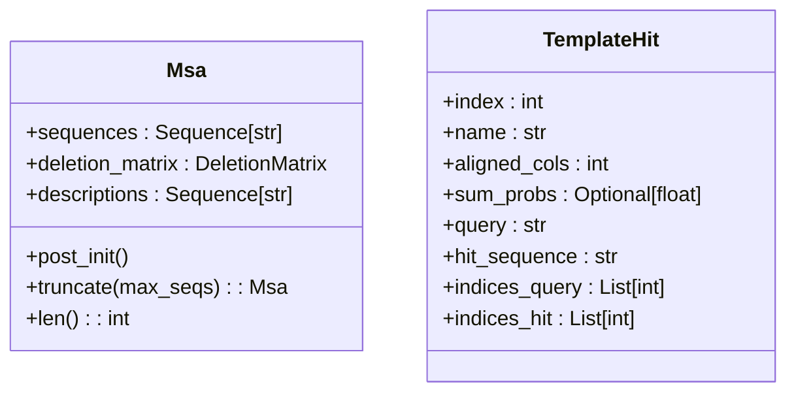
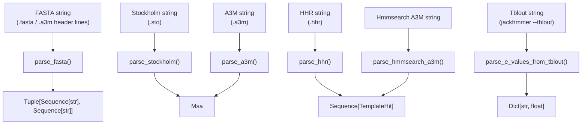
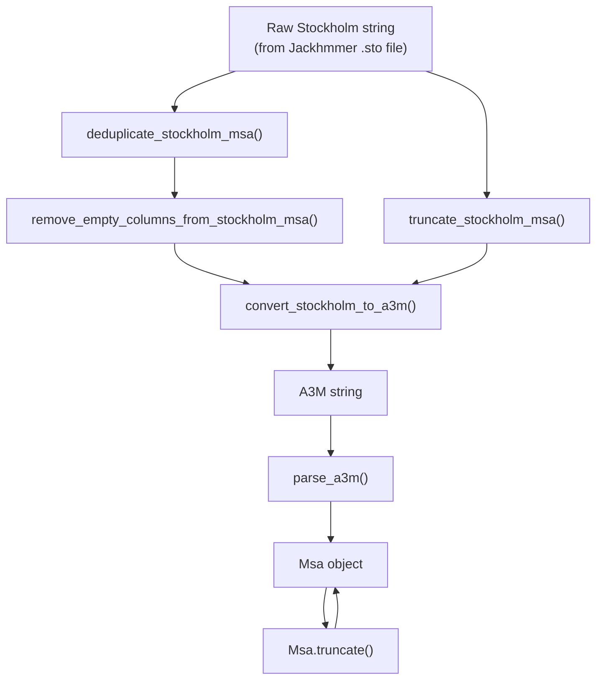

# Data Formats and Parsers

> **Relevant source files**
> * [alphafold/data/parsers.py](https://github.com/jcheongs/alphafold-multimer/blob/8e419501/alphafold/data/parsers.py)

## Purpose and Scope

This page documents the parsing layer in `alphafold/data/parsers.py`. It covers the two core data classes (`Msa` and `TemplateHit`), all `parse_*` functions that convert raw tool output into those structures, and the MSA manipulation utilities that clean and transform alignment data before it reaches the feature pipeline.

This page is strictly about the *parsing and representation* of input file formats. For how these parsed objects are handed to feature construction, see the [Monomer Data Pipeline](/jcheongs/alphafold-multimer/4.1-monomer-data-pipeline) and [Multimer Data Pipeline](/jcheongs/alphafold-multimer/4.4-multimer-data-pipeline) pages. For how the tools that produce these files are invoked, see [MSA Generation Tools](/jcheongs/alphafold-multimer/4.2-msa-generation-tools) and [Template Processing](/jcheongs/alphafold-multimer/4.3-template-processing).

---

## Core Data Classes

Both classes are frozen dataclasses, making them immutable once constructed.

### Msa

[alphafold/data/parsers.py L29-L52](https://github.com/jcheongs/alphafold-multimer/blob/8e419501/alphafold/data/parsers.py#L29-L52)

Represents a parsed multiple sequence alignment. All three fields must have the same length; this is enforced in `__post_init__`.

| Field | Type | Description |
| --- | --- | --- |
| `sequences` | `Sequence[str]` | Aligned sequences, uppercase, with gap characters (`-`) but no lowercase insertions |
| `deletion_matrix` | `DeletionMatrix` (= `Sequence[Sequence[int]]`) | Per-sequence, per-position count of residues deleted relative to the query |
| `descriptions` | `Sequence[str]` | Sequence identifiers / description lines, one per sequence |

The `DeletionMatrix` type alias is defined at [alphafold/data/parsers.py L26](https://github.com/jcheongs/alphafold-multimer/blob/8e419501/alphafold/data/parsers.py#L26-L26)

The `Msa` class provides one method:

* **`truncate(max_seqs: int) -> Msa`** — Returns a new `Msa` with the first `max_seqs` rows, slicing all three fields consistently.

### TemplateHit

[alphafold/data/parsers.py L55-L67](https://github.com/jcheongs/alphafold-multimer/blob/8e419501/alphafold/data/parsers.py#L55-L67)

Represents a single template hit from either HHSearch (`.hhr` format) or Hmmsearch (A3M format).

| Field | Type | Description |
| --- | --- | --- |
| `index` | `int` | Hit number (1-based) in the results file |
| `name` | `str` | Template identifier, e.g. `4abc_A` |
| `aligned_cols` | `int` | Number of aligned columns |
| `sum_probs` | `Optional[float]` | Sum of posterior probabilities (from HHR; `None` for Hmmsearch hits) |
| `query` | `str` | Query sequence string for the alignment block |
| `hit_sequence` | `str` | Template sequence string for the alignment block |
| `indices_query` | `List[int]` | Residue index per alignment column for the query; `-1` at gap positions |
| `indices_hit` | `List[int]` | Residue index per alignment column for the hit; `-1` at gap positions |

**Diagram: Data Class Field Overview**



Sources: [alphafold/data/parsers.py L26-L67](https://github.com/jcheongs/alphafold-multimer/blob/8e419501/alphafold/data/parsers.py#L26-L67)

---

## Gap Sentinels and Deletion Matrices

Understanding these two representations is essential for interpreting `Msa` and `TemplateHit` fields.

### Deletion Matrix

In both Stockholm and A3M formats, sequences may contain residues that are insertions relative to the query (i.e. extra residues not present in the query alignment columns). Rather than keeping these in the sequence string, they are counted and stored in the deletion matrix.

* `deletion_matrix[i][j]` = number of residues that appear in sequence `i` *before* alignment column `j` but are absent from the query at that position.
* The final sequences stored in `Msa.sequences` have all such insertions removed.

### Gap Sentinel (-1) in Index Lists

`TemplateHit.indices_query` and `TemplateHit.indices_hit` use `-1` as a sentinel to mark a gap at a given alignment column. A value of `-1` at position `k` means there is no residue in the corresponding original sequence at that alignment column.

```yaml
alignment column:   0    1    2    3    4
query string:       A    -    C    D    E
indices_query:      0   -1    1    2    3
```

Sources: [alphafold/data/parsers.py L106-L154](https://github.com/jcheongs/alphafold-multimer/blob/8e419501/alphafold/data/parsers.py#L106-L154)

 [alphafold/data/parsers.py L383-L393](https://github.com/jcheongs/alphafold-multimer/blob/8e419501/alphafold/data/parsers.py#L383-L393)

 [alphafold/data/parsers.py L524-L538](https://github.com/jcheongs/alphafold-multimer/blob/8e419501/alphafold/data/parsers.py#L524-L538)

---

## Parse Functions

**Diagram: parse functions, their input formats, and output types**



Sources: [alphafold/data/parsers.py L68-L613](https://github.com/jcheongs/alphafold-multimer/blob/8e419501/alphafold/data/parsers.py#L68-L613)

---

### parse_fasta

[alphafold/data/parsers.py L68-L94](https://github.com/jcheongs/alphafold-multimer/blob/8e419501/alphafold/data/parsers.py#L68-L94)

```
parse_fasta(fasta_string: str) -> Tuple[Sequence[str], Sequence[str]]
```

Splits a FASTA-format string into two parallel lists: amino acid sequences and their description lines (the `>` header text with the leading `>` stripped). Blank lines are skipped. Multi-line sequences are concatenated.

**Returns:** `(sequences, descriptions)`

This function is also used internally by `parse_a3m` since A3M files use FASTA-style headers.

---

### parse_stockholm

[alphafold/data/parsers.py L97-L154](https://github.com/jcheongs/alphafold-multimer/blob/8e419501/alphafold/data/parsers.py#L97-L154)

```
parse_stockholm(stockholm_string: str) -> Msa
```

Parses a Stockholm-format alignment (`.sto`) as produced by Jackhmmer.

**Key processing steps:**

1. Lines beginning with `#` or `//` are skipped.
2. Sequences are collected into an `OrderedDict`, concatenating split alignment blocks.
3. The *first* sequence is treated as the query. Columns where the query has a gap (`-`) are identified.
4. All sequences are filtered to keep only query non-gap columns — these become `Msa.sequences`.
5. A deletion count is accumulated by scanning each sequence: increments when `query_res == '-'`, emits count when a query non-gap column is encountered.

**Result:** An `Msa` where `descriptions` are the raw sequence name tokens (including Jackhmmer subsequence suffixes like `/4-78`).

---

### parse_a3m

[alphafold/data/parsers.py L157-L191](https://github.com/jcheongs/alphafold-multimer/blob/8e419501/alphafold/data/parsers.py#L157-L191)

```
parse_a3m(a3m_string: str) -> Msa
```

Parses an A3M-format alignment. A3M encodes insertions as lowercase letters rather than using a separate gap column.

**Key processing steps:**

1. Calls `parse_fasta` to split sequences and descriptions.
2. Builds the deletion matrix by scanning each sequence: lowercase characters increment `deletion_count`; uppercase or `-` characters flush the count to `deletion_vec`.
3. Strips all lowercase characters from sequences using `str.translate` with a deletion table, producing clean uppercase aligned sequences.

**Lowercase encoding in A3M:**

| Character | Meaning |
| --- | --- |
| Uppercase letter | Aligned residue (kept in `sequences`) |
| `-` | Gap in this sequence at a query column |
| Lowercase letter | Inserted residue not in query (counted in `deletion_matrix`, removed from `sequences`) |

---

### parse_hhr

[alphafold/data/parsers.py L491-L506](https://github.com/jcheongs/alphafold-multimer/blob/8e419501/alphafold/data/parsers.py#L491-L506)

```
parse_hhr(hhr_string: str) -> Sequence[TemplateHit]
```

Parses an `.hhr` file produced by HHSearch or HHBlits. The file structure is:

1. A summary results table.
2. Zero or more "paragraphs", each starting with a line `No <hit_number>`.

`parse_hhr` identifies paragraph boundaries by looking for `No` line prefixes, then delegates each paragraph to the internal `_parse_hhr_hit` function.

#### _parse_hhr_hit

[alphafold/data/parsers.py L395-L488](https://github.com/jcheongs/alphafold-multimer/blob/8e419501/alphafold/data/parsers.py#L395-L488)

For each paragraph:

* Line 0: hit number.
* Line 1: hit name (full description).
* Line 2: summary statistics line, parsed with a regex to extract `aligned_cols` and `sum_probs`.
* Subsequent lines: interleaved `Q <name> <start> <sequence> <end>` and `T <name> <start> <sequence> <end>` blocks. Lines starting with `Q ss_dssp`, `Q ss_pred`, `Q Consensus`, `T ss_dssp`, `T ss_pred`, `T Consensus` are skipped.

Index lists are built by `_update_hhr_residue_indices_list`, which assigns `-1` to gap positions and increments a counter for non-gap residues.

---

### parse_hmmsearch_a3m

[alphafold/data/parsers.py L572-L613](https://github.com/jcheongs/alphafold-multimer/blob/8e419501/alphafold/data/parsers.py#L572-L613)

```yaml
parse_hmmsearch_a3m(
    query_sequence: str,
    a3m_string: str,
    skip_first: bool = True
) -> Sequence[TemplateHit]
```

Converts the A3M output of Hmmsearch into a list of `TemplateHit` objects. Unlike HHR parsing, the query alignment columns are already embedded in the A3M format, so `query_sequence` is passed in explicitly.

**Key differences from HHR:**

* `sum_probs` is always `None` (Hmmsearch does not produce this metric).
* Hit names are constructed as `{pdb_id}_{chain}` from the description line.
* Sequences containing `mol:protein` in their description are kept; others are skipped.
* `indices_hit` start from `metadata.start - 1` (zero-based), derived from the `/start-end` suffix in the description.

#### _parse_hmmsearch_description and HitMetadata

[alphafold/data/parsers.py L542-L569](https://github.com/jcheongs/alphafold-multimer/blob/8e419501/alphafold/data/parsers.py#L542-L569)

Hmmsearch A3M description lines follow the pattern:

```
>4pqx_A/2-217 [subseq from] mol:protein length:217  Free text
```

The `HitMetadata` dataclass stores: `pdb_id`, `chain`, `start`, `end`, `length`, `text`. The regex used for extraction is at [alphafold/data/parsers.py L556-L558](https://github.com/jcheongs/alphafold-multimer/blob/8e419501/alphafold/data/parsers.py#L556-L558)

---

### parse_e_values_from_tblout

[alphafold/data/parsers.py L509-L521](https://github.com/jcheongs/alphafold-multimer/blob/8e419501/alphafold/data/parsers.py#L509-L521)

```
parse_e_values_from_tblout(tblout: str) -> Dict[str, float]
```

Parses the per-target E-value table from a Jackhmmer `--tblout` output file. Comment lines starting with `#` are skipped. The function extracts field 0 (target name) and field 4 (full-sequence E-value, 1-based column 5 in the HMMER User Guide).

The result always contains the key `'query'` mapped to `0` (i.e., the query matches itself with zero E-value).

---

## MSA Manipulation Utilities

These functions operate on raw Stockholm or `Msa` objects to clean, trim, or convert data before it is stored or passed to the feature pipeline.

**Diagram: MSA Utility Function Relationships**



Sources: [alphafold/data/parsers.py L194-L372](https://github.com/jcheongs/alphafold-multimer/blob/8e419501/alphafold/data/parsers.py#L194-L372)

---

### convert_stockholm_to_a3m

[alphafold/data/parsers.py L203-L254](https://github.com/jcheongs/alphafold-multimer/blob/8e419501/alphafold/data/parsers.py#L203-L254)

```yaml
convert_stockholm_to_a3m(
    stockholm_format: str,
    max_sequences: Optional[int] = None,
    remove_first_row_gaps: bool = True
) -> str
```

Converts a Stockholm alignment to A3M format string.

* If `max_sequences` is set, at most that many sequences are included.
* If `remove_first_row_gaps` is `True` (default), columns where the *query* (first sequence) is gapped are reformatted: residues at those columns become lowercase (insertions) in all other sequences, rather than uppercase gap columns. This is the standard A3M convention.
* The `#=GS DE` description lines are extracted and appended to the FASTA headers.
* Dots (`.`, optional gap characters in Stockholm) are removed from sequences.

The helper `_convert_sto_seq_to_a3m` handles the per-residue logic: if the query position is non-gap, emit as-is; if query position is a gap but the hit residue is not `-`, emit lowercase.

---

### truncate_stockholm_msa

[alphafold/data/parsers.py L277-L297](https://github.com/jcheongs/alphafold-multimer/blob/8e419501/alphafold/data/parsers.py#L277-L297)

```
truncate_stockholm_msa(stockholm_msa_path: str, max_sequences: int) -> str
```

Reads a Stockholm file from disk and returns a truncated string containing at most `max_sequences` unique sequence names. This function is file-path based (not string-based) specifically to avoid loading the full file into memory before truncating. It makes two passes over the file: the first to collect the set of sequence names to keep, the second to filter lines with `_keep_line`.

---

### remove_empty_columns_from_stockholm_msa

[alphafold/data/parsers.py L300-L337](https://github.com/jcheongs/alphafold-multimer/blob/8e419501/alphafold/data/parsers.py#L300-L337)

```
remove_empty_columns_from_stockholm_msa(stockholm_msa: str) -> str
```

Removes columns that are all `-` (dashes) across every sequence in a Stockholm alignment. Uses the `#=GC RF` (reference annotation) line as a chunk boundary. For each chunk, a boolean mask is computed and `itertools.compress` is used to filter the alignment characters. The RF line itself is also masked.

---

### deduplicate_stockholm_msa

[alphafold/data/parsers.py L340-L372](https://github.com/jcheongs/alphafold-multimer/blob/8e419501/alphafold/data/parsers.py#L340-L372)

```
deduplicate_stockholm_msa(stockholm_msa: str) -> str
```

Removes sequences that are identical to an already-seen sequence when insertions (columns where the query has a gap) are ignored. Uses the query's gap positions as a mask (`False` for insertion columns), applies the mask with `itertools.compress`, and tracks seen masked sequences in a set. The filtered Stockholm string retains only the first occurrence of each unique sequence.

---

## Summary: Format-to-Parser Mapping

| File Format | Extension | Produced By | Parser Function | Output Type |
| --- | --- | --- | --- | --- |
| FASTA | `.fasta` | User input | `parse_fasta` | `Tuple[Sequence[str], Sequence[str]]` |
| Stockholm | `.sto` | Jackhmmer | `parse_stockholm` | `Msa` |
| A3M (standard) | `.a3m` | HHBlits | `parse_a3m` | `Msa` |
| HHR | `.hhr` | HHSearch, HHBlits | `parse_hhr` | `Sequence[TemplateHit]` |
| A3M (Hmmsearch) | `.a3m` | Hmmsearch | `parse_hmmsearch_a3m` | `Sequence[TemplateHit]` |
| Tblout | (stdout) | Jackhmmer | `parse_e_values_from_tblout` | `Dict[str, float]` |

Sources: [alphafold/data/parsers.py L68-L613](https://github.com/jcheongs/alphafold-multimer/blob/8e419501/alphafold/data/parsers.py#L68-L613)